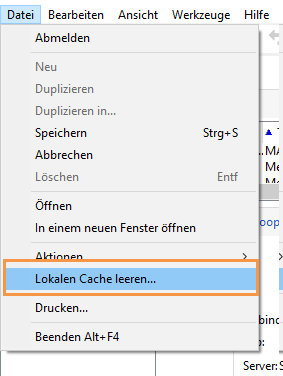

# Häufig gestellte Fragen zu Campaign-Einstellungen {#settings-faq}

Hier erfahren Sie die wichtigsten Informationen zur Konfiguration, um Ihre Campaign-Instanz an Ihre Anforderungen anzupassen.

## Kann ich die Sprache der Benutzeroberfläche von Campaign ändern? {#can-i-change-the-language-of-campaign-interface-}

Die Sprache von Campaign wird zum Zeitpunkt der Instanzenerstellung gewählt. Danach kann sie nicht mehr geändert werden. Weiterführende Informationen dazu finden Sie in [diesem Abschnitt](../../installation/using/creating-an-instance-and-logging-on.md).

Die Benutzeroberfläche von Adobe Campaign ist in vier Sprachen verfügbar: Englisch, Französisch, Deutsch und Japanisch. Bitte beachten Sie, dass für die Clientkonsole und den Server dieselbe Sprache gewählt werden muss. Jede Campaign-Instanz kann nur in einer einzigen Sprache ausgeführt werden.

Für Englisch können Sie bei der Installation von Campaign entweder die US-amerikanische oder britische Variante wählen. Die beiden Varianten unterscheiden sich durch ihr Datums- und Uhrzeitformat. Weiterführende Informationen zu den Unterschieden finden Sie in [diesem Abschnitt](../../platform/using/adobe-campaign-workspace.md#date-and-time).

## Kann ich Campaign Classic mit anderen Adobe-Lösungen kombinieren? {#can-i-use-campaign-classic-with-other-adobe-solutions-}

Sie können die Versand- und Kampagnenverwaltungsfunktionen von Adobe Campaign mit verschiedenen Lösungen kombinieren und damit das Kundenerlebnis personalisieren.

[Hier erfahren Sie, wie Sie andere Adobe-Lösungen einbinden](../../integrations/using/about-campaign-integrations.md) und [IMS in Campaign einrichten](../../integrations/using/about-adobe-id.md).

## Wie kann ich Tracking-Funktionen in meiner Campaign-Instanz einrichten? {#how-can-i-set-up-tracking-capabilities-on-my-campaign-instance-}

Erfahrene Benutzer können die Tracking-Funktionen in der Campaign-Instanz konfigurieren.

[Hier erfahren Sie mehr darüber](../../installation/using/deploying-an-instance.md#tracking-configuration).

## Wie kann ich den E-Mail-Versand konfigurieren? {#how-to-configure-email-deliverability-}

Lesen Sie das [Erste-Schritte-Handbuch zur Zustellbarkeit](https://docs.adobe.com/content/help/en/campaign-classic/using/sending-messages/deliverability-management/about-deliverability.html) und den Abschnitt zur Konfiguration des E-Mail-Versands, um zu erfahren, wie Sie Ihre Instanz konfigurieren können, um die Versandfunktion von Campaign optimal zu nutzen.

[Hier erfahren Sie mehr darüber](../../installation/using/email-deliverability.md).

## Wie kann ich die Inhaltsvalidierung implementieren? {#how-can-i-implement-content-approval-}

Campaign ermöglicht den Einsatz von kollaborativen Validierungsprozessen für die wichtigsten Etappen einer Marketingkampagne. Sie können in jeder Kampagne die Zielgruppe der Sendungen, ihren Inhalt sowie die anfallenden Kosten validieren. Adobe Campaign-Benutzer können per E-Mail von der ausstehenden Validierung benachrichtigt werden und diese über die Konsole oder eine Web-Schnittstelle akzeptieren oder ablehnen.

[Hier erfahren Sie mehr darüber](../../campaign/using/marketing-campaign-approval.md#checking-and-approving-deliveries) und lesen, wie Sie die Inhaltsvalidierung in Campaign implementieren können.

## Wie kann ich auf in einer externen Datenbank gespeicherte Daten zugreifen? {#how-can-i-access-data-stored-in-an-external-database-}

Adobe Campaign bietet die Option Federated Data Access (FDA), um in externen Datenbanken gespeicherte Informationen nutzen zu können. Auf diese Weise ist der Zugriff auf externe Daten möglich, ohne die Datenstruktur in Adobe Campaign zu verändern.

[Hier erfahren Sie mehr darüber](../../platform/using/connecting-to-database.md).

## Welche externen Datenbanken kann ich mit Campaign verknüpfen? {#which-external-databases-can-i-connect-campaign-to-}

Externe Datenbanken, die über Federated Data Access (FDA) mit Campaign kompatibel sind, sind in der [Kompatibilitätsmatrix](https://helpx.adobe.com/campaign/kb/compatibility-matrix.html) aufgelistet.

## Kann Adobe Campaign mit LDAP integriert werden? {#can-adobe-campaign-integrate-with-ldap-}

On-Premise-/Hybrid-Kunden können Campaign mit ihrem LDAP-Verzeichnis integrieren.

[Hier erfahren Sie mehr darüber](../../installation/using/connecting-through-ldap.md).

## Wie kann ich in Campaign CRM-Connectoren einrichten? {#how-can-i-set-up-crm-connectors-in-campaign-}

Adobe Campaign stellt verschiedene CRM-Connectoren zur Verfügung, die die Verbindung der Adobe Campaign-Plattform mit Drittsystemen ermöglichen. So erlauben die CRM-Connectoren z. B. das Synchronisieren von Kontakten, Konten und Bestellungen. Zudem vereinfachen sie die Integration der Anwendung in bestehende Systeme.

Dank der Connectoren ist eine schnelle und einfache Datenintegration möglich. Mithilfe eines spezifischen Assistenten lassen sich Daten aus den im CRM-System verfügbaren Tabellen auswählen und sammeln. Die Zwei-Wege-Synchronisation der Informationen gewährleistet einen einheitlichen Datenstand auf den verschiedenen Systemen.

Lesen Sie [CRM-Connectoren konfigurieren](../../platform/using/crm-connectors.md), um zu erfahren, wie Sie das CRM-Tool mit Adobe Campaign synchronisieren. Dieses Video zeigt ein Anwendungsbeispiel zur [Integration von Adobe Campaign mit Microsoft Dynamics 365](https://helpx.adobe.com/campaign/kt/acc/using/acc-integrate-dynamics365-with-acc-feature-video-set-up.html).

## Wie kann Soft Cache Clear ausgeführt werden, wenn die Probleme maschinspezifisch oder benutzerspezifisch sind? {#perform-soft-cache-clear}

Wenn Sie Probleme haben, z. B. wenn die neuen Logos korrekt dargestellt werden und die Daten, die spezifisch für Computer/Benutzer sind, erfolgreich exportiert werden können, müssen Sie möglicherweise eine Soft Cache-Bereinigung mit Windows (Windows 7, Windows XP, Windows 10) durchführen.

Wenn Sie sich angemeldet haben, gehen Sie zu **[!UICONTROL File]** > **[!UICONTROL Clear the local cache]**. Danach melden Sie sich ab und wieder an.

Wenn dies weiterhin nicht hilfreich ist, versuchen Sie bitte, den Hard Cache zu leeren, indem Sie die folgenden Schritte ausführen.

## Wie kann der Hartcache gelöscht werden, wenn die Probleme maschinspezifisch oder benutzerspezifisch sind? {#perform-hard-cache-clear}

Wenn Sie Probleme haben, z. B. wenn die neuen Logos korrekt dargestellt werden und die Daten, die spezifisch für Computer/Benutzer sind, erfolgreich exportiert werden können, müssen Sie eventuell eine Bereinigung des Hard-Cache unter Windows (Windows 7, Windows XP, Windows 10) durchführen.

1. Wählen Sie in der Client-Konsole **[!UICONTROL File]** > **[!UICONTROL Clear the local cache]**.

1. Melden Sie sich ab und schließen Sie die Client-Konsole (Rich-Client).

1. Gehen Sie je nach Betriebssystemversion zu den folgenden Speicherorten:

   * Windows 7: C:\Users\&lt; Benutzername> \AppData\Roaming\Neolane\NL_5\
   * Windows XP: C:\Documents and Settings\&lt; Benutzername >\Anwendung Data\Neolane\NL_5
   Hier sehen Sie viele XML-Dateien namens nlclient-config-&lt; alphanumerischer Wert >.xml.

1. Löschen Sie diese XML-Dateien und die zugehörigen Ordner.

   >[!CAUTION]
   >
   >Löschen Sie nicht die Datei &quot;nlclient_cnx.xml&quot;.

1. Melden Sie sich bei Client Console an.