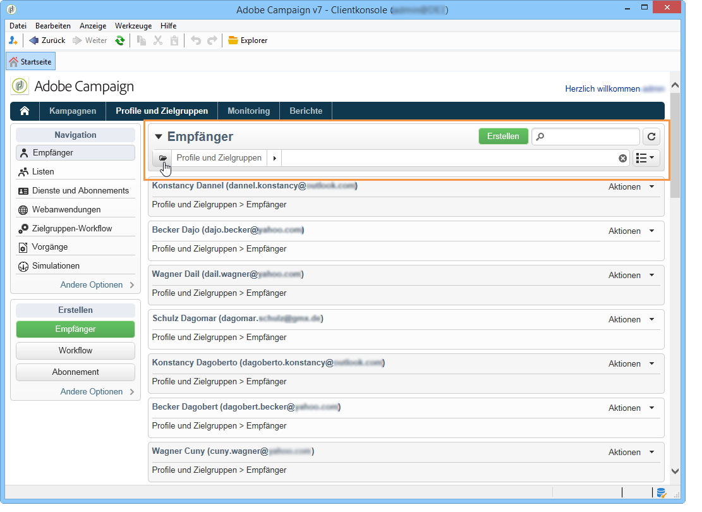
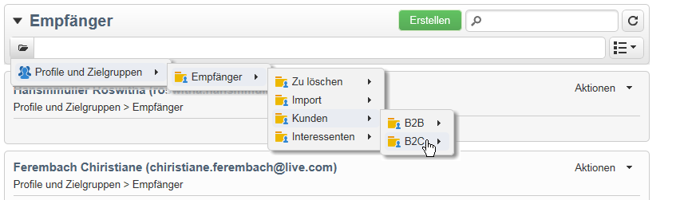
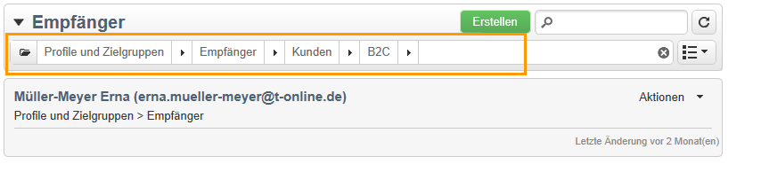
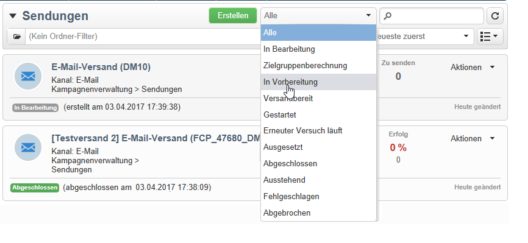
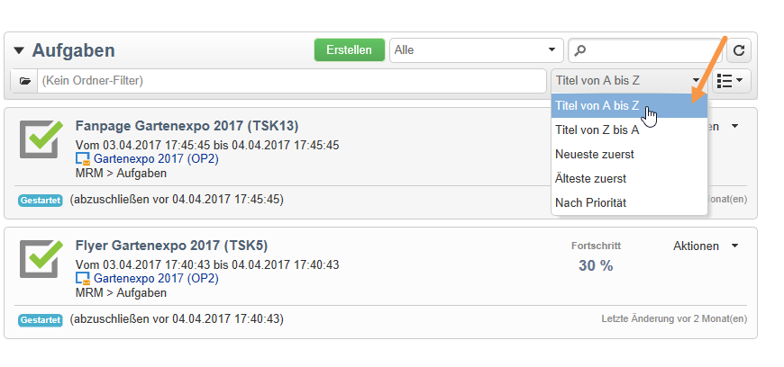
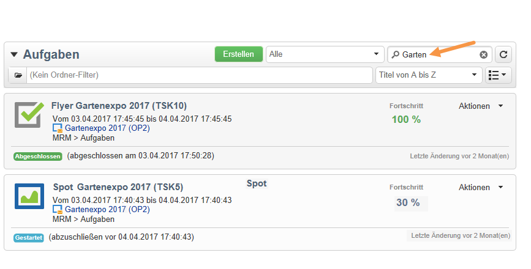

# Filteroptionen{#filtering-options}

## Über Filter {#about-filtering}

Adobe Campaign zeigt standardmäßig alle Daten der Datenbank an, auf die der Benutzer Lesezugriff hat.

Diese Daten können über die Optionen im oberen Bereich des Browserfensters gefiltert werden.

Es gibt unterschiedliche Möglichkeiten, die angezeigten Informationen zu filtern und zu ordnen. Wenn nötig, können sie auch kumuliert werden:

* Ordner-Filter, siehe [Ordnerfilter](#filter-by-folder),
* Filtern nach Status, siehe [Filtern nach Status](#filter-by-status),
* Datensortierung, siehe [Sortierreihenfolge](#order-by),
* Suchen, siehe [Schnellsuche](#quick-search).

## Nach Ordner filtern {#filter-by-folder}

Klicken Sie auf das **[!UICONTROL Ordner]**-Symbol, um den Ordner auszuwählen, der die anzuzeigenden Daten enthält.

Es werden nur die Profile des ausgewählten Ordners angezeigt:

Über das rechts von der Zeile der Ordnerauswahl gelegene Kreuz kann der Standard-Anzeigemodus wieder aktiviert werden.

## Nach Status filtern {#filter-by-status}

Je nach Typ der angezeigten Informationen können Sie Statusfilter anwenden. Sie können beispielsweise beim Filtern von Sendungen nur solche anzeigen lassen, die abgeschlossen sind:

## Sortierreihenfolge {#order-by}

Über die Dropdown-Liste rechts des Ordner-Filterfelds kann die Sortierreihenfolge der angezeigten Daten ausgewählt werden. Der Inhalt dieses Filters hängt vom Datentyp der aufgerufenen Seite ab.

Sie können beispielsweise Ihre Aufgaben nach Priorität, nach Erstellungsdatum oder nach dem Alphabet ordnen.

## Schnellsuche {#quick-search}

Verwenden Sie das Suchfeld, um schnell auf ein bestimmtes Element zuzugreifen: Geben Sie im Titel oder im internen Namen des Elements enthaltene Zeichen ein und bestätigen Sie die Eingabe, um die Daten auf der Seite automatisch zu filtern.

Klicken Sie auf das Kreuz, um den Inhalt des Suchfelds zu löschen und erneut alle vorhandenen Elemente anzuzeigen.
