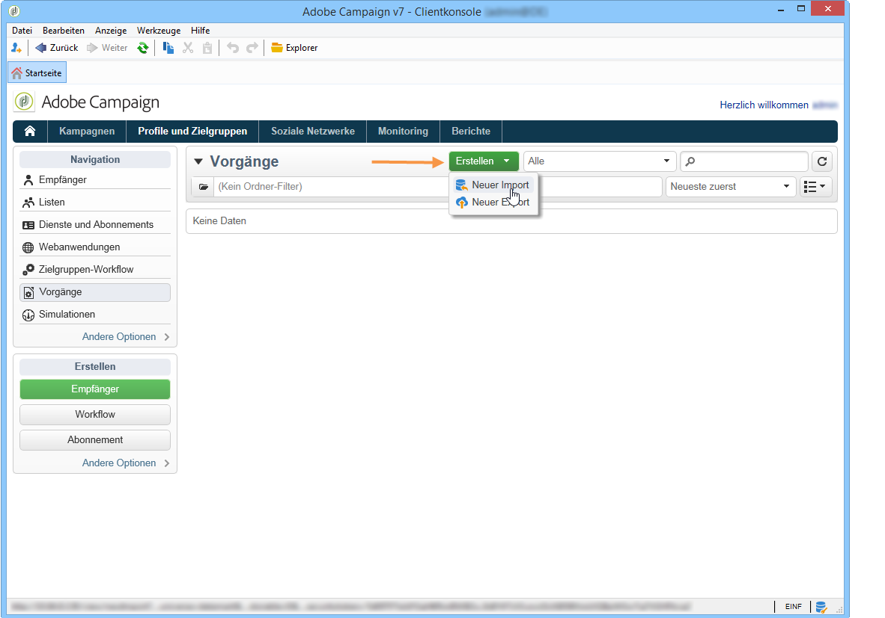

# Allgemeine Importe und Exporte{#generic-imports-and-exports}

Adobe Campaign enthält ein Exportmodul, das es ermöglicht, Daten auf einfache Weise aus der Datenbank zu extrahieren. So können beispielsweise Kunden oder Interessenten im Rahmen einer Zielgruppenbestimmung zu einer Zielpopulation zusammengeschlossen werden.

Des Weiteren bietet Adobe Campaign ein Importmodul, durch das Daten aus einer externen Datei in die Datenbank eingespeist werden können.

>[!NOTE]
>
>Über die Workflow-Aktivitäten **[!UICONTROL Import]** und **[!UICONTROL Export]** stehen spezifische Vorlagen zur Verfügung, die es ermöglichen, Exporte und Importe zu planen und zu automatisieren. So können beispielsweise Daten zwischen verschiedenen Informationssystemen in regelmäßigen Abständen ausgetauscht werden. Bei Bedarf besteht auch die Möglichkeit, über den Knoten **[!UICONTROL Profile und Zielgruppen > Vorgänge > Allgemeine Importe und Exporte]** punktuell Daten zu importieren oder zu exportieren.

Sie haben folgende Möglichkeiten:

* Import- oder Exportvorlagen erstellen und konfigurieren, siehe unten;
* Importe oder Exporte erstellen: Siehe [Daten exportieren](../../platform/using/exporting-data.md) oder [Daten importieren](../../platform/using/importing-data.md).
* Importe oder Exporte starten und deren Ausführung verfolgen. Siehe [Verarbeitung verfolgen](#execution-tracking).

>[!CAUTION]
>
>Datenimporte in Campaign sollten über Workflows durchgeführt werden, da dies die Konsistenz der Daten sicherstellt und die Effizienz erhöht. Weiterführende Informationen dazu finden Sie in den Abschnitten [Datenimport](../../workflow/using/importing-data.md), [Best Practices beim Datenimport](../../workflow/using/importing-data.md#best-practices-when-importing-data) und [Beispiel für eine Importvorlage](../../workflow/using/importing-data.md#setting-up-a-recurring-import).

## Bearbeitungsvorlage erstellen {#creating-a-job-template}

Import- und Exportvorlagen finden Sie im Adobe-Campaign-Navigationsbaum unter dem Menüpunkt **[!UICONTROL Ressourcen > Vorlagen > Bearbeitungsvorlagen]**.

Standardmäßig sind in diesem Verzeichnis drei Importvorlagen und eine Exportvorlage gespeichert. Diese Vorlagen dürfen nicht verändert werden. Es besteht jedoch die Möglichkeit, sie zu duplizieren, um sie Ihren Bedürfnissen anzupassen. Wählen Sie zur Erstellung einer von Grund auf neuen Vorlage **[!UICONTROL Neu > Importvorlage]** bzw. **[!UICONTROL Exportvorlage]** aus.

Das Verfahren zum Erstellen einer Prozessvorlage wird unter [Export-Assistent](../../platform/using/exporting-data.md#export-wizard) und [Import-Assistent](../../platform/using/importing-data.md#import-wizard) beschrieben.

>[!NOTE]
>
>Die native **[!UICONTROL Import-Blockierungsliste]** für Vorlagen ist bereits für den Import einer Liste von E-Mail-Adressen konfiguriert, die der Blockierungsliste hinzugefügt wurden.
> 
>Mit den Vorlagen **[!UICONTROL Neuer Textimport]** und **[!UICONTROL Neuer Textexport]** können Sie einen völlig neuen Import oder Export konfigurieren.

## Neuen Import/Export erstellen {#creating-a-new-import-export}

Import- und Exportvorgänge können nach erfolgter Vorlagenkonfiguration in verschiedenen Anwendungskontexten gestartet werden.

Zunächst öffnet sich der [Import-](../../platform/using/importing-data.md) oder [Export-](../../platform/using/exporting-data.md#export-wizard)Assistent.

* Wählen Sie im Adobe Campaign-Arbeitsbereich im Bereich **[!UICONTROL Profile und Zielgruppen]** den Link **[!UICONTROL Vorgänge]**. Daraufhin wird eine Liste der existierenden Importe und Exporte angezeigt.

   Verwenden Sie die Schaltfläche **[!UICONTROL Erstellen]** und wählen Sie die gewünschte Option aus.

   

* Sie können Importe und Exporte auch direkt über zwei eigene Links im Monitoring-Bereich des Arbeitsbereichs starten.

   

* Auch vom Adobe-Campaign-Explorer aus lassen sich Importe und Exporte starten.

   Wählen Sie hierfür im Knoten **[!UICONTROL Profile und Zielgruppen > Vorgänge > Allgemeine Importe und Exporte]** das Symbol **[!UICONTROL Neu]** und danach **[!UICONTROL Import]** bzw. **[!UICONTROL Export]** aus, um auf den entsprechenden Assistenten zuzugreifen.

   

## Verarbeitung verfolgen {#execution-tracking}

Die Durchführung des Exports kann im oberen Bereich des Assistenten verfolgt werden. Sie können jedoch auch den Assistenten schließen und den Verarbeitungsfortschritt von der Liste &quot;Allgemeine Importe und Exporte&quot; aus nachvollziehen.

* Im Tab **[!UICONTROL Protokoll]** können Sie die die Exportdurchführung betreffenden Logs einsehen.
* Der Tab **[!UICONTROL Zurückweisungen]** listet die Datensätze auf, die nicht verarbeitet werden konnten. Siehe [Verhalten bei Fehlern](../../platform/using/importing-data.md#behavior-in-the-event-of-an-error).

>[!NOTE]
>
>Die verschiedenen möglichen Status beim Import und Export werden im Abschnitt [Vorgangsstatus](../../platform/using/importing-data.md#job-statuses) erläutert.

