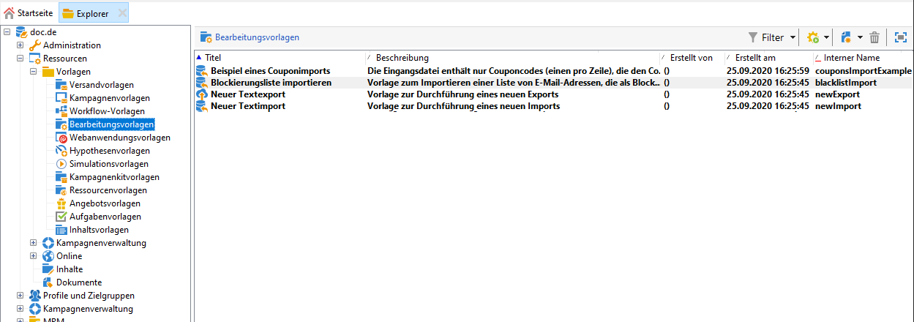

# Allgemeine Importe und Exporte{#generic-imports-and-exports}

Adobe Campaign enthält ein Exportmodul, das es ermöglicht, Daten auf einfache Weise aus der Datenbank zu extrahieren. So können beispielsweise Kunden oder Interessenten im Rahmen einer Zielgruppenbestimmung zu einer Zielpopulation zusammengeschlossen werden.

Des Weiteren bietet Adobe Campaign ein Importmodul, durch das Daten aus einer externen Datei in die Datenbank eingespeist werden können.

>[!NOTE]
>
>Exporte und Importe werden in dedizierten Vorlagen konfiguriert, die über Workflows über die **[!UICONTROL Import]** und **[!UICONTROL Export]** Aktivitäten ausgeführt werden. Sie können automatisch nach einem Zeitplan wiederholt werden, um beispielsweise den Datenaustausch zwischen verschiedenen Informationssystemen zu automatisieren. Bei Bedarf können Sie gelegentlich einen Import oder Export über den **[!UICONTROL Profiles and Targets > Jobs > Generic imports and exports]** Knoten der Adobe Campaign-Struktur erstellen.

Sie haben folgende Möglichkeiten:

* Import- oder Exportvorlagen erstellen und konfigurieren, siehe unten;
* Erstellen Sie einen Import oder Export: Siehe [Exportieren von Daten](../../platform/using/exporting-data.md) oder [Importieren von Daten](../../platform/using/importing-data.md).
* Starten Sie den Import oder Export und überwachen Sie die Ausführung. Siehe [Ausführungsverfolgung](#execution-tracking).

>[!CAUTION]
>
>Datenimporte in Campaign sollten über Workflows durchgeführt werden, da dies die Konsistenz der Daten sicherstellt und die Effizienz erhöht. Weiterführende Informationen dazu finden Sie in den Abschnitten [Datenimport](../../workflow/using/importing-data.md), [Best Practices beim Datenimport](../../workflow/using/importing-data.md#best-practices-when-importing-data) und [Beispiel für eine Importvorlage](../../workflow/using/importing-data.md#setting-up-a-recurring-import).

## Bearbeitungsvorlage erstellen {#creating-a-job-template}

Import and export templates are stored in the **[!UICONTROL Resources > Templates > Job templates]** directory of the Adobe Campaign tree.

Standardmäßig sind in diesem Ordner drei Importvorlagen und eine Exportvorlage vorhanden. Sie dürfen nicht geändert werden. Sie können sie duplizieren, um Ihre eigenen Vorlagen zu erstellen oder eine neue Vorlage über das **[!UICONTROL New > Import template]** /- **[!UICONTROL Export template]** Menü zu erstellen.

Das Verfahren zum Erstellen einer Prozessvorlage wird im [Exportassistenten](../../platform/using/exporting-data.md#export-wizard) und [Importassistenten](../../platform/using/importing-data.md#import-wizard)beschrieben.

>[!NOTE]
>
>The native template **[!UICONTROL Import blacklist]** is already configured to import a list of blacklisted e-mail addresses.
> 
>Mit den Vorlagen **[!UICONTROL New text import]** und **[!UICONTROL New text export]** Vorlagen können Sie einen Import oder Export von Grund auf konfigurieren.

## Neuen Import/Export erstellen {#creating-a-new-import-export}

Import- und Exportvorgänge können nach erfolgter Vorlagenkonfiguration in verschiedenen Anwendungskontexten gestartet werden.

Zunächst öffnet sich der [Import-](../../platform/using/importing-data.md) oder [Export-](../../platform/using/exporting-data.md#export-wizard)Assistent.

* In the **[!UICONTROL Profiles and targets]** section of Adobe Campaign workspace, click the **[!UICONTROL Jobs]** link: this takes you to the list of existing imports and exports.

   Click the **[!UICONTROL Create]** button and select the type of job you want to perform.

   

* Sie können Importe und Exporte auch direkt über zwei eigene Links im Monitoring-Bereich des Arbeitsbereichs starten.

   

* Auch vom Adobe-Campaign-Explorer aus lassen sich Importe und Exporte starten.

   Klicken Sie zum Exportieren/Importieren von Daten auf die **[!UICONTROL Profiles and Targets > Jobs > Generic imports and exports]** Node, dann auf das **[!UICONTROL New]** Symbol und wählen Sie **[!UICONTROL Export]** oder **[!UICONTROL Import]**. Dadurch wird der entsprechende Assistent geöffnet.

   

## Verarbeitung verfolgen {#execution-tracking}

Die Durchführung des Exports kann im oberen Bereich des Assistenten verfolgt werden. Sie können jedoch auch den Assistenten schließen und den Verarbeitungsfortschritt von der Liste &quot;Allgemeine Importe und Exporte&quot; aus nachvollziehen.

* The **[!UICONTROL Log]** tab lets you look at log messages concerning execution.
* Die **[!UICONTROL Rejects]** Registerkarte enthält die abgelehnten Datensätze. See [Behavior in the event of an error](../../platform/using/importing-data.md#behavior-in-the-event-of-an-error).

>[!NOTE]
>
>Import/export job statuses are presented in [Job statuses](../../platform/using/importing-data.md#job-statuses).

