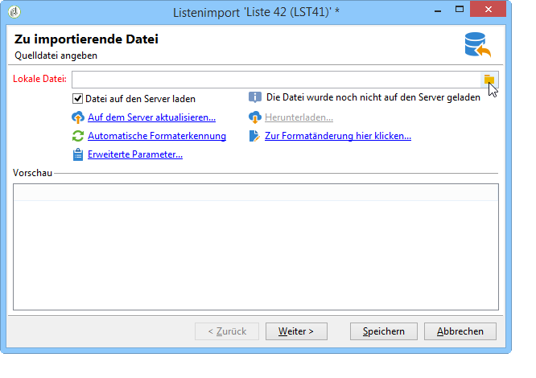
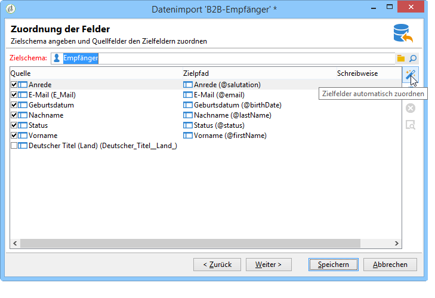
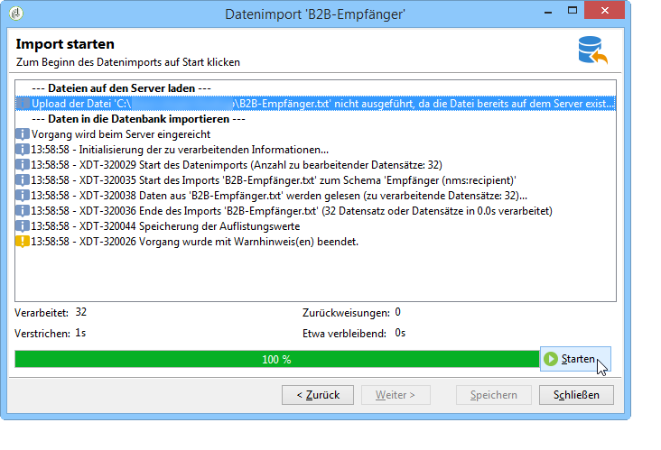
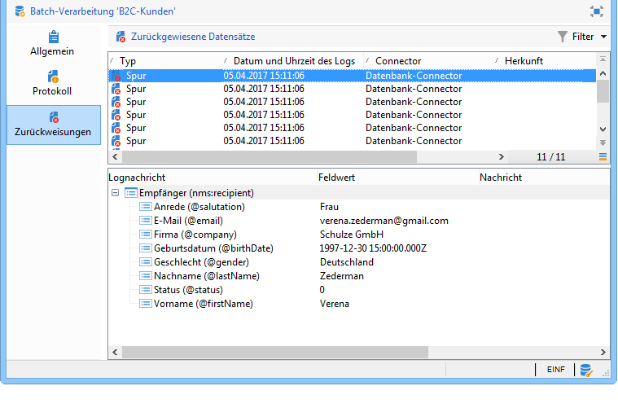
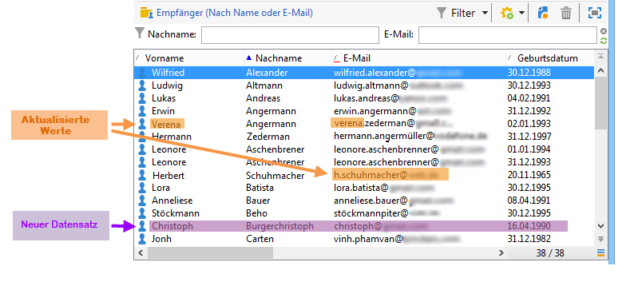
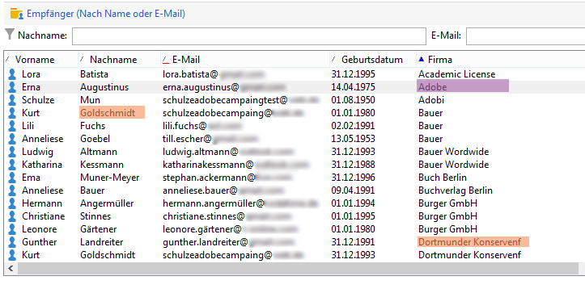
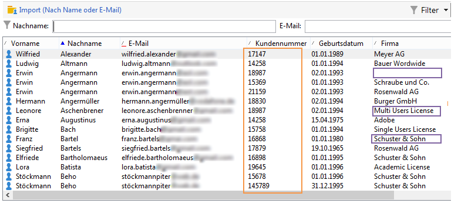

# Allgemeine Beispiele für den Import {#import-operations-samples}

## Import aus einer Empfängerliste {#example--import-from-a-list-of-recipients}

Gehen Sie wie folgt vor, um eine Empfängerliste aus der Listenübersicht zu erstellen und anzureichern:

1. Liste erstellen

   * Klicken Sie auf den Link **[!UICONTROL Listen]** im Menü **[!UICONTROL Profile und Zielgruppen]** der Adobe-Campaign-Startseite.
   * Klicken Sie nun auf die Dropdown-Liste **[!UICONTROL Erstellen]** und wählen Sie die Option **[!UICONTROL Liste importieren]**.

1. Zu importierende Datei auswählen

   Durchsuchen Sie Ihre lokale Festplatte, indem Sie auf das Ordnersymbol rechts vom Feld **[!UICONTROL Lokale Datei]** klicken, und wählen Sie die zu importierende Datei aus.

   

1. Liste benennen und speichern

   Geben Sie Titel und Ordner der Liste an.

   

1. Import starten

   Klicken Sie abschließend auf **[!UICONTROL Weiter]** und **[!UICONTROL Starten]**, um mit dem Listenimport zu beginnen.

   

## Import neuer Datensätze aus einer Textdatei {#example--import-new-records-from-a-text-file-}

Gehen Sie wie folgt vor, um eine als Textdatei vorliegende Empfängerliste in die Adobe-Campaign-Datenbank zu importieren:

1. Vorlage auswählen

   * Klicken Sie auf den Link **[!UICONTROL Vorgänge]** im Menü **[!UICONTROL Profile und Zielgruppen]** der Adobe-Campaign-Startseite. Wählen Sie dann in der Dropdown-Liste Erstellen die Option **[!UICONTROL Neuer Import]**.
   * Behalten Sie die standardmäßig vorgeschlagene Vorlage **[!UICONTROL Neuer Textimport]** bei.
   * Passen Sie Titel und Beschreibung an.
   * Wählen Sie die Option **[!UICONTROL Einfacher Import]**.
   * Behalten Sie den standardmäßig vorgeschlagenen Ordner bei.
   * Klicken Sie auf den Link **[!UICONTROL Erweiterte Parameter]**, um die Option **[!UICONTROL Spurenmodus]** auszuwählen. Auf diese Weise wird der Import ausführlich protokolliert.

1. Zu importierende Datei auswählen

   Durchsuchen Sie Ihre lokale Festplatte, indem Sie auf das Ordnersymbol rechts vom Feld **[!UICONTROL Lokale Datei]** klicken und wählen Sie die zu importierende Datei aus.

   

1. Felder zuordnen

   Die Option **[!UICONTROL Zielfelder automatisch zuordnen]** schlägt für jedes Quellfeld automatisch ein Zielfeld vor. Prüfen Sie die Informationen dieses Bildschirms, bevor Sie auf **[!UICONTROL Weiter]** klicken.

   

1. Abstimmung

   * Markieren Sie im Elementpfad die Tabelle der **Empfänger (nms:recipient)**.
   * Wählen Sie in der Dropdown-Liste des Felds Abstimmoptionen **[!UICONTROL Einfügen]** aus und behalten Sie die anderen Standardeinstellungen bei.

      

1. Empfänger importieren

   * Geben Sie, falls erforderlich, den Ordner an, in dem die Datensätze gespeichert werden sollen.

      

1. Import starten

   * Klicken Sie auf **[!UICONTROL Starten]**.

      Im mittleren Bereich des Assistenten können Sie den Verlauf des Imports und die Anzahl der verarbeiteten Datensätze prüfen.

      

      Dank des **[!UICONTROL Spurenmodus]** haben Sie die Möglichkeit, den Importverlauf für jeden einzelnen Datensatz der Quelldatei detailliert zu betrachten. Klicken Sie hierfür auf den Menüpunkt **[!UICONTROL Vorgänge]** in der Rubrik **[!UICONTROL Profile und Zielgruppen]** auf der Startseite und wählen Sie den entsprechenden Import aus. Die Tabs **[!UICONTROL Allgemein]**, **[!UICONTROL Protokoll]** und **[!UICONTROL Zurückweisungen]** enthalten alle wichtigen Informationen.

      * Importverlauf ansehen

         

      * Datensatzverarbeitung ansehen

         

## Aktualisieren und Hinzufügen von Empfängern {#example--update-and-insert-recipients}

Gehen Sie wie folgt vor, um ausgehend von einer Textdatei existierende Datensätze zu aktualisieren und neue Datensätze in der Datenbank zu erstellen:

1. Vorlage auswählen

   Wiederholen Sie die in Beispiel 2 erläuterten Schritte.

1. Zu importierende Datei auswählen

   Wählen Sie die zu importierende Datei aus.

   Im gewählten Beispiel zeigt die Vorschau der ersten Zeilen Aktualisierungen für zwei Datensätze und einen neuen Datensatz.

   

1. Felder zuordnen

   Gehen Sie wie in Beispiel 2 beschrieben vor.

1. Abstimmung

   * Behalten Sie die standardmäßig vorgeschlagene Abstimmoption **[!UICONTROL Aktualisieren oder einfügen]** bei.
   * Die Option **[!UICONTROL Duplikataverwaltung]** ist im Modus **[!UICONTROL Aktualisieren]** beizubehalten, um die in der Datenbank enthaltenen Datensätze den in der Textdatei enthaltenen Informationen entsprechend anzupassen.
   * Markieren Sie die Felder **[!UICONTROL Geburtsdatum]**, **[!UICONTROL Name]** und **[!UICONTROL Unternehmen]** ordnen Sie ihnen einen Abstimmschlüssel zu.

      

1. Import starten

   * Klicken Sie auf **[!UICONTROL Starten]**.

      Im mittleren Bereich des Assistenten können Sie den Verlauf des Imports und die Anzahl der verarbeiteten Datensätze prüfen.

      

   * Überprüfen Sie in der Empfängertabelle, dass die Datensätze durch den Vorgang wie gewünscht geändert wurden.

      

## Anreicherung vorhandener Daten durch externe Dateien {#example--enrich-the-values-with-those-of-an-external-file}

Ziel ist es, vereinzelte Felder einer Datenbanktabelle durch in einer Textdatei enthaltene Daten anzureichern, wobei jedoch die bereits in der Datenbank enthaltenen Werte Vorrang haben sollen.

Im folgenden Beispiel enthalten teilweise die Felder der Textdatei Werte, während die entsprechenden Felder in der Datenbank leer sind oder andere Werte aufweisen.

* Inhalt der zu importierenden Textdatei

   

* Datenbank vor Durchführung des Imports

   

Gehen Sie wie folgt vor:

1. Vorlage auswählen

   Gehen Sie wie in Beispiel 2 beschrieben vor.

1. Zu importierende Datei auswählen

   Wählen Sie die zu importierende Datei aus.

1. Felder zuordnen

   Gehen Sie wie in Beispiel 2 beschrieben vor.

   Im gewählten Beispiel zeigt die Vorschau der ersten Zeilen Aktualisierungen für diverse Datensätze.

1. Abstimmung

   * Markieren Sie die Tabelle und wählen Sie die Abstimmoption **[!UICONTROL Aktualisieren]** aus.
   * Wählen Sie im Feld **[!UICONTROL Dublettenverwaltung]** die Option **[!UICONTROL Entität zurückweisen]** aus.
   * Die Option **[!UICONTROL Duplikataverwaltung]** ist im Modus **[!UICONTROL Aktualisieren]** beizubehalten, um die in der Datenbank enthaltenen Datensätze den in der Textdatei enthaltenen Informationen entsprechend anzupassen.
   * Markieren Sie den Knoten **[!UICONTROL Nachname (@lastName)]** und wählen Sie die Option **[!UICONTROL Nur aktualisieren, wenn das Zielfeld leer ist]** aus.
   * Wiederholen Sie diesen Schritt für den Knoten **[!UICONTROL Firma (@company)]**.
   * Markieren Sie die Felder **[!UICONTROL Geburtsdatum]**, **[!UICONTROL E-Mail]** und **[!UICONTROL Vorname]** und ordnen Sie ihnen einen Abstimmschlüssel zu.

      

1. Import starten

   Klicken Sie auf **[!UICONTROL Starten]**.

   Überprüfen Sie in der Empfängertabelle, dass die Datensätze durch diesen Vorgang wie gewünscht geändert wurden.

   

   Nur leere Felder wurden mit den Daten der Textdatei aktualisiert, bereits in der Datenbank vorhandene Werte wurden beibehalten.

## Aktualisierung und Anreicherung der Werte durch externe Dateien {#example--update-and-enrich-the-values-from-those-in-an-external-file}

Ziel ist es, vereinzelte Felder einer Datenbanktabelle durch in einer Textdatei enthaltene Daten anzureichern, wobei die in der Textdatei enthaltenen Werte Vorrang vor bereits in der Datenbank enthaltenen Werten haben sollen.

Im folgenden Beispiel enthalten teilweise die Felder der Datenbank Werte, während die entsprechenden Felder in der Textdatei leer sind oder andere Werte aufweisen.

* Inhalt der zu importierenden Textdatei

   

* Datenbank vor Durchführung des Imports

   

1. Vorlage auswählen

   Gehen Sie wie in Beispiel 2 beschrieben vor.

1. Zu importierende Datei auswählen

   Wählen Sie die zu importierende Datei aus.

   Im gewählten Beispiel zeigt die Vorschau der ersten Zeilen teilweise leere Felder und teilweise Aktualisierungen für diverse Datensätze.

1. Felder zuordnen

   Gehen Sie wie in Beispiel 2 beschrieben vor.

1. Abstimmung

   * Markieren Sie die Tabelle und wählen Sie die Abstimmoption **[!UICONTROL Aktualisieren]** aus.
   * Wählen Sie im Feld **[!UICONTROL Dublettenverwaltung]** die Option **[!UICONTROL Entität zurückweisen]** aus.
   * Die Option **[!UICONTROL Duplikataverwaltung]** ist im Modus **[!UICONTROL Aktualisieren]** beizubehalten, um die in der Datenbank enthaltenen Datensätze den in der Textdatei enthaltenen Informationen entsprechend anzupassen.
   * Markieren Sie den Knoten **[!UICONTROL Kundennummer (@account)]** und wählen Sie die Option **[!UICONTROL Aktualisieren (löschen), wenn der Quelldatensatz leer ist]** aus.
   * Markieren Sie die Felder **[!UICONTROL Geburtsdatum]**, **[!UICONTROL E-Mail]** und **[!UICONTROL Vorname]** und ordnen Sie ihnen einen Abstimmschlüssel zu.

      

1. Import starten

   * Klicken Sie auf **[!UICONTROL Starten]**.
   * Überprüfen Sie in der Empfängertabelle, dass die Datensätze durch diesen Vorgang wie gewünscht geändert wurden.

      

      Gemäß der im 4. Schritt bezüglich der Duplikataverwaltung ausgewählten Option **[!UICONTROL Aktualisieren]** haben die Werte der Textdatei die entsprechenden Werte in der Datenbank ersetzt. Dies gilt auch für die leeren Felder der Textdatei.
