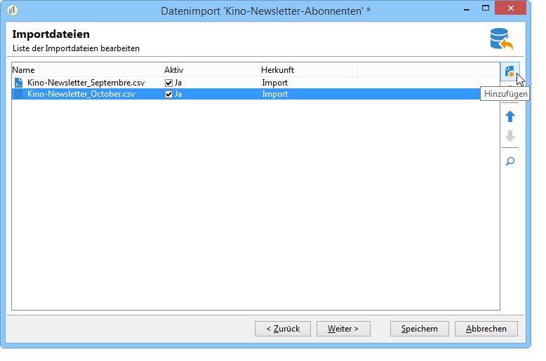
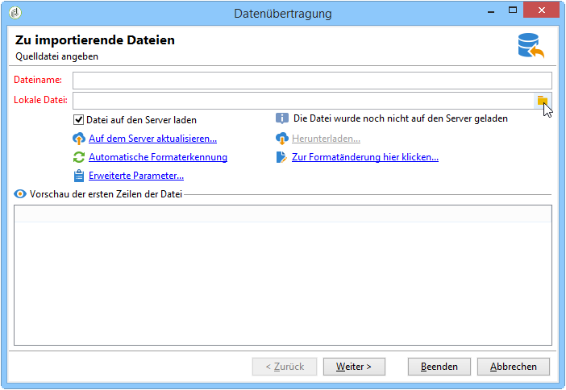
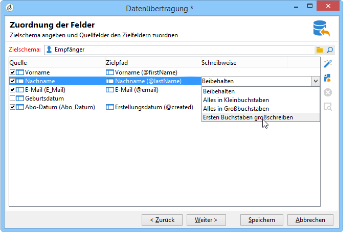
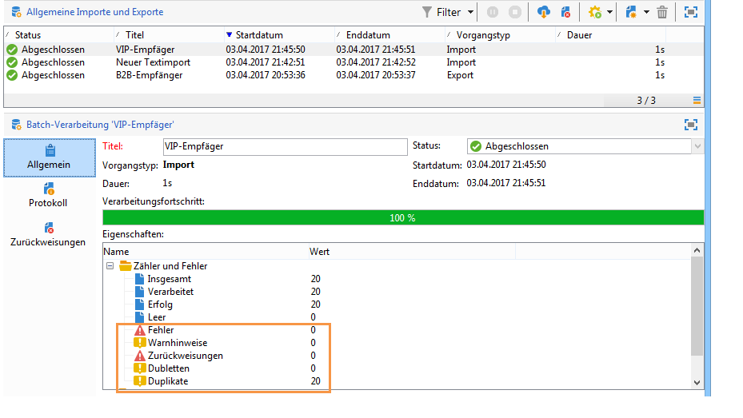
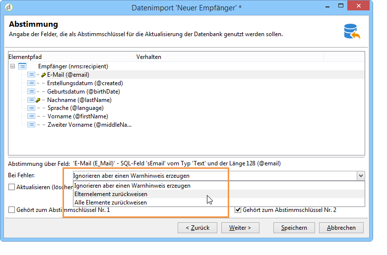
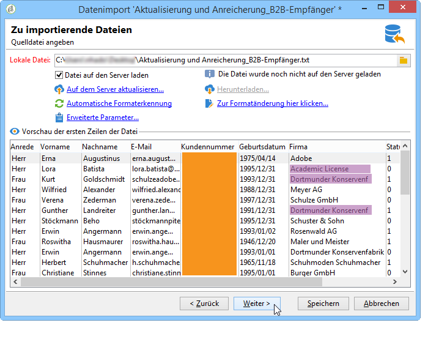
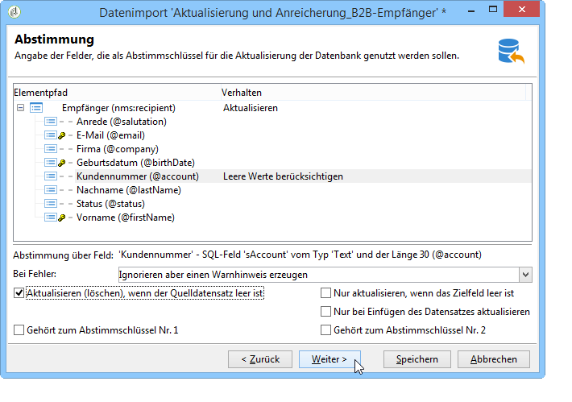
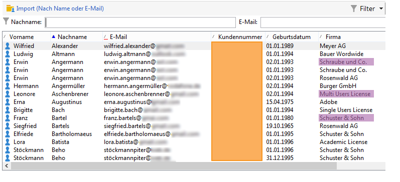

# Daten importieren{#importing-data}

Adobe Campaign erlaubt den Import von Dateien in den Formaten Text, CSV, TAB oder XML. Die importierten Dateien werden mit einer Tabelle verknüpft und jedes Feld des/der Quelldatei(en) wird einem Feld der Datenbank zugeordnet. Die Importkonfiguration kann zur späteren Verwendung gespeichert werden. Sie haben so die Möglichkeit, Importaufgaben zu planen, um Replikationsvorgänge zu automatisieren.

>[!NOTE]
>
>You can import data without mapping it with the database data using the **[!UICONTROL Import a list]** function.
> 
>Die Daten können dann ausschließlich in Workflows über das **[!UICONTROL Read list]** Objekt verwendet werden. Weiterführende Informationen hierzu finden Sie auf dieser [Seite](../../workflow/using/read-list.md).
>
>Weiterführende Informationen dazu finden Sie im Video [Importing profiles](https://docs.adobe.com/content/help/en/campaign-learn/campaign-classic-tutorials/getting-started/importing-profiles.html).

## Struktur der zu importierenden Daten {#structure-of-the-data-to-import}

Jede Zeile der Quelldatei entspricht einem Datensatz. Die einzelnen Daten innerhalb des Datensatzes werden durch Trennzeichen (Leerzeichen, Tabstopp oder andere Zeichen) voneinander abgegrenzt. Die Daten werden somit in Form von Spalten importiert und jede Spalte wird einer Datenbankspalte zugeordnet.

## Import-Assistent {#import-wizard}

Der Import-Assistent ermöglicht die Konfiguration des Imports und die Festlegung von Optionen (beispielsweise der Schreibweise der Daten). Die zu durchlaufenden Konfigurationsschritte hängen vom Importtyp (einfach oder multipel) und den Rechten des jeweiligen Benutzers ab.

>[!NOTE]
>
>Bei Verwendung eines IIS-Web-Servers ist u. U. eine zusätzliche Konfiguration erforderlich, um das Hochladen großer Dateien (> 28 MB) zu ermöglichen.
>
>Weiterführende Informationen hierzu finden Sie in [diesem Abschnitt](../../installation/using/integration-into-a-web-server-for-windows.md#changing-the-upload-file-size-limit).

### 1. Schritt - Importvorlage auswählen {#step-1---choosing-the-import-template}

Beim Start des Import-Assistenten muss zunächst eine Vorlage ausgewählt werden. Um beispielsweise den Import von Empfängern zu konfigurieren, die einen Newsletter erhalten haben, gehen Sie folgendermaßen vor:

1. Wählen Sie den **[!UICONTROL Profiles and Targets > Job > Generic imports and exports]** Ordner aus.
1. Wählen Sie **Neu** und danach **Importieren**, um die Importvorlage zu erstellen.

   

1. Click the arrow to the right of the **[!UICONTROL Import template]** field to select your template, or click **[!UICONTROL Select link]** to browse the tree.

   Die native Vorlage ist **[!UICONTROL New text import]**. Diese Vorlage darf nicht geändert werden, Sie können sie jedoch duplizieren, um je nach Bedarf eine neue Vorlage zu konfigurieren. Importvorlagen werden standardmäßig im **[!UICONTROL Profiles and targets > Templates > Job templates]** Knoten gespeichert.

1. Geben Sie einen Namen für diesen Import in das **[!UICONTROL Label]** Feld ein. Sie können eine Beschreibung hinzufügen.
1. Wählen Sie den Importtyp im entsprechenden Feld aus. Es gibt zwei mögliche Importtypen: nur eine Datei **[!UICONTROL Simple import]** **[!UICONTROL Multiple import]** zu importieren und mehrere Dateien in einer einzigen Ausführung zu importieren.

   For a multiple import, select **[!UICONTROL Multiple import]** from the **[!UICONTROL Import type]** drop-down list in the first screen of the import wizard.

   

1. Specify the fields you want to import by clicking **[!UICONTROL Add]**.

   

   Bei jedem Hinzufügen einer Datei wird der Bildschirm des **[!UICONTROL File to import]** Assistenten angezeigt. Siehe Abschnitt [Schritt 2 - Auswahl](#step-2---source-file-selection) der Quelldatei und befolgen Sie die Schritte im Assistenten, um die Importoptionen wie für einen einfachen Import zu definieren.

   >[!NOTE]
   >
   >Multiple Importe sollten nur in bestimmten Situationen durchgeführt werden und sind nicht empfehlenswert.

#### Erweiterte Parameter {#advanced-parameters}

The **[!UICONTROL Advanced parameters]** link lets you access the following options:

* **[!UICONTROL General]** tab

   * **[!UICONTROL Stop execution if there are too many rejects]**

      Die Durchführung wird standardmäßig gestoppt, sollten die 100 ersten Zeilen zurückgewiesen werden. Wenn Sie mit dem Import unabhängig von der Zurückweisungsanzahl fortfahren wollen, können Sie die Option abwählen.

   * **[!UICONTROL Trace mode]**

      Kreuzen Sie diese Option an, um die Durchführung Zeile für Zeile zu verfolgen.

   * **[!UICONTROL Start the job in a detached process]**

      Diese Option ist standardmäßig ausgewählt. Sie ermöglicht es, den Importprozess separat auszuführen, um keine anderen, zur gleichen Zeit in der Datenbank laufenden Prozesse zu beeinträchtigen.

   * **[!UICONTROL Do not update enumerations]**

      Wählen Sie diese Option, um eine Anreicherung der Liste der nummerierten Werte in der Datenbank zu vermeiden. Siehe [Verwalten von Aufzählungen](../../platform/using/managing-enumerations.md).

* **[!UICONTROL Variables]** tab

   Sie können Variablen definieren, die mit dem Auftrag verknüpft sind und auf die in den Abfrageeditoren und berechneten Feldern zugegriffen werden kann. Um eine Variable zu erstellen, klicken Sie auf **[!UICONTROL Add]** und verwenden Sie den Variableneditor.

   >[!CAUTION]
   >
   >The **[!UICONTROL Variables]** tab is for Workflow-type programming use only, and should be configured by expert users only.

### 2. Schritt - Quelldatei auswählen {#step-2---source-file-selection}

Die Quelldatei kann entweder in Textformat (TXT, CSV, TAB, feste Spalten) oder in XML vorliegen.

Standardmäßig **[!UICONTROL Upload file on the server]** ist ausgewählt. Klicken Sie auf den Ordner rechts neben dem **[!UICONTROL Local file]** Feld, um die lokale Festplatte zu durchsuchen und die zu importierende Datei auszuwählen. Sie können diese Option deaktivieren, um den Zugriffspfad und den Namen der zu importierenden Datei einzugeben, wenn diese sich auf dem Server befindet.

When the file has been specified, you can view its data in the lower section of the window by clicking **[!UICONTROL Auto-detect format]**. This preview displays the first 200 lines of the source file.

Verschiedene Optionen stehen zur Konfiguration des Imports zur Verfügung. Die hier festgelegten Parameter spiegeln sich in der Vorschau wieder.

* **[!UICONTROL Click here to change the file format...]** können Sie das Dateiformat überprüfen und die Konfiguration präzisieren.
* **[!UICONTROL Update on server...]** ermöglicht die Übertragung der lokalen Datei auf den Server. Diese Option ist nur verfügbar, wenn **[!UICONTROL Upload file on the server]** sie ausgewählt ist.
* **[!UICONTROL Download]** ist nur verfügbar, wenn die Datei auf den Server hochgeladen wurde.
* **[!UICONTROL Auto-detect format]** wird verwendet, um das Format der Datenquelle neu zu initialisieren. Mit dieser Option können Sie die ursprünglichen Formate erneut auf Daten anwenden, die über die **[!UICONTROL Click here to change the file format...]** Option formatiert wurden.
* Über den **[!UICONTROL Advanced parameters]** Link können Sie die Quelldaten filtern und auf erweiterte Optionen zugreifen. In diesem Bildschirm können Sie festlegen, dass nur ein Teil der Datei importiert werden soll. Sie können auch einen Filter definieren, z. B. um nur Benutzer vom Typ &quot;Prospekt&quot;oder &quot;Kunde&quot;gemäß dem Wert der entsprechenden Zeile zu importieren. Diese Optionen sollten nur von erfahrenen JavaScript-Benutzern verwendet werden.

#### Dateiformat ändern {#changing-the-file-format}

Mit der **[!UICONTROL Click here to change the file format...]** Option können Sie die Daten der Quelldatei formatieren, insbesondere um das Trennzeichen für Spalten und den Datentyp für die einzelnen Felder anzugeben. Diese Konfiguration wird über das folgende Fenster durchgeführt:

In diesem Schritt legen Sie fest, wie die Werte der Quellfelder zu interpretieren sind. So haben Sie z. B. die Möglichkeit, dem Datentyp &#39;Datum&#39; oder &#39;Datum + Uhrzeit&#39; ein Format (TT.MM.JJJJ, MM-TT-JJ usw.) zuzuordnen. Die nicht dem angegebenen Format entsprechenden Quelldaten werden beim Import zurückgewiesen.

Das Ergebnis der Konfigurationen wird im unteren Teil des Fensters angezeigt.

Click **[!UICONTROL OK]** to save the formatting, then click **[!UICONTROL Next]** to display the next step.

### 3. Schritt - Felder zuordnen {#step-3---field-mapping}

Wählen Sie nun das Zielschema aus und ordnen Sie die Quellfelder den Datenbankfeldern zu.

* Im **[!UICONTROL Destination schema]** Feld können Sie das Schema auswählen, in das die Daten importiert werden sollen. Diese Informationen sind obligatorisch. Klicken Sie auf das **[!UICONTROL Select link]** Symbol, um eines der vorhandenen Schemas auszuwählen. Klicken Sie auf **[!UICONTROL Edit link]** , um den Inhalt der ausgewählten Tabelle anzuzeigen.
* Im mittleren Bereich des Fensters werden alle in der Quelldatei enthaltenen Felder angezeigt. Kreuzen Sie die zu importierenden Felder an und ordnen Sie ihnen ein Zielfeld zu. Dies kann manuell oder automatisch geschehen.

   Um ein Feld manuell zuzuordnen, klicken Sie auf das Kontrollkästchen, um das Quellfeld auszuwählen, und klicken Sie auf die zweite Spalte, um die Zelle zu aktivieren, die dem ausgewählten Feld entspricht. Klicken Sie anschließend auf das **[!UICONTROL Edit expression]** Symbol, um alle Felder der aktuellen Tabelle anzuzeigen. Wählen Sie das Zielfeld aus und klicken Sie auf **[!UICONTROL OK]** , um die Zuordnung zu überprüfen.

   Um die Quell- und Zielfelder automatisch zuzuordnen, klicken Sie auf das **[!UICONTROL Guess the destination fields]** Symbol rechts neben der Feldliste. Die vorgeschlagenen Felder können bei Bedarf geändert werden.

   >[!CAUTION]
   >
   >Prüfen Sie die ordnungsgemäße Zuordnung, bevor Sie zum nächsten Schritt übergehen.

* Sie können eine Transformation auf die importierten Felder anwenden. Klicken Sie dazu in die Zelle der **[!UICONTROL Transformation]** Spalte, die sich auf das betreffende Feld bezieht, und wählen Sie die anzuwendende Transformation aus.

   

   >[!CAUTION]
   >
   >Die Anpassung der Schreibweise wird beim Import vorgenommen. Wurden zuvor für die Zielfelder bestimmte Formatierungen festgelegt (wie in unserem Beispiel für das Feld @lastname), sind diese prioritär.

* Bei Bedarf können Sie über die entsprechende Schaltfläche berechnete Felder hinzufügen. Letztere erlauben komplexe Umwandlungen, das Hinzufügen &quot;virtueller Spalten&quot; oder auch die Anzeige der Werte zweier Spalten in einer gemeinsamen Spalte. Im Folgenden werden die verschiedenen Optionen vorgestellt.

#### Berechnete Felder {#calculated-fields}

Berechnete Felder werden der Quelldatei in Form zusätzlicher Spalten hinzugefügt. Sie enthalten Werte, die ausgehend von anderen Spalten berechnet werden. Beim Import können die berechneten Felder Feldern der Datenbank zugeordnet werden. Es ist jedoch nicht möglich, die Datensätze über berechnete Felder abzustimmen.

Vier verschiedene Feldtypen stehen zur Verfügung:

* **[!UICONTROL Fixed string]**: der Wert des berechneten Felds für alle Zeilen der Quelldatei identisch ist. Hiermit können Sie den Wert eines Felds der eingefügten oder aktualisierten Datensätze festlegen. Sie können beispielsweise für alle importierten Datensätze eine Markierung auf &quot;Ja&quot;setzen.
* **[!UICONTROL String with JavaScript tags]**: Der Wert des berechneten Felds ist eine Zeichenfolge mit JavaScript-Befehlen.
* **[!UICONTROL JavaScript expression]**: der Wert des berechneten Felds ist das Ergebnis der Auswertung einer JavaScript-Funktion. Der zurückgegebene Wert kann eine Zahl, ein Datum usw. sein.
* **[!UICONTROL Enumeration]**: der Wert des Felds wird einem Wert zugeordnet, der in der Quelldatei enthalten ist. Im Editor können Sie die Quellspalte angeben und die Liste der Aufzählungswerte eingeben, wie im folgenden Beispiel:

   

   Auf der **[!UICONTROL Preview]** Registerkarte können Sie das Ergebnis der definierten Konfiguration anzeigen. Hier wurde die **[!UICONTROL Subscription]** Spalte hinzugefügt. Der Wert wird aus dem Feld **Status** berechnet.

   

### 4. Schritt - Datensätze abstimmen {#step-4---reconciliation}

Der Import-Assistent bietet die Möglichkeit, durch die Angabe von Abstimmkriterien die Art der Zusammenführung von importierten und existierenden Daten sowie Prioritätsregeln zu definieren. Dies wird anhand des folgenden Screenshots näher erläutert:

Der mittlere Bereich des dargestellten Bildschirms zeigt die Felder und Tabellen der Adobe-Campaign-Datenbank an, in die die Daten importiert werden.

Für jede Node (Tabelle oder Feld) stehen spezielle Optionen zur Verfügung. Wenn Sie auf die betreffende Node in der Liste klicken, werden die zugehörigen Parameter und eine kurze Beschreibung unten angezeigt. Das für jedes Element definierte Verhalten wird in der entsprechenden **[!UICONTROL Behavior]** Spalte angezeigt.

#### Vorgangstypen {#types-of-operation}

Für jede vom Import betroffene Tabelle ist anzugeben, was mit den Datensätzen geschehen soll. Für das Hauptelement der Datenbank bestehen folgende Möglichkeiten:

* **[!UICONTROL Update or insertion]**: aktualisiert den Datensatz, falls er in der Datenbank vorhanden ist, und erstellt ihn, falls nicht.
* **[!UICONTROL Insertion]**: fügt Datensätze in die Datenbank ein.
* **[!UICONTROL Update]**: aktualisiert nur vorhandene Datensätze (ignoriert andere Datensätze).
* **[!UICONTROL Reconciliation only]**: sucht nach dem Datensatz in der Datenbank, führt jedoch keine Aktualisierung durch. Sie können beispielsweise den Ordner der Empfänger für den Import gemäß einer Spalte der Datei zuordnen, ohne die Daten in den Ordnern zu aktualisieren.
* **[!UICONTROL Deletion]**: können Sie Datensätze in der Datenbank zerstören.

Für die Felder der vom Import betroffenen Tabellen stehen folgende Optionen zur Verfügung:

* **[!UICONTROL Update (empty) if source value is empty]**: bei einer Aktualisierung wird der Datenbankwert durch den Wert im Feld entfernt, wenn das Feld in der Quelldatei leer ist. Andernfalls wird das Datenbankfeld beibehalten.
* **[!UICONTROL Update only if destination is empty]**: der Wert aus der Quelldatei überschreibt den Wert im Datenbankfeld nur, wenn das Datenbankfeld leer ist. In diesem Fall nimmt es den Wert der Quelldatei ein.
* **[!UICONTROL Update the field only when the record is inserted]**: während eines Aktualisierungs- oder Einfügevorgangs werden nur neue Quelldateidatensätze importiert.

>[!NOTE]
>
>Außer bei einem Import ohne Deduplizierung ist die Angabe eines Abstimmschlüssels **zwingend erforderlich**.

#### Abstimmschlüssel {#reconciliation-keys}

Für die Deduplizierung ist die Angabe von mindestens einem Abstimmschlüssel erforderlich.

Unter einem Abstimmschlüssel versteht man eine Kombination von Feldern, die die eindeutige Identifizierung eines Datensatzes ermöglicht. Beim Import von Empfängern z. B. können die Kundennummer, die E-Mail-Adresse oder eine Kombination aus Vor- und Nachname sowie Firma als Abstimmschlüssel verwendet werden.

Die Import-Engine vergleicht für jedes Feld des Abstimmschlüssels die Werte der Quelldatei mit denen der Datenbank, um bereits existierende Datensätze zu identifizieren. Je spezifischer die Felder für einen Datensatz sind, desto genauer lassen sich Quell- und Zieldaten vergleichen und desto besser kann die Integrität der Daten nach erfolgtem Import gewährleistet werden. Es besteht die Möglichkeit, einen zweiten Abstimmschlüssel für eine Tabelle anzugeben. Dieser kommt bei den Datensätzen zum Tragen, bei denen die Felder des ersten Schlüssels leer sind.

Um die Erstellung doppelter Datensätze zu vermeiden, dürfen im Abstimmschlüssel keine Felder verwendet werden, die beim Import verändert werden könnten.

>[!NOTE]
>
>Bei einem Empfängerimport wird der Bezeichner des ausgewählten Ordners implizit zum Schlüssel hinzugefügt.
>
>Die Abstimmung wird daher nur für diesen Ordner durchgeführt (es sei denn, es wird kein Ordner ausgewählt).

#### Deduplizierung {#deduplication}

>[!NOTE]
>
>Eine Dublette ist ein Element, das mindestens zweimal in der zu importierenden Datei enthalten ist.
>
>Ein Duplikat ist ein Element, das sowohl in der Quelldatei als auch in der Datenbank enthalten ist.

Im **[!UICONTROL Management of doubles]** Feld können Sie die Deduplizierung von Daten konfigurieren. Die Deduplizierung bezieht sich auf Datensätze, die mehrmals **in der Quelldatei** (oder bei einem Import mit mehreren Dateien) angezeigt werden, d. h. auf Zeilen, für die die Felder des Abgleichschlüssels identisch sind.

* Die Duplikatverwaltung im **[!UICONTROL Update]** Modus (Standardmodus) führt keine Deduplizierung durch. Der letzte Datensatz hat daher Priorität (weil er die Daten der vorherigen Datensätze aktualisiert). Die Zählung von Duplikaten wird in diesem Modus nicht durchgeführt.
* Duplizierte Verwaltung im **[!UICONTROL Ignore]** Modus oder **[!UICONTROL Reject entity]** schließt Duplikate vom Import aus. In diesem Fall wird kein Datensatz importiert.
* In **[!UICONTROL Reject entity]** mode, the element is not imported, and an error is generated in the import logs.
* Im **[!UICONTROL Ignore]** Modus wird das Element nicht importiert, es wird jedoch keine Fehlerspur beibehalten. In diesem Modus können Sie die Leistung optimieren.

>[!CAUTION]
>
>Die Deduplizierung erfolgt nur im Speicher, was die Größe eines Imports mit Deduplizierung limitiert. Die Limitierung hängt von diversen Parametern ab (Kapazität des Anwendungsservers, Aktivität, Anzahl der Felder im Schlüssel usw.). Als Richtlinie kann man von einer maximalen Größe von 1.000.000 Zeilen für einen Import mit Deduplizierung ausgehen.

Deduplizierung bezieht sich auf einen Datensatz, der sowohl in der Quelldatei als auch in der Datenbank vorhanden ist. Es betrifft nur Vorgänge mit Updates (d.h. **[!UICONTROL Update and insertion]** oder **[!UICONTROL Update]**). Mit der **[!UICONTROL Duplicate management]** Option können Sie den Datensatz aktualisieren oder ignorieren, wenn er sich sowohl in der Quelldatei als auch in der Datenbank befindet. Die **[!UICONTROL Update or insert based on origin]** Option gehört zum optionalen Modul und kann nicht in einem Standardkontext verwendet werden.

The options **[!UICONTROL Reject]** and **[!UICONTROL Ignore]** operate as presented above.

#### Verhalten bei Fehlern {#behavior-in-the-event-of-an-error}

Beim Datentransfer treten häufig Fehler auf, die von verschiedener Natur sein können (inkohärentes Zeilenformat, ungültige E-Mail-Adresse usw.). Alle von der Import-Engine erzeugten Fehler und Warnhinweise werden gespeichert und der Importinstanz zugewiesen.

Details of these rejects can be viewed via the **[!UICONTROL Rejects]** tab.

Zurückweisungen können zwei verschiedenen, in der Spalte **[!UICONTROL Connector]** angezeigten Typen zugeordnet werden:

* Zurückweisungen des Text-Connectors beziehen sich auf Fehler, die bei der Verarbeitung einer Zeile auftreten (berechnetes Feld, Datumsanalyse usw.). In diesem Fall wird die gesamte Zeile zurückgewiesen.
* Zurückweisungen des Datenbank-Connectors beziehen sich auf Fehler, die bei der Abstimmung oder beim Schreiben der Daten in die Datenbank auftreten. Bei Importen in mehrere Tabellen betrifft die Zurückweisung u. U. nur einen Teil des Datensatzes. So kann beispielsweise beim Import von Empfängern und zugeordneten Ereignissen ein Fehler die Aktualisierung eines Ereignisses verhindern, ohne jedoch den Empfänger zurückzuweisen.

Auf der Abstimmungsseite besteht die Möglichkeit, für jedes Feld und jede Tabelle gesondert den Umgang mit Fehlern festzulegen.

* **[!UICONTROL Ignore and log a warning]**: alle Felder werden in die Datenbank importiert, mit Ausnahme der Felder, die einen Fehler generiert haben.
* **[!UICONTROL Reject parent element]**: die gesamte Zeile des Datensatzes wird abgelehnt, nicht nur das Feld, das einen Fehler verursacht hat.
* **[!UICONTROL Reject all elements]**: die Importstopps und alle Elemente des Datensatzes werden abgelehnt.

   

Der Navigationsbaum im Zurückweisungsbildschirm einer Importinstanz zeigt die zurückgewiesenen Felder und aufgetretene Fehler an.

You can generate a file containing these records via the **[!UICONTROL Export rejects]** icon:

### Schritt 5 - Zusätzlicher Schritt beim Import von Empfängern {#step-5---additional-step-when-importing-recipients}

Der folgende Schritt im Import-Assistenten ermöglicht die Auswahl oder Erstellung eines Importordners, die automatische Zuordnung der importierten Empfänger zu einer neuen oder existierenden Liste und ihre Anmeldung für Informationsdienste.

>[!NOTE]
>
>Dieser Schritt wird nur im Falle eines Empfängerimports unter Verwendung der Standardempfängertabelle **nms:recipient** angezeigt.

* Click the **[!UICONTROL Edit]** links to select the folder, the list, or the service to which you want to associate or subscribe the recipients.

   1. In einem Ordner speichern

      Über den **[!UICONTROL Edit...]** Link im **[!UICONTROL Import into a folder]** Abschnitt können Sie den Ordner auswählen oder erstellen, in den die Empfänger importiert werden sollen. Wenn keine Partition definiert ist, werden die Daten standardmäßig in den Standardordner des Operators importiert.

      >[!NOTE]
      >
      >Der Standardordner für einen Operator ist der erste Ordner, auf den der Operator Schreibzugriff hat. Siehe [Ordnerzugriffsverwaltung](../../platform/using/access-management.md#folder-access-management).

      Um den Importordner auszuwählen, klicken Sie auf den Pfeil rechts neben dem **[!UICONTROL Folder]** Feld und wählen Sie den gewünschten Ordner aus. Sie können das Symbol auch verwenden, um den **[!UICONTROL Select link]** Baum in einem neuen Fenster anzuzeigen oder einen neuen Ordner zu erstellen.

      

      To create a new folder, select the node from which you want to add a folder, and right-click. Select **[!UICONTROL Create a new 'Recipients' folder]**.

      

      Der Ordner wird als Unterordner des aktuellen Knotens eingefügt. Geben Sie den Namen des neuen Ordners an, drücken Sie zum Bestätigen die Enter-Taste und klicken Sie auf **[!UICONTROL OK]**.

      

   1. Einer Liste zuordnen

      The **[!UICONTROL Edit...]** link in the **[!UICONTROL Add recipients to a list]** section lets you select or create a list into which the recipients will be imported.

      

      Sie können eine neue Liste für diese Empfänger erstellen, indem Sie auf **[!UICONTROL Select link]** und dann **[!UICONTROL Create]**. Die Erstellung und Verwaltung von Listen finden Sie unter [Erstellen und Verwalten von Listen](../../platform/using/creating-and-managing-lists.md).

      

      Es besteht die Möglichkeit, eine Liste um die neuen Empfänger zu ergänzen oder ihren Inhalt zu löschen und durch die importierten Daten zu ersetzen.

   1. Anmeldung für einen Dienst

      Wenn Sie alle importierten Empfänger für einen Informationsdienst abonnieren möchten, klicken Sie auf den **[!UICONTROL Edit...]** Link im **[!UICONTROL Subscribe recipients to a service]** Abschnitt, um den Informationsdienst auszuwählen oder zu erstellen, den die Empfänger abonnieren sollen. Sie können die **[!UICONTROL Send a confirmation message]** Option auswählen: Der Inhalt dieser Nachricht wird in der dem Abonnementdienst zugeordneten Bereitstellungsvorlage definiert.

      

      Sie können einen neuen Dienst für diese Empfänger erstellen, indem Sie auf **[!UICONTROL Select link]** und dann auf das **[!UICONTROL Create]** Symbol klicken. Die Verwaltung der Informationsdienste wird in [diesem Abschnitt](../../delivery/using/managing-subscriptions.md)erläutert.

* Verwenden Sie das **[!UICONTROL Origin]** Feld, um Informationen über den Ursprung der Empfänger zu ihren Profilen hinzuzufügen. Diese Informationen sind besonders im Rahmen eines mehrfachen Imports nützlich.

Click **[!UICONTROL Next]** to validate this step and display the following step.

### 6. Schritt - Import starten {#step-6---launching-the-import}

Im letzten Schritt des Assistenten können Sie den Datenimport starten. To do this, click the **[!UICONTROL Start]** button.

### Vorgangsstatus {#job-statuses}

Jeder Vorgangsstatus wird von einem Symbol gekennzeichnet und durch einen Titel erläutert. Die Status werden in der Vorgangsliste angezeigt. Folgende Werte sind möglich:

* **In Bearbeitung**

   Vorgang wird durch einen Benutzer bearbeitet.

* **Ausführung in Gang**

   Vorgang wird ausgeführt.

* **Rückgängig**

   Click the **[!UICONTROL Cancel]** button: the job in progress is cancelled.

* **Wird abgebrochen**

   Der Abbruch wurde berücksichtigt und der Vorgang ist im Abbruch begriffen.

* **Wird ausgesetzt**

   Klick auf die Schaltfläche **[!UICONTROL Pause]**: Die Aussetzung des Vorgangs ist in Gang.

* **Ausgesetzt**

   Click **[!UICONTROL Pause]**: the job is suspended. Sie kann durch Klicken auf **[!UICONTROL Start]** neu gestartet werden.

* **Abgeschlossen**

   Die Ausführung des Vorgangs ist abgeschlossen.

* **Abgeschlossen mit Fehlern**

   Der Vorgang konnte aufgrund eines technischen Fehlers nicht ausgeführt werden.

* **Server wird heruntergefahren**

   Der laufende Vorgang wurde aufgrund eines Stopps des Adobe-Campaign-Servers unterbrochen.

## Allgemeine Beispiele für den Import {#generic-import-samples}

### Beispiel: Import aus einer Empfängerliste {#example--import-from-a-list-of-recipients}

Gehen Sie wie folgt vor, um eine Empfängerliste aus der Listenübersicht zu erstellen und anzureichern:

1. Liste erstellen

   * Klicken Sie auf den **[!UICONTROL Lists]** Link im **[!UICONTROL Profiles and targets]** Menü der Adobe Campaign-Homepage.
   * Klicken Sie auf die Schaltfläche **[!UICONTROL Create]** und dann auf die **[!UICONTROL Import a list]** Schaltfläche.

1. Zu importierende Datei auswählen

   Click the folder to the right of the **[!UICONTROL Local file]** field and select the file containing the list to import.

   

1. Liste benennen und speichern

   Geben Sie Titel und Ordner der Liste an.

   

1. Import starten

   Click **[!UICONTROL Next]** and then **[!UICONTROL Start]** to start importing the list.

   

### Beispiel: Import neuer Datensätze aus einer Textdatei {#example--import-new-records-from-a-text-file-}

Gehen Sie wie folgt vor, um eine als Textdatei vorliegende Empfängerliste in die Adobe-Campaign-Datenbank zu importieren:

1. Vorlage auswählen

   * Klicken Sie auf der Homepage von Adobe Campaign auf den **[!UICONTROL Profiles and targets]** Link und dann **[!UICONTROL Jobs]**. Klicken Sie oberhalb der Liste der Aufträge auf **[!UICONTROL New import]**.
   * Lassen Sie die **[!UICONTROL New text import]** Vorlage standardmäßig ausgewählt.
   * Passen Sie Titel und Beschreibung an.
   * Auswählen **[!UICONTROL Simple import]**.
   * Behalten Sie den standardmäßig vorgeschlagenen Ordner bei.
   * Click **[!UICONTROL Advanced parameters]** and select the **[!UICONTROL Tracking mode]** option to view the details of your import during execution.

1. Zu importierende Datei auswählen

   Click the folder to the right of the **[!UICONTROL Local file]** field and select the file you want to import.

   

1. Felder zuordnen

   Klicken Sie auf das **[!UICONTROL Guess the destination fields]** Symbol, um das Quell- und das Zielschema automatisch zuzuordnen. Überprüfen Sie die Informationen in diesem Fenster, bevor Sie auf **[!UICONTROL Next]**.

   

1. Abstimmung

   * Markieren Sie im Elementpfad die Tabelle der **Empfänger (nms:recipient)**.
   * Select the **[!UICONTROL Insertion]** operation and leave the default values in the other fields.

      

1. Empfänger importieren

   * Geben Sie, falls erforderlich, den Ordner an, in dem die Datensätze gespeichert werden sollen.

      

1. Import starten

   * Klicks **[!UICONTROL Start]**.

      Im mittleren Bereich des Assistenten können Sie den Verlauf des Imports und die Anzahl der verarbeiteten Datensätze prüfen.

      

      Im **[!UICONTROL Tracking]** Modus können Sie die Details des Imports für jeden Datensatz in der Quelldatei verfolgen. Klicken Sie dazu auf der Startseite **[!UICONTROL Profiles and Targets]** dann **[!UICONTROL Processes]**, wählen Sie den entsprechenden Import aus und suchen Sie die **[!UICONTROL General]** Registerkarten **[!UICONTROL Journal]** und **[!UICONTROL Rejects]** Registerkarten.

      * Importverlauf ansehen

         

      * Datensatzverarbeitung ansehen

         

### Beispiel: Aktualisieren und Hinzufügen von Empfängern {#example--update-and-insert-recipients}

Gehen Sie wie folgt vor, um ausgehend von einer Textdatei existierende Datensätze zu aktualisieren und neue Datensätze in der Datenbank zu erstellen:

1. Vorlage auswählen

   Wiederholen Sie die in Beispiel 2 erläuterten Schritte.

1. Zu importierende Datei auswählen

   Wählen Sie die zu importierende Datei aus.

   Im gewählten Beispiel zeigt die Vorschau der ersten Zeilen Aktualisierungen für zwei Datensätze und einen neuen Datensatz.

   

1. Felder zuordnen

   Gehen Sie wie in Beispiel 2 beschrieben vor.

1. Abstimmung

   * Lassen Sie **[!UICONTROL Update or insert]** die Auswahl standardmäßig bestehen.
   * Keep the option **[!UICONTROL Management of duplicates]** in **[!UICONTROL Update]** mode so that existing records in the database will be modified with data from the text file.
   * Select the fields **[!UICONTROL Birth date]**, **[!UICONTROL Name]** and **[!UICONTROL Company]** and assign a reconciliation key to them.

      

1. Import starten

   * Klicks **[!UICONTROL Start]**.

      Im mittleren Bereich des Assistenten können Sie den Verlauf des Imports und die Anzahl der verarbeiteten Datensätze prüfen.

      

   * Überprüfen Sie in der Empfängertabelle, dass die Datensätze durch den Vorgang wie gewünscht geändert wurden.

      

### Beispiel: Anreicherung vorhandener Daten durch externe Dateien {#example--enrich-the-values-with-those-of-an-external-file}

Ziel ist es, vereinzelte Felder einer Datenbanktabelle durch in einer Textdatei enthaltene Daten anzureichern, wobei jedoch die bereits in der Datenbank enthaltenen Werte Vorrang haben sollen.

Im folgenden Beispiel enthalten teilweise die Felder der Textdatei Werte, während die entsprechenden Felder in der Datenbank leer sind oder andere Werte aufweisen.

* Inhalt der zu importierenden Textdatei

   

* Datenbank vor Durchführung des Imports

   

Gehen Sie wie folgt vor:

1. Vorlage auswählen

   Gehen Sie wie in Beispiel 2 beschrieben vor.

1. Zu importierende Datei auswählen

   Wählen Sie die zu importierende Datei aus.

1. Felder zuordnen

   Gehen Sie wie in Beispiel 2 beschrieben vor.

   Im gewählten Beispiel zeigt die Vorschau der ersten Zeilen Aktualisierungen für diverse Datensätze.

1. Abstimmung

   * Go to the table and select the **[!UICONTROL Update]** operation.
   * Wählen Sie die Option **[!UICONTROL Reject entity]** für das **[!UICONTROL Management of doubles]** Feld aus.
   * Keep the option **[!UICONTROL Management of duplicates]** in **[!UICONTROL Update]** mode so that existing records in the database will be modified with data from the text file.
   * Platzieren Sie den Cursor auf der **[!UICONTROL Last name (@lastName)]** Node und wählen Sie die **[!UICONTROL Update only if destination is empty]** Option aus.
   * Wiederholen Sie diesen Vorgang für die **[!UICONTROL Company (@company)]** Node.
   * Weisen Sie den Feldern einen Abgleichschlüssel zu **[!UICONTROL Birth date]****[!UICONTROL E-mail]** und **[!UICONTROL First name]**.

      

1. Import starten

   Klicks **[!UICONTROL Start]**.

   Überprüfen Sie in der Empfängertabelle, dass die Datensätze durch diesen Vorgang wie gewünscht geändert wurden.

   

   Nur leere Felder wurden mit den Daten der Textdatei aktualisiert, bereits in der Datenbank vorhandene Werte wurden beibehalten.

### Beispiel: Aktualisierung und Anreicherung der Werte durch externe Dateien {#example--update-and-enrich-the-values-from-those-in-an-external-file}

Ziel ist es, vereinzelte Felder einer Datenbanktabelle durch in einer Textdatei enthaltene Daten anzureichern, wobei die in der Textdatei enthaltenen Werte Vorrang vor bereits in der Datenbank enthaltenen Werten haben sollen.

Im folgenden Beispiel enthalten teilweise die Felder der Datenbank Werte, während die entsprechenden Felder in der Textdatei leer sind oder andere Werte aufweisen.

* Inhalt der zu importierenden Textdatei

   

* Datenbank vor Durchführung des Imports

   

1. Vorlage auswählen

   Gehen Sie wie in Beispiel 2 beschrieben vor.

1. Zu importierende Datei auswählen

   Wählen Sie die zu importierende Datei aus.

   Im gewählten Beispiel zeigt die Vorschau der ersten Zeilen teilweise leere Felder und teilweise Aktualisierungen für diverse Datensätze.

1. Felder zuordnen

   Gehen Sie wie in Beispiel 2 beschrieben vor.

1. Abstimmung

   * Go to the table and select **[!UICONTROL Update]**.
   * Wählen Sie die Option **[!UICONTROL Reject entity]** für das **[!UICONTROL Management of doubles]** Feld aus.
   * Leave the option **[!UICONTROL Management of duplicates]** in **[!UICONTROL Update]** mode for existing records in the database to be modified with data from the text file.
   * Platzieren Sie den Cursor auf der **[!UICONTROL Account number (@account)]** Node und wählen Sie die Option **[!UICONTROL Take empty values into account]**.
   * Select the fields **[!UICONTROL Birth date]**, **[!UICONTROL E-mail]** and **[!UICONTROL First name]** and assign a reconciliation key to them.

      

1. Import starten

   * Klicks **[!UICONTROL Start]**.
   * Überprüfen Sie in der Empfängertabelle, dass die Datensätze durch diesen Vorgang wie gewünscht geändert wurden.

      

      Die Werte der Textdatei, die leer waren, haben die Werte in der Datenbank überschrieben. Die vorhandenen Werte in der Datenbank wurden entsprechend der in Schritt 4 für Duplikate ausgewählten **[!UICONTROL Update]** Option mit denen in der Importdatei aktualisiert.

## Daten mithilfe eines Workflows importieren {#importing-data-from-a-workflow}

Workflows sind eine nützliche Methode, Importverfahren zu automatisieren. Sie helfen Ihnen bei der Standardisierung Ihrer Datenverwaltungsaufgaben, egal ob Sie Daten von einer lokalen Datei oder von einem SFTP-Server importieren.

Weiterführende Informationen zum Datenimport mithilfe eines Workflows finden Sie in [diesem Abschnitt](../../workflow/using/importing-data.md).
