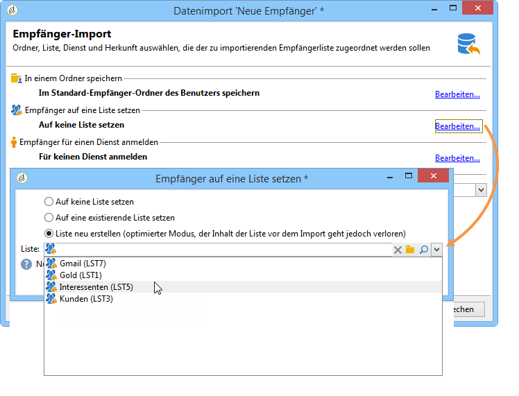
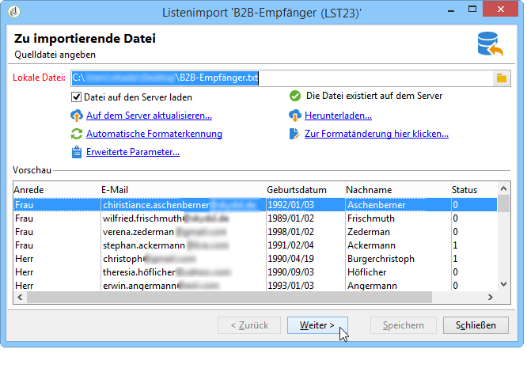
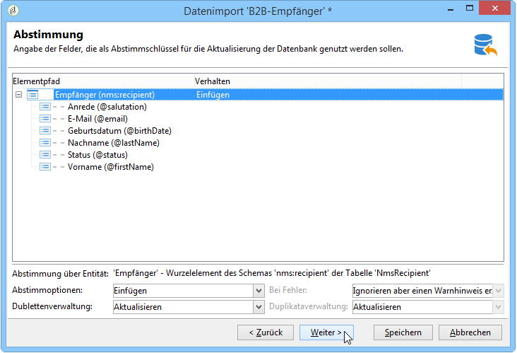
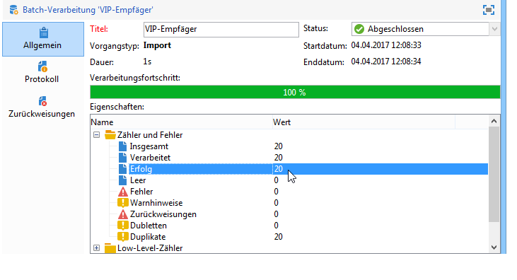
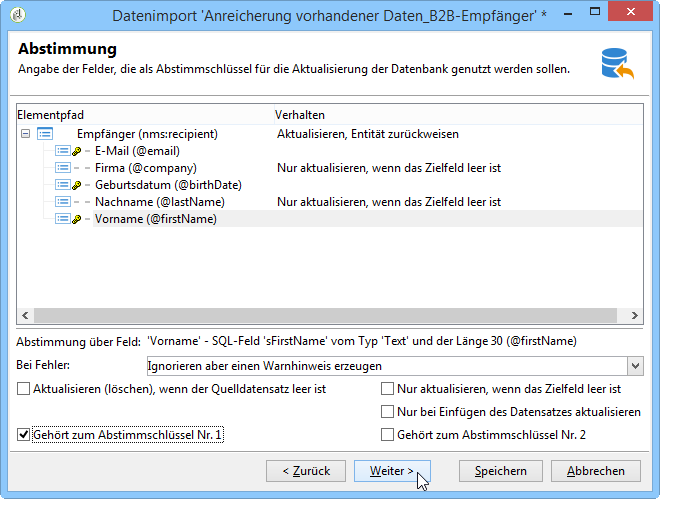

# Daten importieren{#importing-data}

Adobe Campaign erlaubt den Import von Dateien in den Formaten Text, CSV, TAB oder XML. Die importierten Dateien werden mit einer Tabelle verknüpft und jedes Feld des/der Quelldatei(en) wird einem Feld der Datenbank zugeordnet. Die Importkonfiguration kann zur späteren Verwendung gespeichert werden. Sie haben so die Möglichkeit, Importaufgaben zu planen, um Replikationsvorgänge zu automatisieren.

>[!NOTE]
>
>Um Daten zu importieren, ohne sie mit Daten in der Datenbank zu verknüpfen, steht die Funktion **[!UICONTROL Liste importieren]** zur Verfügung.
>
>Diese Daten können dann ausschließlich in Workflows mit dem Objekt **[!UICONTROL Liste lesen]** verwendet werden. Weiterführende Informationen dazu finden Sie auch auf [dieser Seite](../../workflow/using/read-list.md).

 [Funktion im Video kennenlernen](https://docs.adobe.com/content/help/de-DE/campaign-classic-learn/tutorials/profile-management/importing-profiles.html).

## Struktur der zu importierenden Daten {#structure-of-the-data-to-import}

Jede Zeile der Quelldatei entspricht einem Datensatz. Die einzelnen Daten innerhalb des Datensatzes werden durch Trennzeichen (Leerzeichen, Tabstopp oder andere Zeichen) voneinander abgegrenzt. Die Daten werden somit in Form von Spalten importiert und jede Spalte wird einer Datenbankspalte zugeordnet.

## Import-Assistent {#import-wizard}

Der Import-Assistent ermöglicht die Konfiguration des Imports und die Festlegung von Optionen (beispielsweise der Schreibweise der Daten). Die zu durchlaufenden Konfigurationsschritte hängen vom Importtyp (einfach oder multipel) und den Rechten des jeweiligen Benutzers ab.

>[!NOTE]
>
>Bei Verwendung eines IIS-Web-Servers ist u. U. eine zusätzliche Konfiguration erforderlich, um das Hochladen großer Dateien (> 28 MB) zu ermöglichen.
>
>Weiterführende Informationen hierzu finden Sie in [diesem Abschnitt](../../installation/using/integration-into-a-web-server-for-windows.md#changing-the-upload-file-size-limit).

### 1. Schritt - Importvorlage auswählen {#step-1---choosing-the-import-template}

Beim Start des Import-Assistenten muss zunächst eine Vorlage ausgewählt werden. Um beispielsweise den Import von Empfängern zu konfigurieren, die einen Newsletter erhalten haben, gehen Sie folgendermaßen vor:

1. Gehen Sie zum Ordner **[!UICONTROL Profile und Zielgruppen > Vorgang > Allgemeine Importe und Exporte]**.
1. Wählen Sie **Neu** und danach **Importieren**, um die Importvorlage zu erstellen.

   

1. Klicken Sie zur Auswahl der gewünschten Vorlage rechts vom Feld **[!UICONTROL Importvorlage]** entweder auf den Pfeil oder auf **[!UICONTROL Verknüpftes Element auswählen]**, um den Navigationsbaum zu durchsuchen.

   Die anwendungseigene Vorlage **[!UICONTROL Neuer Textimport]** darf nicht geändert werden. Sie können sie jedoch duplizieren, um eine neue Vorlage zu erstellen. Standardmäßig werden Importvorlagen im Knoten **[!UICONTROL Ressourcen > Vorlagen > Bearbeitungsvorlagen]** gespeichert.

1. Geben Sie im Feld **[!UICONTROL Titel]** einen Namen für diesen Import ein und fügen Sie eventuell eine Beschreibung hinzu.
1. Wählen Sie anschließend den Importtyp aus. Mit der Option **[!UICONTROL Einfacher Import]** kann jeweils nur eine Datei importiert werden. Die Option **[!UICONTROL Multipler Import]** hingegen bietet die Möglichkeit, in einem Durchgang mehrere Dateien zu importieren.

   Wählen Sie, wenn Sie mehrere Dateien gleichzeitig importieren möchten, im ersten Schritt des Import-Assistenten die Option **[!UICONTROL Multipler Import]** aus der Dropdown-Liste des Felds **[!UICONTROL Importtyp]** aus.

   

1. Geben Sie dann die zu importierenden Dateien an, indem Sie für jede Datei auf **[!UICONTROL Hinzufügen]** klicken.

   

   Jedes Mal, wenn eine Datei hinzugefügt wird, wird der Bildschirm des Assistenten **[!UICONTROL Zu importierende Datei auswählen]** angezeigt. Konsultieren Sie den Abschnitt [2. Schritt - Quelldatei auswählen](#step-2---source-file-selection) und befolgen Sie die Schritte im Assistenten, um die Importoptionen wie für einen einfachen Import zu definieren.

   >[!NOTE]
   >
   >Multiple Importe sollten nur in bestimmten Situationen durchgeführt werden und sind nicht empfehlenswert.

#### Erweiterte Parameter {#advanced-parameters}

Der Link **[!UICONTROL Erweiterte Parameter...]** bietet Zugriff auf folgende Optionen:

* Im Tab **[!UICONTROL Allgemein]**

   * **[!UICONTROL Bei zu großer Anzahl an Zurückweisungen Ausführung stoppen]**

      Die Durchführung wird standardmäßig gestoppt, sollten die 100 ersten Zeilen zurückgewiesen werden. Wenn Sie mit dem Import unabhängig von der Zurückweisungsanzahl fortfahren wollen, können Sie die Option abwählen.

   * **[!UICONTROL Spurenmodus]**

      Kreuzen Sie diese Option an, um die Durchführung Zeile für Zeile zu verfolgen.

   * **[!UICONTROL Vorgang in einem separaten Prozess starten]**

      Diese Option ist standardmäßig ausgewählt. Sie ermöglicht es, den Importprozess separat auszuführen, um keine anderen, zur gleichen Zeit in der Datenbank laufenden Prozesse zu beeinträchtigen.

   * **[!UICONTROL Auflistungen nicht aktualisieren]**

      Aktivieren Sie diese Option, wenn die Liste der Auflistungswerte in der Datenbank nicht ergänzt werden soll. Siehe [Auflistungen verwalten](../../platform/using/managing-enumerations.md).

* Im Tab **[!UICONTROL Variablen]**

   Hier besteht die Möglichkeit, dem Vorgang zugeordnete Variablen zu definieren, auf die im Abfragetool und in berechneten Feldern zugegriffen werden kann. Klicken Sie hierfür auf **[!UICONTROL Hinzufügen]** und machen Sie im Variableneditor die entsprechenden Angaben.

   >[!CAUTION]
   >
   >Der Tab **[!UICONTROL Variablen]** sollte programmierten Verwendungen vom Typ Workflow sowie erfahrenen Benutzern vorbehalten bleiben.

### 2. Schritt - Quelldatei auswählen {#step-2---source-file-selection}

Die Quelldatei kann entweder in Textformat (TXT, CSV, TAB, feste Spalten) oder in XML vorliegen.

Standardmäßig ist die Option **[!UICONTROL Datei auf den Server laden]** angekreuzt. Durchsuchen Sie Ihre lokale Festplatte, indem Sie auf das Ordnersymbol rechts vom Feld **[!UICONTROL Lokale Datei]** klicken und wählen Sie die zu importierende Datei aus. Sie haben die Möglichkeit, diese Option abzuwählen und den Pfad und Namen der Datei anzugeben, wenn sie sich bereits auf dem Server befindet.

Nach Auswahl der Datei können Sie die Daten im unteren Bereich des Fensters ansehen. Klicken Sie hierfür auf **[!UICONTROL Automatische Formaterkennung]**: Die ersten 200 Zeilen der Quelldatei werden angezeigt.

Verschiedene Optionen stehen zur Konfiguration des Imports zur Verfügung. Die hier festgelegten Parameter spiegeln sich in der Vorschau wieder.

* Die Option **[!UICONTROL Zur Formatänderung hier klicken...]** erlaubt die Überprüfung des Formats und eventuell seine Anpassung.
* Die Option **[!UICONTROL Auf dem Server aktualisieren...]** ermöglicht den Upload der lokalen Datei auf den Server. Sie steht nur zur Verfügung, wenn zuvor die Option **[!UICONTROL Datei auf den Server laden]** ausgewählt wurde.
* Die Option **[!UICONTROL Herunterladen]** ist nur verfügbar, wenn die Datei auf den Server geladen wurde.
* Die Option **[!UICONTROL Automatische Formaterkennung]** stellt das ursprüngliche Format von durch die Option **[!UICONTROL Zur Formatänderung hier klicken...]** formatierten Daten wieder her.
* Der Link **[!UICONTROL Erweiterte Parameter...]** bietet Filtermöglichkeiten der Quelldaten und weitere Optionen. So haben Sie beispielsweise die Möglichkeit, nur einen Teil einer Datei zu importieren oder nur bestimmte Kriterien erfüllende Datensätze (Empfänger vom Typ &#39;Interessent&#39; oder &#39;Kunde&#39;). Die Verwendung dieser Optionen ist in JavaScript bewanderten Benutzern vorbehalten.

#### Dateiformat ändern {#changing-the-file-format}

Mithilfe der Option **[!UICONTROL Zur Formatänderung hier klicken...]** können die Quelldaten formatiert sowie Spalten-Trennzeichen und der Datentyp für jedes Feld angegeben werden. Diese Konfigurationen werden in folgendem Fenster vorgenommen:

In diesem Schritt legen Sie fest, wie die Werte der Quellfelder zu interpretieren sind. So haben Sie z. B. die Möglichkeit, dem Datentyp &#39;Datum&#39; oder &#39;Datum + Uhrzeit&#39; ein Format (TT.MM.JJJJ, MM-TT-JJ usw.) zuzuordnen. Die nicht dem angegebenen Format entsprechenden Quelldaten werden beim Import zurückgewiesen.

Das Ergebnis der Konfigurationen wird im unteren Teil des Fensters angezeigt.

Klicken Sie auf **[!UICONTROL OK]**, um die Formatierung zu speichern, und anschließend auf **[!UICONTROL Weiter]**.

### 3. Schritt - Felder zuordnen {#step-3---field-mapping}

Wählen Sie nun das Zielschema aus und ordnen Sie die Quellfelder den Datenbankfeldern zu.

* Das Feld **[!UICONTROL Zielschema]** ist ein Pflichtfeld. Klicken Sie auf das Symbol **[!UICONTROL Verknüpftes Element auswählen]**, um ein existierendes Schema auszuwählen, bzw. auf **[!UICONTROL Verknüpftes Element öffnen]**, um die Struktur der zugrunde liegenden Tabelle anzusehen.
* Im mittleren Bereich des Fensters werden alle in der Quelldatei enthaltenen Felder angezeigt. Kreuzen Sie die zu importierenden Felder an und ordnen Sie ihnen ein Zielfeld zu. Dies kann manuell oder automatisch geschehen.

   Kreuzen Sie für eine manuelle Zuordnung das gewünschte Quellfeld an und klicken Sie dann in die zweite Spalte, um die zugehörige Zelle zu aktivieren. Klicken Sie auf **[!UICONTROL Ausdruck bearbeiten]**, um alle verfügbaren Felder der Tabelle anzuzeigen. Wählen Sie das Zielfeld aus und bestätigen Sie die Zuordnung mit **[!UICONTROL OK]**.

   Die Schaltfläche **[!UICONTROL Zielfelder automatisch zuordnen]** rechts im Fenster schlägt für jedes Quellfeld automatisch ein Zielfeld vor. Die getroffene Auswahl kann bei Bedarf geändert werden.

   >[!CAUTION]
   >
   >Prüfen Sie die ordnungsgemäße Zuordnung, bevor Sie zum nächsten Schritt übergehen.

* Es besteht die Möglichkeit, die Schreibweise der importierten Felder anzupassen. Klicken Sie hierfür in der Spalte **[!UICONTROL Schreibweise]** in die dem Feld entsprechende Zelle und wählen Sie die gewünschte Option aus.

   

   >[!CAUTION]
   >
   >Die Anpassung der Schreibweise wird beim Import vorgenommen. Wurden zuvor für die Zielfelder bestimmte Formatierungen festgelegt (wie in unserem Beispiel für das Feld @lastname), sind diese prioritär.

* Bei Bedarf können Sie über die entsprechende Schaltfläche berechnete Felder hinzufügen. Letztere erlauben komplexe Umwandlungen, das Hinzufügen &quot;virtueller Spalten&quot; oder auch die Anzeige der Werte zweier Spalten in einer gemeinsamen Spalte. Im Folgenden werden die verschiedenen Optionen vorgestellt.

#### Berechnete Felder {#calculated-fields}

Berechnete Felder werden der Quelldatei in Form zusätzlicher Spalten hinzugefügt. Sie enthalten Werte, die ausgehend von anderen Spalten berechnet werden. Beim Import können die berechneten Felder Feldern der Datenbank zugeordnet werden. Es ist jedoch nicht möglich, die Datensätze über berechnete Felder abzustimmen.

Vier verschiedene Feldtypen stehen zur Verfügung:

* **[!UICONTROL Unveränderliche Zeichenkette]**: Der Wert des berechneten Feldes ist derselbe für jede Zeile der Quelldatei. Damit können Sie den Wert eines Feldes der eingefügten oder aktualisierten Datensätze festlegen. Sie können beispielsweise für alle importierten Datensätze &quot;Ja&quot; festlegen.
* **[!UICONTROL Zeichenkette mit JavaScript-Fusion]**: Das berechnete Feld kombiniert eine Zeichenkette mit JavaScript-Direktiven.
* **[!UICONTROL JavaScript-Ausdruck]**: Der Wert des berechneten Felds ist das Ergebnis einer JavaScript-Funktion. Der ausgegebene Wert kann einen bestimmten Typ aufweisen (Ziffer, Datum usw.).
* **[!UICONTROL Auflistungen]**: Der Wert des Felds wird in Abhängigkeit eines Werts der Quelldatei zugeordnet. Der Editor erlaubt die Angabe der Auflistungswerte je Quellspalte, wie in folgendem Beispiel dargestellt:

   

   Im **[!UICONTROL Vorschau]**-Tab können Sie das Ergebnis der Konfiguration ansehen. Im Beispiel wurde die Spalte **[!UICONTROL Abonnements]** hinzugefügt. Der Wert wird vom Feld **Status** ausgehend berechnet.

   

### 4. Schritt - Datensätze abstimmen {#step-4---reconciliation}

Der Import-Assistent bietet die Möglichkeit, durch die Angabe von Abstimmkriterien die Art der Zusammenführung von importierten und existierenden Daten sowie Prioritätsregeln zu definieren. Dies wird anhand des folgenden Screenshots näher erläutert:

Der mittlere Bereich des dargestellten Bildschirms zeigt die Felder und Tabellen der Adobe-Campaign-Datenbank an, in die die Daten importiert werden.

Für jeden Knoten (Tabelle oder Feld) stehen spezifische Optionen zur Verfügung. Wenn Sie auf einen Knoten in der Liste klicken, werden unterhalb seine Parameter und eine kurze Beschreibung angezeigt. Für jedes Element werden in der Spalte **[!UICONTROL Verhalten]** die Auswirkungen der gewählten Optionen angegeben.

#### Vorgangstypen {#types-of-operation}

Für jede vom Import betroffene Tabelle ist anzugeben, was mit den Datensätzen geschehen soll. Für das Hauptelement der Datenbank bestehen folgende Möglichkeiten:

* **[!UICONTROL Aktualisieren oder einfügen]**: Aktualisiert Datensätze oder erstellt sie, falls sie noch nicht in der Datenbank existieren.
* **[!UICONTROL Einfügen]**: Erstellt neue Datensätze in der Datenbank.
* **[!UICONTROL Aktualisieren]**: Aktualisiert bestehende Datensätze, ignoriert alle anderen.
* **[!UICONTROL Nur abstimmen]**: Sucht den Datensatz in der Datenbank, ohne ihn zu aktualisieren. Dies ermöglicht beispielsweise die Zuordnung des zu importierenden Empfängerordners in Abhängigkeit von einer Spalte der Datei, ohne die Daten des Ordners zu aktualisieren.
* **[!UICONTROL Löschen]**: Löscht die Datensätze der Datenbank.

Für die Felder der vom Import betroffenen Tabellen stehen folgende Optionen zur Verfügung:

* **[!UICONTROL Aktualisieren (löschen), wenn der Quelldatensatz leer ist]**: Löscht den Wert des Datenbankfelds, wenn das Feld im Quelldokument leer ist. Ansonsten wird der Wert aus der Datenbank beibehalten.
* **[!UICONTROL Nur aktualisieren, wenn das Zielfeld leer ist]**: Wenn das Datenbankfeld bereits einen Wert enthält, wird dieser beibehalten. Ansonsten wird der Wert der Quelldatei eingefügt.
* **[!UICONTROL Nur bei Einfügen des Datensatzes aktualisieren]**: Bei Aktualisierungs- oder Ergänzungsvorgängen werden nur die Datensätze der Quelldatei importiert, die neu in der Datenbank sind.

>[!NOTE]
>
>Außer bei einem Import ohne Deduplizierung ist die Angabe eines Abstimmschlüssels **zwingend erforderlich**.

#### Abstimmschlüssel {#reconciliation-keys}

Für die Deduplizierung ist die Angabe von mindestens einem Abstimmschlüssel erforderlich.

Unter einem Abstimmschlüssel versteht man eine Kombination von Feldern, die die eindeutige Identifizierung eines Datensatzes ermöglicht. Beim Import von Empfängern z. B. können die Kundennummer, die E-Mail-Adresse oder eine Kombination aus Vor- und Nachname sowie Firma als Abstimmschlüssel verwendet werden.

Die Import-Engine vergleicht für jedes Feld des Abstimmschlüssels die Werte der Quelldatei mit denen der Datenbank, um bereits existierende Datensätze zu identifizieren. Je spezifischer die Felder für einen Datensatz sind, desto genauer lassen sich Quell- und Zieldaten vergleichen und desto besser kann die Integrität der Daten nach erfolgtem Import gewährleistet werden. Es besteht die Möglichkeit, einen zweiten Abstimmschlüssel für eine Tabelle anzugeben. Dieser kommt bei den Datensätzen zum Tragen, bei denen die Felder des ersten Schlüssels leer sind.

Um die Erstellung doppelter Datensätze zu vermeiden, dürfen im Abstimmschlüssel keine Felder verwendet werden, die beim Import verändert werden könnten.

>[!NOTE]
>
>Bei einem Empfängerimport wird die Kennung des ausgewählten Ordners implizit zum Schlüssel hinzugefügt.
>
>Die Abstimmung wird daher nur für diesen Ordner durchgeführt (es sei denn, es ist kein Ordner ausgewählt).

#### Deduplizierung {#deduplication}

>[!NOTE]
>
>Eine Dublette ist ein Element, das mindestens zweimal in der zu importierenden Datei enthalten ist.
>
>Ein Duplikat ist ein Element, das sowohl in der Quelldatei als auch in der Datenbank enthalten ist.

Das Feld **[!UICONTROL Dublettenverwaltung]** dient der Konfiguration der Deduplizierung in Bezug auf Dubletten, d. h. Datensätzen, die wiederholt in der **Quelldatei** (oder den Quelldateien bei einem multiplen Import) vorkommen. Bei Dubletten sind die den Abstimmschlüssel bildenden Felder identisch.

* Im Modus **[!UICONTROL Aktualisieren]** löst die Dublettenverwaltung keine Deduplizierung aus. Dies bedeutet, dass der neueste Datensatz Priorität vor älteren Datensätzen hat. Demzufolge werden Dubletten in diesem Modus nicht gezählt.
* In den Modi **[!UICONTROL Ignorieren]** oder **[!UICONTROL Entität zurückweisen]** werden Dubletten beim Import durch die Dublettenverwaltung ausgeschlossen, d. h. keiner der wiederholt vorkommenden Datensätze wird importiert.
* Im Modus **[!UICONTROL Entität zurückweisen]** werden die entsprechenden Datensätze nicht importiert und im Importprotokoll wird ein Fehler ausgewiesen.
* Im Modus **[!UICONTROL Ignorieren]** werden die entsprechenden Datensätze ebenfalls nicht importiert, der Fehler wird jedoch nicht protokolliert. Dies optimiert die Leistung der Anwendung.

>[!CAUTION]
>
>Die Deduplizierung erfolgt nur im Speicher, was die Größe eines Imports mit Deduplizierung limitiert. Die Limitierung hängt von diversen Parametern ab (Kapazität des Anwendungsservers, Aktivität, Anzahl der Felder im Schlüssel usw.). Als Richtlinie kann man von einer maximalen Größe von 1.000.000 Zeilen für einen Import mit Deduplizierung ausgehen.

Die Deduplizierung in Bezug auf Duplikata, d. h. Datensätze, die sowohl in der Quelldatei als auch in der Datenbank vorkommen, kommt nur bei Importen mit Datenaktualisierung zum Tragen (**[!UICONTROL Aktualisieren und einfügen]** oder **[!UICONTROL Aktualisieren]**). Die Option **[!UICONTROL Duplikataverwaltung]** ermöglicht es, einen Datensatz entweder zu aktualisieren oder zu ignorieren, wenn er sowohl in der Quelldatei als auch der Datenbank vorkommt. Die Option **[!UICONTROL Je nach Herkunft aktualisieren oder hinzufügen]** ist Teil eines optionalen Moduls, sie steht im Standardkontext nicht zur Verfügung.

Die Optionen **[!UICONTROL Zurückweisen]** und **[!UICONTROL Ignorieren]** arbeiten auf die gleiche Weise wie zuvor beschrieben.

#### Verhalten bei Fehlern {#behavior-in-the-event-of-an-error}

Beim Datentransfer treten häufig Fehler auf, die von verschiedener Natur sein können (inkohärentes Zeilenformat, ungültige E-Mail-Adresse usw.). Alle von der Import-Engine erzeugten Fehler und Warnhinweise werden gespeichert und der Importinstanz zugewiesen.

Im Tab **[!UICONTROL Zurückweisungen]** können Details eingesehen werden.

Zurückweisungen können zwei verschiedenen, in der Spalte **[!UICONTROL Connector]** angezeigten Typen zugeordnet werden:

* Zurückweisungen des Text-Connectors beziehen sich auf Fehler, die bei der Verarbeitung einer Zeile auftreten (berechnetes Feld, Datumsanalyse usw.). In diesem Fall wird die gesamte Zeile zurückgewiesen.
* Zurückweisungen des Datenbank-Connectors beziehen sich auf Fehler, die bei der Abstimmung oder beim Schreiben der Daten in die Datenbank auftreten. Bei Importen in mehrere Tabellen betrifft die Zurückweisung u. U. nur einen Teil des Datensatzes. So kann beispielsweise beim Import von Empfängern und zugeordneten Ereignissen ein Fehler die Aktualisierung eines Ereignisses verhindern, ohne jedoch den Empfänger zurückzuweisen.

Auf der Abstimmungsseite besteht die Möglichkeit, für jedes Feld und jede Tabelle gesondert den Umgang mit Fehlern festzulegen.

* **[!UICONTROL Ignorieren aber einen Warnhinweis erzeugen]**: Es werden alle Felder in die Datenbank importiert, ausgenommen das Feld, das den Fehler erzeugt hat.
* **[!UICONTROL Elternelement zurückweisen]**: Die gesamte Zeile wird zurückgewiesen (nicht nur das den Fehler auslösende Feld).
* **[!UICONTROL Alle Elemente zurückweisen]**: Der Import wird gestoppt und alle Elemente des Datensatzes werden zurückgewiesen.

   

Der Navigationsbaum im Zurückweisungsbildschirm einer Importinstanz zeigt die zurückgewiesenen Felder und aufgetretene Fehler an.

Über das Symbol **[!UICONTROL Zurückweisungen exportieren]** können Sie eine Datei mit den entsprechenden Informationen erzeugen.

### Schritt 5 - Zusätzlicher Schritt beim Import von Empfängern {#step-5---additional-step-when-importing-recipients}

Der folgende Schritt im Import-Assistenten ermöglicht die Auswahl oder Erstellung eines Importordners, die automatische Zuordnung der importierten Empfänger zu einer neuen oder existierenden Liste und ihre Anmeldung für Informationsdienste.

>[!NOTE]
>
>Dieser Schritt wird nur im Falle eines Empfängerimports unter Verwendung der Standardempfängertabelle **nms:recipient** angezeigt.

* Klicken Sie auf den **[!UICONTROL Bearbeiten]**-Link, um den Ordner, die Liste oder den Dienst auszuwählen, mit denen die Empfänger verknüpft werden sollen.

   1. In einem Ordner speichern

      Der **[!UICONTROL Bearbeiten...]**-Link der Option **[!UICONTROL In einen Ordner importieren]** ermöglicht die Auswahl oder die Erstellung des Ordners, in den die Empfänger importiert werden sollen. Falls nicht anders angegeben, werden die Daten in den Standard-Ordner des Benutzers eingefügt.

      >[!NOTE]
      >
      >Der Standardordner des Benutzers entspricht dem ersten Ordner, für den der Benutzer Schreibzugriff hat. Siehe [Zugriffsverwaltungsordner](../../platform/using/access-management.md#folder-access-management).

      Klicken Sie zur Auswahl des Importordners auf den Pfeil rechts des **[!UICONTROL Ordner]**-Feldes und wählen Sie den gewünschten Ordner aus. Über das Symbol **[!UICONTROL Verknüpftes Element auswählen]** können Sie den Navigationsbaum in einem neuen Fenster anzeigen und einen neuen Ordner erstellen.

      

      Wählen Sie zur Erstellung eines neuen Ordners den Knoten aus, in den der Ordner eingefügt werden soll, klicken Sie mit der rechten Maustaste und wählen Sie **[!UICONTROL Empfänger-Ordner hinzufügen]**.

      

      Der Ordner wird als Unterordner des aktuellen Knotens eingefügt. Geben Sie den Namen des neuen Ordners an, drücken Sie zum Bestätigen die Enter-Taste und klicken Sie auf **[!UICONTROL OK]**.

      

   1. Einer Liste zuordnen

      Der **[!UICONTROL Bearbeiten...]**-Link der Option **[!UICONTROL Empfänger auf eine Liste setzen]** ermöglicht die Auswahl oder die Erstellung der Liste, zu der die Empfänger hinzugefügt werden sollen.

      

      Sie können eine neue Liste für diese Empfänger erstellen, indem Sie auf **[!UICONTROL Verknüpftes Element auswählen]** und dann auf **[!UICONTROL Erstellen]** klicken. Das Erstellen und Verwalten von Listen wird unter [Listen erstellen und verwalten](../../platform/using/creating-and-managing-lists.md) genauer beschrieben.

      

      Es besteht die Möglichkeit, eine Liste um die neuen Empfänger zu ergänzen oder ihren Inhalt zu löschen und durch die importierten Daten zu ersetzen.

   1. Anmeldung für einen Dienst

      Der **[!UICONTROL Bearbeiten...]**-Link der Option **[!UICONTROL Empfänger für einen Dienst anmelden]** ermöglicht die Auswahl oder die Erstellung des Informationsdienstes, für den die Empfänger angemeldet werden sollen. Kreuzen Sie **[!UICONTROL Benachrichtigung versenden]** an, wenn die Empfänger von der Anmeldung in Kenntnis gesetzt werden sollen. Der Benachrichtigungsinhalt wird in den die An- und Abmeldungen betreffenden Versandvorlagen bestimmt.

      

      Sie haben auch die Möglichkeit, einen neuen Informationsdienst für diese Empfänger zu erstellen. Klicken Sie hierfür auf **[!UICONTROL Verknüpftes Element auswählen]** und dann auf das Symbol **[!UICONTROL Erstellen]**. Informationsdienste werden in [diesem Abschnitt](../../delivery/using/managing-subscriptions.md) näher erläutert.

* Das Feld **[!UICONTROL Herkunft]** bietet die Möglichkeit, eine Information bezüglich der Empfängerherkunft im Profil zu hinterlegen. Dies ist insbesondere bei multiplen Importen empfehlenswert.

Klicken Sie auf **[!UICONTROL Weiter]**, um die in diesem Schritt vorgenommenen Konfigurationen zu bestätigen.

### 6. Schritt - Import starten {#step-6---launching-the-import}

Im letzten Schritt des Assistenten wird der Datenimport ausgelöst. Klicken Sie hierfür auf die Schaltfläche **[!UICONTROL Starten]**.

### Vorgangsstatus {#job-statuses}

Jeder Vorgangsstatus wird von einem Symbol gekennzeichnet und durch einen Titel erläutert. Die Status werden in der Vorgangsliste angezeigt. Folgende Werte sind möglich:

* **In Bearbeitung**

   Vorgang wird durch einen Benutzer bearbeitet.

* **Ausführung in Gang**

   Vorgang wird ausgeführt.

* **Rückgängig**

   Der laufende Vorgang wurde durch Klick auf die Schaltfläche **[!UICONTROL Abbrechen]** abgebrochen.

* **Wird abgebrochen**

   Der Abbruch wurde berücksichtigt und der Vorgang ist im Abbruch begriffen.

* **Wird ausgesetzt**

   Klick auf die Schaltfläche **[!UICONTROL Pause]**: Die Aussetzung des Vorgangs ist in Gang.

* **Ausgesetzt**

   Klick auf die Schaltfläche **[!UICONTROL Pause]**: Der Vorgang wurde ausgesetzt. Er kann über die Schaltfläche **[!UICONTROL Starten]** wieder aufgenommen werden.

* **Abgeschlossen**

   Die Ausführung des Vorgangs ist abgeschlossen.

* **Abgeschlossen mit Fehlern**

   Der Vorgang konnte aufgrund eines technischen Fehlers nicht ausgeführt werden.

* **Server wird heruntergefahren**

   Der laufende Vorgang wurde aufgrund eines Stopps des Adobe-Campaign-Servers unterbrochen.

## Allgemeine Beispiele für den Import {#generic-import-samples}

### Beispiel: Import aus einer Empfängerliste {#example--import-from-a-list-of-recipients}

Gehen Sie wie folgt vor, um eine Empfängerliste aus der Listenübersicht zu erstellen und anzureichern:

1. Liste erstellen

   * Klicken Sie auf den Link **[!UICONTROL Listen]** im Menü **[!UICONTROL Profile und Zielgruppen]** der Adobe-Campaign-Startseite.
   * Klicken Sie nun auf die Dropdown-Liste **[!UICONTROL Erstellen]** und wählen Sie die Option **[!UICONTROL Liste importieren]**.

1. Zu importierende Datei auswählen

   Durchsuchen Sie Ihre lokale Festplatte, indem Sie auf das Ordnersymbol rechts vom Feld **[!UICONTROL Lokale Datei]** klicken, und wählen Sie die zu importierende Datei aus.

   

1. Liste benennen und speichern

   Geben Sie Titel und Ordner der Liste an.

   

1. Import starten

   Klicken Sie abschließend auf **[!UICONTROL Weiter]** und **[!UICONTROL Starten]**, um mit dem Listenimport zu beginnen.

   

### Beispiel: Import neuer Datensätze aus einer Textdatei {#example--import-new-records-from-a-text-file-}

Gehen Sie wie folgt vor, um eine als Textdatei vorliegende Empfängerliste in die Adobe-Campaign-Datenbank zu importieren:

1. Vorlage auswählen

   * Klicken Sie auf den Link **[!UICONTROL Vorgänge]** im Menü **[!UICONTROL Profile und Zielgruppen]** der Adobe-Campaign-Startseite. Wählen Sie dann in der Dropdown-Liste Erstellen die Option **[!UICONTROL Neuer Import]**.
   * Behalten Sie die standardmäßig vorgeschlagene Vorlage **[!UICONTROL Neuer Textimport]** bei.
   * Passen Sie Titel und Beschreibung an.
   * Wählen Sie die Option **[!UICONTROL Einfacher Import]**.
   * Behalten Sie den standardmäßig vorgeschlagenen Ordner bei.
   * Klicken Sie auf den Link **[!UICONTROL Erweiterte Parameter]**, um die Option **[!UICONTROL Spurenmodus]** auszuwählen. Auf diese Weise wird der Import ausführlich protokolliert.

1. Zu importierende Datei auswählen

   Durchsuchen Sie Ihre lokale Festplatte, indem Sie auf das Ordnersymbol rechts vom Feld **[!UICONTROL Lokale Datei]** klicken und wählen Sie die zu importierende Datei aus.

   

1. Felder zuordnen

   Die Option **[!UICONTROL Zielfelder automatisch zuordnen]** schlägt für jedes Quellfeld automatisch ein Zielfeld vor. Prüfen Sie die Informationen dieses Bildschirms, bevor Sie auf **[!UICONTROL Weiter]** klicken.

   

1. Abstimmung

   * Markieren Sie im Elementpfad die Tabelle der **Empfänger (nms:recipient)**.
   * Wählen Sie in der Dropdown-Liste des Felds Abstimmoptionen **[!UICONTROL Einfügen]** aus und behalten Sie die anderen Standardeinstellungen bei.

      

1. Empfänger importieren

   * Geben Sie, falls erforderlich, den Ordner an, in dem die Datensätze gespeichert werden sollen.

      

1. Import starten

   * Klicken Sie auf **[!UICONTROL Starten]**.

      Im mittleren Bereich des Assistenten können Sie den Verlauf des Imports und die Anzahl der verarbeiteten Datensätze prüfen.

      

      Dank des **[!UICONTROL Spurenmodus]** haben Sie die Möglichkeit, den Importverlauf für jeden einzelnen Datensatz der Quelldatei detailliert zu betrachten. Klicken Sie hierfür auf den Menüpunkt **[!UICONTROL Vorgänge]** in der Rubrik **[!UICONTROL Profile und Zielgruppen]** auf der Startseite und wählen Sie den entsprechenden Import aus. Die Tabs **[!UICONTROL Allgemein]**, **[!UICONTROL Protokoll]** und **[!UICONTROL Zurückweisungen]** enthalten alle wichtigen Informationen.

      * Importverlauf ansehen

         

      * Datensatzverarbeitung ansehen

         

### Beispiel: Aktualisieren und Hinzufügen von Empfängern {#example--update-and-insert-recipients}

Gehen Sie wie folgt vor, um ausgehend von einer Textdatei existierende Datensätze zu aktualisieren und neue Datensätze in der Datenbank zu erstellen:

1. Vorlage auswählen

   Wiederholen Sie die in Beispiel 2 erläuterten Schritte.

1. Zu importierende Datei auswählen

   Wählen Sie die zu importierende Datei aus.

   Im gewählten Beispiel zeigt die Vorschau der ersten Zeilen Aktualisierungen für zwei Datensätze und einen neuen Datensatz.

   

1. Felder zuordnen

   Gehen Sie wie in Beispiel 2 beschrieben vor.

1. Abstimmung

   * Behalten Sie die standardmäßig vorgeschlagene Abstimmoption **[!UICONTROL Aktualisieren oder einfügen]** bei.
   * Die Option **[!UICONTROL Duplikataverwaltung]** ist im Modus **[!UICONTROL Aktualisieren]** beizubehalten, um die in der Datenbank enthaltenen Datensätze den in der Textdatei enthaltenen Informationen entsprechend anzupassen.
   * Markieren Sie die Felder **[!UICONTROL Geburtsdatum]**, **[!UICONTROL Name]** und **[!UICONTROL Unternehmen]** ordnen Sie ihnen einen Abstimmschlüssel zu.

      

1. Import starten

   * Klicken Sie auf **[!UICONTROL Starten]**.

      Im mittleren Bereich des Assistenten können Sie den Verlauf des Imports und die Anzahl der verarbeiteten Datensätze prüfen.

      

   * Überprüfen Sie in der Empfängertabelle, dass die Datensätze durch den Vorgang wie gewünscht geändert wurden.

      

### Beispiel: Anreicherung vorhandener Daten durch externe Dateien {#example--enrich-the-values-with-those-of-an-external-file}

Ziel ist es, vereinzelte Felder einer Datenbanktabelle durch in einer Textdatei enthaltene Daten anzureichern, wobei jedoch die bereits in der Datenbank enthaltenen Werte Vorrang haben sollen.

Im folgenden Beispiel enthalten teilweise die Felder der Textdatei Werte, während die entsprechenden Felder in der Datenbank leer sind oder andere Werte aufweisen.

* Inhalt der zu importierenden Textdatei

   

* Datenbank vor Durchführung des Imports

   

Gehen Sie wie folgt vor:

1. Vorlage auswählen

   Gehen Sie wie in Beispiel 2 beschrieben vor.

1. Zu importierende Datei auswählen

   Wählen Sie die zu importierende Datei aus.

1. Felder zuordnen

   Gehen Sie wie in Beispiel 2 beschrieben vor.

   Im gewählten Beispiel zeigt die Vorschau der ersten Zeilen Aktualisierungen für diverse Datensätze.

1. Abstimmung

   * Markieren Sie die Tabelle und wählen Sie die Abstimmoption **[!UICONTROL Aktualisieren]** aus.
   * Wählen Sie im Feld **[!UICONTROL Dublettenverwaltung]** die Option **[!UICONTROL Entität zurückweisen]** aus.
   * Die Option **[!UICONTROL Duplikataverwaltung]** ist im Modus **[!UICONTROL Aktualisieren]** beizubehalten, um die in der Datenbank enthaltenen Datensätze den in der Textdatei enthaltenen Informationen entsprechend anzupassen.
   * Markieren Sie den Knoten **[!UICONTROL Nachname (@lastName)]** und wählen Sie die Option **[!UICONTROL Nur aktualisieren, wenn das Zielfeld leer ist]** aus.
   * Wiederholen Sie diesen Schritt für den Knoten **[!UICONTROL Firma (@company)]**.
   * Markieren Sie die Felder **[!UICONTROL Geburtsdatum]**, **[!UICONTROL E-Mail]** und **[!UICONTROL Vorname]** und ordnen Sie ihnen einen Abstimmschlüssel zu.

      

1. Import starten

   Klicken Sie auf **[!UICONTROL Starten]**.

   Überprüfen Sie in der Empfängertabelle, dass die Datensätze durch diesen Vorgang wie gewünscht geändert wurden.

   

   Nur leere Felder wurden mit den Daten der Textdatei aktualisiert, bereits in der Datenbank vorhandene Werte wurden beibehalten.

### Beispiel: Aktualisierung und Anreicherung der Werte durch externe Dateien {#example--update-and-enrich-the-values-from-those-in-an-external-file}

Ziel ist es, vereinzelte Felder einer Datenbanktabelle durch in einer Textdatei enthaltene Daten anzureichern, wobei die in der Textdatei enthaltenen Werte Vorrang vor bereits in der Datenbank enthaltenen Werten haben sollen.

Im folgenden Beispiel enthalten teilweise die Felder der Datenbank Werte, während die entsprechenden Felder in der Textdatei leer sind oder andere Werte aufweisen.

* Inhalt der zu importierenden Textdatei

   

* Datenbank vor Durchführung des Imports

   

1. Vorlage auswählen

   Gehen Sie wie in Beispiel 2 beschrieben vor.

1. Zu importierende Datei auswählen

   Wählen Sie die zu importierende Datei aus.

   Im gewählten Beispiel zeigt die Vorschau der ersten Zeilen teilweise leere Felder und teilweise Aktualisierungen für diverse Datensätze.

1. Felder zuordnen

   Gehen Sie wie in Beispiel 2 beschrieben vor.

1. Abstimmung

   * Markieren Sie die Tabelle und wählen Sie die Abstimmoption **[!UICONTROL Aktualisieren]** aus.
   * Wählen Sie im Feld **[!UICONTROL Dublettenverwaltung]** die Option **[!UICONTROL Entität zurückweisen]** aus.
   * Die Option **[!UICONTROL Duplikataverwaltung]** ist im Modus **[!UICONTROL Aktualisieren]** beizubehalten, um die in der Datenbank enthaltenen Datensätze den in der Textdatei enthaltenen Informationen entsprechend anzupassen.
   * Markieren Sie den Knoten **[!UICONTROL Kundennummer (@account)]** und wählen Sie die Option **[!UICONTROL Aktualisieren (löschen), wenn der Quelldatensatz leer ist]** aus.
   * Markieren Sie die Felder **[!UICONTROL Geburtsdatum]**, **[!UICONTROL E-Mail]** und **[!UICONTROL Vorname]** und ordnen Sie ihnen einen Abstimmschlüssel zu.

      

1. Import starten

   * Klicken Sie auf **[!UICONTROL Starten]**.
   * Überprüfen Sie in der Empfängertabelle, dass die Datensätze durch diesen Vorgang wie gewünscht geändert wurden.

      

      Gemäß der im 4. Schritt bezüglich der Duplikataverwaltung ausgewählten Option **[!UICONTROL Aktualisieren]** haben die Werte der Textdatei die entsprechenden Werte in der Datenbank ersetzt. Dies gilt auch für die leeren Felder der Textdatei.

## Daten mithilfe eines Workflows importieren {#importing-data-from-a-workflow}

Workflows sind eine nützliche Methode, Importverfahren zu automatisieren. Sie helfen Ihnen bei der Standardisierung Ihrer Datenverwaltungsaufgaben, egal ob Sie Daten von einer lokalen Datei oder von einem SFTP-Server importieren.

Weiterführende Informationen zum Datenimport mithilfe eines Workflows finden Sie in [diesem Abschnitt](../../workflow/using/importing-data.md).
