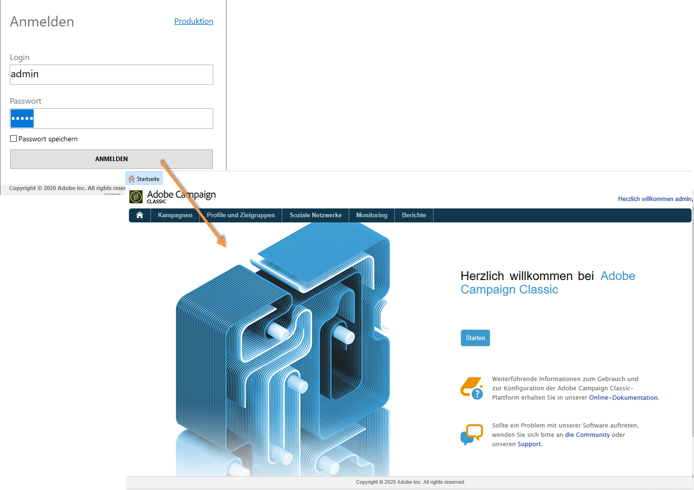
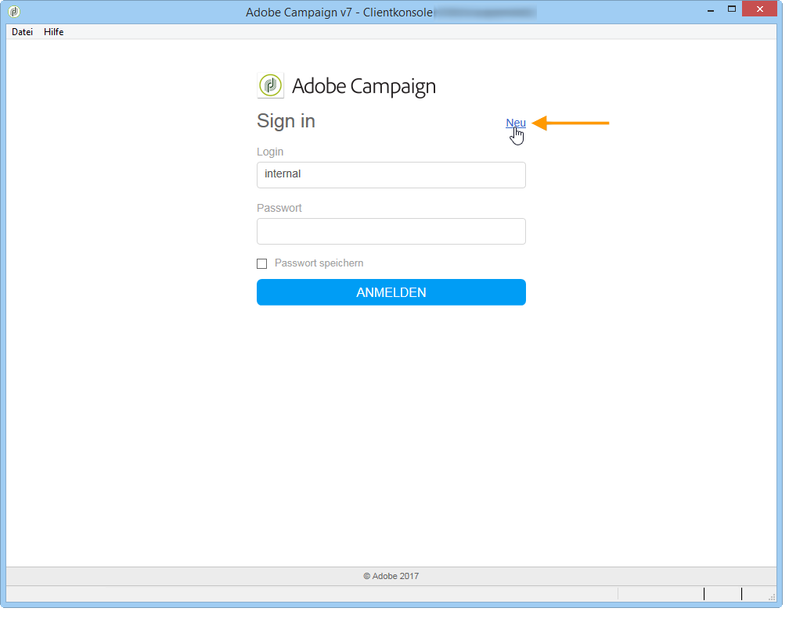
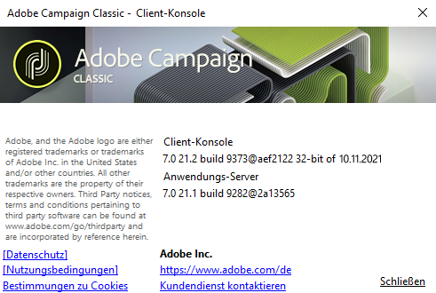

# Starten von Adobe Campaign {#launching-adobe-campaign}

Die Client-Konsole in Campaign ist ein Rich-Client, mit dem Sie eine Verbindung zu Ihren Campaign-Anwendungs-Servern herstellen können. Auf [dieser Seite](../../installation/using/installing-the-client-console.md) erfahren Sie, wie Sie die Clientkonsole herunterladen und konfigurieren.

>[!CAUTION]
>
>Überprüfen Sie die Kompatibilität Ihres Systems und Ihrer Tools mit der Adobe Campaign-Client-Konsole in der [Kompatibilitätsmatrix](../../rn/using/compatibility-matrix.md#ClientConsoleoperatingsystems)

## Adobe Campaign starten {#starting-adobe-campaign}

Sie können Adobe Campaign ausgehend vom Menü **[!UICONTROL Start > Alle Programme > Adobe Campaign v.X > Adobe Campaign Clientkonsole]** starten.

Im Clientkonsole-Verbindungsfenster können Sie mithilfe Ihrer Benutzerkennung und Ihres Passworts eine existierende Datenbank auswählen oder konfigurieren und eine Verbindung mit dieser Datenbank herstellen:

## Verbindung mit Adobe Campaign herstellen {#connecting-to-adobe-campaign}

### Verbinden mit Ihrer Adobe ID

Campaign-Anwender stellen über das Adobe Identity Management System (IMS) mit ihrer Adobe ID eine Verbindung zur Adobe Campaign-Konsole her. Sie können für alle Adobe-Lösungen dieselbe ID verwenden. Die Verbindung wird bei Verwendung von Adobe Campaign mit anderen Lösungen gespeichert. Weitere Informationen zu Adobe IMS finden Sie [auf dieser Seite](https://helpx.adobe.com/de/enterprise/using/identity.html).

Informationen zum Konfigurieren der Campaign Classic v7-Verbindung mit dem Adobe-Identitäts-Management-Service (IMS) finden Sie [auf dieser Seite](../../integrations/using/about-adobe-id.md).

Wie Sie nach Abschluss der Konfiguration mit Ihrer Adobe ID eine Verbindung zu Campaign herstellen, erfahren Sie in der [Dokumentation zu Campaign v8 (Konsole)](https://experienceleague.adobe.com/de/docs/campaign/campaign-v8/new/connect){target=_blank}.

### Anmeldung mit einem Login/Passwort

Die Verbindung kann auch mit einem spezifischen Login/Passwort hergestellt werden. Diese Verbindung wird als die „Native Authentifizierung“ von Campaign bezeichnet:

1. Geben Sie im Feld **[!UICONTROL Login]** die Kontokennung des Benutzers ein.

   Diese wird vom Administrator der Adobe Campaign-Plattform vergeben.

1. Geben Sie im Feld **[!UICONTROL Passwort]** Ihr Passwort ein.

   Wenn Sie zum ersten Mal auf die Datenbank zugreifen, ist Ihr Passwort das vom Administrator festgelegte. Anschließend kann es über das Menü **[!UICONTROL Werkzeuge > Passwort ändern...]** angepasst werden. Details zu Benutzern und Verbindungen finden Sie unter [Zugriffsverwaltung](../../platform/using/access-management.md).

1. Klicken Sie zum Bestätigen auf **[!UICONTROL ANMELDEN]**.

Jetzt haben Sie Zugriff auf den [Adobe Campaign-Arbeitsbereich](../../platform/using/adobe-campaign-workspace.md).

## Verbindungen einrichten {#setting-up-connections}

Auf die Verbindungseinstellungen des Servers können Sie über den Link über dem Eingabefeld zugreifen.

Weitere Informationen zur Einrichtung von Verbindungen finden Sie in der [Dokumentation zu Campaign v8 (Konsole)](https://experienceleague.adobe.com/de/docs/campaign/campaign-v8/new/connect#create-your-connection){target=_blank}.

## Benutzer und Berechtigungen {#operators-and-permissions}

Kennungen, Passwörter und Zugriffsberechtigungen werden vom Adobe Campaign-Systemadministrator im Verzeichnisknoten **[!UICONTROL Administration > Zugriffe > Benutzer]** des Adobe Campaign-Navigationsbaums festgelegt.

Diese Funktionen werden im Abschnitt [Zugriffsverwaltung](../../platform/using/access-management.md) beschrieben.

## Adobe Campaign-Version abrufen {#getting-your-campaign-version}

Das Menü **[!UICONTROL Hilfe > Versionsinformationen…]** liefert folgende Informationen:

* **Versionsnummer** der Campaign-Client-Konsole und des Anwendungs-Servers
* **Build-Nummer** der Campaign-Client-Konsole und des Anwendungs-Servers
* Link zur Adobe-Kundenunterstützung
* Links zur Adobe-Datenschutzrichtlinie sowie zu Nutzungsbedingungen und Bestimmungen zu Cookies

Wenn Sie mit dem Team der Adobe-Kundenunterstützung Kontakt aufnehmen, müssen Sie die Versionsnummer und die Build-Nummer Ihrer Adobe Campaign-Client-Konsole und des Anwendungs-Servers angeben.

