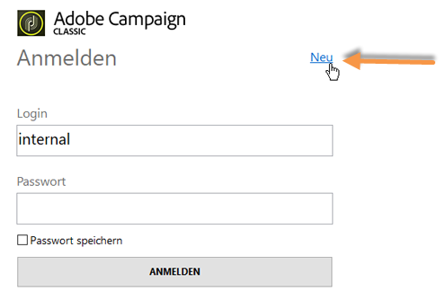

# Starten von Adobe Campaign{#launching-adobe-campaign}

Die Client-Konsole in Campaign ist ein Rich-Client, mit dem Sie eine Verbindung zu Ihren Campaign-Anwendungs-Servern herstellen können. Auf [dieser Seite](../../installation/using/installing-the-client-console.md) erfahren Sie, wie Sie die Clientkonsole herunterladen und konfigurieren.

>[!CAUTION]
>
>Überprüfen Sie die Kompatibilität Ihres Systems und Ihrer Tools mit der Adobe Campaign-Client-Konsole in der [Kompatibilitätsmatrix](../../rn/using/compatibility-matrix.md#ClientConsoleoperatingsystems)

## Adobe Campaign starten {#starting-adobe-campaign}

Sie können Adobe Campaign ausgehend vom Menü **[!UICONTROL Start > Alle Programme > Adobe Campaign v.X > Adobe Campaign Clientkonsole]** starten.

Im Clientkonsole-Verbindungsfenster können Sie mithilfe Ihrer Benutzerkennung und Ihres Passworts eine existierende Datenbank auswählen oder konfigurieren und eine Verbindung mit dieser Datenbank herstellen:

## Verbindung mit Adobe Campaign herstellen {#connecting-to-adobe-campaign}

Sie können über Ihre Adobe ID eine Verbindung mit Adobe Campaign herstellen. Weiterführende Informationen hierzu finden Sie auf [dieser Seite](../../integrations/using/about-adobe-id.md).

Die Verbindung kann auch mit einem spezifischen Login/Passwort hergestellt werden:

1. Geben Sie im Feld **[!UICONTROL Login]** die Kontokennung des Benutzers ein.

   Diese wird vom Administrator der Adobe-Campaign-Plattform vergeben.

1. Geben Sie im Feld **[!UICONTROL Passwort]** Ihr Passwort ein.

   Beim ersten Zugriff auf die Datenbank ist das vom Administrator festgelegte Passwort zu verwenden. Anschließend kann es über das Menü **[!UICONTROL Werkzeuge > Passwort ändern...]** angepasst werden. Details zu Benutzern und Verbindungen finden Sie unter [Zugriffsverwaltung](../../platform/using/access-management.md).

1. Klicken Sie zum Bestätigen auf **[!UICONTROL ANMELDEN]**.<!--You can also press the **Enter** key to launch connection.-->

Jetzt haben Sie Zugriff auf den [Adobe Campaign-Arbeitsbereich](../../platform/using/adobe-campaign-workspace.md).

Auf dem **[!UICONTROL Anmeldebildschirm]** sind einige Tastaturbefehle verfügbar:
* Alle aktionsfähigen Elemente können über die **Tabulatortaste** (von oben nach unten) oder die **Tabulatortaste** + **Umschalttaste** (von unten nach oben) ausgewählt werden.
* Um die Verbindung zu starten, können Sie auch die **Eingabetaste** drücken.
* Mit der **Escape**-Taste können Sie die Felder **[!UICONTROL Login]** und **[!UICONTROL Kennwort]** auf die letzten erfolgreichen Verbindungswerte zurücksetzen.

## Verbindungen einrichten {#setting-up-connections}

Auf die Verbindungseinstellungen des Servers können Sie über den Link über dem Eingabefeld zugreifen.

Wählen Sie im Fenster **[!UICONTROL Verbindungen]** die Option **[!UICONTROL Hinzufügen > Verbindung]** aus.

Anschließend sind die Verbindungsparameter wie folgt zu konfigurieren:

1. Erfassen Sie den **[!UICONTROL Namen]** der neuen Verbindung zur Datenbank.

1. Geben Sie im Feld **[!UICONTROL URL]** die Adresse des Anwendungs-Servers ein. Sollten Sie diese nicht kennen, kontaktieren Sie Ihren Administrator.

1. Aktivieren Sie die Option **[!UICONTROL Anmeldung mit einer Adobe ID]**, damit sich Benutzer über ihre Adobe ID mit der Konsole verbinden können. Weiterführende Informationen hierzu finden Sie [auf dieser Seite](../../integrations/using/about-adobe-id.md).

1. Wählen Sie zur Bestätigung **[!UICONTROL OK]** aus.

## Benutzer und Berechtigungen {#operators-and-permissions}

Kennungen, Passwörter und Zugriffsberechtigungen werden vom Adobe-Campaign-Systemadministrator im Verzeichnisknoten **[!UICONTROL Administration > Zugriffe > Benutzer]** des Adobe-Campaign-Navigationsbaums festgelegt.

Diese Funktionen werden im Abschnitt [Zugriffsverwaltung](../../platform/using/access-management.md) beschrieben.

## Verbindung zu Adobe Campaign unterbrechen {#disconnecting-from-adobe-campaign}

Um die Verbindung zu Adobe Campaign zu unterbrechen, verwenden Sie das erste Symbol in der Symbolleiste.

>[!NOTE]
>
>Alternativ ist es möglich, die Anwendung ohne vorheriges Abmelden direkt zu verlassen.

## Adobe Campaign-Version abrufen {#getting-your-campaign-version}

Das Menü **[!UICONTROL Hilfe > Versionsinformationen…]** liefert folgende Informationen:

* **Versionsnummer** der Campaign-Client-Konsole und des Anwendungs-Servers
* **Build-Nummer** der Campaign-Client-Konsole und des Anwendungs-Servers
* Link zur Adobe-Kundenunterstützung
* Links zur Adobe-Datenschutzrichtlinie sowie zu Nutzungsbedingungen und Bestimmungen zu Cookies

Wenn Sie mit dem Team der Adobe-Kundenunterstützung Kontakt aufnehmen, müssen Sie die Versionsnummer und die Build-Nummer Ihrer Adobe Campaign-Client-Konsole und des Anwendungs-Servers angeben.

**Verwandte Themen**:

* [Hilfe- und Support-Optionen für Adobe Campaign](../../support.md)
* [Adobe Campaign-Software-Verteilung](https://experience.adobe.com/#/downloads/content/software-distribution/de/campaign.html)
* [Support für Adobe Experience Cloud und Expertensitzungen](https://helpx.adobe.com/de/enterprise/admin-guide.html/enterprise/using/support-for-experience-cloud.ug.html)
