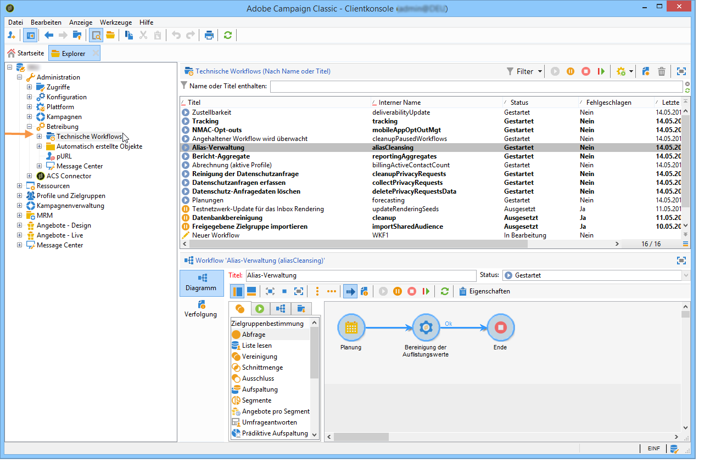

# Auflistungen verwalten{#managing-enumerations}

Eine Auflistung ist eine Liste mit vom System vorgeschlagenen Werten für das Ausfüllen bestimmter Felder. Mithilfe von Auflistungen können Sie die Werte dieser Felder vereinheitlichen und die Dateneingabe und Nutzung in Abfragen vereinfachen.

Die Werteliste erscheint in Form einer Dropdown-Liste, wo der dem Feld zuzuordnende Wert ausgewählt werden kann. Die Dropdown-Liste ermöglicht zudem die prädiktive Eingabe: Der Benutzer gibt die ersten Buchstaben ein und die Anwendung vervollständigt automatisch den Wert.

Diverse Felder der Anwendung enthalten derartige Auflistungen. Sie werden &quot;offen&quot; genannt, wenn Werte über eine direkte Eingabe im entsprechenden Feld hinzufügt werden können.

## Wertekonfiguration {#access-to-values}

Die Bestimmung der Werte für Auflistungsfelder und ihre Verwaltung (Hinzufügen/Löschen eines Werts) erfolgen über den Verzeichnisknoten **[!UICONTROL Administration > Plattform > Auflistungen]**.

* Im oberen Abschnitt befindet sich die Liste der Felder, für die eine Auflistung bestimmt wurde.
* Im unteren Abschnitt werden die vorgeschlagenen Werte aufgelistet. Diese Werte werden in den Eingabemasken wiederaufgenommen, die das entsprechende Feld verwenden.

  

  Um einen neuen Auflistungswert zu erstellen, klicken Sie auf die Schaltfläche **[!UICONTROL Hinzufügen]**.

  

  Wenn der Typ **[!UICONTROL Offen]** ausgewählt wird, kann der Benutzer einen neuen Auflistungswert durch direkte Eingabe in das entsprechende Feld hinzufügen. Eine Bestätigungsnachricht ermöglicht die Erstellung des Werts.

  

* Wenn der Typ **[!UICONTROL Geschlossen]** ausgewählt wird, können die Benutzer keine neuen Werte erstellen, sondern nur unter den vorgeschlagenen Werten auswählen.

## Daten standardisieren {#standardizing-data}

### Über die Alias-Verwaltung {#about-alias-cleansing}

In Auflistungsfelder können auch andere als die in der Auflistung vorgesehenen Werte eingegeben werden. Diese Werte können entweder, wie sie sind, gespeichert oder aber bereinigt werden.

>[!CAUTION]
>
>Die Bereinigung von Daten ist ein kritischer Prozess, der auf die Daten in der Datenbank einwirkt. Adobe Campaign aktualisiert Daten gebündelt, was zur Löschung von gewissen Werten führen kann. Dieser Vorgang ist daher erfahrenen Benutzern vorbehalten.

Der eingegebene Wert kann:

* den Werten der Auflistung hinzugefügt werden. Hierzu muss der Typ **[!UICONTROL Offen]** ausgewählt werden;
* automatisch von seinem Alias ersetzt werden. Hierzu muss Letzterer zuvor im Tab **[!UICONTROL Alias]** bestimmt worden sein;
* in der Liste der Alias gespeichert werden. Die Zuordnung des Alias kann zu einem späteren Zeitpunkt erfolgen.

  >[!NOTE]
  >
  >Wenn Sie Datenbereinigungskapazitäten benötigen, wählen Sie in der Aufzählung die Option **[!UICONTROL Alias-Verwaltung]**.

### Alias verwenden {#using-aliases}

Die Option **[!UICONTROL Alias-Verwaltung]** ermöglicht es, die Alias für die ausgewählte Auflistung zu verwalten. Wenn diese Option ausgewählt ist, wird unten im Fenster die Registerkarte **[!UICONTROL Alias]** angezeigt.

#### Alias erstellen {#creating-an-alias}

Um einen Alias zu erstellen, klicken Sie auf die Schaltfläche **[!UICONTROL Hinzufügen]**.

Geben Sie den zu konvertierenden Alias und den anzuwendenden Wert an und klicken Sie auf **[!UICONTROL OK]**.

Überprüfen Sie die Parameter vor dem Bestätigen des Vorgangs.

>[!CAUTION]
>
>Nach Bestätigung dieser Etappe können die zuvor eingegebenen Werte nicht mehr abgerufen werden: Sie wurden ersetzt.

Wenn der Benutzer also z. B. den Wert **NIELSEN** im Feld „Firma“ (in der Adobe Campaign-Konsole oder in einem Formular) eingibt, wird dieser durch den Wert **NIELSEN Ltd** ersetzt. Die Werteersetzung wird vom Workflow **Alias-Verwaltung** durchgeführt. Weitere Informationen finden Sie unter [Datenbereinigung durchführen](#running-data-cleansing).

#### Werte in Alias konvertieren {#converting-values-into-aliases}

Um einen Auflistungswert in einen Alias zu konvertieren, klicken Sie mit der rechten Maustaste in die Werteliste und wählen Sie die Aktion **[!UICONTROL Werte in Alias konvertieren...]**.

Wählen Sie die Werte aus, die Sie konvertieren möchten, und klicken Sie auf die Schaltfläche **[!UICONTROL Weiter]**.

Klicken Sie auf **[!UICONTROL Starten]**, um die Konvertierung zu starten.

Nach erfolgreicher Konvertierung wird der Alias der Alias-Liste hinzugefügt.

#### Aliastreffer abrufen {#retrieving-alias-hits}

Die von den Benutzern eingegebenen Werte können in Alias konvertiert werden. Wenn der Benutzer einen Wert eingibt, der sich nicht in den Auflistungswerten befindet, wird dieser im Tab **[!UICONTROL Alias]** gespeichert.

Der technische Workflow **Alias-Verwaltung** (aliasCleansing) ruft diese Werte jede Nacht ab, um die Auflistungen zu aktualisieren. Weitere Informationen finden Sie unter [Datenbereinigung durchführen](#running-data-cleansing).

Wenn gewünscht, kann in der Spalte **[!UICONTROL Treffer]** die Anzahl der Eingaben dieses Werts angezeigt werden. Die Berechnung dieses Werts kann jedoch lang und speicherintensiv sein. Weitere Informationen hierzu finden Sie unter [Eingabeanzahl berechnen](#calculating-entry-occurrences).

### Durchführen einer Datenbereinigung {#running-data-cleansing}

Die Datenbereinigung wird vom technischen Workflow der **[!UICONTROL Alias-Verwaltung]** durchgeführt. Die für die Auflistungen festgelegten Konfigurationen werden während der Ausführung des Workflows berücksichtigt. Siehe [Workflow Alias-Verwaltung](#alias-cleansing-workflow).

Die Datenbereinigung kann über den Link **[!UICONTROL Werte bereinigen...]** ausgelöst werden.

Der Link **[!UICONTROL Erweiterte Parameter...]** ermöglicht die Festlegung des Datums, ab dem die gesammelten Werte berücksichtigt werden.

Klicken Sie auf die Schaltfläche **[!UICONTROL Starten]**, um die Datenbereinigung zu beginnen.

#### Eingabeanzahl berechnen {#calculating-entry-occurrences}

Die Unterregisterkarte **[!UICONTROL Alias]** einer Auflistung kann die Anzahl der Vorkommen eines Alias unter allen eingegebenen Werten anzeigen. Es handelt sich bei dieser Information um eine Schätzung. Sie wird in der Spalte **[!UICONTROL Treffer]** angezeigt.

>[!CAUTION]
>
>Die Berechnung der Anzahl der Alias-Erscheinungen kann zeitaufwändig sein. Diese Funktion sollte daher mit Vorsicht angewandt werden.

Sie können die Trefferberechnung manuell über den Link **[!UICONTROL Werte bereinigen…]** ausführen. Klicken Sie hierfür auf den Link **[!UICONTROL Erweiterte Parameter...]** und wählen Sie die gewünschte(n) Option(en) aus.

* **[!UICONTROL Anzahl der Alias-Erscheinungen aktualisieren]**: Ermöglicht es, die bereits berechneten Treffer ab dem angegebenen Berücksichtigungsdatum zu aktualisieren.
* **[!UICONTROL Anzahl der Alias-Erscheinungen von Beginn an neu berechnen]**: Ermöglicht die Durchführung der Berechnung auf der gesamten Adobe-Campaign-Plattform.

Sie können auch einen dedizierten Workflow erstellen, um die Berechnung automatisch in bestimmten Abständen durchzuführen, beispielsweise jede Woche.

Erstellen Sie hierfür eine Kopie des Workflows **[!UICONTROL Alias-Verwaltung]**, passen Sie die Planung an und konfigurieren Sie in der Aktivität **[!UICONTROL Bereinigung der Auflistungswerte]** folgende Parameter:

* **-updateHits**, um die Anzahl der Alias-Erscheinungen zu aktualisieren;
* **-updateHits:full**, um die Anzahl aller Alias-Erscheinungen neu zu berechnen.

#### Alias-Verwaltungs-Workflow {#alias-cleansing-workflow}

Der Workflow **Alias-Verwaltung** führt die Bereinigung der Auflistungswerte durch. Er wird standardmäßig täglich ausgeführt.

Der Alias-Verwaltungs-Workflow ist über den Verzeichnisknoten **[!UICONTROL Administration > Betreibung > Technische Workflows]** zugänglich.

