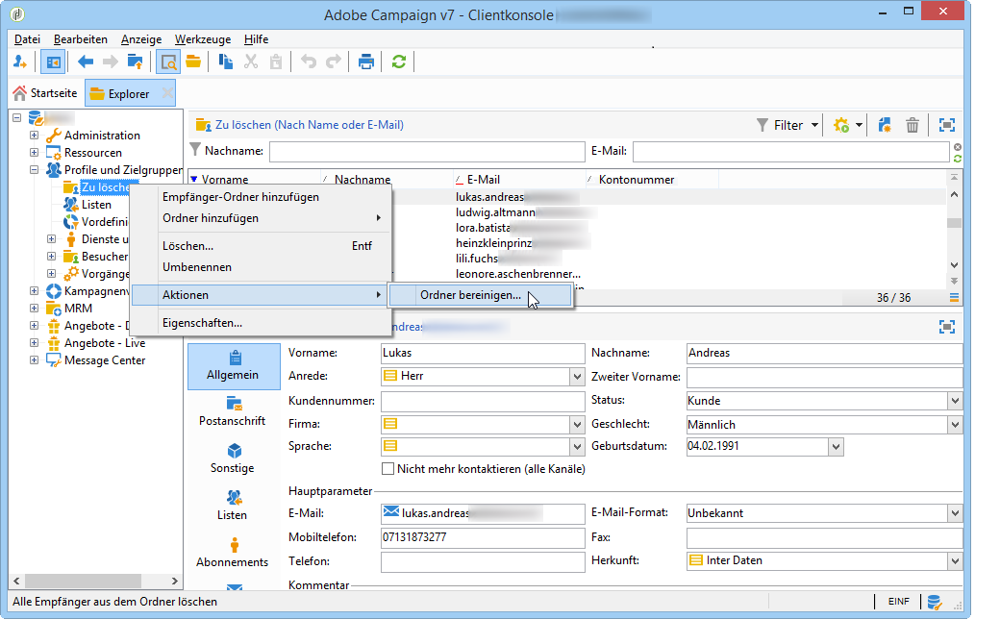
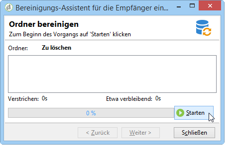

# Profile verwalten{#managing-profiles}

## Empfängerknoten im Navigationsbaum {#recipient-tree}

Erweiterte Funktionalitäten zur Empfängerverwaltung stehen über den Navigationsbaum zur Verfügung. Klicken Sie hierfür auf der Adobe-Campaign-Startseite auf die **[!UICONTROL Explorer]**-Schaltfläche in der Symbolleiste.

Der Empfängerordner befindet sich standardmäßig im Knoten **[!UICONTROL Profile und Zielgruppen]** des Adobe-Campaign-Navigationsbaums. Sie können von diesem Knoten ausgehend weitere Ordner oder Unterordner erstellen, um Empfängerprofile zu speichern.

Jeder Knoten entspricht einem Ordner. Die Daten eines Ordners sind als in sich abgeschlossen zu betrachten. Somit würde sich z. B. die Deduplizierung im Falle von mehreren Empfängerordnern als schwierig erweisen.

>[!NOTE]
>
>Um eine Liste aller in der Datenbank enthaltenen Empfänger anzuzeigen, ist die Erstellung einer Ansicht erforderlich. Siehe [Ordner und Ansichten](../../platform/using/access-management.md#folders-and-views).

## Empfänger verschieben {#moving-recipients}

Sie können einen oder eine Gruppe von Empfängern markieren und sie durch Drag&amp;Drop aus der Liste in einen anderen Ordner verschieben. Vor der endgültigen Verschiebung ist eine Bestätigung Ihrerseits erforderlich.

## Empfänger duplizieren {#copying-a-recipient}

Es besteht die Möglichkeit, einen Empfänger im selben Ordner zu duplizieren. Klicken Sie hierzu mit der rechten Maustaste auf den entsprechenden Empfänger und wählen Sie **[!UICONTROL Duplizieren]**.

## Empfänger löschen {#deleting-recipients}

Zu löschende Empfänger sind zunächst in einen spezifischen Ordner zu verschieben, welcher im Anschluss daran bereinigt wird. Es wird **dringend davon abgeraten**, in diesem Zusammenhang die Option **[!UICONTROL Löschen]** zu verwenden.

Löschen Sie den Ordnerinhalt, indem Sie mit der rechten Maustaste auf den entsprechenden Ordner klicken und **[!UICONTROL Aktionen > Ordner bereinigen]** auswählen.

Klicken Sie auf **[!UICONTROL Starten]**, um den Vorgang zu beginnen. Eine Statusleiste zeigt den Bearbeitungsfortschritt an:

