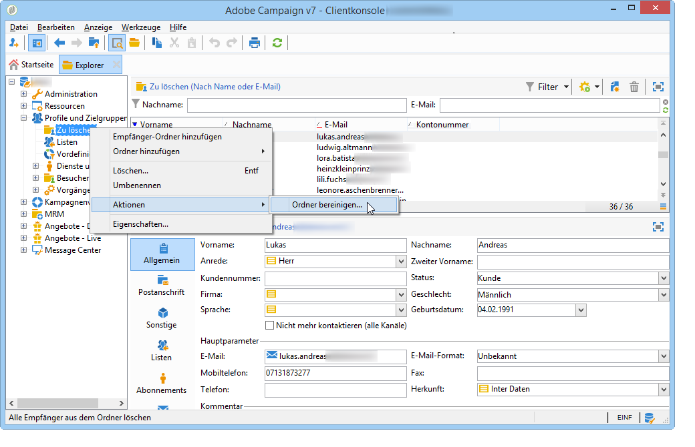
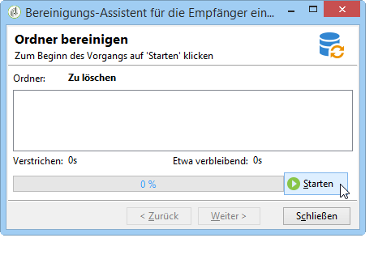

# Verwalten von Profilen{#managing-profiles}

## Empfängerknoten im Navigationsbaum {#recipient-tree}

Um auf erweiterte Funktionen für die Empfängerverwaltung zugreifen zu können, müssen Sie den Adobe Campaign-Navigationsbaum bearbeiten. Klicken Sie hierfür auf die Schaltfläche **[!UICONTROL Explorer]** in der Symbolleiste.

Standardmäßig werden Empfängerinnen und Empfänger im Knoten **[!UICONTROL Profile und Zielgruppen]** im Adobe Campaign-Navigationsbaum gespeichert. Vom selben Knoten aus können Sie einen oder mehrere Ordner und Unterordner zum Speichern von Empfängerprofilen erstellen.

Jeder Knoten entspricht einem Ordner. Die Daten jedes Ordners müssen als voneinander getrennt betrachtet werden. Dies bedeutet, dass die Verwaltung von Duplikaten für mehrere Empfängerordner schwieriger ist.

>[!NOTE]
>
> * Um eine Liste aller in der Datenbank enthaltenen Empfänger anzuzeigen, ist die Erstellung einer Ansicht erforderlich. Weitere Informationen finden Sie in der [Dokumentation zu Campaign v8 (Konsole)](https://experienceleague.adobe.com/de/docs/campaign/campaign-v8/config/configuration/folders-and-views){target=_blank}.
>
> * Weitere Informationen zum Verwalten von Profilen finden Sie in der [Dokumentation zu Campaign v8 (Konsole)](https://experienceleague.adobe.com/de/docs/campaign/campaign-v8/config/configuration/folders-and-views){target=_blank}.

<!--
## Move recipients {#moving-recipients}

You can select one or more recipients, drag them from the recipient list, and drop them in the desired folder. A warning message asks you to confirm this action.

## Copy a recipient {#copying-a-recipient}

You can copy a recipient in the same folder by right-clicking the desired recipient and selecting **[!UICONTROL Copy]**.

## Delete recipients {#deleting-recipients}

To delete recipients, move them to a specific folder and then purge the content of this folder. It is **strongly recommended not to use** the **[!UICONTROL Delete]** option in this case.

To purge a folder, use the **[!UICONTROL Actions > Purge folder]** menu, accessed by right-clicking the desired folder.

Click **[!UICONTROL Start]** to launch the operation. The middle section of the window displays the progress status, as shown below:

-->