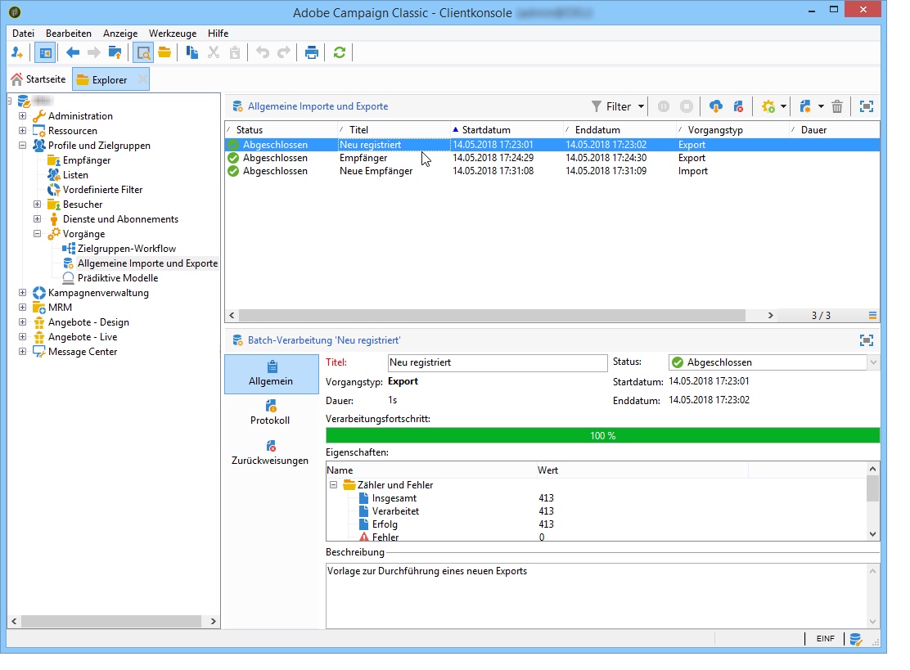
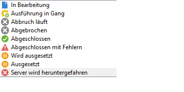

# Überwachen der Ausführung von Aufträgen {#monitoring-job-execution}

Sie können die Ausführung von Import- und Exportaufträgen direkt über die Liste der Import-/Exportaufträge verfolgen.

* Im Tab **[!UICONTROL Journal]** können Sie die zur Exportdurchführung gehörigen Protokollnachrichten einsehen.
* Der Tab **[!UICONTROL Zurückweisungen]** listet die Datensätze auf, die nicht verarbeitet werden konnten. Weitere Informationen finden Sie in [diesem Abschnitt](../../platform/using/executing-import-jobs.md#behavior-in-the-event-of-an-error).

Im Tab **[!UICONTROL Allgemein]** gibt das Feld **[!UICONTROL Status]** den aktuellen Status eines Auftrags an.

Jeder Status wird durch ein spezielles Symbol und eine spezielle Bezeichnung repräsentiert. Die Statusangaben und zugehörigen Symbole sind im Folgenden aufgeführt:

* **In Bearbeitung**

  Auftrag wird durch einen Benutzer bearbeitet.

* **Ausführung in Gang**

  Auftrag wird ausgeführt.

* **Rückgängig**

  Der laufende Auftrag wurde durch Klick auf die Schaltfläche **[!UICONTROL Abbrechen]** abgebrochen.

* **Wird abgebrochen**

  Der Abbruch wurde berücksichtigt und der Auftrag ist im Abbruch begriffen.

* **Wird ausgesetzt**

  Klick auf die Schaltfläche **[!UICONTROL Pause]**: Die Aussetzung des Auftrags ist in Gang.

* **Ausgesetzt**

  Klick auf die Schaltfläche **[!UICONTROL Pause]**:Der Auftrag ist ausgesetzt. Er kann durch Klicken auf **[!UICONTROL Starten]** neu gestartet werden.

* **Abgeschlossen**

  Die Ausführung des Auftrags ist abgeschlossen.

* **Abgeschlossen mit Fehlern**

  Der Auftrag konnte aufgrund eines technischen Fehlers nicht ausgeführt werden.

* **Server wird heruntergefahren**

  Der laufende Auftrag wurde aufgrund eines Stopps des Adobe Campaign-Servers unterbrochen.
