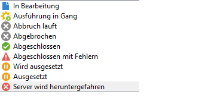

# Überwachung der Vorgangsausführung {#monitoring-job-execution}

Sie können die Ausführung von Import- und Exportvorgängen direkt über die Liste der Import-/Exportvorgänge verfolgen.

* Im Tab **[!UICONTROL Journal]** können Sie die zur Exportdurchführung gehörigen Protokollnachrichten einsehen.
* Der Tab **[!UICONTROL Zurückweisungen]** listet die Datensätze auf, die nicht verarbeitet werden konnten. Siehe [Verhalten bei Fehlern](../../platform/using/executing-import-jobs.md#behavior-in-the-event-of-an-error).

Im Tab **[!UICONTROL Allgemein]** gibt das Feld **[!UICONTROL Status]** den aktuellen Status eines Vorgangs an.

Jeder Status wird durch ein spezielles Symbol und eine spezielle Bezeichnung repräsentiert. Die Statusangaben und zugehörigen Symbole sind im Folgenden aufgeführt:

* **In Bearbeitung**

   Vorgang wird durch einen Benutzer bearbeitet.

* **Ausführung in Gang**

   Vorgang wird ausgeführt.

* **Rückgängig**

   Der laufende Vorgang wurde durch Klick auf die Schaltfläche **[!UICONTROL Abbrechen]** abgebrochen.

* **Wird abgebrochen**

   Der Abbruch wurde berücksichtigt und der Vorgang ist im Abbruch begriffen.

* **Wird ausgesetzt**

   Klick auf die Schaltfläche **[!UICONTROL Pause]**: Die Aussetzung des Vorgangs ist in Gang.

* **Ausgesetzt**

   Klick auf die Schaltfläche **[!UICONTROL Pause]**: Der Vorgang wurde ausgesetzt. Er kann über die Schaltfläche **[!UICONTROL Starten]** wieder aufgenommen werden.

* **Abgeschlossen**

   Die Ausführung des Vorgangs ist abgeschlossen.

* **Abgeschlossen mit Fehlern**

   Der Vorgang konnte aufgrund eines technischen Fehlers nicht ausgeführt werden.

* **Server wird heruntergefahren**

   Der laufende Vorgang wurde aufgrund eines Stopps des Adobe-Campaign-Servers unterbrochen.
