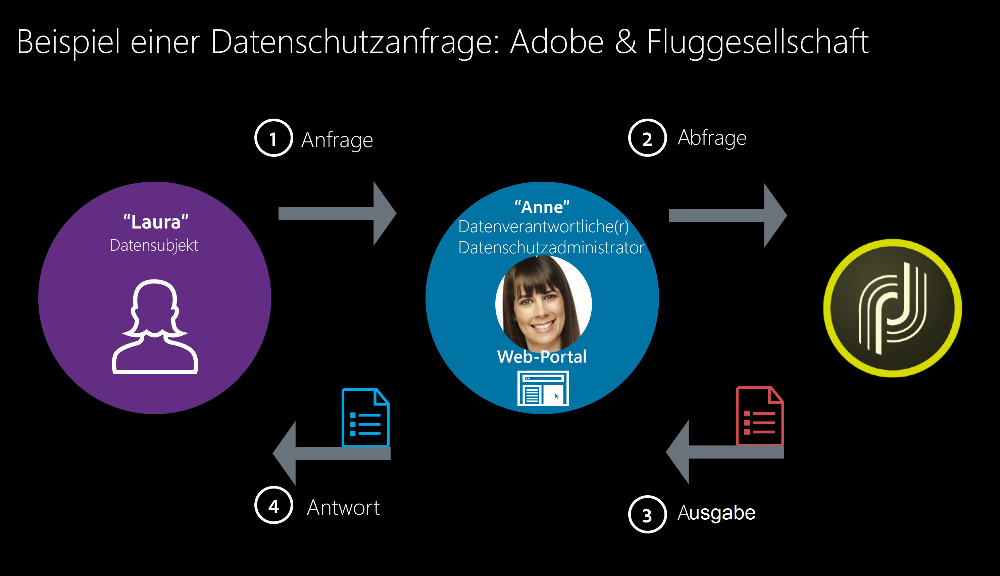

# Datenschutz und Einverständniserklärung{#privacy-and-recommendations}

## Allgemeine Empfehlungen {#general-recommendations}

Adobe Campaign ist ein leistungsstarkes Tool zur Erfassung und Verarbeitung sehr großer Datenmengen, einschließlich personenbezogener Daten und vertraulicher Informationen. Aus diesem Grund muss der Datenschutz sorgfältig gehandhabt werden.

* Gehen Sie stets verantwortungsvoll und ethisch korrekt mit persönlichen Informationen um.

* Senden Sie keine unerwünschten E-Mails, Push-Benachrichtigungen und SMS-Nachrichten (&quot;Spam&quot;). Adobe glaubt fest an Permission Marketing, um den Kundenlebenszeitwert und die Treue zu fördern, und verbietet daher strikt die Verwendung von Adobe Campaign zum Versenden von unerbetenen Nachrichten.

Lesen Sie auch die [Checkliste zu Sicherheit und Datenschutz](../../installation/using/get-started-security-privacy.md), um sich über die wichtigsten Elemente zu informieren, die in Bezug auf Sicherheit und Datenschutz zu überprüfen sind.

### Datenschutzbestimmungen {#privacy-regulations}

Um den Datenschutz korrekt zu handhaben und personenbezogene Daten zu verwalten, müssen Sie die für die Region(en) geltenden Gesetze einhalten, in denen Sie tätig sind. Zu diesen Verordnungen gehören:
* [DSGVO](https://ec.europa.eu/info/law/law-topic/data-protection/reform/what-does-general-data-protection-regulation-gdpr-govern_de) (Europäische Datenschutz-Grundverordnung)
* [DPA](https://www.gov.uk/data-protection) (Umsetzung der DSGVO durch das Vereinigte Königreich)
* [Europäische Richtlinie über Datenschutz und elektronische Kommunikation](https://eur-lex.europa.eu/legal-content/DE/TXT/?uri=CELEX:02002L0058-20091219)
* [CAN-SPAM Act](https://www.ftc.gov/tips-advice/business-center/guidance/can-spam-act-compliance-guide-business) (US-Gesetz zur Festlegung der Regeln und Anforderungen für kommerzielle E-Mails)
* [CCPA](https://leginfo.legislature.ca.gov/faces/codes_displayText.xhtml?lawCode=CIV&amp;division=3.&amp;title=1.81.5.&amp;part=4.&amp;chapter=&amp;article=) (kalifornisches Verbraucherschutzgesetz)
* [PDPA](https://secureprivacy.ai/thailand-pdpa-summary-what-businesses-need-to-know/) (thailändisches Gesetz zum Schutz personenbezogener Daten)
* [LGPD](https://iapp.org/media/pdf/resource_center/Brazilian_General_Data_Protection_Law.pdf) (brasilianisches Datenschutzgesetz) – tritt am 16. August 2020 in Kraft

>[!NOTE]
>
>Weitere Informationen zur Anwendung von DSGVO, CCPA, PDPA und LGPD auf Adobe Campaign finden Sie auf [dieser Seite](../../platform/using/privacy-management.md#privacy-management-regulations).

### Adobe Experience Cloud – Datenschutz {#experience-cloud-privacy}

Adobe Campaign ist Teil der Adobe Experience Cloud-Lösungen. Die Art und Weise, wie der Datenschutz in Campaign gehandhabt wird, entspricht den allgemeinen Grundsätzen von Experience Cloud, z. B.:

* **Welche Informationen werden bei Verwendung von Adobe Experience Cloud erfasst?**

   Als Unternehmen, das Adobe Experience Cloud-Lösungen nutzt, entscheiden Sie selbst, welche Informationen erfasst und an Ihr Adobe Experience Cloud-Konto gesendet werden sollen. Beispiele für die Arten von Informationen, die erfasst werden können, sind Webbrowsing-Aktivitäten, IP-Adressen, Standortinformationen von Mobilgeräten, Erfolgsquoten von Kampagnen, gekaufte oder in den Warenkorb gelegte Artikel usw.

   >[!NOTE]
   >
   >Wie bei allen Produkten von Adobe erfasst Campaign Informationen über App- und Website-Benutzer. Weitere Informationen finden Sie in der [Datenschutzerklärung von Adobe](https://www.adobe.com/de/privacy/policy.html).

* **Verwendung von Adobe Experience Cloud zur Erfassung von Informationen**

   * Adobe Experience Cloud-Lösungen verwenden Cookies und ähnliche Technologien, wie Webbeacons (auch als Tags oder Pixel bezeichnet), um die Erfassung von Informationen zu ermöglichen. Weitere Informationen zu Cookies und Tracking-Funktionen mit Adobe Campaign finden Sie in [diesem Abschnitt](#tracking-capabilities).
   * Sie können Adobe Experience Cloud-Technologien auch in Ihren mobilen Apps verwenden. Weitere Informationen zu mobilen Sendungen mit Campaign finden Sie unter [SMS-Kanal](../../delivery/using/sms-channel.md) und [Mobile-App-Kanal](../../delivery/using/about-mobile-app-channel.md).

* **Datenschutzoptionen Ihrer Benutzer bezüglich Ihrer Verwendung von Adobe Experience Cloud**

   Adobe fordert Sie auf, Ihren Kunden Datenschutzrichtlinien bereitzustellen, in denen Folgendes beschrieben wird:

   * Ihre Datenschutzpraktiken in Verbindung mit Adobe Experience Cloud
   * Die Art und Weise, auf die Benutzer ihre Voreinstellungen für die Erfassung oder Verwendung ihrer Informationen in Verbindung mit Adobe Experience Cloud festlegen können

   >[!NOTE]
   >
   >Wie bei allen Produkten von Adobe können Campaign-Benutzer die Weitergabe von Informationen, die über Apps und Websites erfasst wurden, deaktivieren. Weitere Informationen finden Sie in den [häufig gestellten Fragen zu den Adobe Experience Cloud-Nutzungsinformationen](https://www.adobe.com/de/privacy/experience-cloud-usage-info-faq.html).

Weitere Informationen zum Datenschutz in Adobe Experience Cloud finden Sie auf [dieser Seite](https://www.adobe.com/de/privacy/marketing-cloud.html).

## Persönliche Daten und Personas {#personal-data}

Bei der Verwaltung des Datenschutzes ist es wichtig zu definieren, welche Daten von wem mit Sorgfalt behandelt werden sollen.
* **Personenbezogene Daten** sind Informationen, die eine lebende Person direkt oder indirekt identifizieren können.
* **Vertrauliche personenbezogene Daten** sind Informationen zu Rasse, politischen Ansichten, religiösen Überzeugungen, kriminellem Hintergrund, genetischen Informationen, Gesundheitsdaten, sexuellen Vorlieben, biometrischen Informationen sowie zur Gewerkschaftsmitgliedschaft.

Bei der Integration von Campaign mit anderen Experience Cloud-Lösungen, bei denen Audiences von einem System auf ein anderes übertragen werden können, wie z. B. mit [Adobe Analytics](../../platform/using/adobe-analytics-data-connector.md), [Audience Manager oder People Coreservice](../../integrations/using/sharing-audiences-with-adobe-experience-cloud.md), [Campaign Standard](../../integrations/using/synchronizing-audiences.md) oder mit anderen Lösungen über [CRM-Connectoren](../../platform/using/crm-connectors.md), müssen Sie dem Schutz personenbezogener Daten besondere Aufmerksamkeit widmen.

Die [wichtigsten Rechtsvorschriften](#privacy-regulations) beziehen sich auf die verschiedenen Einheiten, die Daten wie folgt verwalten:
* Ein **Datenverantwortlicher** ist die Autorität, die die Mittel und den Zweck der Erfassung, Verwendung und Weitergabe personenbezogener Daten festlegt.
* Ein **Auftragsverarbeiter** ist eine natürliche oder juristische Person, die personenbezogene Daten gemäß den Anweisungen des Datenverantwortlichen erfasst, verwendet oder weitergibt.
* Eine **betroffene Person** ist eine lebende Person, deren personenbezogene Daten erfasst, verwendet oder weitergegeben werden und die direkt oder indirekt anhand dieser personenbezogenen Daten identifiziert werden kann.

Als Unternehmen, das personenbezogene Daten erfasst und weitergibt, sind Sie daher der Datenverantwortliche, Ihre Kunden sind die betroffenen Personen und Adobe Campaign fungiert als Auftragsverarbeiter, wenn wir deren personenbezogenen Daten gemäß Ihren Anweisungen verarbeiten. Beachten Sie, dass es in Ihrer Verantwortung als Datenverantwortlicher liegt, die Beziehung zu den betroffenen Personen zu verwalten, z. B. bei der Verwaltung von [Datenschutzanfragen](#privacy-requests).

### Anwendungsszenario {#use-case-scenario}

Um zu veranschaulichen, wie die verschiedenen Personas interagieren, finden Sie hier ein Beispiel für ein DSGVO-Kundenerlebnis auf hoher Ebene.

In diesem Beispiel ist eine Fluggesellschaft der Kunde von Adobe Campaign. Diese Firma ist der **Datenverantwortliche** und alle Kunden der Fluggesellschaft sind **betroffene Personen**. Laura ist in diesem speziellen Fall eine Kundin der Fluggesellschaft.

Die Personas in unserem Beispiel haben folgende Rollen:

* **Laura** ist die **betroffene Person**. Sie ist die Empfängerin, die Nachrichten von der Fluggesellschaft erhält. Laura mag eine Vielfliegerin sein, kann aber irgendwann entscheiden, dass sie keine personalisierten Werbe- oder Marketing-Botschaften mehr von der Fluggesellschaft wünscht. Sie wird die Fluggesellschaft (anhand des entsprechenden Vorgangs) bitten, ihre Vielfliegernummer zu löschen.

* **Anne** ist die **Datenverantwortliche** der Fluggesellschaft. Sie erhält Lauras Anfrage, ruft nützliche IDs ab, die zur Identifizierung der betroffenen Person erforderlich sind, und sendet die Anfrage in Adobe Campaign.

* **Adobe Campaign** ist der **Auftragsverarbeiter**.

Dies ist das übliche Verfahren für ein derartiges Szenario:

1. Die **betroffene Person** (Laura) übermittelt per E-Mail, über die Kundenunterstützung oder über ein Web-Portal eine DSGVO-Anfrage an die **Datenverantwortliche**.

1. Die **Datenverantwortliche** (Anne) sendet die DSGVO-Anfrage über die Benutzerschnittstelle oder eine API an Campaign.

1. Nachdem der **Auftragsverarbeiter** (Adobe Campaign) die Informationen erhalten hat, wird er in Bezug auf die DSGVO-Anfrage aktiv und sendet eine Antwort oder eine Bestätigung an die **Datenverantwortliche** (Anne).

1. Die **Datenverantwortliche** (Anne) prüft die Informationen und sendet sie an die **betroffene Person** (Laura).

## Datenakquise {#data-acquisition}

Mit Adobe Campaign können Sie Daten, einschließlich persönlicher und vertraulicher Daten, erfassen. Es ist daher unerlässlich, dass Sie das Einverständnis Ihrer Empfänger erhalten und überwachen.

* Fordern Sie die Empfänger immer auf, dem Empfang von Nachrichten zuzustimmen. Dazu müssen Sie Opt-out-Anfragen so schnell wie möglich erfüllen und das Einverständnis durch einen Anmeldeprozess mit zweifacher Bestätigung überprüfen. Weitere Informationen hierzu finden Sie unter [Abonnement-Formular mit zweifacher Bestätigung erstellen](../../web/using/use-cases--web-forms.md#create-a-subscription--form-with-double-opt-in).
* Importieren Sie keine betrügerischen Listen und verwenden Sie Testadressen, um sicherzustellen, dass Ihre Client-Datei nicht betrügerisch verwendet wird. Weiterführende Informationen dazu finden Sie im Abschnitt [Über Testadressen](../../delivery/using/about-seed-addresses.md).
* Mithilfe von Einverständnisverwaltung und Berechtigungs-Management können Sie die Voreinstellungen Ihrer Empfänger verfolgen und festlegen, wer in Ihrem Unternehmen auf welche Daten zugreifen kann. Weiterführende Informationen hierzu finden Sie in [diesem Abschnitt](#consent).
* Erleichtern und verwalten Sie Datenschutzanfragen von Ihren Empfängern. Weiterführende Informationen hierzu finden Sie in [diesem Abschnitt](#privacy-requests).

## Datenschutzverwaltung {#privacy-management}

Die Datenschutzverwaltung bezieht sich auf alle Prozesse und Tools, mit denen Sie die Datenschutzbestimmungen (DSGVO, CCPA usw.) einhalten können. Verschaffen Sie sich auf [dieser Seite](https://helpx.adobe.com/de/campaign/kb/campaign-privacy-overview.html) einen Überblick über die Datenschutzverwaltung.

Adobe Campaign bietet Ihnen verschiedene Funktionen zur Datenschutzverwaltung:
* Einverständnisverwaltung, Datenbeibehaltung und Benutzerrollen. Siehe [diesen Abschnitt](#consent).
* Datenschutzanfragen (Recht auf Zugriff und Recht auf Vergessenwerden). Siehe [diesen Abschnitt](#privacy-requests).
* Abmeldung (Opt-out) vom Verkauf von personenbezogenen Daten (CCPA-spezifisch). Siehe [diesen Abschnitt](../../platform/using/privacy-requests.md#sale-of-personal-information-ccpa).

Die wichtigsten Datenschutzfunktionen in Campaign und ein Beispiel der beteiligten Rollen werden in [diesem Abschnitt](https://helpx.adobe.com/de/campaign/kb/campaign-privacy-more.html#gdprpersonasandflow) dargestellt.

### Einverständnis, Datenbeibehaltung und Benutzerrollen {#consent}

Zunächst bietet Adobe Campaign wichtige Funktionen, die für den Datenschutz unerlässlich sind:

* **Einverständnisverwaltung**: Mithilfe der Abonnementverwaltung können Sie die Voreinstellungen Ihrer Empfänger verwalten und nachverfolgen, welche Empfänger sich für welche Art von Abonnements entschieden haben. Weitere Informationen hierzu finden Sie im Abschnitt [Über Abonnements](../../delivery/using/about-services-and-subscriptions.md).
* **Datenbeibehaltung**: Alle integrierten standardmäßigen Protokolltabellen in Campaign verfügen über eine vordefinierte Beibehaltungsdauer, die üblicherweise auf maximal sechs Monate begrenzt ist. Mit Workflows können weitere Beibehaltungszeiträume eingerichtet werden. Weitere Informationen hierzu erhalten Sie von den Adobe-Beratern oder technischen Administratoren.
* **Berechtigungs-Management**: Adobe Campaign bietet Ihnen die Möglichkeit, die den unterschiedlichen Campaign-Benutzern zugewiesenen Rechte mithilfe von vordefinierten oder benutzerdefinierten spezifischen Rollen zu verwalten. Damit können Sie festlegen, wer in Ihrem Unternehmen auf unterschiedliche Arten von Daten zugreifen, diese ändern und exportieren kann. Weitere Informationen hierzu finden Sie unter [Über die Zugriffsverwaltung](../../platform/using/access-management.md).

Weitere Informationen zu diesen Funktionen und deren Verwaltung in Adobe Campaign finden Sie in [diesem Abschnitt](../../platform/using/privacy-management.md#consent-retention-roles).

### Datenschutzanfragen {#privacy-requests}

Adobe Campaign bietet zusätzliche Funktionen, mit denen Sie sich als Datenverantwortlicher auf bestimmte Datenschutzanfragen vorbereiten können:

* Das **Recht auf Zugriff** ist das Recht der betroffenen Person, vom Datenverantwortlichen eine Auskunft darüber zu erhalten, ob und warum personenbezogene Daten über sie verarbeitet werden oder nicht.

* Das **Recht auf Vergessenwerden** (Löschanfrage) berechtigt die betroffene Person dazu, vom Datenverantwortlichen die Löschung ihrer personenbezogenen Daten zu verlangen.

Näheres zu Anfragen zum **Zugriff** und zur **Löschung** finden Sie in [diesem Abschnitt](../../platform/using/privacy-management.md#right-access-forgotten).

Die Implementierungsschritte zum Erstellen dieser Anfragen werden in [diesem Abschnitt](../../platform/using/privacy-requests.md) beschrieben.

## Tracking-Funktionen {#tracking-capabilities}

### Cookies {#cookies}

Dank der Tracking-Funktionen können Sie mit Adobe Campaign die Navigation Ihrer Versandempfänger mit drei Cookie-Typen verfolgen: mit einem Sitzungs-Cookie und zwei dauerhaften Cookies.

* Ein **Sitzungs**-Cookie: Das **nlid**-Cookie enthält die Kennung der an den Kontakt gesendeten E-Mail (**broadlogId**) und die Kennung der Nachrichtenvorlage (**deliveryId**). Es wird gesetzt, sobald der Kontakt auf eine in einer mit Adobe Campaign gesendeten E-Mail enthaltene URL klickt, und ermöglicht, das Web-Verhalten des Kontakts zu verfolgen. Dieses Sitzungs-Cookie wird automatisch beim Schließen des Browsers gelöscht. Der Kontakt hat die Möglichkeit, das Setzen des Cookies zu verbieten, indem er seine Browser-Einstellungen dementsprechend ändert.

* Zwei **dauerhafte** Cookies:
   * Das **UUID**-Cookie (Universal Unique IDentifier) wird von verschiedenen Adobe Experience Cloud-Lösungen verwendet. Es wird einmal gesetzt, bis es beim Generieren eines neuen Werts aus dem Clientbrowser verschwindet. Dieses Cookie ermöglicht die Identifizierung eines Benutzers, der bei Website-Besuchen mit Experience Cloud-Lösungen interagiert. Es kann von einer Landingpage (um unbekannte Kundenaktivitäten einem Empfänger zuzuordnen) oder von einem Versand hinterlegt werden. Eine Beschreibung dieses Cookies finden Sie auf [dieser Seite](https://experienceleague.adobe.com/docs/core-services/interface/ec-cookies/cookies-mc.html?lang=de#ec-cookies).
   * Das **nllastdelid**-Cookie (eingeführt in Campaign Classic 20.3) ist ein dauerhaftes Cookie, das die **deliveryId** des letzten Versands enthält, von dem aus der Benutzer auf den Link geklickt hat. Dieses Cookie wird (wenn das Sitzungs-Cookie fehlt) zur Identifizierung der zu verwendenden Tracking-Tabelle verwendet.

Vorschriften wie die EU-Datenschutz-Grundverordnung (DSGVO) besagen, dass Unternehmen die Zustimmung der Website-Benutzer benötigen, bevor sie Cookies installieren.

* Eine Möglichkeit besteht darin, Besucher von Webtracking betroffenen Seiten zur Zustimmung aufzufordern, indem im oberen Bereich auf der ersten besuchten Seite ein Banner eingeblendet und zum Ankreuzen eines Feldes aufgefordert wird.
* Vermeiden Sie jedoch Pop-ups, da diese häufig von den Browsern blockiert werden.

### Nachrichten-Tracking {#message-tracking}

Mit Adobe Campaign können Sie die gesendeten E-Mails und das Verhalten der Empfänger Ihrer Sendungen verfolgen: Öffnen, Klicks auf Links, Abmeldungen usw. Weitere Informationen hierzu finden Sie unter [Über das Nachrichten-Tracking](../../delivery/using/about-message-tracking.md).

Fügen Sie zu diesem Zweck [getrackte Links](../../delivery/using/how-to-configure-tracked-links.md) zu Ihren Nachrichten hinzu, um die Wirkung Ihrer Sendungen und des Verhaltens Ihrer Empfänger im Tab [Tracking](../../delivery/using/delivery-dashboard.md#tracking-logs) des Versand-Dashboards zu messen. Tracking-Daten werden im Bericht [Trackingindikatoren](../../reporting/using/delivery-reports.md#tracking-indicators) interpretiert.

### Webtracking {#web-tracking}

Mit Adobe Campaign können Sie auch überwachen, wie Empfänger auf Ihrer Website surfen: Fügen Sie Trackingtags ein, um Informationen zu sammeln und Besuche auf Websites der Web-Anwendung zu messen. Weitere Informationen hierzu finden Sie unter [Verfolgen einer Web-Anwendung](../../web/using/tracking-a-web-application.md).

Die Konfiguration des Webtrackings wird in [diesem Abschnitt](../../configuration/using/about-web-tracking.md) beschrieben.

Zusätzlich können Sie in Adobe Campaign ein Opt-out-Banner anzeigen, über das Endbenutzer das Tracking ihres Web-Verhaltens beenden können. Weitere Informationen hierzu finden Sie unter [Opt-out vom Web-Anwendungs-Tracking](../../web/using/web-application-tracking-opt-out.md).
