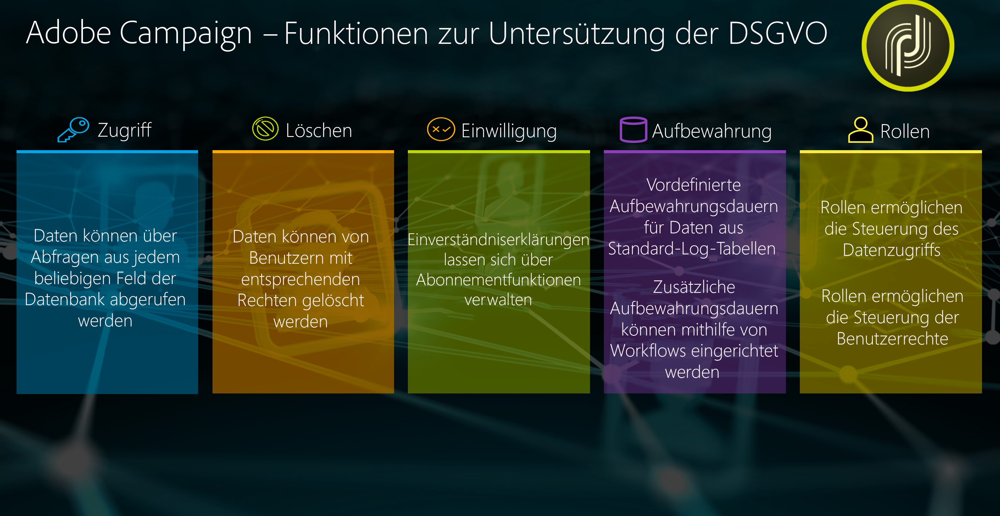

# Datenschutzverwaltung {#privacy-management}

Adobe Campaign bietet eine Reihe von Tools, die Sie bei der Einhaltung der [Datenschutzverordnungen](#privacy-management-regulations) (einschließlich DSGVO, CCPA, PDPA, LGPD) unterstützen.

Im Folgenden sind die fünf wichtigsten Funktionen von Adobe Campaign zur Einhaltung der Datenschutzbestimmungen aufgeführt:

* **Recht auf Zugriff**
* **Recht auf Löschen**
* **Einverständnisverwaltung**
* **Datenbeibehaltung**
* **Rights Management**

Weitere Informationen hierzu finden Sie unter [Recht auf Zugriff und Recht auf Vergessenwerden](#right-access-forgotten) und unter [Einverständnis, Datenbeibehaltung und Benutzerrollen](#consent-retention-roles).

<!--This section presents general information on what Privacy management is and the features provided by Adobe Campaign to manage the [Right to Access and Right to be Forgotten](#right-access-forgotten).

It also contains information on important features to manage Privacy ([Consent, Retention and Roles](#consent-retention-roles)), as well as best practices to help you with your Privacy compliance when using Adobe Campaign.-->

## Vorschriften zur Datenschutzverwaltung {#privacy-management-regulations}

Die Funktionen von Adobe Campaign helfen Ihnen bei der Einhaltung der folgenden Verordnungen:

* Die **DSGVO** (Datenschutz-Grundverordnung) ist das Datenschutzgesetz der Europäischen Union (EU), in dem die Anforderungen an den Datenschutz in den Ländern der EU harmonisiert und neu geregelt werden. 
* Der **CCPA** (California Consumer Privacy Act) gibt in Kalifornien ansässigen Personen neue Rechte in Bezug auf ihre personenbezogenen Daten und verpflichtet bestimmte in Kalifornien tätige Unternehmen zur Einhaltung von Datenschutzvorschriften.
* Der **PDPA** (Personal Data Protection Act) ist das neue Datenschutzgesetz, in dem die Anforderungen an den Datenschutz in Thailand harmonisiert und neu geregelt werden.
* Der **LGPD** (Lei Geral de Proteção de Dados) gilt für alle Unternehmen, die in Brasilien personenbezogene Daten sammeln oder verarbeiten.
* Das **CASL** (Canadian Anti-Spam Law) betrifft alle Nachrichten, die in oder aus Kanada gesendet werden, jedoch keine Nachrichten, die durch Kanada geleitet werden.
* Der **VCDPA** (Virginia Consumer Data Protection Act) und **CPA** (Colorado Privacy Act) gelten für alle Unternehmen, die in diesen Bundesstaaten geschäftlich tätig sind oder Personen mit Wohnsitz in diesen Staaten aufnehmen.

Alle diese Verordnungen gelten für Adobe Campaign-Kundinnen und -Kunden, die über Daten von betroffenen Personen mit Wohnsitz in den oben genannten Regionen oder Ländern verfügen.

<!--Several Privacy capabilities are available in Adobe Campaign, including consent management, data retention settings, and rights management. See [Consent, Retention and Roles](#consent-retention-roles). In addition to this, Adobe Campaign helps facilitate your readiness as Data Controller for certain Privacy requests. See [Right to Access and Right to be Forgotten](#right-access-forgotten).-->

>[!NOTE]
>
>Weitere Informationen zu personenbezogenen Daten und zu den verschiedenen Entitäten, die Daten verwalten (Datenverantwortliche, Auftragsverarbeiter und betroffene Personen), finden Sie unter [Personenbezogene Daten und Personas](../../platform/using/privacy-and-recommendations.md#personal-data).

## Recht auf Zugriff und Recht auf Vergessenwerden {#right-access-forgotten}

Um Sie bei der Einhaltung der Datenschutzverordnungen zu unterstützen, ermöglicht Ihnen Adobe Campaign jetzt die Durchführung von **Zugriffs-** und **Löschanfragen**.

* Das **Recht auf Zugriff** ist das Recht der betroffenen Person, vom Datenverantwortlichen eine Auskunft darüber zu erhalten, ob ihre personenbezogenen Daten verarbeitet werden, wo dies geschieht und zu welchem Zweck. Der Datenverantwortliche muss eine Kopie der personenbezogenen Daten kostenlos in elektronischer Form zur Verfügung stellen.

* Das **Recht auf Vergessenwerden** (Löschungsanfrage), auch Datenlöschung genannt, bedeutet, dass die betroffene Person vom Datenverantwortlichen verlangen kann, ihre personenbezogenen Daten zu löschen, ihre Daten nicht weiter zu verbreiten und mögliche Dritte anzuhalten, die Datenverarbeitung einzustellen.

Weitere Informationen zum Erstellen von **Zugriffs-** und **Löschanfragen** und zur Verarbeitung dieser Anfragen durch Adobe Campaign finden Sie in den [Implementierungsschritten](../../platform/using/privacy-requests.md).

<!--Tutorials on Privacy management in Campaign Standard are also available [here](https://experienceleague.adobe.com/docs/campaign-standard-learn/tutorials/privacy/privacy-overview.html?lang=de).
https://experienceleague.adobe.com/docs/campaign-standard-learn/tutorials/privacy/privacy-overview.html-->

## Einverständnis, Datenbeibehaltung und Benutzerrollen {#consent-retention-roles}

Zusätzlich zu den neuen Funktionen für das **Recht auf Zugriff** und das **Recht auf Vergessenwerden** bietet Adobe Campaign weitere für den Datenschutz wichtige Funktionen:

* [Einverständnisverwaltung](#consent-management): Abonnement-Funktion für die Verwaltung von Einstellungen
* [Datenbeibehaltung](#data-retention): Fristen für die Datenbeibehaltung für alle Standard-Log-Tabellen; zusätzliche Fristen für die Datenbeibehaltung können mit Workflows eingerichtet werden
* [Berechtigungs-Management](#rights-management): Der Datenzugriff wird über spezifische Berechtigungen verwaltet

### Einverständnisverwaltung {#consent-management}

Einverständnis bedeutet die Zustimmung des Datensubjekts zur Verarbeitung seiner personenbezogenen Daten. Der Datenverantwortliche ist dafür zuständig, das erforderliche Einverständnis für diese Verarbeitung einzuholen. Adobe Campaign stellt zwar Funktionen bereit, die den Kunden bei der Verwaltung der Einverständniserklärungen unterstützen, Adobe ist jedoch nicht für das Einverständnis als solches verantwortlich. Kunden sollten ihre Rechtsabteilung zurate ziehen, um Prozesse und Verfahren für das Einholen des Einverständnisses auszuarbeiten.

Die Funktionen, die bei der Verwaltung bestimmter Aspekte des Einverständnisses helfen, waren bei Adobe Campaign schon immer von zentraler Bedeutung. Mithilfe des Abonnementverwaltungsprozesses können Kunden nachverfolgen, welche Empfänger sich für welche Arten von Abonnements angemeldet haben, ob Newsletter, tägliche oder wöchentliche Promotions oder andere Marketing-Programme.

Weitere Informationen zur Einverständnisverwaltung finden Sie im [entsprechenden Handbuch](../../delivery/using/managing-subscriptions.md).

Zusätzlich zu den von Adobe Campaign bereitgestellten Werkzeugen für die Einverständnisverwaltung können Sie verfolgen, ob ein Benutzer dem Verkauf seiner personenbezogenen Daten widersprochen hat. Weitere Informationen finden Sie in [diesem Abschnitt](../../platform/using/privacy-requests.md#sale-of-personal-information-ccpa).

### Datenbeibehaltung {#data-retention}

Die nativen Log-Tabellen in Campaign verfügen über eine vordefinierte Beibehaltungsdauer, die üblicherweise auf maximal sechs Monate begrenzt ist.

Im Folgenden finden Sie die standardmäßige Beibehaltungsdauer für Standardtabellen. Beachten Sie, dass diese Beibehaltungswerte von den technischen Adobe-Administratoren während der Implementierung festgelegt werden und daher je nach Kundenanforderungen variieren können.

* **Konsolidiertes Tracking**: 1 Jahr
* **Versandlogs**: 6 Monate
* **Trackinglogs**: 1 Jahr
* **Gelöschte Sendungen**: 1 Woche
* **Importzurückweisungen**: 6 Monate
* **Besucherprofile**: 1 Monat
* **Angebotsvorschläge**: 1 Jahr
* **Ereignisse**: 1 Monat
* **Statistiken zur Ereignisverarbeitung**: 1 Jahr
* **Ereignisse mit Verlauf**: 1 Jahr
* **Ignorierte Pipeline-Ereignisse**: 1 Monat
* **Dynamische Berichterstellung**: 13 Monate

Ähnlich wie beim Löschvorgang kann auch mithilfe von Standard-Workflow-Funktionen die Beibehaltungsdauer für benutzerdefinierte Tabellen festgelegt werden.

Wenden Sie sich an einen Adobe-Berater oder technischen Administrator, um mehr über die Beibehaltung zu erfahren oder um festzustellen, ob Sie eine Beibehaltung für benutzerdefinierte Tabellen festlegen müssen.

### Rights Management {#rights-management}

Adobe Campaign bietet Ihnen die Möglichkeit, die den unterschiedlichen Campaign-Benutzern zugewiesenen Rechte mithilfe von vordefinierten oder benutzerdefinierten spezifischen Rollen zu verwalten.

Ein Vorteil ist, dass Sie damit verwalten können, wer in Ihrer Firma auf verschiedene Datentypen zugreifen kann. So können Sie beispielsweise verschiedene Marketing-Experten für verschiedene geografische Gebiete (Geos) verwenden, und jeder Marketing-Experte kann nur auf Daten aus seinem geografischen Gebiet zugreifen.

Analog können Sie mit dieser Funktion für jeden Benutzer bestimmte Funktionen konfigurieren. So können Sie zum Beispiel eingrenzen, wer Sendungen übermitteln darf oder – was für die Verwaltung von Datenschutz relevanter ist – wer Daten verändern oder exportieren darf.

Weitere Informationen zur Zugriffsverwaltung finden Sie im [entsprechenden Handbuch](../../platform/using/access-management.md).
