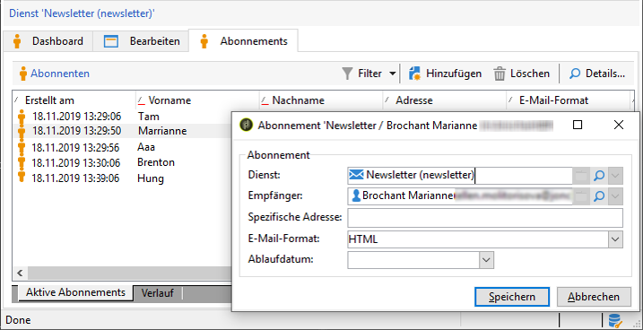
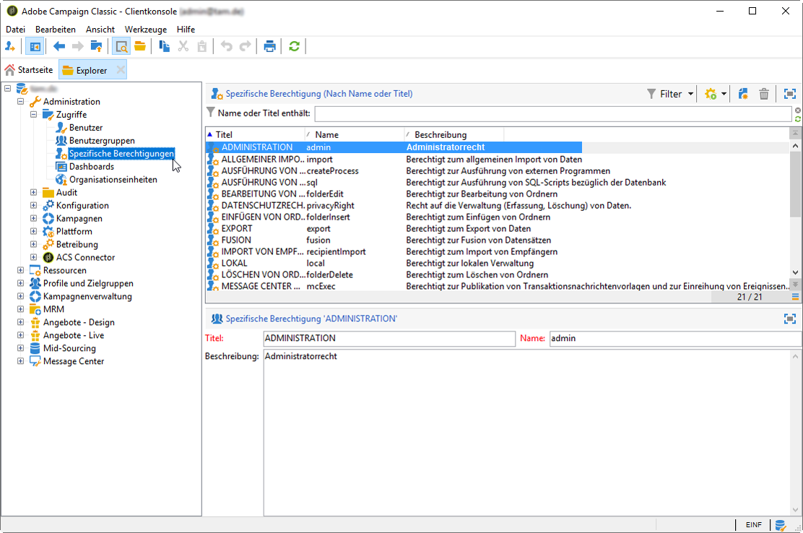

# Datenschutzverwaltung {#privacy-management}

Adobe Campaign bietet eine Reihe von Tools, die Sie bei der Einhaltung der Datenschutzverordnungen (einschließlich DSGVO, CCPA, PDPA, LGPD) unterstützen.

* This section presents general information on what Privacy management is and the features provided by Adobe Campaign to manage the [Right to Access and Right to be Forgotten](#right-access-forgotten).

* Es enthält außerdem Informationen zu wichtigen Funktionen zur Verwaltung der Privatsphäre ([Einwilligung, Datenspeicherung und Benutzerrollen](#consent-retention-roles)) sowie Best Practices, die Ihnen bei der Einhaltung Ihrer Datenschutzbestimmungen bei der Verwendung von Adobe Campaign helfen.

## Vorschriften über die Verwaltung der Privatsphäre {#privacy-management-regulations}

Die Funktionen von Adobe Campaign helfen Ihnen bei der Einhaltung der folgenden Richtlinien:

* Die **DSGVO** ([Datenschutz-Grundverordnung](https://ec.europa.eu/info/law/law-topic/data-protection/reform/what-does-general-data-protection-regulation-gdpr-govern_de)) ist das Datenschutzgesetz der Europäischen Union (EU), in dem die Anforderungen an den Datenschutz in den Ländern der EU harmonisiert und neu geregelt werden.
* Der **CCPA** ([California Consumer Privacy Act](https://leginfo.legislature.ca.gov/faces/codes_displayText.xhtml?lawCode=CIV&amp;division=3.&amp;title=1.81.5.&amp;part=4.&amp;chapter=&amp;article=)) gibt in Kalifornien ansässigen Personen neue Rechte in Bezug auf ihre personenbezogenen Daten und verpflichtet bestimmte in Kalifornien tätige Unternehmen zur Einhaltung von Datenschutzvorschriften.
* **PDPA** ([Personal Data Protection Act](https://secureprivacy.ai/thailand-pdpa-summary-what-businesses-need-to-know/)) ist das neue Datenschutzgesetz, mit dem die Datenschutzanforderungen für Thailand harmonisiert und modernisiert werden.
* Das **LGPD** ([Lei Geral de Proteção de Dados](https://iapp.org/media/pdf/resource_center/Brazilian_General_Data_Protection_Law.pdf)) gilt ab Frühjahr 2021 für alle Firmen, die personenbezogene Daten in Brasilien erheben oder verarbeiten.

Alle diese Verordnungen gelten für Adobe Campaign-Kunden, die Daten für betroffene Personen mit Wohnsitz in den oben genannten Regionen oder Ländern (EU, Kalifornien, Thailand, Brasilien) besitzen.

<!--Several Privacy capabilities are available in Adobe Campaign, including consent management, data retention settings, and rights management. See [Consent, Retention and Roles](#consent-retention-roles). In addition to this, Adobe Campaign helps facilitate your readiness as Data Controller for certain Privacy requests. See [Right to Access and Right to be Forgotten](#right-access-forgotten).-->

>[!NOTE]
>
>Weitere Informationen zu personenbezogenen Daten und zu den verschiedenen Entitäten, die Daten verwalten (Datenverantwortlicher, Auftragsverarbeiter und betroffene Person), finden Sie unter [Personenbezogene Daten und Personas](../../platform/using/privacy-and-recommendations.md#personal-data).

## Recht auf Zugriff und Recht auf Vergessenwerden {#right-access-forgotten}

In order to help you facilitate your Privacy readiness, Adobe Campaign allows you to handle **Access** and **Delete** requests.

* The **Right to Access** is the right for the Data Subject to obtain from the Data Controller confirmation as to whether or not personal data concerning them is being processed, where and for what purpose. Der Datenverantwortliche muss eine Kopie der personenbezogenen Daten kostenlos in elektronischer Form zur Verfügung stellen.

* Das **Recht auf Vergessenwerden** (Löschungsanfrage), auch Datenlöschung genannt, bedeutet, dass das Datensubjekt vom Datenverantwortlichen verlangen kann, seine personenbezogenen Daten zu löschen, seine Daten nicht weiter zu verbreiten und mögliche Dritte anzuhalten, die Datenverarbeitung einzustellen.

Weitere Informationen zum Erstellen von **Zugriffs** - und **Löschanforderungen** und zur Verarbeitung dieser Anforderungen durch Adobe Campaign finden Sie in den [Implementierungsschritten](../../platform/using/privacy-requests.md).

<!--Tutorials on Privacy management in Campaign Standard are also available [here](https://docs.adobe.com/content/help/en/campaign-standard-learn/tutorials/privacy/privacy-overview.html).
https://experienceleague.corp.adobe.com/docs/campaign-standard-learn/tutorials/privacy/privacy-overview.html?lang=en-->

## Einverständnis, Datenbeibehaltung und Benutzerrollen {#consent-retention-roles}

In addition to the most recent **Right to Access** and **Right to be Forgotten** capabilities, Adobe Campaign offers other important features that are essential to Privacy:

* [Einverständnisverwaltung](#consent-management): Abonnement-Funktion für die Verwaltung von Einstellungen
* [Datenbeibehaltung](#data-retention): Fristen für die Datenbeibehaltung für alle Standard-Log-Tabellen; zusätzliche Fristen für die Datenbeibehaltung können mit Workflows eingerichtet werden
* [Berechtigungs-Management](#rights-management): Der Datenzugriff wird über spezifische Berechtigungen verwaltet

### Einverständnisverwaltung {#consent-management}

Einverständnis bedeutet die Zustimmung des Datensubjekts zur Verarbeitung seiner personenbezogenen Daten. Der Datenverantwortliche ist dafür zuständig, das erforderliche Einverständnis für diese Verarbeitung einzuholen. Adobe Campaign stellt zwar Funktionen bereit, die den Kunden bei der Verwaltung der Einverständniserklärungen unterstützen, Adobe ist jedoch nicht für das Einverständnis als solches verantwortlich. Kunden sollten ihre Rechtsabteilung zurate ziehen, um Prozesse und Verfahren für das Einholen des Einverständnisses auszuarbeiten.

Die Funktionen, die bei der Verwaltung einiger Aspekte der Zustimmung helfen, sind seit Beginn des Adobe Campaigns von zentraler Bedeutung. Im Rahmen des Abonnement-Managements können Kunden nachverfolgen, welche Empfänger sich für welche Abonnements entschieden haben, ob es sich um Newsletter, tägliche oder wöchentliche Promotions oder andere Marketing-Programme handelt.

For more on Consent management, refer to the [detailed documentation](../../delivery/using/managing-subscriptions.md).

Zusätzlich zu den von Adobe Campaign bereitgestellten Tools für die Verwaltung von Zustimmungen haben Sie die Möglichkeit nachzuverfolgen, ob ein Verbraucher sich für den Verkauf von persönlichen Informationen entschieden hat. Siehe [diesen Abschnitt](../../platform/using/privacy-requests.md#sale-of-personal-information).

### Datenbeibehaltung {#data-retention}

In Bezug auf die Aufbewahrung haben integrierte Protokolltabellen in der Kampagne vorab festgelegte Aufbewahrungszeiträume, wodurch ihre Datenspeicherung im Allgemeinen auf sechs Monate oder weniger begrenzt wird.

Im Folgenden finden Sie die standardmäßige Beibehaltungsdauer für Standardtabellen. Beachten Sie, dass diese Beibehaltungswerte von den technischen Adobe-Administratoren während der Implementierung festgelegt werden und daher je nach Kundenanforderungen variieren können.

* **Konsolidiertes Tracking**: 1 Jahr
* **Versandlogs**: 6 Monate
* **Trackinglogs**: 1 Jahr
* **Gelöschte Sendungen**: 1 Woche
* **Importzurückweisungen**: 6 Monate
* **Besucherprofile**: 1 Monat
* **Angebotsvorschläge**: 1 Jahr
* **Ereignisse**: 1 Monat
* **Statistiken zur Ereignisverarbeitung**: 1 Jahr
* **Ereignisse mit Verlauf**: 1 Jahr
* **Ignorierte Pipeline-Ereignisse**: 1 Monat

Ähnlich wie beim Löschvorgang kann auch mithilfe von Standard-Workflow-Funktionen die Beibehaltungsdauer für benutzerdefinierte Tabellen festgelegt werden.

Wenden Sie sich an einen Adobe-Berater oder technischen Administrator, um mehr über die Beibehaltung zu erfahren oder um festzustellen, ob Sie eine Beibehaltung für benutzerdefinierte Tabellen festlegen müssen.

### Berechtigungs-Management {#rights-management}

Adobe Campaign bietet Ihnen die Möglichkeit, die den unterschiedlichen Campaign-Benutzern zugewiesenen Rechte mithilfe von vordefinierten oder benutzerdefinierten spezifischen Rollen zu verwalten.

Ein Vorteil ist, dass Sie damit verwalten können, wer in Ihrer Firma auf verschiedene Datentypen zugreifen kann. So können Sie beispielsweise verschiedene Marketingfachleute für unterschiedliche Geos verwenden, und jeder Marketingspezialist kann nur auf Daten aus seinem Geo zugreifen.

Diese Funktion ermöglicht es Ihnen außerdem, verschiedene Funktionen für jeden Benutzer zu konfigurieren, z. B. die Beschränkung der Sendebereitschaft von Versänden oder eine größere Relevanz für die Datenschutzverwaltung, die Daten ändern oder exportieren kann.

For more on access management, refer to the [detailed documentation](../../platform/using/access-management.md).