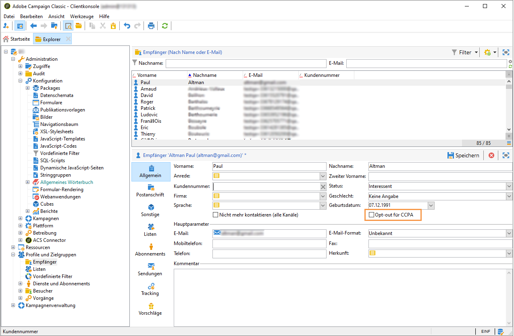
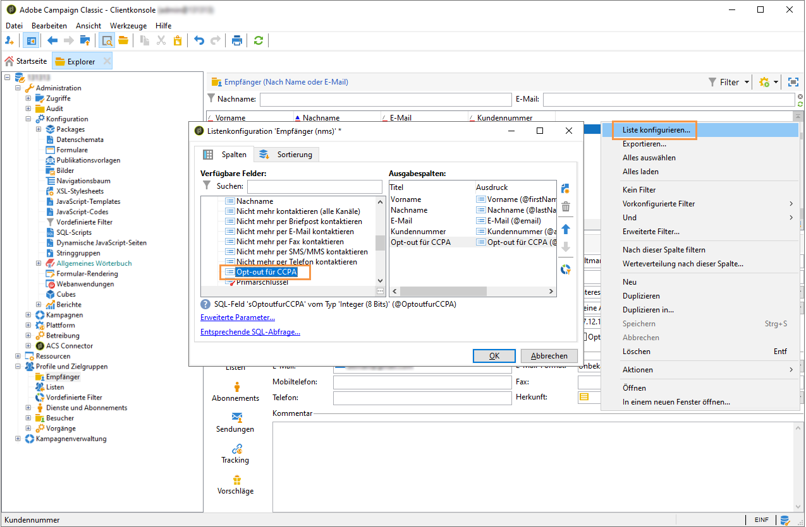

# Opt-out aus dem Verkauf von personenbezogenen Daten (CCPA) {#sale-of-personal-information-ccpa}


Der **California Consumer Privacy Act** (CCPA) gibt in Kalifornien ansässigen Personen neue Rechte in Bezug auf ihre personenbezogenen Daten und verpflichtet bestimmte in Kalifornien tätige Unternehmen zur Einhaltung von Datenschutzvorschriften.

Die Konfiguration und Verwendung von Zugriffs- und Löschanfragen sind für DSGVO (GDPR) und CCPA identisch. In diesem Abschnitt geht es um den Opt-out aus dem Verkauf von personenbezogenen Daten, der spezifisch für den CCPA ist.

Zusätzlich zu den von Adobe Campaign bereitgestellten Werkzeugen für die [Einverständnisverwaltung](privacy-management.md#consent-management) können Sie verfolgen, ob ein Benutzer dem Verkauf seiner personenbezogenen Daten widersprochen hat.

Kontakte können über Ihr System entscheiden, dass sie nicht zulassen, dass ihre personenbezogenen Daten an Dritte verkauft werden. In Adobe Campaign können Sie diese Informationen speichern und verfolgen.

Erweitern Sie dazu die Profiltabelle und fügen Sie ein Feld mit der Bezeichnung **[!UICONTROL Opt-out für CCPA]** hinzu.

>[!IMPORTANT]
>
>Es liegt in Ihrer Verantwortung als Datenverantwortlicher, die Anfrage der betroffenen Person zu erhalten und die Anfragedaten für CCPA zu verfolgen. Als Technologieanbieter bieten wir nur eine Opt-out-Möglichkeit. Weitere Informationen zu Ihrer Rolle als Datenverantwortlicher finden Sie unter [Personenbezogene Daten und Personas](privacy-and-recommendations.md#personal-data).

## Voraussetzung {#ccpa-prerequisite}

Um diese Informationen nutzen zu können, müssen Sie dieses Feld in Adobe Campaign Classic erstellen. Fügen Sie dazu der Tabelle **[!UICONTROL Empfänger]** ein boolesches Feld hinzu. Wenn ein neues Feld erstellt wird, wird es automatisch von der Campaign-API unterstützt.

Wenn Sie eine benutzerdefinierte Empfängertabelle verwenden, müssen Sie diesen Vorgang ebenfalls durchführen.

Ausführlichere Informationen zum Erstellen eines neuen Felds finden Sie in der [Dokumentation zur Schemabearbeitung](../../configuration/using/about-schema-edition.md).

>[!IMPORTANT]
>
>Die Änderung von Schemata ist eine sensible Aufgabe, die nur von erfahrenen Benutzern durchgeführt werden kann.

1. Gehen Sie zu **[!UICONTROL Werkzeuge]** > **[!UICONTROL Erweitert]** > **[!UICONTROL Felder hinzufügen]**, wählen Sie **[!UICONTROL Empfänger]** als den **[!UICONTROL Dokumenttyp]** aus und klicken Sie auf **[!UICONTROL Weiter]**. Weitere Informationen zum Hinzufügen von Feldern zu einer Tabelle finden Sie in [diesem Abschnitt](../../configuration/using/new-field-wizard.md).

   

1. Wählen Sie für **[!UICONTROL Feldtyp]** die Option **[!UICONTROL SQL-Feld]** aus. Geben Sie als Titel die Bezeichnung **[!UICONTROL Opt-out für CCPA]** an. Wählen Sie den Typ **[!UICONTROL Ganze Zahl 8 Bits (boolean)]** aus und legen Sie für **[!UICONTROL Relativer Pfad]** den folgenden eindeutigen Pfad fest: @OPTOUTCCPA. Klicken Sie auf **[!UICONTROL Beenden]**.

   

   Dadurch wird das Schema **[!UICONTROL Empfänger (cus)]** erweitert oder erstellt. Klicken Sie darauf, um zu überprüfen, ob das Feld korrekt hinzugefügt wurde.

   

1. Klicken Sie im Explorer auf den Knoten **[!UICONTROL Konfiguration]** > **[!UICONTROL Formulare]**. Fügen Sie in **[!UICONTROL Empfänger (nms)]** unter &quot;General Package&quot; ein `<input>`-Element hinzu und geben Sie als xpath-Wert den in Schritt 2 festgelegten relativen Pfad an. Weitere Informationen zum Identifizieren eines Formulars finden Sie in [diesem Abschnitt](../../configuration/using/identifying-a-form.md).

   ```
   <input  colspan="2" type="checkbox" xpath="@OPTOUTCCPA"/>
   ```

   

1. Trennen Sie die Verbindung und stellen Sie sie wieder her. Führen Sie die im nächsten Abschnitt beschriebenen Schritte aus, um sicherzustellen, dass das Feld in den Details eines Empfängers verfügbar ist.

## Verwendung {#usage}

Der Datenverantwortliche muss dafür sorgen, dass das Feld ausgefüllt wird und die CCPA-Richtlinien und -Regeln bezüglich des Datenverkaufs eingehalten werden.

Um die Werte auszufüllen, können mehrere Methoden verwendet werden:

* Bearbeiten der Details des Empfängers über die Campaign-Oberfläche
* API verwenden
* Über einen Workflow zum Datenimport

Stellen Sie sicher, dass Sie die personenbezogenen Daten in den Profilen von Benutzern, die sich für eine Opt-out-Regelung entschieden haben, niemals an Dritte verkaufen.

1. Um den Opt-out-Status zu ändern, gehen Sie zu **[!UICONTROL Profile und Zielgruppen]** > **[!UICONTROL Empfänger]** und wählen Sie einen Empfänger aus. Auf der Registerkarte **[!UICONTROL Allgemein]** sehen Sie das im vorherigen Abschnitt konfigurierte Feld.

   

1. Konfigurieren Sie die Empfängerliste so, dass die Opt-out-Spalte angezeigt wird. Wie Sie Listen konfigurieren, erfahren Sie im [entsprechenden Handbuch](../../platform/using/adobe-campaign-workspace.md#configuring-lists).

   

1. Sie können auf die Spalte klicken, um die Empfänger nach den Opt-out-Informationen zu sortieren. Sie können auch einen Filter erstellen, um nur Empfänger anzuzeigen, die sich abgemeldet haben. Weitere Informationen zum Erstellen von Filtern finden Sie in [diesem Abschnitt](../../platform/using/creating-filters.md).

   
