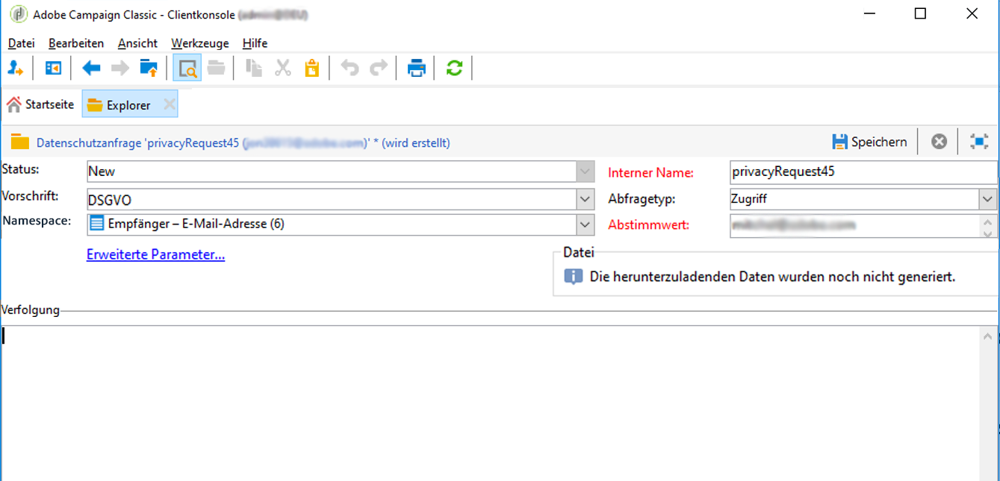
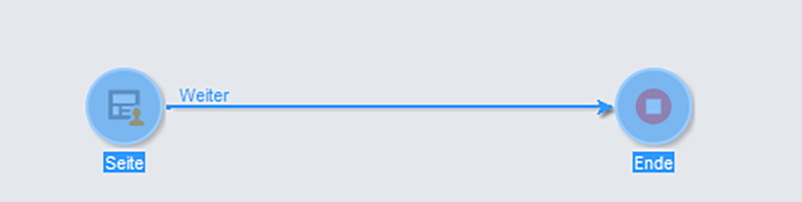

# Erstellen und Verwalten von Datenschutzanfragen {#privacy-request-ui}


In diesem Abschnitt wird beschrieben, wie Sie Zugriffs- und Löschanfragen erstellen und wie sie in Adobe Campaign verarbeitet werden.

## Erstellen einer Datenschutzanfrage {#create-privacy-request-ui}

Mit der **Adobe Campaign-Oberfläche** können Sie Ihre Datenschutzanfragen erstellen und ihren Fortschritt verfolgen. Gehen Sie wie folgt vor, um eine neue Datenschutzanfrage zu erstellen:

1. Öffnen Sie den Datenschutzanfrage-Ordner in **[!UICONTROL Administration]** > **[!UICONTROL Plattform]** > **[!UICONTROL Datenschutzanfragen]**.

   

1. Auf diesem Bildschirm können Sie alle aktuellen Datenschutzanfragen, deren Status und die Logs einsehen. Klicken Sie auf **[!UICONTROL Neu]**, um eine Datenschutzanfrage zu erstellen.

   

1. Wählen Sie die **[!UICONTROL Verordnung]** (DSGVO, CCPA, PDPA oder LGPD) und den **[!UICONTROL Anfragetyp]** (Zugriff oder Löschen) aus. Wählen Sie einen **[!UICONTROL Namespace]** aus und geben Sie den **[!UICONTROL Abstimmwert]** ein. Wenn Sie E-Mail als Namespace verwenden, geben Sie die E-Mail der betroffenen Person ein.

   

Die technischen Datenschutz-Workflows werden einmal täglich ausgeführt. Dabei werden auch alle neuen Anfragen verarbeitet.

* Löschanfrage: Die in Adobe Campaign gespeicherten Empfängerdaten werden gelöscht.
* Zugriffsanfragen: Die in Adobe Campaign gespeicherten Empfängerdaten werden erstellt und als XML-Datei auf der linken Seite des Anfragefensters bereitgestellt.


## Liste der Tabellen {#list-of-tables}

Bei der Durchführung einer Lösch- oder Zugriffsanfrage durchsucht Adobe Campaign alle Daten der betroffenen Person auf der Basis des **[!UICONTROL Abstimmwerts]**. Gesucht wird in allen Tabellen, in denen eine Relation mit der Tabelle des Empfängers besteht (vom Typ &quot;own&quot;).

Dies sind die Tabellen, die bei der Durchführung von Datenschutzanfragen standardmäßig berücksichtigt werden:

* Empfänger (recipient)
* Versandlog eines Empfängers (broadLogRcp)
* Trackinglogs der Empfänger (trackingLogRcp)
* Versandlog eines Ereignisses mit Verlauf (broadLogEventHisto)
* Inhalte der Empfängerlisten (rcpGrpRel)
* Angebotsvorschlag für einen Besucher (propositionVisitor)
* Besucher (visitor)
* Abonnementverlauf (subHisto)
* Abonnements (subscription)
* Angebotsvorschlag für einen Empfänger (propositionRcp)

Wenn Sie benutzerdefinierte Tabellen erstellt haben, für die eine Relation zur Empfängertabelle (Typ &quot;own&quot;) besteht, werden auch diese berücksichtigt. Wenn Sie beispielsweise eine Transaktionen-Tabelle haben, für die eine Relation mit der Empfängertabelle vorhanden ist, und eine Transaktionendetails-Tabelle, für die eine Relation mit der Transaktionen-Tabelle besteht, werden beide berücksichtigt.

>[!IMPORTANT]
>
>Wenn Sie Datenschutz-Batch-Anfragen mithilfe von Profillöschungs-Workflows ausführen, beachten Sie Folgendes:
>* Beim Löschen von Profilen mit Workflows werden keine untergeordneten Tabellen verarbeitet.
>* Alle untergeordneten Tabellen müssen manuell gelöscht werden.
>* Es wird empfohlen, einen ETL-Workflow zu erstellen, mit dem der Datenschutz-Zugriffstabelle die zu löschenden Zeilen hinzugefügt werden, und den Löschvorgang mit dem Workflow **[!UICONTROL Datenschutz-Anfragedaten löschen]** auszuführen Wir empfehlen, maximal 200 Profile täglich zu löschen, um die Systemleistung nicht zu beeinträchtigen.


## Status von Datenschutzanfragen {#privacy-request-statuses}

Dies sind die unterschiedlichen Status einer Datenschutzanfrage:

* **[!UICONTROL Neu]** / **[!UICONTROL Erneuter Versuch steht aus]**: Durchführung läuft, der Workflow hat die Anfrage noch nicht verarbeitet.
* **[!UICONTROL Verarbeitungsvorgang läuft]** / **[!UICONTROL Erneuter Versuch läuft]**: Der Workflow verarbeitet gerade die Anfrage.
* **[!UICONTROL Löschen steht aus]**: Der Workflow hat alle zu löschenden Empfängerdaten identifiziert.
* **[!UICONTROL Löschvorgang läuft]**: Der Workflow führt gerade die Löschung durch.
* **[!UICONTROL Löschbestätigung steht aus]**: (Löschanfrage im zweistufigen Prozessmodus) Der Workflow hat die Zugriffsanfrage verarbeitet. Für die Löschung ist eine manuelle Bestätigung erforderlich. Die Schaltfläche ist 15 Tage lang verfügbar.
* **[!UICONTROL Beendet]**: Die Verarbeitung der Anfrage wurde ohne Fehler abgeschlossen.
* **[!UICONTROL Fehler]**: Beim Workflow ist ein Fehler aufgetreten. Die Ursache wird in der Liste der Datenschutzanfragen in der **[!UICONTROL Anfragestatus]**-Spalte angezeigt. Beispielsweise bedeutet **[!UICONTROL Fehlerhafte Daten nicht gefunden]**, dass keine Empfängerdaten in der Datenbank gefunden wurden, die dem **[!UICONTROL Abstimmwert]** der betroffenen Person entsprechen.

## Zweistufiger Prozess {#two-step-process}

Standardmäßig ist der **zweistufige Prozess** aktiviert. Wenn Sie in diesem Modus eine neue Löschanfrage erstellen, führt Adobe Campaign immer zuerst eine Zugriffsanfrage aus. Auf diese Weise können Sie die Daten überprüfen, bevor Sie die Löschung bestätigen.

Sie können diesen Modus im Datenschutzanfrage-Bearbeitungsfenster ändern. Klicken Sie auf **[!UICONTROL Erweiterte Einstellungen]**.


Wenn der zweistufige Modus aktiviert ist, ändert sich der Status einer neuen Löschanfrage in **[!UICONTROL Löschungsbestätigung ausstehend]**. Laden Sie die generierte XML-Datei aus dem Datenschutzanfrage-Bildschirm herunter und überprüfen Sie die Daten. Um das Löschen der Daten zu bestätigen, klicken Sie auf die Schaltfläche **[!UICONTROL Löschung der Daten bestätigen]**.


## JSSP-URL {#jspp-url}

Bei der Verarbeitung von Zugriffsanfragen erzeugt Adobe Campaign JSSP, mit deren Hilfe die Empfängerdaten aus der Datenbank abgerufen und in eine auf einem lokalen Gerät gespeicherte XML-Datei exportiert werden. Die JSSP-URL ist folgendermaßen definiert:

```
"$(serverUrl)+'/nms/gdpr.jssp?id='+@id"
```

wobei @id die Kennung der Datenschutzanfrage ist.

Die URL wird im Feld **[!UICONTROL &quot;Speicherort der Datei&quot; (@urlFile)]** des Schemas der **[!UICONTROL Datenschutzanfragen (gdprRequest)]** gespeichert.

Die Daten sind in der Datenbank 90 Tage lang verfügbar. Wenn die Anfrage durch den technischen Workflow bereinigt wird, werden die Daten aus der Datenbank entfernt und die URL wird ungültig. Achten Sie deshalb darauf, dass die URL noch gültig ist, wenn Sie die Daten von einer Website herunterladen.

Hier ist ein Beispiel für die Datendatei einer betroffenen Person:


Der Datenverantwortliche kann einfach eine Web-Anwendung erstellen, die die jeweilige JSSP-URL enthält, und so die Datendatei der betroffenen Person auf einer Website verfügbar machen.


Im Folgenden finden Sie ein Beispiel eines Code-Snippets, das Sie in der **[!UICONTROL Seite]**-Aktivität der Web-Anwendung verwenden können.



```
<!DOCTYPE html PUBLIC "-//W3C//DTD XHTML 1.0 Transitional//EN" "http://www.w3.org/TR/xhtml1/DTD/xhtml1-transitional.dtd"> <html xmlns="http://www.w3.org/1999/xhtml"> <head> <meta http-equiv="Content-Language" content="en"> <meta http-equiv="Content-Type" content="text/html; charset=utf-8" /> <link rel="stylesheet" type="text/css" href="/nl/webForms/landingPage.css"/> <title>Clickthrough</title> <style type="text/css" media="all"> /* override formulary area */ .formulary { top: 200px; position: absolute; left: 0; } </style> </head> <body style="" class="">
<center>
<div id="wrap">
<div id="header">
<div class="header-title center-title">DOWNLOAD GDPR DATA</div>
<div class="formulary center-formulary"><form>
<div class="button large-button"><a href=[SERVER_URL]/nms/gdpr.jssp?id=13000" data-nl-type="externalLink">CLICK TO DOWNLOAD</a></div>
</form></div>
</div>
<div id="content">
<div class="row">
<div class="info">
<div class="desc">
<div class="title">EFFICIENCY</div>
<div class="desc">Our service is guaranteed to improve your efficiency. Increase performance and use our high-technology service to implement even the most ambitious of projects.</div>
</div>
</div>
</div>
</div>
<div id="footer">
<div style="text-align: center;">
<div style="float: left;"><a href="#">Contact us</a></div>
<div style="float: right;">&copy; Copyrights</div>
<div><a href="#"></a> <a href="#"></a> <a href="#"></a> <a href="#"></a></div>
</div>
</div>
</div>
</center>
</body> </html>
```

Da der Zugriff auf die Datendatei der betroffenen Person eingeschränkt ist, muss der anonyme Zugriff auf die Website deaktiviert sein. Nur Benutzer mit der spezifischen Berechtigung **[!UICONTROL Datenschutz-Daten]** können sich bei der Seite anmelden und die Daten herunterladen.
