# Managing privacy requests {#privacy-requests}

For a general presentation on Privacy Management, refer to [this section](../../platform/using/privacy-management.md).

Diese Informationen gelten für DSGVO, CCPA, PDPA und LGPD. Weitere Informationen zu diesen Verordnungen finden Sie in [diesem Abschnitt](../../platform/using/privacy-management.md#privacy-management-regulations).

The opt-out for the Sale of Personal Information, which is specific to CCPA, is explained in [this section](#sale-of-personal-information-ccpa).

>[!IMPORTANT]
>
>Die in diesem Dokument beschriebenen Installationsverfahren gelten ab Campaign Classic 18.4 (Build 8931+). If you are running on a previous version, refer to this [technote](https://helpx.adobe.com/de/campaign/kb/how-to-install-gdpr-package-on-legacy-versions.html).

## Datenschutzanforderungen {#about-privacy-requests}

Um Ihnen die Datenschutzbereitschaft zu erleichtern, ermöglicht Ihnen Adobe Campaign die Bearbeitung von Zugriffs- und Löschanfragen. Das **Zugriffsrecht** und das **Recht auf Vergessen** (Löschungsanfrage) werden in [diesem Abschnitt](../../platform/using/privacy-management.md#right-access-forgotten)beschrieben.

Sehen wir uns an, wie Sie Zugriff- und Löschanforderungen erstellen können und wie Adobe Campaign sie verarbeitet.

### Grundsätze {#principles}

Adobe Campaign bietet Datenverantwortlichen zwei Möglichkeiten zur Durchführung von Zugriffs- und Löschanfragen:

* Via the **Adobe Campaign interface**: for each Privacy request, the Data Controller creates a new privacy request in Adobe Campaign. Siehe [diesen Abschnitt](#create-privacy-request-ui).
* Via the **API**: Adobe Campaign provides an API that allows the automatic process of Privacy requests using SOAP. Siehe [diesen Abschnitt](#automatic-privacy-request-api).

>[!NOTE]
>
>Weitere Informationen zu personenbezogenen Daten und zu den verschiedenen Entitäten, die Daten verwalten (Datenverantwortlicher, Auftragsverarbeiter und betroffene Person), finden Sie unter [Personenbezogene Daten und Personas](../../platform/using/privacy-and-recommendations.md#personal-data).

### Voraussetzungen {#prerequesites}

Adobe Campaign Angebots Data Controllers-Tools zum Erstellen und Verarbeiten von Datenschutzanforderungen für in Adobe Campaign gespeicherte Daten. Für den Kontakt mit den betroffenen Personen ist jedoch der Datenverantwortliche allein zuständig (über E-Mail, Kundenunterstützung oder ein Web-Portal).

Als Datenverantwortlicher sind Sie daher außerdem verpflichtet, die Identität der betroffenen Person zu überprüfen, die die Anfrage stellt, und sicherzustellen, dass die dem Anfragenden übermittelten Daten zur betroffenen Person gehören.

### Installing the Privacy package {#install-privacy-package}

Um diese Funktion nutzen zu können, müssen Sie das Paket **[!UICONTROL Datenschutzverordnung]** über **[!UICONTROL Tools]** > **[!UICONTROL Erweitert]** > **[!UICONTROL Importpaket]** > **[!UICONTROL Adobe Campaign-Paket]** installieren. Weitere Informationen zum Installieren von Paketen finden Sie in der [ausführlichen Dokumentation](../../installation/using/installing-campaign-standard-packages.md).

Two new folders, specific to Privacy, are created under **[!UICONTROL Administration]** > **[!UICONTROL Platform]**:

* **[!UICONTROL Datenschutzanforderungen]**: Hier erstellen Sie Ihre Datenschutzanforderungen und verfolgen deren Entwicklung.
* **[!UICONTROL Namensräume]**: Hier definieren Sie das Feld, das zur Identifikation des Datensubjekts in der Adobe-Campaign-Datenbank herangezogen wird.

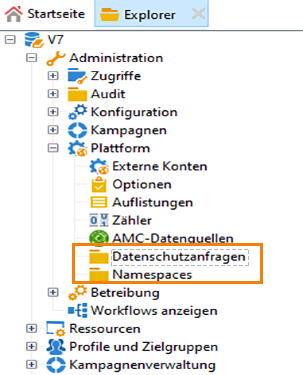

In **[!UICONTROL Administration]** > **[!UICONTROL Production]** > **[!UICONTROL Technical workflows]**, three technical workflows run every day to process Privacy requests.

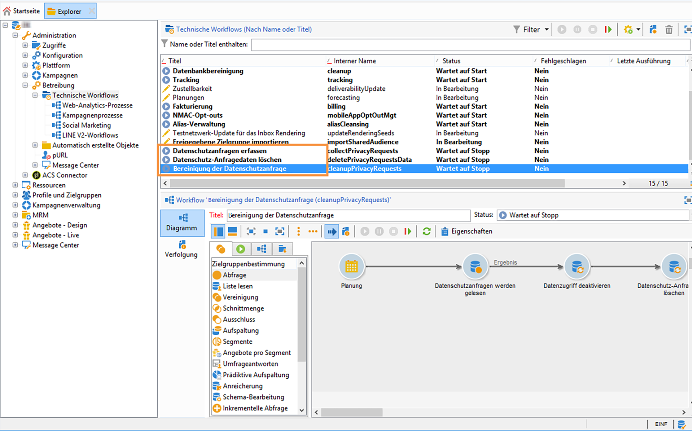

* **[!UICONTROL Datenschutzanfragen werden erfasst]**: Mit diesem Workflow werden die in Adobe Campaign gespeicherten Empfängerdaten abgerufen und im Datenschutzanfrage-Fenster für den Download bereitgestellt.
* **[!UICONTROL Datenschutz-Anfragedaten löschen]**: Mit diesem Workflow werden die in Adobe Campaign gespeicherten Empfängerdaten gelöscht.
* **[!UICONTROL Bereinigung der Datenschutzanfrage]**: Mit diesem Workflow werden Zugriffsanfragedateien gelöscht, die älter als 90 Tage sind.

Unter **[!UICONTROL Administration]** > **[!UICONTROL Zugriffe]** > **[!UICONTROL Spezifische Berechtigungen]** wurde die Berechtigung **[!UICONTROL Datenschutz-Daten]** hinzugefügt. Datenverantwortliche benötigen diese spezifische Berechtigung, um Datenschutz-Tools verwenden zu können. Damit können Sie neue Anfragen erstellen, ihren Verlauf verfolgen, die API verwenden etc.

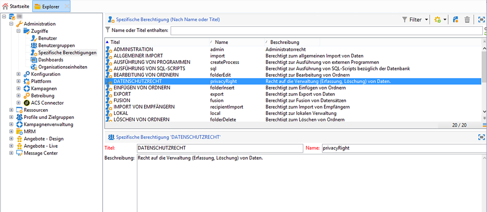

### Namensräume {#namesspaces}

Bevor Sie Datenschutzanforderungen erstellen, müssen Sie den zu verwendenden Namensraum definieren. Dies ist der Schlüssel, der zur Identifizierung des Datenfachs in der Adobe Campaign-Datenbank verwendet wird.

Standardmäßig sind drei Namespaces verfügbar: E-Mail, Telefon und Mobiltelefon. If you need a different namespace (a recipient custom field, for example), you can create a new one from **[!UICONTROL Administration]** > **[!UICONTROL Platform]** > **[!UICONTROL Namespaces]**.

## Creating a Privacy request {#create-privacy-request-ui}

Die **Adobe Campaign-Oberfläche** ermöglicht es Ihnen, Ihre Datenschutzanforderungen zu erstellen und deren Entwicklung zu verfolgen. Gehen Sie wie folgt vor, um eine neue Datenschutzanforderung zu erstellen:

1. Öffnen Sie den Datenschutzanfrage-Ordner in **[!UICONTROL Administration]** > **[!UICONTROL Plattform]** > **[!UICONTROL Datenschutzanfragen]**.

   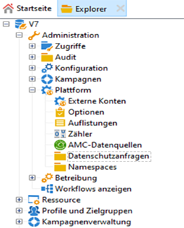

1. In diesem Bildschirm können Sie alle aktuellen Datenschutzanfragen, ihren Status und ihre Protokolle Ansicht. Klicken Sie auf **[!UICONTROL Neu]** , um eine Datenschutzanforderung zu erstellen.

   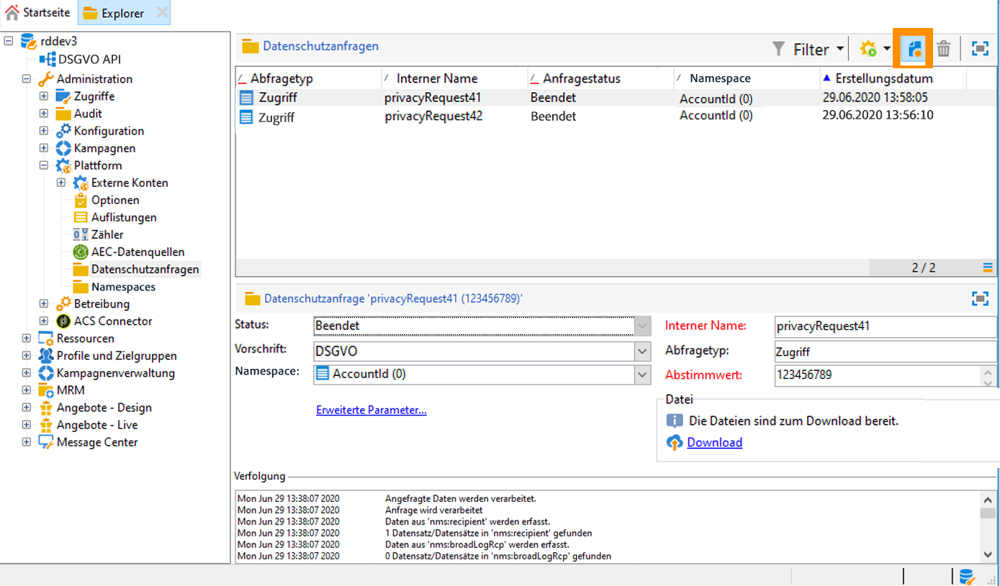

1. Select the **[!UICONTROL Regulation]** (GDPR, CCPA, PDPA or LGPD),  **[!UICONTROL Request type]** (Access or Delete), select a **[!UICONTROL Namespace]** and enter the **[!UICONTROL Reconciliation value]**. Wenn Sie E-Mail als Namespace verwenden, geben Sie die E-Mail der betroffenen Person ein.

   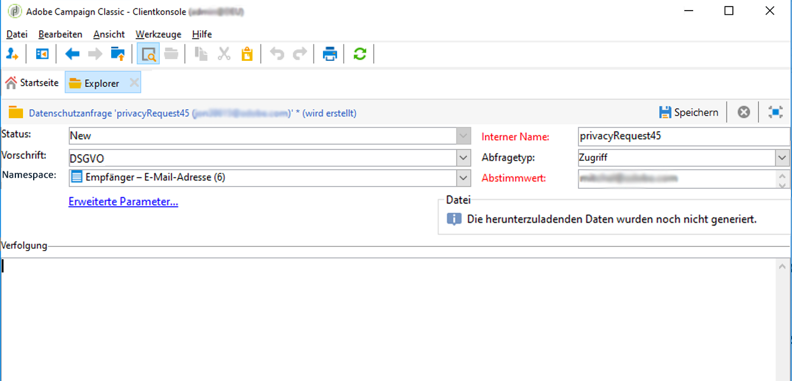

Die Datenschutzrichtlinien werden einmal täglich ausgeführt und verarbeiten jede neue Anforderung:

* Löschungsanfrage: Die in Adobe Campaign gespeicherten Empfängerdaten werden gelöscht.
* Zugriffsanfragen: Die in Adobe Campaign gespeicherten Empfängerdaten werden erstellt und als XML-Datei auf der linken Seite des Anfragefensters bereitgestellt.

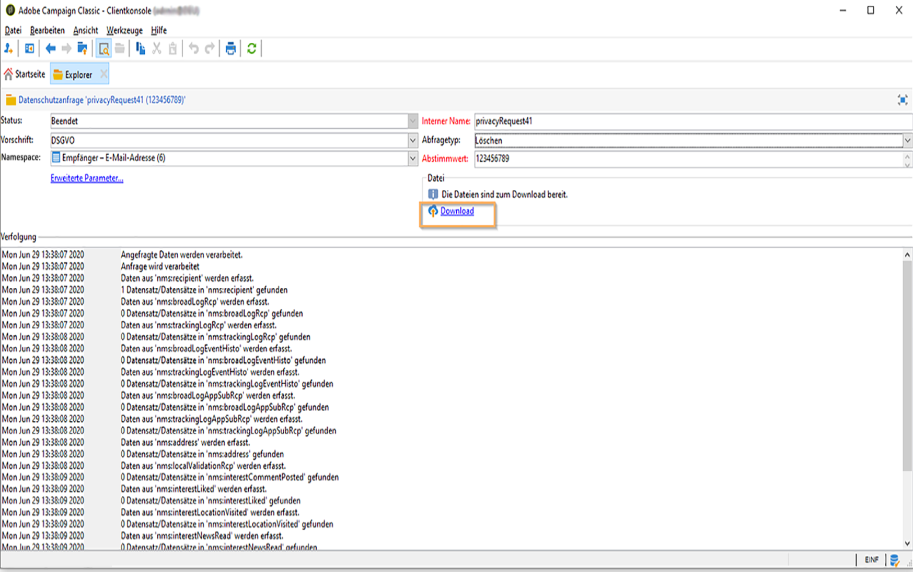

### Liste der Tabellen {#list-of-tables}

When performing a Delete or Access Privacy request, Adobe Campaign searches all the Data Subject&#39;s data based on the **[!UICONTROL Reconciliation value]** in all the tables that have a link to the recipient table (own type).

Im Folgenden finden Sie die Liste der vordefinierten Tabellen, die bei der Ausführung von Datenschutzanforderungen berücksichtigt werden:

* Empfänger (recipient)
* Versandlog eines Empfängers (broadLogRcp)
* Trackinglogs der Empfänger (trackingLogRcp)
* Versandlog eines Ereignisses mit Verlauf (broadLogEventHisto)
* Inhalte der Empfängerlisten (rcpGrpRel)
* Angebotsvorschlag für einen Besucher (propositionVisitor)
* Besucher (visitor)
* Abonnementverlauf (subHisto)
* Abonnements (subscription)
* Angebotsvorschlag für einen Empfänger (propositionRcp)

Wenn Sie benutzerdefinierte Tabellen erstellt haben, für die eine Relation zur Empfängertabelle (Typ „own“) besteht, werden auch diese berücksichtigt. Wenn Sie beispielsweise eine Transaktionen-Tabelle haben, für die eine Relation mit der Empfängertabelle vorhanden ist, und eine Transaktionendetails-Tabelle, für die eine Relation mit der Transaktionen-Tabelle besteht, werden beide berücksichtigt.

>[!IMPORTANT]
>
>Wenn Sie Batch-Anfragen zum Datenschutz mithilfe von Workflows zum Löschen von Profilen durchführen, beachten Sie bitte die folgenden Hinweise:
>* Beim Löschen von Profilen mit Workflows werden keine untergeordneten Tabellen verarbeitet.
>* Alle untergeordneten Tabellen müssen manuell gelöscht werden.
>* Adobe empfiehlt, einen ETL-Arbeitsablauf zu erstellen, der die zu löschenden Zeilen in der Tabelle &quot;Zugriffsschutz&quot;enthält und den Arbeitsablauf zum **[!UICONTROL Löschen von Datenschutzanforderungen]** ausführen lässt. Wir empfehlen, aus Leistungsgründen auf 200 Profil pro Tag zu begrenzen.


### Status von Datenschutzanfragen {#privacy-request-statuses}

Hier sind die verschiedenen Status für Datenschutzanforderungen:

* **[!UICONTROL Neu]** / **[!UICONTROL Erneuter Versuch steht aus]**: Durchführung läuft, der Workflow hat die Anfrage noch nicht verarbeitet.
* **[!UICONTROL Verarbeitungsvorgang läuft]** / **[!UICONTROL Erneuter Versuch läuft]**: Der Workflow verarbeitet gerade die Anfrage.
* **[!UICONTROL Löschen steht aus]**: Der Workflow hat alle zu löschenden Empfängerdaten identifiziert.
* **[!UICONTROL Löschvorgang läuft]**: Der Workflow führt gerade die Löschung durch.
* **[!UICONTROL Bestätigung ausstehend]** löschen (Anforderung in 2 Schritten löschen): der Workflow die Zugriffsanforderung verarbeitet hat. Zur Durchführung des Löschvorgangs wird eine manuelle Bestätigung angefordert. Der Knopf ist 15 Tage lang verfügbar.
* **[!UICONTROL Beendet]**: Die Verarbeitung der Anfrage wurde ohne Fehler abgeschlossen.
* **[!UICONTROL Fehler]**: beim Workflow ist ein Fehler aufgetreten. Der Grund wird in der Liste der Datenschutzanforderungen in der Spalte **[!UICONTROL Anforderungsstatus]** angezeigt. Wenn beispielsweise keine **[!UICONTROL Fehlerdaten gefunden wurden]** , bedeutet dies, dass keine Empfänger-Daten gefunden wurden, die mit dem **[!UICONTROL Abgleichungswert]** des Datenbetreibers übereinstimmen.

### 2-Schritt-Prozess {#two-step-process}

By default, the **2-step process** is activated. Wenn Sie eine neue Löschanforderung in diesem Modus erstellen, führt Adobe Campaign immer zuerst eine Zugriffsanforderung aus. Auf diese Weise können Sie die Daten überprüfen, bevor Sie den Löschvorgang bestätigen.

Sie können diesen Modus im Bildschirm &quot;Datenschutzanforderung&quot;ändern. Click **[!UICONTROL Advanced settings]**.

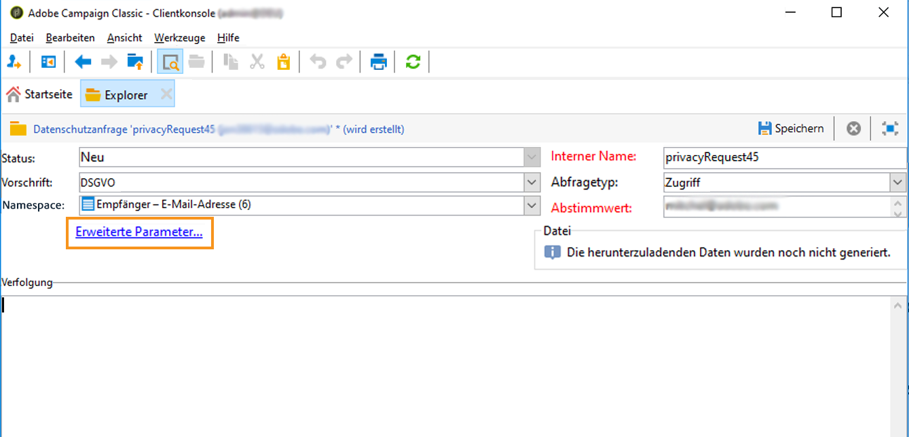

With the 2-step mode activated, the status of a new Delete request changes to **[!UICONTROL Confirm Delete Pending]**. Laden Sie die generierte XML-Datei aus dem Bildschirm &quot;Datenschutzanforderung&quot;herunter und überprüfen Sie die Daten. To confirm erasing the data, click the **[!UICONTROL Confirm delete data]** button.

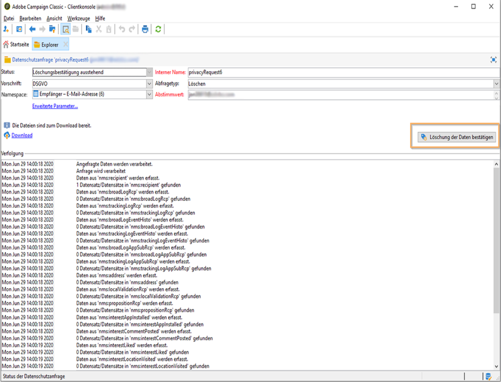

### JSSP-URL {#jspp-url}

Bei der Verarbeitung von Zugriffsanfragen erzeugt Adobe Campaign JSSP, mit deren Hilfe die Empfängerdaten aus der Datenbank abgerufen und in eine auf einem lokalen Gerät gespeicherte XML-Datei exportiert werden. Die JSSP-URL ist folgendermaßen definiert:

```
"$(serverUrl)+'/nms/gdpr.jssp?id='+@id"
```

wobei &quot;@id&quot;die ID der Datenschutzanforderung ist.

This URL is stored in the **[!UICONTROL &quot;File location&quot; (@urlFile)]** field of the **[!UICONTROL Privacy Requests (gdprRequest)]** schema.

Die Daten sind in der Datenbank 90 Tage lang verfügbar. Wenn die Anfrage durch den technischen Workflow bereinigt wird, werden die Daten aus der Datenbank entfernt und die URL wird ungültig. Achten Sie deshalb darauf, dass die URL noch gültig ist, wenn Sie die Daten von einer Webseite herunterladen.

Hier ist ein Beispiel für die Datendatei eines Datensubjekts:


Der Datenverantwortliche kann einfach eine Webanwendung erstellen, die die jeweilige JSSP-URL enthält, und so die Datendatei des Datensubjekts auf einer Webseite verfügbar machen.

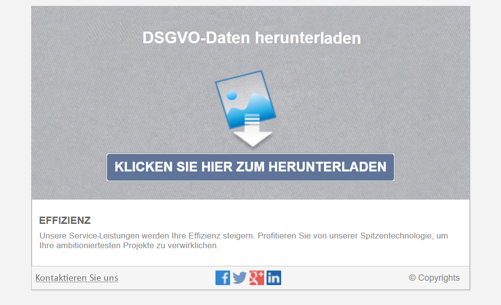

Im Folgenden finden Sie ein Beispiel eines Code-Snippets, das Sie in der **[!UICONTROL Seite]**-Aktivität der Webanwendung verwenden können.

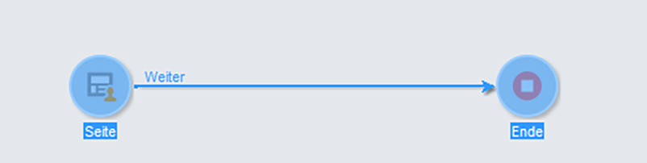

```
<!DOCTYPE html PUBLIC "-//W3C//DTD XHTML 1.0 Transitional//EN" "http://www.w3.org/TR/xhtml1/DTD/xhtml1-transitional.dtd"> <html xmlns="http://www.w3.org/1999/xhtml"> <head> <meta http-equiv="Content-Language" content="en"> <meta http-equiv="Content-Type" content="text/html; charset=utf-8" /> <link rel="stylesheet" type="text/css" href="/nl/webForms/landingPage.css"/> <title>Clickthrough</title> <style type="text/css" media="all"> /* override formulary area */ .formulary { top: 200px; position: absolute; left: 0; } </style> </head> <body style="" class="">
<center>
<div id="wrap">
<div id="header">
<div class="header-title center-title">DOWNLOAD GDPR DATA</div>
<div class="formulary center-formulary"><form>
<div class="button large-button"><a href=[SERVER_URL]/nms/gdpr.jssp?id=13000" data-nl-type="externalLink">CLICK TO DOWNLOAD</a></div>
</form></div>
</div>
<div id="content">
<div class="row">
<div class="info">
<div class="desc">
<div class="title">EFFICIENCY</div>
<div class="desc">Our service is guaranteed to improve your efficiency. Increase performance and use our high-technology service to implement even the most ambitious of projects.</div>
</div>
</div>
</div>
</div>
<div id="footer">
<div style="text-align: center;">
<div style="float: left;"><a href="#">Contact us</a></div>
<div style="float: right;">&copy; Copyrights</div>
<div><a href="#"></a> <a href="#"></a> <a href="#"></a> <a href="#"></a></div>
</div>
</div>
</div>
</center>
</body> </html>
```

Da der Zugriff auf die Datendatei des Datensubjekts eingeschränkt ist, muss der anonyme Zugriff auf die Webseite deaktiviert sein. Nur Benutzer mit der spezifischen Berechtigung **[!UICONTROL Datenschutz-Daten]** können sich bei der Seite anmelden und die Daten herunterladen.

## Automatischer Prozess zur Datenschutzanforderung {#automatic-privacy-request-api}

Adobe Campaign provides an **API** which allows you to setup an automatic Privacy request process.

Mit der API ist der allgemeine Datenschutzprozess mit dem [Verwenden der Oberfläche](#create-privacy-request-ui)identisch. Der einzige Unterschied ist die Erstellung der Datenschutzanforderung. Anstatt die Anforderung in Adobe Campaign zu erstellen, wird eine POST mit den Anforderungsinformationen an die Kampagne gesendet. Für jede Anforderung wird im Bildschirm &quot; **[!UICONTROL Datenschutzanforderungen]** &quot;ein neuer Eintrag hinzugefügt. Die Datenschutzeinstellungen verarbeiten dann die Anforderung auf die gleiche Weise wie bei einer Anforderung, die über die Oberfläche hinzugefügt wird.

If you&#39;re using the API to submit Privacy requests, we recommend that you leave the **2-step process** activated for the first Delete requests, in order to test the returned data. Nach Abschluss der Tests können Sie den zweistufigen Prozess deaktivieren, damit der Vorgang zum Löschen automatisch ausgeführt werden kann.

Die JS API **[!UICONTROL CreateRequestByName]** ist folgendermaßen definiert.

>[!NOTE]
>
>Wenn Sie bisher die **gdprRequest**-API verwendet haben, können Sie dies weiterhin tun. Es wird jedoch empfohlen, auf die neue **privacyRequest**-API umzusteigen.

>[!IMPORTANT]
>
>The **[!UICONTROL Privacy Data Right]** named right is required to use the API.

```
<method library="nms:gdpr.js" name="CreateRequestByName" static="true">
 <help>Create a new GDPR Request using namespace internal name</help>
 <parameters>
  <param name="namespaceName" type="string" desc="Namespace internal name"/>
  <param name="reconciliationValue" type="string" desc="Reconciliation value"/>
  <param name="type" type="long" desc="Reconciliation value"/>
  <param name="confirmDeletePending" type="boolean" desc="Request confirm before deleting data"/>
  <param name="regulation" type="long" desc="regulation of newly created request"/>
  <param name="id" type="long" inout="out" desc="ID of newly created request"/>
 </parameters>
</method>
```

>[!NOTE]
>
>Das Feld &quot;Verordnung&quot; steht nur zur Verfügung, wenn Sie Campaign Classic 20.2 (Build 9178 oder höher) verwenden.
>
>Wenn Sie auf 20.2 migrieren und die API bereits verwendet haben, müssen Sie das Feld „Vorschrift“ wie oben gezeigt hinzufügen. Wenn Sie einen früheren Build verwenden, können Sie die API weiterhin ohne das Feld „Vorschrift“ verwenden.

### Die API extern aufrufen {#invoking-api-externally}

Im Folgenden finden Sie ein Beispiel dafür, wie Sie die API extern aufrufen können (Authentifizierung über die API und Details zur Datenschutz-API). Weitere Informationen zur Datenschutz-API finden Sie in der [API-Dokumentation](https://docs.adobe.com/content/help/en/campaign-classic/technicalresources/api/s-nms-privacyRequest.html). Sie können auch die Dokumentation zu [Webdienst-Aufrufen](../../configuration/using/web-service-calls.md)lesen.

Führen Sie zuerst die Authentifizierung über die API durch.

1. Download the **xtk:session** WSDL via this url: **`<server url>`/nl/jsp/schemawsdl.jsp?schema=xtk:session**.

1. Verwenden Sie die Anmeldemethode und geben Sie in der Anfrage einen Benutzernamen und ein Passwort als Parameter ein. Sie erhalten eine Antwort mit einem Sitzungstoken. In unserem Beispiel wird SoapUI verwendet.

   

1. Verwenden Sie dieses Sitzungstoken zur Authentifizierung für alle folgenden API-Aufrufe. Das Token ist 24 Stunden lang gültig.

Rufen Sie dann die Datenschutz-API auf:

1. Download the WSDL from this URL: **`<server url>`/nl/jsp/schemawsdl.jsp?schema=nms:privacyRequest**.

1. Use **[!UICONTROL CreateRequestByName]** to create a specific Privacy request.

   Here is an example using the **[!UICONTROL CreateRequestByName]**. Beachten Sie, wie das oben bereitgestellte Sitzungs-Token zur Authentifizierung verwendet wird. Die Antwort ist die ID der erstellten Anforderung.

   

   Um Ihnen bei der Durchführung der oben genannten Schritte behilflich zu sein, sollten Sie Folgendes beachten:

   * You can use a **queryDef** on the **nms:gdprRequest** schema to check the status of the Access request.
   * You can use a **queryDef** on the **nms:gdprRequestData** schema to get the result of the Access request.
   * To be able to download the XML file from **&quot;$(serverUrl)&#39;/nms/gdpr.jssp?id=&#39;@id&quot;**, you must be logged in and accessing it from a whitelisted IP. Erstellen Sie dazu eine Webanwendung, mit der Sie auf die von JSSP generierte Datei zugreifen können.

### Die API über ein JS abrufen {#invoking-api-from-js}

Hier ist ein Beispiel dafür, wie Sie die API innerhalb von Campaign Classic über ein JS abrufen können.

>[!NOTE]
>
>Das Feld &quot;Verordnung&quot; steht nur zur Verfügung, wenn Sie Campaign Classic 20.2 (Build 9178 oder höher) verwenden.
>
>Wenn Sie auf Version 20.2 migrieren und die API bereits verwendet haben, müssen Sie das Feld &quot;Verordnung&quot; hinzufügen. Wenn Sie einen früheren Build verwenden, können Sie die API weiterhin ohne das Feld &quot;Verordnung&quot; verwenden.

* If you are **using a previous build (with GDPR package)**, you can continue to use the API without the ‘regulation’ field as shown below:

   ```
   loadLibrary("nms:gdpr.js");
   /**************************** 
   This code calls an API to create new Privay request on the DB.
   It requires 4 parameters below.
   Feel free to change parameter values.
   ****************************/
   // 1. Namespace internal name
   var namespaceName = "defaultNamespace1";
   // 2. Reconciliation value for privacy request
   var reconciliationValue = "example@adobe.com";
   // 3. Privacy request type
   // GDPR_REQUEST_TYPE_ACCESS = 1;
   // GDPR_REQUEST_TYPE_DELETE = 2;
   var requestType = GDPR_REQUEST_TYPE_ACCESS;
   // 4. Confirm deleting data required.
   // value : true or false
   var ConfirmDeletePending = true;
   // BEGIN
   var requestId = nms.privacyRequest.CreateRequestByName(namespaceName, reconciliationValue, requestType, ConfirmDeletePending);
   // User can use a simple queryDef with requestID as a parameter to check request status.
   ```

* If you are **migrating to 20.2** and if you were already using the API, you must add the ‘regulation’ field as shown below:

   ```
   loadLibrary("nms:gdpr.js");
   /**************************** 
   This code calls an API to create new Privay request on the DB.
   It requires 5 parameters below.
   Feel free to change parameter values.
   ****************************/
   // 1. Namespace internal name
   var namespaceName = "defaultNamespace1";
   // 2. Reconciliation value for privacy request
   var reconciliationValue = "example@adobe.com";
   // 3. Privacy request type
   // PRIVACY_REQUEST_TYPE_ACCESS = 1;
   // PRIVACY_REQUEST_TYPE_DELETE = 2;
   var requestType = PRIVACY_REQUEST_TYPE_ACCESS;
   // 4. Confirm deleting data required.
   // value : true or false
   var ConfirmDeletePending = true;
   // 5. Specify which regulation applies to newly created request. This is mandatory parameter.
   // GDPR = 1
   // CCPA = 2
   // PDPA = 3
   // LGPD = 4
   var regulation = 1;
   // BEGIN
   var requestId = nms.privacyRequest.CreateRequestByName(namespaceName, reconciliationValue, requestType, ConfirmDeletePending, regulation);
   // User can use a simple queryDef with requestID as a parameter to check request status.
   ```

* If you are **using Campaign Classic 20.2 (build 9178+) or above**, the &#39;regulation&#39; field is optional, as shown below:

   ```
   loadLibrary("nms:gdpr.js");
   /**************************** 
   This code calls an API to create new Privay request on the DB.
   It requires 5 parameters below.
   Feel free to change parameter values 
   ****************************/
   // 1. Namespace internal name
   var namespaceName = "defaultNamespace1";
   // 2. Reconciliation value for privacy request
   var reconciliationValue = "example@adobe.com";
   // 3. Privacy request type
   // PRIVACY_REQUEST_TYPE_ACCESS = 1;
   // PRIVACY_REQUEST_TYPE_DELETE = 2;
   var requestType = PRIVACY_REQUEST_TYPE_ACCESS;
   // 4. Confirm deleting data required.
   // value : true or false
   var ConfirmDeletePending = true;
   // 5. Specify which regulation applies to newly created request. This is optional parameter.
   // GDPR = 1
   // CCPA = 2
   // PDPA = 3
   // LGPD = 4
   var regulation = 1;
   // BEGIN
   var requestId = nms.privacyRequest.CreateRequestByName(namespaceName, reconciliationValue, requestType, ConfirmDeletePending, regulation);
   // User can use a simple queryDef with requestID as a parameter to check request status.
   ```

## Opt-out aus dem Verkauf von personenbezogenen Daten (CCPA) {#sale-of-personal-information-ccpa}

The **California Consumer Privacy Act** (CCPA) provides California residents new rights in regards to their personal information and imposes data protection responsibilities on certain entities whom conduct business in California.

Die Konfiguration und Verwendung von Zugriffs- und Löschanforderungen gelten sowohl für GDPR- als auch für CCPA-Anforderungen. In diesem Abschnitt wird das Opt-out für den Verkauf personenbezogener Daten vorgestellt, das speziell für CCPA gilt.

In addition to the [Consent management](../../platform/using/privacy-management.md#consent-management) tools provided by Adobe Campaign, you have the possibility to track whether a consumer has opted-out for the sale of Personal Information.

Ein Verbraucher entscheidet über Ihr System, dass er nicht zulässt, dass seine persönlichen Daten an Dritte verkauft werden. In Adobe Campaign können Sie diese Informationen speichern und nachverfolgen.

For this to work, you need to extend the Profiles table and add an **[!UICONTROL Opt-Out for CCPA]** field.

>[!IMPORTANT]
>
>Es liegt in Ihrer Verantwortung als Datenkontrolleur, die Anfrage des Datenbetreibers zu empfangen und die Daten der Anfrage für CCPA zu verfolgen. Als Technologieanbieter bieten wir nur eine Möglichkeit zum Ausschluss. Weitere Informationen zu Ihrer Rolle als Datenverantwortlicher finden Sie unter [Persönliche Daten und Personen](../../platform/using/privacy-and-recommendations.md#personal-data).

### Voraussetzung    {#ccpa-prerequisite}

Um diese Informationen nutzen zu können, müssen Sie dieses Feld in Adobe Campaign Classic erstellen. Dazu fügen Sie der Tabelle &quot; **[!UICONTROL Empfänger]** &quot;ein boolesches Feld hinzu. Wenn ein neues Feld erstellt wird, wird es automatisch von der Campaign-API unterstützt.

Wenn Sie eine benutzerdefinierte Tabelle für den Empfänger verwenden, müssen Sie diesen Vorgang auch ausführen.

Ausführlichere Informationen zum Erstellen eines neuen Felds finden Sie in der [Dokumentation zur Schemabearbeitung](../../configuration/using/about-schema-edition.md).

>[!IMPORTANT]
>
>Das Ändern von Schemas ist ein sensibler Vorgang, der nur von erfahrenen Anwendern ausgeführt werden muss.

1. Go to **[!UICONTROL Tools]** > **[!UICONTROL Advanced]** > **[!UICONTROL Add new fields]**, select **[!UICONTROL Recipients]** as the **[!UICONTROL Document type]** and click **[!UICONTROL Next]**. For more on adding fields to a table, see [this section](../../configuration/using/new-field-wizard.md).

   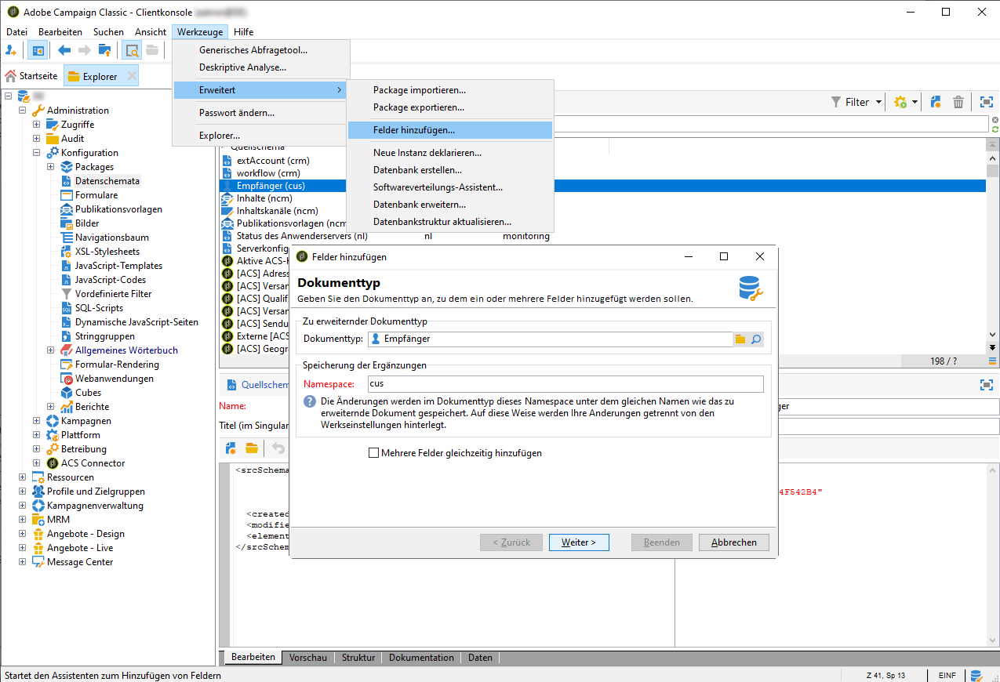

1. Wählen Sie als **[!UICONTROL Feldtyp]** das **[!UICONTROL SQL-Feld]**. Verwenden Sie für die Beschriftung **[!UICONTROL Ausschluss für CCPA]**. Wählen Sie den **[!UICONTROL 8-Bit-Ganzzahltyp (boolesch)]** und definieren Sie den folgenden eindeutigen **[!UICONTROL relativen Pfad]**: @OPTOUTCCPA. Klicken Sie auf **[!UICONTROL Beenden]**.

   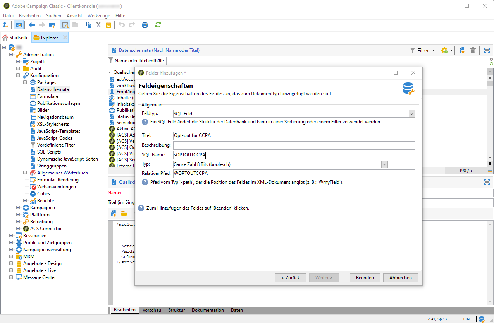

   Dadurch wird das Schema **[!UICONTROL Empfänger (cus)]** erweitert oder erstellt. Klicken Sie darauf, um sicherzustellen, dass das Feld korrekt hinzugefügt wurde.

   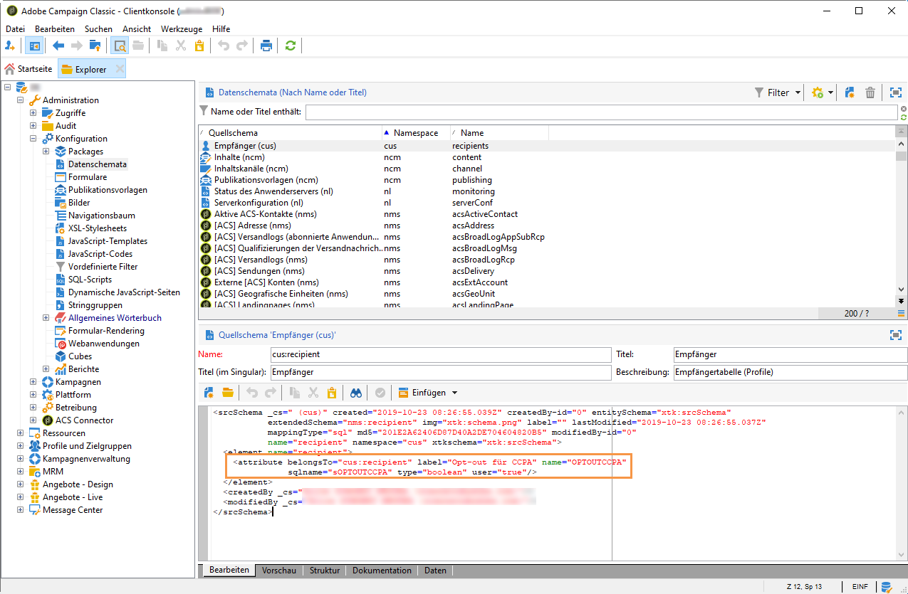

1. Klicken Sie auf den Knoten **[!UICONTROL Configuration]** > **[!UICONTROL Input forms]** des Explorers. In **[!UICONTROL Recipient (nms)]**, under &quot;General Package&quot;, add an `<input>` element and use, for the xpath value, the relative path defined in step 2. For more on identifying a form, see [this section](../../configuration/using/identifying-a-form.md).

   ```
   <input  colspan="2" type="checkbox" xpath="@OPTOUTCCPA"/>
   ```

   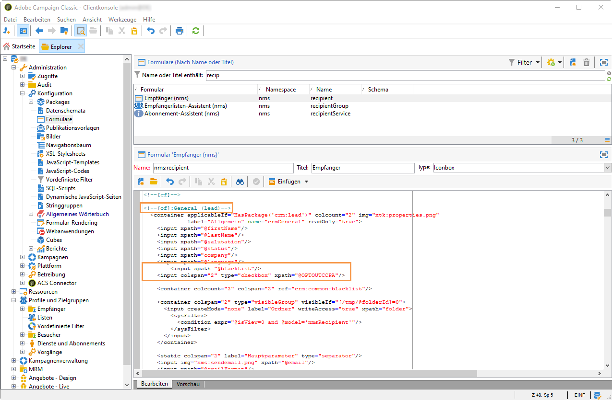

1. Trennen Sie die Verbindung und stellen Sie die Verbindung wieder her. Führen Sie die im nächsten Abschnitt beschriebenen Schritte aus, um sicherzustellen, dass das Feld in den Details eines Empfängers verfügbar ist.

### Verwendung {#usage}

Es liegt in der Verantwortung des Datenkontrolleurs, den Wert des Feldes auszufüllen und die CCPA-Richtlinien und -Regeln für den Datenverkauf zu befolgen.

Um die Werte auszufüllen, können mehrere Methoden verwendet werden:

* Bearbeiten der Details des Empfängers über die Campaign-Oberfläche
* API verwenden
* Über einen Workflow zum Datenimport

Sie sollten dann sicherstellen, dass Sie niemals personenbezogene Daten von Profilen, die sich gegen diese Regelung entschieden haben, an Dritte verkaufen.

1. Um den Abmeldestatus zu ändern, gehen Sie zu **[!UICONTROL Profil und Zielgruppe]** > **[!UICONTROL Empfänger]** und wählen Sie einen Empfänger aus. Auf der Registerkarte &quot; **[!UICONTROL Allgemein]** &quot;wird das im vorherigen Abschnitt konfigurierte Feld angezeigt.

   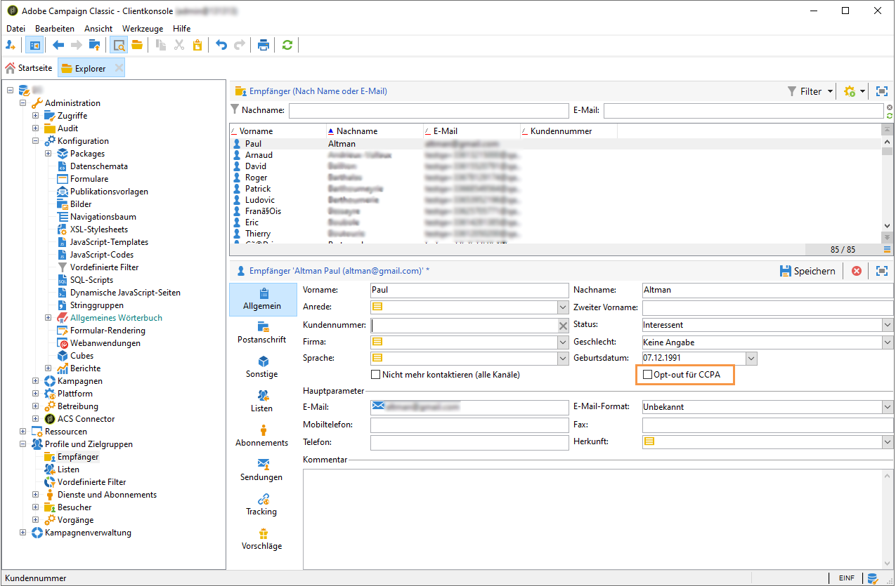

1. Konfigurieren Sie die Liste &quot;Empfänger&quot;, um die Spalte &quot;Op-out&quot;anzuzeigen. Informationen zum Konfigurieren von Listen finden Sie in der [ausführlichen Dokumentation](../../platform/using/adobe-campaign-workspace.md#configuring-lists).

   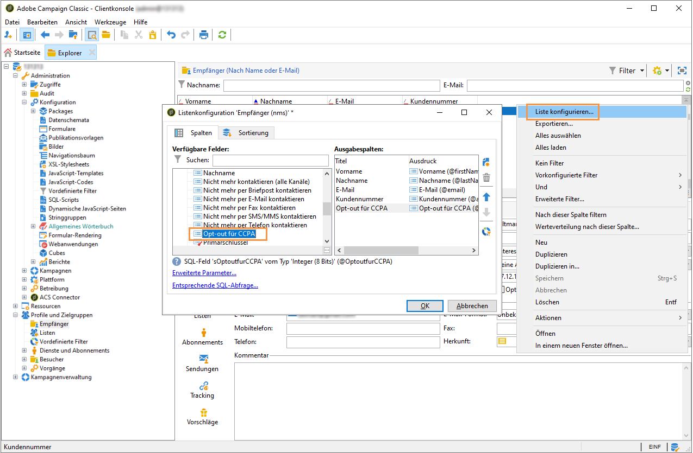

1. Sie können auf die Spalte klicken, um Empfänger gemäß den Ausschluss-Informationen zu sortieren. Sie können auch einen Filter erstellen, um nur Empfänger anzuzeigen, die sich abgemeldet haben. For more on creating filters, see [this section](../../platform/using/creating-filters.md).

   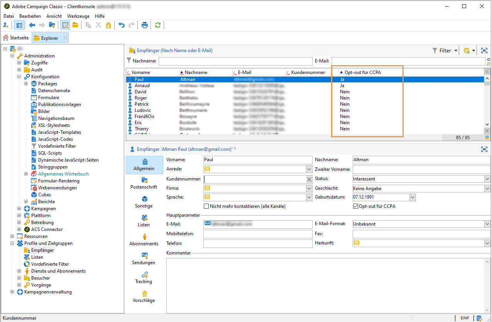
