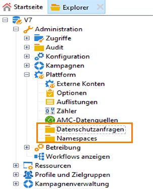
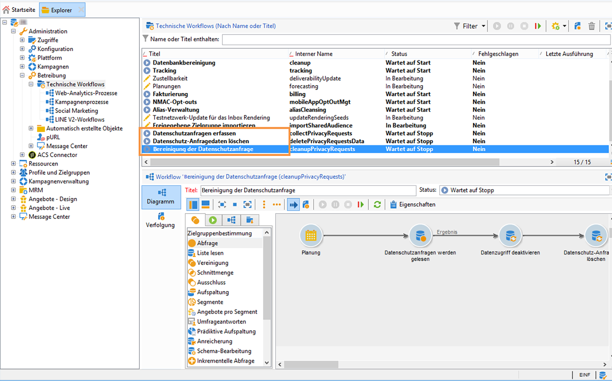
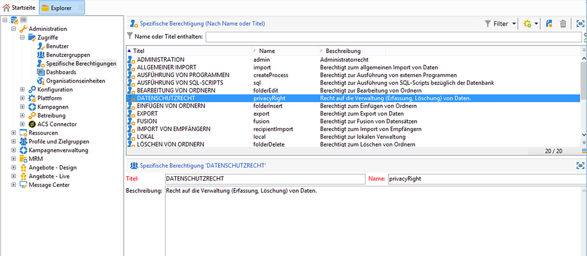

# Datenschutzanfragen {#privacy-requests}

Allgemeine Informationen zum Thema Datenschutzverwaltung finden Sie in [diesem Abschnitt](privacy-management.md).

Diese Informationen gelten für DSGVO, CCPA, PDPA und LGPD. Weitere Informationen zu diesen Verordnungen finden Sie in [diesem Abschnitt](privacy-management.md#privacy-management-regulations).

>[!NOTE]
>
>Die Möglichkeit zum Opt-out aus dem Verkauf von personenbezogenen Daten, die sich speziell auf den CCPA bezieht, wird in [diesem Abschnitt](#sale-of-personal-information-ccpa) erläutert.

<!--Installation procedures described in this document are applicable starting Campaign Classic 18.4 (build 8931+). If you are running on a previous version, refer to this [technote](https://helpx.adobe.com/campaign/kb/how-to-install-gdpr-package-on-legacy-versions.html).-->

Um Sie bei der Einhaltung der Datenschutzverordnungen zu unterstützen, ermöglicht Ihnen Adobe Campaign die Durchführung von Zugriffs- und Löschanfragen. Das **Recht auf Zugriff** und das **Recht auf Vergessenwerden** (Löschanfrage) werden in [diesem Abschnitt](privacy-management.md#right-access-forgotten) beschrieben.

Adobe Campaign bietet Datenverantwortlichen zwei Möglichkeiten zur Durchführung von Zugriffs- und Löschanfragen:

* Über die **Adobe Campaign-Benutzeroberfläche**: Für jede Datenschutzanfrage erstellt der Datenverantwortliche eine neue Datenschutzanfrage in Adobe Campaign. Siehe [diesen Abschnitt](privacy-requests-ui.md).
* Über die **API**: Adobe Campaign verfügt über eine API, mit der Datenschutzanfragen automatisch per SOAP verarbeitet werden können. Siehe [diesen Abschnitt](privacy-requests-api.md).

>[!NOTE]
>
>* Weitere Informationen zu personenbezogenen Daten und zu den verschiedenen Entitäten, die Daten verwalten (Datenverantwortlicher, Auftragsverarbeiter und betroffene Person), finden Sie unter [Personenbezogene Daten und Personas](privacy-and-recommendations.md#personal-data).
>* Weitere Informationen zu Datenschutzanfragen finden Sie in der [Dokumentation zu Campaign v8](https://experienceleague.adobe.com/de/docs/campaign/campaign-v8/privacy/privacy){target=_blank}.

<!--
## Prerequisites {#prerequesites}

Adobe Campaign offers Data Controllers tools to create and process Privacy requests for data stored in Adobe Campaign. However, it is the Data Controller's responsibility to handle the relationship with the Data Subject (email, customer care or a web portal).

It is therefore your responsibility as a Data Controller to confirm the identity of the Data Subject making the request and to confirm that the data returned to the requester is about the Data Subject.

## Installing the Privacy package {#install-privacy-package}

In order to use this feature, you need to install the **[!UICONTROL Privacy Data Protection Regulation]** package via the **[!UICONTROL Tools]** > **[!UICONTROL Advanced]** > **[!UICONTROL Import package]** > **[!UICONTROL Adobe Campaign Package]** menu. For more information on how to install packages, refer to the [detailed documentation](../../installation/using/installing-campaign-standard-packages.md).

Two new folders, specific to Privacy, are created under **[!UICONTROL Administration]** > **[!UICONTROL Platform]**:

* **[!UICONTROL Privacy Requests]**: this is where you will create your Privacy requests and track their evolution.
* **[!UICONTROL Namespaces]**: this is where you will define the field that will be used to identify the Data Subject in the Adobe Campaign database.

In **[!UICONTROL Administration]** > **[!UICONTROL Production]** > **[!UICONTROL Technical workflows]**, three technical workflows run every day to process Privacy requests.

* **[!UICONTROL Collect privacy requests]**: this workflow generates the recipient's data stored in Adobe Campaign and makes it available for download in the privacy request's screen.
* **[!UICONTROL Delete privacy requests data]**: this workflow deletes the recipient's data stored in Adobe Campaign.
* **[!UICONTROL Privacy request cleanup]**: this workflow erases the access request files that are older than 90 days.

In **[!UICONTROL Administration]** > **[!UICONTROL Access Management]** > **[!UICONTROL Named rights]**, the **[!UICONTROL Privacy Data Right]** named right has been added. This named right is required for Data Controllers in order for them to use privacy tools. This allows them to create new requests, track their evolution, use the API, etc.

## Namespaces {#namesspaces}

Before creating Privacy requests, you need to define the namespace you will use. This is the key that will be used to identify the Data Subject in the Adobe Campaign database.

Three namespaces are available out-of-the-box: email, phone and mobile phone. If you need a different namespace (a recipient custom field, for example), you can create a new one from **[!UICONTROL Administration]** > **[!UICONTROL Platform]** > **[!UICONTROL Namespaces]**.

>[!NOTE]
>
>For optimal performance, it is recommended to use out-of-the-box namespaces.
-->