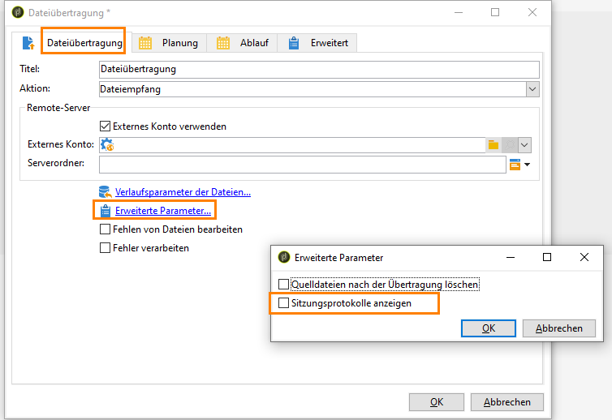

# Best Practices für die Nutzung von SFTP-Servern und die Fehlerbehebung {#sftp-server-usage}

## Allgemeine Empfehlungen zu SFTP-Servern {#global-recommendations}

Wenn Dateien und Daten für ETL-Zwecke verwaltet werden, werden diese Dateien auf einem von Adobe bereitgestellten gehosteten SFTP-Server gespeichert. Richten Sie sich bei Verwendung von SFTP-Servern nach den im Folgenden aufgeführten Empfehlungen.

* Verwenden Sie eine schlüsselbasierte Authentifizierung anstelle einer passwortbasierten Authentifizierung, um das Ablaufen von Passwörtern zu vermeiden (Passwörter haben eine Gültigkeitsdauer von 90 Tagen). Außerdem ermöglicht die schlüsselbasierte Authentifizierung die Erstellung mehrerer Schlüssel, wenn beispielsweise mehrere Entitäten verwaltet werden. Im Gegensatz dazu erfordert die passwortbasierte Authentifizierung, dass das Passwort mit allen verwalteten Entitäten geteilt wird.

   Das unterstützte Schlüsselformat ist SSH-2 RSA 2048. Schlüssel können mit Tools wie PyTTY (Windows) oder ssh-keygen (Unix) erstellt werden. Sie müssen dazu dem Adobe-Supportteam den öffentlichen Schlüssel über die [Adobe-Kundenunterstützung](https://helpx.adobe.com/de/enterprise/admin-guide.html/enterprise/using/support-for-experience-cloud.ug.html) bereitstellen, damit er zum Campaign-Server hochgeladen werden kann.

* Verwenden Sie Batch-Prozesse bei SFTP-Uploads und in Workflows.

* Beseitigen Sie Fehler/Ausnahmen.

* Standardmäßig sind alle von Ihnen erstellten Ordner im Lese-/Schreibmodus ausschließlich für Ihre Kennung verfügbar. Wenn Sie Ordner erstellen, auf die Campaign Zugriff haben soll, konfigurieren Sie sie mit Lese-/Schreibrechten für die gesamte Gruppe. Andernfalls ist es für Workflows unmöglich, Dateien zu erstellen oder zu löschen, da sie aus Sicherheitsgründen innerhalb derselben Gruppe unter einer anderen Kennung ausgeführt werden.

* Die öffentlichen IPs, mit denen Sie die SFTP-Verbindung aufbauen, müssen in der Campaign-Instanz auf der Zulassungsliste stehen. Das Hinzufügen von IP-Adressen zur Zulassungsliste kann über die [Adobe-Kundenunterstützung](https://helpx.adobe.com/de/enterprise/admin-guide.html/enterprise/using/support-for-experience-cloud.ug.html) angefordert werden.

## Best Practices zur Datenbanknutzung {#sftp-server-best-practices}

SFTP-Server sind als vorübergehende Datenspeicher konzipiert, auf denen Sie die Aufbewahrung und Löschung von Dateien selbst kontrollieren können.

Bei nicht ordnungsgemäßer Nutzung oder unzureichender Überwachung belegen diese schnell den physisch auf dem Server verfügbaren Speicherplatz, was dazu führen kann, dass Dateien bei nachfolgenden Uploads abgeschnitten werden. Bei voller Belegung des Speicherplatzes wird u. U. eine automatische Bereinigung ausgelöst, durch die die ältesten Dateien aus dem SFTP-Datenspeicher gelöscht werden.

Um solche Probleme zu vermeiden, empfiehlt Adobe, die unten stehenden Best Practices zu befolgen.

>[!NOTE]
>
>Wenn Ihre Instanz auf AWS gehostet wird, können Sie den Speicherplatz des SFTP-Servers mit dem [Control Panel](https://docs.adobe.com/content/help/de-DE/control-panel/using/sftp-management/sftp-storage-management.html) von Campaign Classic überwachen.
>
>Um zu überprüfen, ob Ihre Instanz auf AWS gehostet wird, folgen Sie den Schritten in [diesem Abschnitt](https://docs.adobe.com/content/help/de-DE/control-panel/using/faq.html#ims-org-id) .

* Die Größe des Servers variiert je nach Ihrer Lizenz. Achten Sie in jedem Fall darauf, dass die Datengröße möglichst gering ist und bewahren Sie Daten nur so lange auf, wie dies erforderlich ist (15 Tage ist das obere Zeitlimit).

* Verwenden Sie Workflows, um Daten ordnungsgemäß zu löschen (verwalten Sie die Beibehaltung von Daten innerhalb der Workflows, die die Daten nutzen).

* Melden Sie sich gelegentlich beim SFTP-Server direkt an, um dessen Inhalt zu prüfen.

* Beachten Sie bitte, dass die Verwaltung des SFTP-Speichers hauptsächlich Ihre Verantwortung ist.

## Verwendung externer SFTP-Server {#external-SFTP-server}

Halten Sie sich bei Verwendung eigener SFTP-Server so weit wie möglich an die oben beschriebenen Empfehlungen.

Außerdem ist bei der Angabe eines Pfades zu einem externen SFTP-Server in Campaign Classic zu beachten, dass die Pfadsyntax abhängig vom Betriebssystem des SFTP-Servers jeweils unterschiedlich ist:

* Wenn Ihr SFTP-Server unter **Windows** läuft, müssen Sie grundsätzlich einen relativen Pfad verwenden.
* Läuft Ihr STP-Server unter **Linux**, verwenden Sie immer einen Pfad, der relativ zum Home ist (beginnend mit „~/“), oder einen absoluten Pfad (beginnend mit „/“).

## Verbindungsprobleme mit einem Adobe-gehosteten SFTP-Server {#sftp-server-troubleshooting}

Im Folgenden finden Sie die Informationen, die Sie prüfen und dem Adobe-Supportteam über die [Adobe-Kundenunterstützung](https://helpx.adobe.com/de/enterprise/admin-guide.html/enterprise/using/support-for-experience-cloud.ug.html) zur Verfügung stellen müssen, wenn ein Verbindungsproblem mit von Adobe gehosteten SFTP-Servern auftritt.

1. Überprüfen Sie, ob Ihre Instanz ausgeführt wird. Öffnen Sie dazu Ihren Browser und machen Sie einen **[!UICONTROL GET]**-Aufruf am **[!UICONTROL /r/test]**-Endpunkt der Instanz:

   ```
   https://instanceUrl/r/test
   ```

   Wenn die Instanz ausgeführt wird, erhalten Sie in etwa diese Antwort:

   ```
   <redir status='OK' date='YYYY-MM-DD HH:MM:SS' build='XXXX' instance='instanceName'
   sourceIP='AAA.BB.CCC.DD' host='instanceUrl' localHost='instanceName'/>
   ```

   Geben Sie in jedem Fall im Supportticket die Antwort an, die Sie auf den Befehl erhalten haben.

1. Überprüfen Sie, ob der ausgehende Port 22 dort geöffnet ist, wo Sie versuchen, die SFTP-Verbindung aufzubauen. Verwenden Sie dazu den folgenden Befehl:

   ```
   bash-3.2$ nc -vz <SFTP_URL> 22
   # Replace the SFTP_URL with actual SFTP instance URL
   # If the port 22 is opened you will see output similar to the below one
   # for e.g. the  output for the command on myCompany-stage-sftp.neolane.net after ssh-out, will give
   bash-3.2$ nc -vz myCompagny-stage-sftp.neolane.net 22
   myCompany-stage-sftp.neolane.net [AAA.BBB.CCC.D] 22 (ssh) open
   ```

   >[!NOTE]
   >
   >Mithilfe des Netcat Tools können Sie mühelos Netzwerkverbindungen auf verschiedenen Betriebssystemen verwalten (siehe [https://eternallybored.org/misc/netcat/](https://eternallybored.org/misc/netcat/)).

   Wenn der Port nicht geöffnet ist, stellen Sie sicher, dass Sie ausgehende Verbindungen auf Ihrer Seite öffnen und versuchen Sie es dann erneut. Wenn Sie immer noch Verbindungsprobleme haben, melden Sie das Ergebnis des Befehls dem Adobe-Supportteam.

1. Überprüfen Sie, ob die öffentliche IP-Adresse, von der Sie versuchen, die SFTP-Verbindung herzustellen, auch tatsächlich diejenige ist, die Sie dem Adobe-Supportteam zur Aufnahme in die Zulassungsliste bereitgestellt haben.
1. Wenn Sie Passwort-basierte Authentifizierung verwenden, ist Ihr Passwort möglicherweise abgelaufen (die Gültigkeitsdauer von Passwörtern beträgt 90 Tage). Daher empfehlen wir dringend die Verwendung einer schlüsselbasierten Authentifizierung (siehe [Best Practices für die Nutzung von SFTP-Servern](#sftp-server-best-practices)).
1. Wenn Sie eine schlüsselbasierte Authentifizierung verwenden, überprüfen Sie, ob der von Ihnen verwendete Schlüssel mit dem übereinstimmt, den Sie dem Adobe-Supportteam zur Konfiguration der Instanz bereitgestellt haben.
1. Wenn Sie FileZilla oder ein ähnliches FTP-Tool verwenden, geben Sie im Supportticket die Verbindungsprotokoll-Details an.

## „Hostname konnte nicht aufgelöst werden“

In diesem Abschnitt finden Sie Informationen zu den Prüfungen und Aktionen, die ausgeführt werden müssen, wenn nach dem Herstellen einer Verbindung zum FTP-Server von Campaign Classic der Fehler „Hostname konnte nicht aufgelöst werden“ angezeigt wird.

Das Workflow-Journal zeigt die folgenden Protokolle an:

```
16/05/2016 12:49:03    fileTransfer    Upload error in cURL
16/05/2016 12:49:03    fileTransfer    Couldn't resolve host name
16/05/2016 12:49:03    fileTransfer    Couldn't resolve host name
16/05/2016 12:49:03    fileTransfer    Starting transfer of '/usr/local/neolane/nl6/var/williamreed/export/Recipients' to 'ftp://213.253.61.250/Recipients'
16/05/2016 12:49:03    fileTransfer    1 file(s) to transfer
```

Dieser Fehler tritt auf, wenn Sie versuchen, von einem Workflow aus eine Verbindung zum FTP-Server herzustellen und die Dateien vom Server herunterzuladen, während Sie noch in der Lage sind, eine FTP-Verbindung mit FileZilla oder WinSCP herzustellen.

Dieser Fehler gibt an, dass der Domain-Name des FTP-Servers nicht ordnungsgemäß aufgelöst werden konnte. Gehen Sie zur Fehlerbehebung wie folgt vor:

1. Fehlerbehebung bei der **DNS-Server-Konfiguration**:

   1. Überprüfen Sie, ob der Server-Name dem lokalen DNS-Server hinzugefügt wurde.
   1. Wenn ja, führen Sie den folgenden Befehl auf dem Adobe Campaign-Server aus, um die IP-Adresse abzurufen:

      `nslookup <server domain name>`

      Dies bestätigt, dass der FTP-Server funktioniert und vom Adobe Campaign-Anwendungs-Server aus erreichbar ist.

1. Fehlerbehebung bei **Sitzungsprotokollen**:

   1. Doppelklicken Sie im Workflow auf die Aktivität [Dateiübertragung](../../workflow/using/file-transfer.md).
   1. Wechseln Sie zur Registerkarte **[!UICONTROL Dateiübertragung]** und klicken Sie dann auf **[!UICONTROL Erweiterte Parameter]**.
   1. Aktivieren Sie die Option **[!UICONTROL Sitzungsprotokolle anzeigen]**.

      

   1. Wechseln Sie zum Workflow-Audit und überprüfen Sie, ob in den Protokollen der Fehler „Hostname konnte nicht aufgelöst werden“ angezeigt wird.

1. Wenn der SFTP-Server von Adobe gehostet wird, überprüfen Sie, ob die IP-Adresse zur Zulassungsliste hinzugefügt wurde, indem Sie sich an die Kundenunterstützung wenden.

   Überprüfen Sie andernfalls:

   * Das Kennwort enthält kein „@“. Die Verbindung ist fehlgeschlagen, wenn das Kennwort „@“ enthält.
   * Es gibt keine Firewall-Probleme, die die Kommunikation zwischen dem Adobe Campaign-Anwendungs-Server und dem SFTP-Server behindern können.
   * Führen Sie die Befehle „tracert“ und „telnet“ vom Campaign-Server zum SFTP-Server aus, um zu prüfen, ob es Verbindungsprobleme gibt.
   * Es gibt keine Probleme mit dem Kommunikationsprotokoll.
   * Der Port ist offen.
