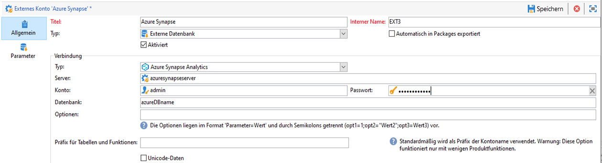
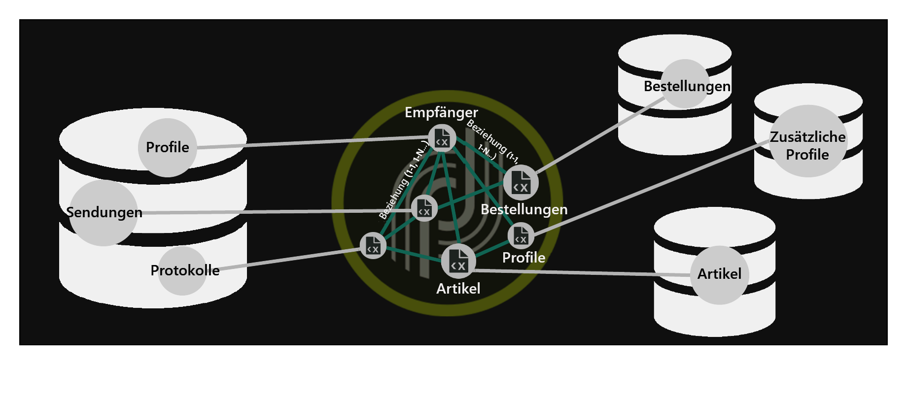
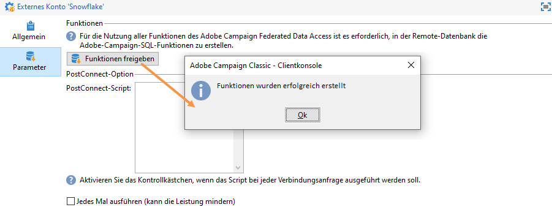
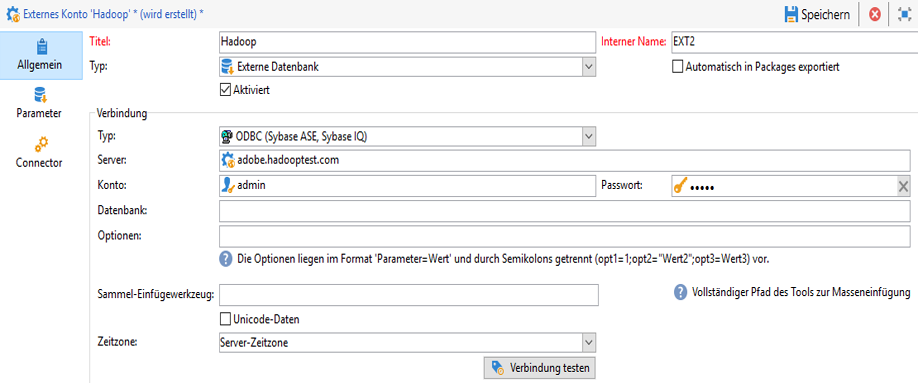

# Spezifische Konfigurationen nach Datenbanktyp {#specific-configurations-by-database-type}

Abhängig von der externen Datenbank, auf die Sie von Adobe Campaign aus zugreifen möchten, müssen Sie bestimmte Konfigurationen vornehmen. Hierzu zählen im Prinzip die Einrichtung von Treibern und die Deklaration von Umgebungsvariablen für jedes DBMS auf dem Adobe-Campaign-Server.

Dazu müssen Sie die jeweilige Client-Ebene in der externen Datenbank auf dem Adobe-Campaign-Server installieren.

>[!NOTE]
>
>Kompatible Versionen sind in der [Campaign-Kompatibilitätsmatrix](https://helpx.adobe.com/de/campaign/kb/compatibility-matrix.html#FederatedDataAccessFDA) aufgeführt.

## Zugriff auf Azure Synapse konfigurieren {#configure-access-to-azure-synapse}

### Externes Azure Synapse-Konto {#azure-external}

Über das externe [!DNL Azure]-Konto können Sie Ihre Campaign-Instanz mit Ihrer externen Azure Synapse-Datenbank verbinden.
So erstellen Sie Ihr externes [!DNL Azure Synapse]-Konto:

1. Konfigurieren Sie in Campaign Classic Ihr externes [!DNL Azure Synapse]-Konto. Klicken Sie im **[!UICONTROL Explorer]** auf **[!UICONTROL Administration]** > **[!UICONTROL Platform]** > **[!UICONTROL Externe Konten]**.

1. Wählen Sie **[!UICONTROL Erstellen]** aus.

1. Konfigurieren Sie das externe [!DNL Azure Synapse]-Konto; geben Sie dazu Folgendes an:

   * **[!UICONTROL Typ]**: Azurblase Synapse Analytics

   * **[!UICONTROL Server]**: URL des Azure Synapse-Servers

   * **[!UICONTROL Konto]**: Name des Benutzers

   * **[!UICONTROL Passwort]**: Passwort des Benutzerkontos

   * **[!UICONTROL Datenbank]**: Name der Datenbank
   

### Azure Synapse unter CentOS {#azure-centos}

**Voraussetzungen:**

* Sie benötigen Stammberechtigungen zur Installation eines ODBC-Treibers.
* Red Hat Enterprise ODBC-Treiber von Microsoft können auch mit CentOS verwendet werden, um eine Verbindung zum SQL-Server herzustellen.
* Version 13.0 funktioniert mit Red Hat 6 und 7.

So konfigurieren Sie Azure Synapse unter CentOS:

1. Installieren Sie zunächst den ODBC-Treiber. Sie finden ihn auf dieser [Seite](https://www.microsoft.com/en-us/download/details.aspx?id=50420).

   >[!NOTE]
   >
   >Dies gilt ausschließlich für Version 13 des ODBC-Treibers.

   ```
   sudo su
   curl https://packages.microsoft.com/config/rhel/6/prod.repo > /etc/yum.repos.d/mssql-release.repo
   exit
   # Uninstall if already installed Unix ODBC driver
   sudo yum remove unixODBC-utf16 unixODBC-utf16-devel #to avoid conflicts
   
   sudo ACCEPT_EULA=Y yum install msodbcsql
   
   sudo ACCEPT_EULA=Y yum install mssql-tools
   echo 'export PATH="$PATH:/opt/mssql-tools/bin"' >> ~/.bash_profile
   echo 'export PATH="$PATH:/opt/mssql-tools/bin"' >> ~/.bashrc
   source ~/.bashrc
   
   # the Microsoft driver expects unixODBC to be here /usr/lib64/libodbc.so.1, so add soft links to the '.so.2' files
   cd /usr/lib64
   sudo ln -s libodbccr.so.2   libodbccr.so.1
   sudo ln -s libodbcinst.so.2 libodbcinst.so.1
   sudo ln -s libodbc.so.2     libodbc.so.1
   
   # Set the path for unixODBC
   export ODBCINI=/usr/local/etc/odbc.ini
   export ODBCSYSINI=/usr/local/etc
   source ~/.bashrc
   
   #Add a DSN information to /etc/odbc.ini
   sudo vi /etc/odbc.ini
   
   #Add the following:
   [Azure Synapse Analytics]
   Driver      = ODBC Driver 13 for SQL Server
   Description = Azure Synapse Analytics DSN
   Trace       = No
   Server      = [insert your server here]
   ```

1. Bei Bedarf können Sie unixODBC-Entwicklungskopfzeilen installieren, indem Sie den folgenden Befehl ausführen:

   ```
   sudo yum install unixODBC-devel
   ```

1. Nach der Installation der Treiber können Sie Ihren ODBC-Treiber testen und überprüfen und Ihre Datenbank bei Bedarf abfragen. Führen Sie den folgenden Befehl aus:

   ```
   /opt/mssql-tools/bin/sqlcmd -S yourServer -U yourUserName -P yourPassword -q "your query" # for example -q "select 1"
   ```

1. In Campaign Classic können Sie dann Ihr externes [!DNL Azure Synapse]-Konto konfigurieren. Weiterführende Informationen zur Konfiguration Ihres externen Kontos finden Sie in diesem [Abschnitt](../../platform/using/specific-configuration-database.md#azure-external).

1. Da Azure Synapse Analytics über den TCP-Port 1433 kommuniziert, müssen Sie diesen Port in Ihrer Firewall öffnen. Verwenden Sie den folgenden Befehl:

   ```
   firewall-cmd --permanent --add-rich-rule='rule family="ipv4" source address="[server_ip_here]/32" port port="1433" protocol="tcp" accept'
   # you can ping your hostname and the ping command will translate the hostname to IP address which you can use here
   ```

   >[!NOTE]
   >
   >Um die Kommunikation von der Seite von Azurblase Synapse Analytics zu ermöglichen, müssen Sie eventuell Ihre öffentliche IP zur zulassungsliste hinzufügen. Lesen Sie dazu die [Azure-Dokumentation](https://docs.microsoft.com/en-us/azure/sql-database/sql-database-firewall-configure#use-the-azure-portal-to-manage-server-level-ip-firewall-rules).

1. Führen Sie bei &quot;iptables&quot; den folgenden Befehl aus:

   ```
   iptables -A OUTPUT -p tcp -d [server_hostname_here] --dport 1433 -j ACCEPT
   ```

### Azure Synapse unter Windows {#azure-windows}

>[!NOTE]
>
>Dies gilt ausschließlich für Version 13 des ODBC-Treibers; Adobe Campaign Classic kann aber auch SQL Server Native Client-Treiber 11.0 und 10.0 verwenden.

So konfigurieren Sie Azure Synapse unter Windows:

1. Installieren Sie zunächst den Microsoft ODBC-Treiber. Sie finden ihn auf dieser [Seite](https://www.microsoft.com/en-us/download/details.aspx?id=50420).

1. Wählen Sie die folgenden zu installierenden Dateien aus:

   ```
   your_language\your_architecture\msodbcsql.msi (i.e: English\X64\msodbcsql.msi)
   ```

1. Sobald der ODBC-Treiber installiert ist, können Sie ihn bei Bedarf testen. Weiterführende Informationen hierzu finden Sie auf dieser [Seite](https://docs.microsoft.com/en-us/sql/connect/odbc/windows/system-requirements-installation-and-driver-files?view=sql-server-ver15#installing-microsoft-odbc-driver-for-sql-server).

1. In Campaign Classic können Sie dann Ihr externes [!DNL Azure Synapse]-Konto konfigurieren. Weiterführende Informationen zur Konfiguration Ihres externen Kontos finden Sie in diesem [Abschnitt](../../platform/using/specific-configuration-database.md#azure-external).

1. Da Azure Synapse Analytics über den TCP-Port 1433 kommuniziert, müssen Sie diesen Port in der Windows Defender Firewall öffnen. Weitere Informationen hierzu finden Sie in der [Windows-Dokumentation](https://docs.microsoft.com/en-us/windows/security/threat-protection/windows-firewall/create-an-outbound-program-or-service-rule).

### Azure Synapse unter Debian {#azure-debian}

**Voraussetzungen:**

* Sie benötigen Stammberechtigungen, um einen ODBC-Treiber zu installieren.
* Zur Installation des msodbcsql-Packages ist curl erforderlich. Führen Sie den folgenden Befehl aus, wenn Sie curl nicht installiert haben:

   ```
   sudo apt-get install curl
   ```

So konfigurieren Sie Azure Synapse unter Debian:

1. Installieren Sie zunächst den Microsoft ODBC-Treiber für SQL Server. Verwenden Sie folgende Befehle, um den ODBC-Treiber 13.1 für SQL Server zu installieren:

   ```
   sudo su
   curl https://packages.microsoft.com/keys/microsoft.asc | apt-key add -
   curl https://packages.microsoft.com/config/debian/8/prod.list > /etc/apt/sources.list.d/mssql-release.list
   exit
   sudo apt-get update
   sudo ACCEPT_EULA=Y apt-get install msodbcsql
   ```

1. Wenn Sie den Fehler **&quot;Der Methodentreiber /usr/lib/apt/methods/https konnte nicht gefunden werden&quot;** beim Aufruf von **sudo apt-get update** erhalten, müssen Sie diesen Befehl ausführen:

   ```
   sudo apt-get install apt-transport-https ca-certificates
   ```

1. Installieren Sie jetzt &quot;mssql-tools&quot; mit den folgenden Befehlen. &quot;mssql-tools&quot; sind erforderlich, um das Dienstprogramm Bulk Copy Program (BCP) zu nutzen und Abfragen auszuführen.

   ```
   sudo ACCEPT_EULA=Y apt-get install mssql-tools
   echo 'export PATH="$PATH:/opt/mssql-tools/bin"' >> ~/.bash_profile
   echo 'export PATH="$PATH:/opt/mssql-tools/bin"' >> ~/.bashrc
   source ~/.bashrc
   ```

1. Bei Bedarf können Sie unixODBC-Entwicklungskopfzeilen installieren, indem Sie den folgenden Befehl ausführen:

   ```
   sudo yum install unixODBC-devel
   ```

1. Nach der Installation der Treiber können Sie Ihren ODBC-Treiber testen und überprüfen und Ihre Datenbank bei Bedarf abfragen. Führen Sie den folgenden Befehl aus:

   ```
   /opt/mssql-tools/bin/sqlcmd -S yourServer -U yourUserName -P yourPassword -q "your query" # for example -q "select 1"
   ```

1. In Campaign Classic können Sie nun Ihr externes [!DNL Azure Synapse]-Konto konfigurieren. Weiterführende Informationen zur Konfiguration Ihres externen Kontos finden Sie in diesem [Abschnitt](../../platform/using/specific-configuration-database.md#azure-external).

1. Um &quot;iptables&quot; unter Debian zu konfigurieren und die Verbindung mit Azure Synapse Analytics sicherzustellen, aktivieren Sie mit dem folgenden Befehl den ausgehenden TCP-Port 1433 für Ihren Hostname:

   ```
   iptables -A OUTPUT -p tcp -d [server_hostname_here] --dport 1433 -j ACCEPT
   ```

   >[!NOTE]
   >
   >Um die Kommunikation von der Seite von Azurblase Synapse Analytics zu ermöglichen, müssen Sie eventuell Ihre öffentliche IP zur zulassungsliste hinzufügen. Lesen Sie dazu die [Azure-Dokumentation](https://docs.microsoft.com/en-us/azure/sql-database/sql-database-firewall-configure#use-the-azure-portal-to-manage-server-level-ip-firewall-rules).

## Zugriff auf Snowflake konfigurieren {#configure-access-to-snowflake}

>[!NOTE]
>
>Der [!DNL Snowflake]-Connector ist für gehostete und On-Premise-Implementierungen verfügbar. Weiterführende Informationen hierzu finden Sie in [diesem Artikel](https://helpx.adobe.com/de/campaign/kb/acc-on-prem-vs-hosted.html).



### Externes Snowflake-Konto {#snowflake-external}

Über das externe [!DNL Snowflake]-Konto können Sie Ihre Kampagneninstanz mit Ihrer externen Snowflake-Datenbank verbinden.

1. Konfigurieren Sie in Campaign Classic Ihr externes [!DNL Snowflake]-Konto. Klicken Sie im **[!UICONTROL Explorer]** auf **[!UICONTROL Administration]** > **[!UICONTROL Platform]** > **[!UICONTROL Externe Konten]**.

1. Wählen Sie das native externe **[!UICONTROL Snowflake]**-Konto.

1. Konfigurieren Sie das externe **[!UICONTROL Snowflake]**-Konto; geben Sie dazu Folgendes an:

   * **[!UICONTROL Server]**: URL des [!DNL Snowflake]-Servers

   * **[!UICONTROL Konto]**: Name des Benutzers

   * **[!UICONTROL Passwort]**: Passwort des Benutzerkontos

   * **[!UICONTROL Datenbank]**: Name der Datenbank
   

1. Klicken Sie auf den Tab **[!UICONTROL Parameter]** und dann auf die Schaltfläche **[!UICONTROL Funktionen freigeben]**, um Funktionen zu erstellen.

   

Der Connector unterstützt die folgenden Optionen:

| Option | Beschreibung |
|---|---|
| workschema | Datenbankschema zur Verwendung mit Arbeitstabellen |
| warehouse | Name des zu verwendenden Standard-Warehouse. Dadurch wird die Standardeinstellung des Benutzers außer Kraft gesetzt. |
| TimeZoneName | Standardmäßig leer, d. h. die Systemzeitzone des Campaign Classic-App-Servers wird verwendet. Mit dieser Option können Sie den Sitzungsparameter TIMEZONE erzwingen. <br>Weiterführende Informationen hierzu finden Sie auf dieser [Seite](https://docs.snowflake.net/manuals/sql-reference/parameters.html#timezone). |
| WeekStart | Sitzungsparameter WEEK_START. Standardmäßig auf 0 gesetzt <br>Weiterführende Informationen hierzu finden Sie auf dieser [Seite](https://docs.snowflake.com/de/sql-reference/parameters.html#week-start). |
| UseCachedResult | Sitzungsparameter USE_CACHED_RESULTS. Standardmäßig ist TRUE festgelegt. Diese Option kann verwendet werden, um zwischengespeicherte Ergebnisse von Snowflake zu deaktivieren. <br>Weiterführende Informationen dazu finden Sie auf [dieser Seite](https://docs.snowflake.net/manuals/user-guide/querying-persisted-results.html). |

### Snowflake unter CentOS {#snowflake-centos}

1. Laden Sie die ODBC-Treiber für [!DNL Snowflake] herunter. [Klicken Sie hier](https://sfc-repo.snowflakecomputing.com/odbc/linux/latest/snowflake-odbc-2.20.2.x86_64.rpm), um mit dem Herunterladen zu beginnen.
1. Installieren Sie anschließend die ODBC-Treiber mit folgendem Befehl in CentOS:

   ```
   rpm -Uvh unixodbc
   rpm -Uvh snowflake-odbc-2.20.2.x86_64.rpm
   ```

1. Nach dem Herunterladen und Installieren der ODBC-Treiber muss Campaign Classic neu gestartet werden. Führen Sie dazu den folgenden Befehl aus:

   ```
   /etc/init.d/nlserver6 stop
   /etc/init.d/nlserver6 start
   ```

1. In Campaign Classic können Sie dann Ihr externes [!DNL Snowflake]-Konto konfigurieren. Weiterführende Informationen zur Konfiguration Ihres externen Kontos finden Sie in diesem [Abschnitt](../../platform/using/specific-configuration-database.md#snowflake-external).

### Snowflake unter Debian {#snowflake-debian}

1. Laden Sie die ODBC-Treiber für [!DNL Snowflake] herunter. [Klicken Sie hier](https://sfc-repo.snowflakecomputing.com/odbc/linux/latest/index.html), um mit dem Herunterladen zu beginnen.

1. Anschließend müssen Sie die ODBC-Treiber in Debian mit folgendem Befehl installieren:

   ```
   apt-get install unixodbc
   apt-get install snowflake-odbc-x.xx.x.x86_64.deb
   ```

1. Nach dem Herunterladen und Installieren der ODBC-Treiber müssen Sie Campaign Classic neu starten. Führen Sie dazu den folgenden Befehl aus:

   ```
   systemctl stop nlserver.service
   systemctl start nlserver.service
   ```

1. In Campaign Classic können Sie dann Ihr externes [!DNL Snowflake]-Konto konfigurieren. Weiterführende Informationen zur Konfiguration Ihres externen Kontos finden Sie in diesem [Abschnitt](../../platform/using/specific-configuration-database.md#snowflake-external).

### Snowflake unter Windows {#snowflake-windows}

1. Laden Sie den [ODBC-Treiber für Windows](https://docs.snowflake.net/manuals/user-guide/odbc-download.html) herunter. Beachten Sie, dass Sie zum Installieren des Treibers Administratorrechte benötigen. Weiterführende Informationen hierzu finden Sie auf dieser [Seite](https://docs.snowflake.net/manuals/user-guide/admin-user-management.html)

1. Konfigurieren Sie den ODBC-Treiber. Weiterführende Informationen hierzu finden Sie auf dieser [Seite](https://docs.snowflake.net/manuals/user-guide/odbc-windows.html#step-2-configure-the-odbc-driver)

1. In Campaign Classic können Sie dann Ihr externes [!DNL Snowflake]-Konto konfigurieren. Weiterführende Informationen zur Konfiguration Ihres externen Kontos finden Sie in diesem [Abschnitt](../../platform/using/specific-configuration-database.md#snowflake-external).

## Zugriff auf Hadoop 3.0 konfigurieren {#configure-access-to-hadoop-3}

Die Verbindung mit einer externen Hadoop-Datenbank über die FDA-Option erfordert folgende Konfigurationen auf dem Adobe Campaign-Server. Beachten Sie, dass diese Konfiguration für sowohl Windows als auch Linux verfügbar ist.

1. Laden Sie je nach Betriebssystemversion die ODBC-Treiber für Hadoop herunter. Treiber finden Sie auf [dieser Seite](https://www.cloudera.com/downloads.html).

1. Anschließend müssen Sie die ODBC-Treiber installieren und einen DSN für Ihre Hive-Verbindung einrichten. Anweisungen dazu finden Sie auf [dieser Seite](https://docs.cloudera.com/documentation/other/connectors/hive-odbc/2-6-5/Cloudera-ODBC-Driver-for-Apache-Hive-Install-Guide.pdf).

1. Nach dem Herunterladen und Installieren der ODBC-Treiber müssen Sie Campaign Classic neu starten. Führen Sie dazu den folgenden Befehl aus:

   ```
   systemctl stop nlserver.service
   systemctl start nlserver.service
   ```

1. In Campaign Classic können Sie dann Ihr externes Snowflake-Konto konfigurieren. Klicken Sie im **[!UICONTROL Explorer]** auf **[!UICONTROL Administration]** > **[!UICONTROL Platform]** > **[!UICONTROL Externe Konten]**.

1. Klicken Sie auf **[!UICONTROL Erstellen]** und wählen Sie als Kontotyp **[!UICONTROL Externe Datenbank]** aus.

1. Um das externe **[!UICONTROL Hadoop]**-Konto zu konfigurieren, müssen Sie Folgendes angeben:

   * **[!UICONTROL Typ]**: ODBC (Sybase ASE, Sybase IQ)

   * **[!UICONTROL Server]**: Name des DNS

   * **[!UICONTROL Konto]**: Name des Benutzers

   * **[!UICONTROL Passwort]**: Passwort des Benutzerkontos

   * **[!UICONTROL Datenbank]**: Name Ihrer Datenbank, falls nicht im DSN angegeben. Kann leer bleiben, wenn im DSN angegeben

   * **[!UICONTROL Zeitzone]**: Zeitzone des Servers
   

Der Connector unterstützt die folgenden ODBC-Optionen:

| Name | Wert |
|---|---|
| ODBCMgr | iODBC |
| warehouse | 1/2/4 |

Der Connector unterstützt außerdem die folgenden Hive-Optionen:

| Name | Wert | Beschreibung |
|---|---|---|
| bulkKey | Azur Blob- oder DataLake-Zugriffsschlüssel | Für wasb://- oder wasbs://-Bulk-Loader (z. B. wenn das Bulk-Load-Tool mit wasb:// oder wasbs:// beginnt). <br>Das ist der Zugriffsschlüssel für den Blob- oder DataLake-Bucket bei Bulk Loads. |
| hdfsPort | Port-Nummer <br>standardmäßig auf 8020 gesetzt | Bei HDFS-Bulk-Load (d. h. wenn das Bulk-Load-Tool mit webhdfs:// oder webhdfss:// beginnt). |
| bucketsNumber | 20 | Anzahl der Buckets beim Erstellen einer Cluster-Tabelle. |
| fileFormat | PARQUET | Standarddateiformat für Arbeitstabellen. |

## Zugriff auf Hadoop 2.1 konfigurieren {#configure-access-to-hadoop}

### Für Windows:{#for-windows}

1. Installieren Sie die ODBC- und [Azure HD Insight](https://www.microsoft.com/en-us/download/details.aspx?id=40886)-Treiber für Windows.
1. Erstellen Sie den DSN (Data Source Name), indem Sie das Tool ODBC DataSource Administrator ausführen. Dort finden Sie ein Beispiel für einen System-DSN für Hive, das Sie anpassen können.

   ```
   Description: vorac (or any name you like)
   Host: vorac.azurehdinsight.net
   Port: 443
   Database: sm_tst611 (or your database name)
   Mechanism: Azure HDInsight Service
   User/Password: admin/<your password here>
   ```

1. Erstellen Sie das externe Hadoop-Konto wie im Abschnitt auf [dieser Seite](../../platform/using/external-accounts.md#hadoop-external-account) beschrieben.

### Für Linux:{#for-linux}

1. Installieren Sie unixodbc für Linux.

   ```
   apt-get install unixodbc
   ```

1. Laden Sie ODBC-Treiber für Apache Hive von HortonWorks herunter und installieren Sie sie: [https://www.hortonworks.com/downloads/](https://www.hortonworks.com/downloads/).

   ```
   dpkg -i hive-odbc-native_2.1.10.1014-2_amd64.deb
   ```

1. Sehen Sie nach, wo die ODBC-Dateien gespeichert sind.

   ```
   root@campadpac71:/tmp# odbcinst -j
   unixODBC 2.3.1
   DRIVERS............: /etc/odbcinst.ini
   SYSTEM DATA SOURCES: /etc/odbc.ini
   FILE DATA SOURCES..: /etc/ODBCDataSources
   USER DATA SOURCES..: /root/.odbc.ini
   SQLULEN Size.......: 8
   SQLLEN Size........: 8
   SQLSETPOSIROW Size.: 8
   ```

1. Erstellen Sie den DSN (Data Source Name) und bearbeiten Sie die Datei odbc.ini. Erstellen Sie dann einen DSN für Ihre Hive-Verbindung.

   Hier ist ein Beispiel für HDInsight zur Herstellung einer Verbindung mit der Bezeichnung &quot;viral&quot;:

   ```
   [ODBC Data Sources]
   vorac 
   
   [vorac]
   Driver=/usr/lib/hive/lib/native/Linux-amd64-64/libhortonworkshiveodbc64.so
   HOST=vorac.azurehdinsight.net
   PORT=443
   Schema=sm_tst611
   HiveServerType=2
   AuthMech=6
   UID=admin
   PWD=<your password here>
   HTTPPath=
   UseNativeQuery=1
   ```

   >[!NOTE]
   >
   >Der Parameter **UseNativeQuery** ist dabei sehr wichtig. Campaign unterstützt Hive und funktioniert nur dann ordnungsgemäß, wenn UseNativeQuery eingerichtet ist. Üblicherweise formuliert der Treiber oder Hive SQL Connector Abfragen um und ändert die Spaltenanordnung.

   Die Authentifizierungseinrichtung hängt von der Konfiguration von Hive/Hadoop ab. Verwenden Sie z. B. für HD Insight AuthMech=6 für die Benutzer-/Passwort-Authentifizierung entsprechend [dieser Beschreibung](https://www.simba.com/products/Spark/doc/ODBC_InstallGuide/unix/content/odbc/hi/configuring/authenticating/azuresvc.htm).

1. Exportieren Sie die Variablen.

   ```
   export ODBCINI=/etc/myodbc.ini
   export ODBCSYSINI=/etc/myodbcinst.ini
   ```

1. Richten Sie Hortonworks-Treiber über /usr/lib/hive/lib/native/Linux-amd64-64/hortonworks.hiveodbc.ini ein.

   Sie müssen UTF-16 verwenden, um eine Verbindung mit Campaign und unix-odbc (libodbcinst) herstellen zu können.

   ```
   [Driver]
   
   DriverManagerEncoding=UTF-16
   ErrorMessagesPath=/usr/lib/hive/lib/native/hiveodbc/ErrorMessages/
   LogLevel=0
   LogPath=/tmp/hive
   SwapFilePath=/tmp
   
   ODBCInstLib=libodbcinst.so
   ```

1. Jetzt können Sie Ihre Verbindung unter Verwendung von isql testen.

   ```
   isql vorac
   isql vorac -v
   ```

1. Erstellen Sie das externe Hadoop-Konto wie im Abschnitt auf [dieser Seite](../../platform/using/external-accounts.md#hadoop-external-account) beschrieben.

## Zugriff auf Netezza konfigurieren {#configure-access-to-netezza}

Die Verbindung zu einer externen Netezza-Datenbank über die FDA-Option erfordert die zusätzlichen unten aufgeführten Konfigurationen auf dem Adobe Campaign Server:

1. Installieren Sie die ODBC-Treiber für Netezza entsprechend dem verwendeten Betriebssystem:

   * **nz-linuxclient-v7.2.0.0.tar.gz für Linux: Wählen Sie den Ordner aus, der Ihrem Betriebssystem entspricht (linux oder linux64) und starten Sie den Entpacken-Befehl. Sie können die Installation im standardmäßig empfohlenen Verzeichnis ausführen: &quot;/usr/local/nz&quot;.**
   * **nz-winclient-v7.2.0.0.zip für Windows: Dekomprimieren Sie die Datei und führen Sie das jeweilige Script für Ihr Betriebssystem aus: nzodbcsetup.exe oder nzodbcsetup64.exe. Folgen Sie den Anweisungen des Assistenten, um die Treiber zu installieren.**

1. Konfigurieren sie den ODBC-Treiber. Die Konfiguration kann in den Standarddateien ausgeführt werden: **/etc/odbc.ini** für allgemeine Parameter und **/etc/odbcinst.ini** zur Deklarierung der Treiber.

   * **/etc/odbc.ini**

      ```
      [ODBC]
      InstallDir=/etc/
      ```

      &quot;InstallDir&quot; entspricht dem Pfad der odbcinst.ini-Datei.

   * **/etc/odbcinst.ini**

      ```
      [ODBC Drivers]
      NetezzaSQL = Installed
      
      [NetezzaSQL]
      Driver           = /usr/local/nz/lib/libnzsqlodbc3.so
      Setup            = /usr/local/nz/lib/libnzsqlodbc3.so
      APILevel         = 1
      ConnectFunctions = YYN
      Description      = Netezza ODBC driver
      DriverODBCVer    = 03.51
      DebugLogging     = false
      LogPath          = /tmp
      UnicodeTranslationOption = utf8
      CharacterTranslationOption = all
      PreFetch         = 256
      Socket           = 16384
      ```

1. Spezifizieren Sie die Umgebungsvariablen des Adobe Campaign-Servers:

   * **LD_LIBRARY_PATH**: /usr/local/nz/lib und /usr/local/nz/lib64. „/usr/local/nz“ entspricht dem bei der Treiberinstallation standardmäßig angegebenen Installationsverzeichnis. Geben Sie hier das für die Installation ausgewählte Verzeichnis an.
   * **ODBCINI**: Pfad der odbc.ini-Datei (z. B. /etc/odbc.ini).
   * **NZ_ODBC_INI_PATH**: Pfad der Datei „odbc.ini“. In Netezza ist auch diese zweite Variable zur Verwendung der odbc.ini-Datei erforderlich.

1. In Campaign Classic können Sie dann Ihr externes Netezza-Konto konfigurieren. Klicken Sie im **[!UICONTROL Explorer]** auf **[!UICONTROL Administration]** > **[!UICONTROL Platform]** > **[!UICONTROL Externe Konten]**.

1. Klicken Sie auf **[!UICONTROL Neu]** und wählen Sie **[!UICONTROL Externe Datenbank]** als **[!UICONTROL Typ]** aus.

1. Zum Konfigurieren des externen **[!UICONTROL Netezza]**-Kontos müssen Sie Folgendes angeben:

   * **[!UICONTROL Typ]**: Netezza

   * **[!UICONTROL Server]**: URL des Netezza-Servers

   * **[!UICONTROL Konto]**: Name des Benutzers

   * **[!UICONTROL Passwort]**: Passwort des Benutzerkontos

   * **[!UICONTROL Datenbank]**: Name der Datenbank

>[!NOTE]
>
>Vorgänge, die Schemata betreffen und automatisch erstellte Primärschlüssel enthalten, werden hierbei nicht berücksichtigt.
>
>Für den ersten im Schema definierten Index wird von der Tabelle die Bedingung **Organize on** verwendet. Da diese Bedingung bei Netezza auf 1 bis 4 Spalten beschränkt ist, kann dieser Index nur maximal 4 Spalten beinhalten.

## Zugriff auf Oracle konfigurieren {#configure-access-to-oracle}

Die Verbindung zu einer externen Oracle-Datenbank über die FDA-Option erfordert die zusätzlichen unten aufgeführten Konfigurationen auf dem Adobe Campaign Server:

### Für Linux:{#for-linux-1}

1. Installieren Sie den vollständigen Oracle-Client für Ihre jeweilige Oracle-Version.
1. Fügen Sie der Installation Ihre TNS-Definitionen hinzu. Spezifizieren Sie diese Definitionen dazu in der Datei **tnsnames.ora** im Verzeichnis /etc/oracle. Wenn dieses Verzeichnis nicht vorhanden ist, erstellen Sie es.

   Erstellen Sie dann eine neue TNS_ADMIN-Umgebungsvariable: Exportieren Sie TNS_ADMIN=/etc/oracle und starten Sie das Gerät neu.

1. Integrieren Sie Oracle in Ihren Adobe Campaign-Server (nlserver). Dazu muss die Datei **customer.sh** im Navigationsbaum des Adobe Campaign-Servers im Ordner „nl6“ vorhanden sein; und die Datei muss die Links zu den Oracle-Bibliotheken enthalten.

   Beispiel für einen Client in 11.2:

   ```
   export ORACLE_HOME=/usr/lib/oracle/11.2
   export TNS_ADMIN=/etc/oracle
   export LD_LIBRARY_PATH=$ORACLE_HOME/client64/lib:$LD_LIBRARY_PATH
   ```

   >[!NOTE]
   >
   >Diese Werte (vor allem ORACLE_HOME) hängen von Ihren Installationsverzeichnissen ab. Prüfen Sie Ihren Navigationsbaums, bevor Sie diese Werte referenzieren.

1. Installieren Sie die für Oracle nötigen Bibliotheken:

   * **libclntsh.so**

      ```
      cd /usr/lib/oracle/<version>/client<architecture>/lib
      ln -s libclntsh.so.<version> libclntsh.so
      ```

   * **libaio1**

      ```
      aptitude install libaio1
      or
      yum install libaio1
      ```

### Für Windows:{#for-windows-1}

1. Installieren Sie den Oracle-Client.
1. Erstellen Sie im Ordner unter C:\Oracle eine **tnsnames.ora**-Datei, die Ihre TNS-Definition enthält.

   Fügen Sie eine TNS_ADMIN-Umgebungsvariable mit C:\Oracle als Wert hinzu und starten Sie das Gerät neu.

## Zugriff auf Sybase IQ konfigurieren {#configure-access-to-sybase-iq}

Die Verbindung zu einer externen Sybase IQ-Datenbank über die FDA-Option erfordert die zusätzlichen unten aufgeführten Konfigurationen auf dem Adobe Campaign Server:

1. Prüfen Sie, ob sich das unixodbc-Package auf dem Server befindet.
1. Installieren Sie **iq_odbc**. Nach Abschluss der Installation wird möglicherweise ein Fehler angezeigt, der ignoriert werden kann.
1. Installieren Sie **iq_client_common**. Nach Abschluss der Installation wird möglicherweise ein Java-Fehler angezeigt, der ignoriert werden kann.
1. Konfigurieren sie den ODBC-Treiber. Die Konfiguration kann in den Standarddateien ausgeführt werden: /etc/odbc.ini für allgemeine Parameter und /etc/odbcinst.ini zur Deklarierung der Treiber:

   * **/etc/odbc.ini** (ersetzen Sie Werte wie `<server_alias>`-Zeichen durch Ihre eigenen):

      ```
      [ODBC Data Sources]
      <server_alias>=libdbodbc.so
      
      [<server_alias>]
      Driver=/opt/sybase/IQ-16_0/lib64/libdbodbc16.so
      Description=<description>
      Username=<username>
      Password=<password>
      ServerName=<server_name>
      CommLinks=tcpip(host=<host>)
      ```

   * **/etc/odbcinst.ini**

      ```
      [ODBC DRIVERS]
      SAP SybaseIQ=Installed
      
      [SAP SybaseIQ]
      Driver=/opt/sybase/IQ-16_0/lib64/libdbodbc16.so
      ```

1. Fügen Sie den Pfad für die neue Bibliothek libodbc16.so in der Variablen LD_LIBRARY_PATH hinzu. Gehen Sie dazu folgendermaßen vor:

   * Wenn Sie eine customer.sh-Datei verwenden, um Ihren Pfad zu deklarieren: Fügen Sie den Pfad /opt/sybase/IQ-16_0/lib64 für die Variable LD_LIBRARY_PATH hinzu.
   * Verwenden Sie ansonsten einen Unix-Befehl.

1. In Campaign Classic können Sie dann Ihr externes Sybase IQ-Konto konfigurieren. Klicken Sie im **[!UICONTROL Explorer]** auf **[!UICONTROL Administration]** > **[!UICONTROL Platform]** > **[!UICONTROL Externe Konten]**.

1. Klicken Sie auf **[!UICONTROL Neu]** und wählen Sie **[!UICONTROL Externe Datenbank]** als **[!UICONTROL Typ]** aus.

1. Zum Konfigurieren des externen **[!UICONTROL Sybase IQ]**-Kontos müssen Sie Folgendes angeben:

   * **[!UICONTROL Typ]**: ODBC (Sybase ASE, Sybase IQ)

   * **[!UICONTROL Server]**: Entspricht der ODBC-Verbindung (`<server_alias>`), die in Schritt 5 definiert wird. Es handelt sich dabei nicht unbedingt um den Namen des Servers selbst.

   * **[!UICONTROL Konto]**: Name des Benutzers

   * **[!UICONTROL Passwort]**: Passwort des Benutzerkontos

   * **[!UICONTROL Datenbank]**: Name der Datenbank

>[!NOTE]
>
>Unter Windows müssen Sie den Sybase IQ-Client auf dem Adobe Campaign-Server installieren und eine ODBC-Verbindung einrichten. Stellen Sie sicher, dass Sie eine Systemdatenquelle erstellen, wenn der Adobe Campaign-Server (nlserver) in Windows als Dienst ausgeführt wird.

## Zugriff auf Teradata konfigurieren {#configure-access-to-teradata}

Die Verbindung mit einer externen Teradata-Datenbank über die FDA-Option erfordert gewisse zusätzliche Konfigurationen auf dem Adobe Campaign-Server. Weiterführende Informationen zur Konfiguration Ihrer Teradata-Datenbank finden Sie in diesem [Artikel](https://helpx.adobe.com/de/campaign/kb/campaign_fda_teradata.html).

1. Installieren Sie den [ODBC-Treiber für Teradata](https://downloads.teradata.com/download/connectivity/odbc-driver/linux).

   Er besteht aus drei Packages, die in der folgenden Reihenfolge auf Red Hat (oder CentOS)/Suse installiert werden können:

   * TeraGSS
   * tdicu1510 (Installation mit setup_wrapper.sh)
   * tdodbc1510 (Installation mit setup_wrapper.sh)

1. Konfigurieren Sie den ODBC-Treiber. Die Konfiguration kann in den Standarddateien ausgeführt werden: **/etc/odbc.ini** für allgemeine Parameter und /etc/odbcinst.ini zur Deklarierung der Treiber:

   * **/etc/odbc.ini**

      ```
      [ODBC]
      InstallDir=/etc/
      ```

      „InstallDir“ entspricht dem Pfad der Datei **odbcinst.ini**.

   * **/etc/odbcinst.ini**

      ```
      [ODBC DRIVERS]
      teradata=Installed
      
      [teradata]
      Driver=/opt/teradata/client/15.10/lib64/tdata.so
      APILevel=CORE
      ConnectFunctions=YYY
      DriverODBCVer=3.51
      SQLLevel=1
      ```

1. Spezifizieren Sie die Umgebungsvariablen des Adobe Campaign-Servers:

   * **LD_LIBRARY_PATH**: /opt/teradata/client/15.10/lib64 und /opt/teradata/client/15.10/odbc_64/lib.
   * **ODBCINI**: Pfad der odbc.ini-Datei (z. B. /etc/odbc.ini).
   * **NLSPATH**: Pfad der opermsgs.cat-Datei (/opt/teradata/client/15.10/msg/opermsgs.cat)

1. In Campaign Classic können Sie dann Ihr externes Teradata-Konto konfigurieren. Klicken Sie im **[!UICONTROL Explorer]** auf **[!UICONTROL Administration]** > **[!UICONTROL Platform]** > **[!UICONTROL Externe Konten]**.

1. Klicken Sie auf **[!UICONTROL Neu]** und wählen Sie **[!UICONTROL Externe Datenbank]** als **[!UICONTROL Typ]** aus.

1. Zum Konfigurieren des externen **[!UICONTROL Teradata]**-Kontos müssen Sie Folgendes angeben:

   * **[!UICONTROL Typ]**: Teradata

   * **[!UICONTROL Server]**: URL des Teradata-Servers

   * **[!UICONTROL Konto]**: Name des Benutzers

   * **[!UICONTROL Passwort]**: Passwort des Benutzerkontos

   * **[!UICONTROL Datenbank]**: Name der Datenbank

## Zugriff auf SAP HANA konfigurieren {#configure-access-to-sap-hana}

Die Verbindung mit einer externen SAP-HANA-Datenbank über die FDA-Option erfordert gewisse zusätzliche Konfigurationen auf dem Adobe-Campaign-Server:

1. Installieren Sie entsprechend dem verwendeten Betriebssystem die nötigen ODBC-Treiber für SAP HANA:

   * **hdb_client_linux.tgz für Linux: Dekomprimieren Sie die Datei, führen Sie den hdbinst-Befehl aus und folgen Sie der Anleitung zur Installation der Treiber.**
   * **hdb_client_windows.zip** für Windows: Dekomprimieren Sie die Datei und führen Sie die ausführbare Datei **hdbinst.exe** aus. Folgen Sie den Anweisungen des Assistenten zur Installation der Treiber.

1. Konfigurieren sie den ODBC-Treiber. Die Konfiguration kann in den Standarddateien ausgeführt werden: /etc/odbc.ini für allgemeine Parameter und /etc/odbcinst.ini zur Deklarierung der Treiber.

   * **/etc/odbc.ini**

      ```
      [ODBC]
      InstallDir=/etc/
      
      [HDB]
      Driver=HDBODBC
      servernode=localhost:39013 (this value depend of your server)
      User:SYSTEM
      ```

      „InstallDir“ entspricht dem Pfad der Datei **odbcinst.ini**.

   * **/etc/odbcinst.ini**

      ```
      [HDBODBC]
      Description = "SmartCloudPT HANA"
      Driver = /usr/sap/hdbclient/libodbcHDB.so
      ```

1. Spezifizieren Sie die Umgebungsvariablen des Adobe Campaign-Servers:

   * **LD_LIBRARY_PATH**: Diese Variable sollte die Verknüpfung zu Ihrem SAP Hana Client enthalten (standardmäßig /usr/sap/hdbclient/libodbcHDB.so).
   * **ODBCINI**: Pfad der odbc.ini-Datei (z. B. /etc/odbc.ini).

1. In Campaign Classic können Sie dann Ihr externes SAP Hana-Konto konfigurieren. Klicken Sie im **[!UICONTROL Explorer]** auf **[!UICONTROL Administration]** > **[!UICONTROL Platform]** > **[!UICONTROL Externe Konten]**.

1. Klicken Sie auf **[!UICONTROL Neu]** und wählen Sie **[!UICONTROL Externe Datenbank]** als **[!UICONTROL Typ]** aus.

1. Zur Konfiguration des externen **[!UICONTROL SAP Hana]**-Kontos müssen Sie Folgendes angeben:

   * **[!UICONTROL Typ]**: SAP Hana

   * **[!UICONTROL Server]**: URL des SAP Hana-Servers

   * **[!UICONTROL Konto]**: Name des Benutzers

   * **[!UICONTROL Passwort]**: Passwort des Benutzerkontos
