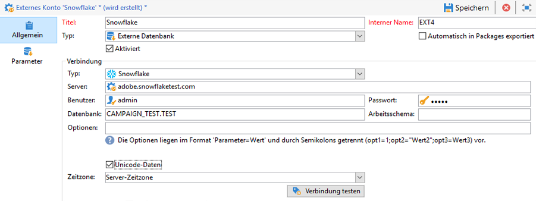

# Spezifische Konfigurationen nach Datenbanktyp {#specific-configurations-by-database-type}

Abhängig von der externen Datenbank, auf die Sie von Adobe Campaign aus zugreifen möchten, müssen Sie bestimmte Konfigurationen vornehmen. Hierzu zählen im Prinzip die Einrichtung von Treibern und die Deklaration von Umgebungsvariablen für jedes DBMS auf dem Adobe-Campaign-Server.

Dazu müssen Sie die jeweilige Client-Ebene in der externen Datenbank auf dem Adobe-Campaign-Server installieren.

>[!NOTE]
>
>Kompatible Versionen sind in der [Campaign-Kompatibilitätsmatrix](https://helpx.adobe.com/de/campaign/kb/compatibility-matrix.html#FederatedDataAccessFDA) aufgeführt.

<!--
## Configure access to Azure Synapse {#configure-access-to-azure-synapse}

### Azure Synapse on CentOS {#azure-centos}

1. Download mysql57-community-release.noarch.rpm. You can find it in this [page](https://dev.mysql.com/downloads/repo/yum).

1. Install the client library:

    ```
    $ yum install mysql57-community-release-el7-9.noarch.rpm
    $ yum install mysql-community-libs
    ```

1. You now need to configure the external account. In Campaign Classic, unfold the **[!UICONTROL Platform]** menu and click **[!UICONTROL External accounts]**.

1. Select the out-of-the box **[!UICONTROL Azure Synapse]** external account.

1. To configure the **[!UICONTROL Azure Synapse]** external account:

    * **[!UICONTROL Server]**
  
      URL of the Azure Synapse server.

    * **[!UICONTROL Account]**

      Name of the user.

    * **[!UICONTROL Password]**

      User account password.

    * **[!UICONTROL Database]**

      Name of your database

    >[!NOTE]
    >
    >Make sure the **[!UICONTROL Time zone]** and **[!UICONTROL Unicode data]** are set according to your database.

### Azure Synapse on Debian {#azure-debian}

1. Download mysql-apt-config.deb. You can find it in this [page](https://dev.mysql.com/doc/mysql-apt-repo-quick-guide/en).

1. Install the client library:

    ```
    $ dpkg -i mysql-apt-config_*_all.deb # choose mysql-5.7 in the configuration menu
    $ apt update
    $ apt install libmysqlclient20
    ```

1. You now need to configure the external account. In Campaign Classic, unfold the **[!UICONTROL Platform]** menu and click **[!UICONTROL External accounts]**.

1. Select the out-of-the box **[!UICONTROL Azure Synapse]** external account.

1. To configure the **[!UICONTROL Azure Synapse]** external account:

    * **[!UICONTROL Server]**
  
      URL of the Azure Synapse server.

    * **[!UICONTROL Account]**

      Name of the user.

    * **[!UICONTROL Password]**

      User account password.

    * **[!UICONTROL Database]**

      Name of your database

    >[!NOTE]
    >
    >Make sure the **[!UICONTROL Time zone]** and **[!UICONTROL Unicode data]** are set according to your database.

### Azure Synapse on Windows {#azure-windows}

1. Download the C connector. You can find it in this [page](https://dev.mysql.com/downloads/connector/c).

1. Make sure the directory that contains libmysqlclient.dll is added to the PATH environment variable that nlserver will use.

1. You now need to configure the external account. In Campaign Classic, unfold the **[!UICONTROL Platform]** menu and click **[!UICONTROL External accounts]**.

1. You now need to configure the external account. In Campaign Classic, unfold the **[!UICONTROL Platform]** menu and click **[!UICONTROL External accounts]**.

1. Select the out-of-the box **[!UICONTROL Azure Synapse]** external account.

1. To configure the **[!UICONTROL Azure Synapse]** external account:

    * **[!UICONTROL Server]**
  
      URL of the Azure Synapse server.

    * **[!UICONTROL Account]**

      Name of the user.

    * **[!UICONTROL Password]**

      User account password.

    * **[!UICONTROL Database]**

      Name of your database

    >[!NOTE]
    >
    >Make sure the **[!UICONTROL Time zone]** and **[!UICONTROL Unicode data]** are set according to your database.

-->

## Configure access to Snowflake {#configure-access-to-snowflake}

>[!NOTE]
>
>[!DNL Snowflake] Connector ist für gehostete und lokale Bereitstellungen verfügbar. For more on this, refer to [this article](https://helpx.adobe.com/de/campaign/kb/acc-on-prem-vs-hosted.html).


### Schneeflocke auf CentOS {#snowflake-centos}

1. Laden Sie die ODBC-Treiber herunter [!DNL Snowflake]. [Klicken Sie hier](https://sfc-repo.snowflakecomputing.com/odbc/linux/latest/snowflake-odbc-2.20.2.x86_64.rpm) , um den Beginn herunterzuladen.
1. Anschließend müssen Sie die ODBC-Treiber mit folgendem Befehl auf CentOs installieren:

   ```
   rpm -Uvh unixodbc
   rpm -Uvh snowflake-odbc-2.20.2.x86_64.rpm
   ```

1. Nach dem Herunterladen und Installieren der ODBC-Treiber müssen Sie Campaign Classic neu starten. Führen Sie dazu den folgenden Befehl aus:

   ```
   /etc/init.d/nlserver6 stop
   /etc/init.d/nlserver6 start
   ```

1. In Campaign Classic können Sie dann Ihr [!DNL Snowflake] Externe Konto konfigurieren. Klicken Sie von der **[!UICONTROL Explorer]**, klicken Sie auf **[!UICONTROL Administration]** / **[!UICONTROL Platform]** / **[!UICONTROL External accounts]**.

1. Wählen Sie das integrierte **[!UICONTROL Snowflake]** Externe Konto aus.

1. Konfigurieren Sie das **[!UICONTROL Snowflake]** Externe Konto und geben Sie Folgendes an:

   * **[!UICONTROL Server]**: URL des [!DNL Snowflake] Servers

   * **[!UICONTROL Account]**: Name des Benutzers

   * **[!UICONTROL Password]**: Passwort des Benutzerkontos

   * **[!UICONTROL Database]**: Name der Datenbank
   

1. Klicken Sie auf die **[!UICONTROL Parameters]** Registerkarte und dann auf die **[!UICONTROL Deploy functions]** Schaltfläche, um Funktionen zu erstellen.

   

Der Connector unterstützt die folgenden Optionen:

| Option | Description |
|---|---|
| workschema | Datenbank-Schema für Arbeitstabellen |
| warehouse | Name des zu verwendenden Standardlagers. Dadurch wird die Standardeinstellung des Benutzers außer Kraft gesetzt. |
| TimeZoneName | Standardmäßig leer, d. h. die Systemzeitzone des Campaign Classic-App-Servers wird verwendet. Mit dieser Option können Sie den Sitzungsparameter TIMEZONE erzwingen. <br>[Weiterführende Informationen hierzu finden Sie auf dieser Seite](https://docs.snowflake.net/manuals/sql-reference/parameters.html#timezone). |
| WeekStart | Sitzungsparameter &quot;WEEK_BEGINN&quot;. Standardmäßig auf 0 eingestellt. <br>[Weiterführende Informationen hierzu finden Sie auf dieser Seite](https://docs.snowflake.com/en/sql-reference/parameters.html#week-start). |
| UseCachedResult | USE_CACHED_RESULTS-Sitzungsparameter. Standardmäßig ist TRUE festgelegt. Diese Option kann verwendet werden, um die zwischengespeicherten Ergebnisse von Snowflake zu deaktivieren. <br>[Weiterführende Informationen hierzu finden Sie auf dieser Seite](https://docs.snowflake.net/manuals/user-guide/querying-persisted-results.html). |

### Schneeflocke auf Debian {#snowflake-debian}

1. Laden Sie die ODBC-Treiber herunter [!DNL Snowflake]. [Klicken Sie hier](https://sfc-repo.snowflakecomputing.com/odbc/linux/latest/index.html) Beginn Downloads.

1. Anschließend müssen Sie die ODBC-Treiber unter Debian mit folgendem Befehl installieren:

   ```
   apt-get install unixodbc
   apt-get install snowflake-odbc-x.xx.x.x86_64.deb
   ```

1. Nach dem Herunterladen und Installieren der ODBC-Treiber müssen Sie Campaign Classic neu starten. Führen Sie dazu den folgenden Befehl aus:

   ```
   systemctl stop nlserver.service
   systemctl start nlserver.service
   ```

1. In Campaign Classic können Sie dann Ihr [!DNL Snowflake] Externe Konto konfigurieren. Klicken Sie von der **[!UICONTROL Explorer]**, klicken Sie auf **[!UICONTROL Administration]** / **[!UICONTROL Platform]** / **[!UICONTROL External accounts]**.

1. Wählen Sie das integrierte **[!UICONTROL Snowflake]** Externe Konto aus.

1. Zum Konfigurieren des **[!UICONTROL Snowflake]** Externen Kontos müssen Sie Folgendes angeben:

   * **[!UICONTROL Server]**: URL des [!DNL Snowflake] Servers

   * **[!UICONTROL Account]**: Name des Benutzers

   * **[!UICONTROL Password]**: Passwort des Benutzerkontos

   * **[!UICONTROL Database]**: Name der Datenbank
   

1. Klicken Sie auf die **[!UICONTROL Parameters]** Registerkarte und dann auf die **[!UICONTROL Deploy functions]** Schaltfläche, um Funktionen zu erstellen.

   

Der Connector unterstützt die folgenden Optionen:

| Option | Description |
|---|---|
| workschema | Datenbank-Schema für Arbeitstabellen |
| warehouse | Name des zu verwendenden Standardlagers. Dadurch wird die Standardeinstellung des Benutzers außer Kraft gesetzt. |
| TimeZoneName | Standardmäßig leer, d. h. die Systemzeitzone des Campaign Classic-App-Servers wird verwendet. Mit dieser Option können Sie den Sitzungsparameter TIMEZONE erzwingen. <br>[Weiterführende Informationen hierzu finden Sie auf dieser Seite](https://docs.snowflake.net/manuals/sql-reference/parameters.html#timezone). |
| WeekStart | Sitzungsparameter &quot;WEEK_BEGINN&quot;. Standardmäßig auf 0 eingestellt.  <br>[Weiterführende Informationen hierzu finden Sie auf dieser Seite](https://docs.snowflake.net/manuals/sql-reference/parameters.html#week-start). |
| UseCachedResult | USE_CACHED_RESULTS-Sitzungsparameter. Standardmäßig ist TRUE festgelegt. Diese Option kann verwendet werden, um die zwischengespeicherten Ergebnisse von Snowflake zu deaktivieren. <br>[Weiterführende Informationen hierzu finden Sie auf dieser Seite](https://docs.snowflake.net/manuals/user-guide/querying-persisted-results.html). |

### Schneeflocken unter Windows {#snowflake-windows}

1. Laden Sie den [ODBC-Treiber für Windows](https://docs.snowflake.net/manuals/user-guide/odbc-download.html)herunter. Beachten Sie, dass Sie zum Installieren des Treibers über Administratorrechte verfügen müssen. Weiterführende Informationen hierzu finden Sie auf dieser [Seite](https://docs.snowflake.net/manuals/user-guide/admin-user-management.html)

1. Konfigurieren Sie den ODBC-Treiber. Weiterführende Informationen hierzu finden Sie auf dieser [Seite](https://docs.snowflake.net/manuals/user-guide/odbc-windows.html#step-2-configure-the-odbc-driver)

1. In Campaign Classic können Sie dann Ihr [!DNL Snowflake] Externe Konto konfigurieren. Klicken Sie von der **[!UICONTROL Explorer]**, klicken Sie auf **[!UICONTROL Administration]** / **[!UICONTROL Platform]** / **[!UICONTROL External accounts]**.

1. Wählen Sie das integrierte **[!UICONTROL Snowflake]** Externe Konto aus.

1. Zum Konfigurieren des **[!UICONTROL Snowflake]** Externen Kontos müssen Sie Folgendes angeben:

   * **[!UICONTROL Server]**: URL des [!DNL Snowflake] Servers

   * **[!UICONTROL Account]**: Name des Benutzers

   * **[!UICONTROL Password]**: Passwort des Benutzerkontos

   * **[!UICONTROL Database]**: Name der Datenbank
   

1. Klicken Sie auf die **[!UICONTROL Parameters]** Registerkarte und dann auf die **[!UICONTROL Deploy functions]** Schaltfläche, um Funktionen zu erstellen.

   

Der Connector unterstützt die folgenden Optionen:

| Option | Description |
|---|---|---|
| workschema | Datenbank-Schema für Arbeitstabellen |
| warehouse | Name des zu verwendenden Standardlagers. Dadurch wird die Standardeinstellung des Benutzers außer Kraft gesetzt. |
| TimeZoneName | Standardmäßig leer, d. h. die Systemzeitzone des Campaign Classic-App-Servers wird verwendet. Mit dieser Option können Sie den Sitzungsparameter TIMEZONE erzwingen. <br>[Weiterführende Informationen hierzu finden Sie auf dieser Seite](https://docs.snowflake.net/manuals/sql-reference/parameters.html#timezone). |
| WeekStart | Sitzungsparameter &quot;WEEK_BEGINN&quot;. Standardmäßig auf 0 eingestellt. <br>[Weiterführende Informationen hierzu finden Sie auf dieser Seite](https://docs.snowflake.net/manuals/sql-reference/parameters.html#week-start). |
| UseCachedResult | Standardmäßig ist TRUE festgelegt. Diese Option kann verwendet werden, um die zwischengespeicherten Ergebnisse von Snowflake zu deaktivieren (Sitzungsparameter USE_CACHED_RESULTS). <br>Weitere Informationen finden Sie auf [dieser Seite](https://docs.snowflake.net/manuals/user-guide/querying-persisted-results.html). |

## Configure access to Hadoop 3.0 {#configure-access-to-hadoop-3}

Für das Herstellen einer Verbindung zu einer externen Hadoop-Datenbank in FDA sind die folgenden Konfigurationen auf dem Adobe Campaign-Server erforderlich. Beachten Sie, dass diese Konfiguration für Windows und Linux verfügbar ist.

1. Laden Sie die ODBC-Treiber für Hadoop je nach Betriebssystemversion herunter. Treiber finden Sie auf [dieser Seite](https://www.cloudera.com/downloads.html).

1. Anschließend müssen Sie die ODBC-Treiber installieren und ein DSN für Ihre Hive-Verbindung erstellen. Anweisungen finden Sie auf [dieser Seite](https://docs.cloudera.com/documentation/other/connectors/hive-odbc/2-6-5/Cloudera-ODBC-Driver-for-Apache-Hive-Install-Guide.pdf)

1. Nach dem Herunterladen und Installieren der ODBC-Treiber müssen Sie Campaign Classic neu starten. Führen Sie dazu den folgenden Befehl aus:

   ```
   systemctl stop nlserver.service
   systemctl start nlserver.service
   ```

1. Im Campaign Classic können Sie dann Ihr Snowflake-Externe Konto konfigurieren. Klicken Sie von der **[!UICONTROL Explorer]**, klicken Sie auf **[!UICONTROL Administration]** / **[!UICONTROL Platform]** / **[!UICONTROL External accounts]**.

1. Klicken Sie auf **[!UICONTROL Create]** und wählen Sie **[!UICONTROL External database]** als Kontotyp aus.

1. Um das **[!UICONTROL  Hadoop]** Externe Konto zu konfigurieren, müssen Sie Folgendes angeben:

   * **[!UICONTROL Type]**: ODBC (Sybase ASE, Sybase IQ)

   * **[!UICONTROL Server]**: Name des DNS

   * **[!UICONTROL Account]**: Name des Benutzers

   * **[!UICONTROL Password]**: Passwort des Benutzerkontos

   * **[!UICONTROL Database]**: Name der Datenbank, falls nicht in DSN angegeben. Sie kann leer bleiben, wenn im DSN angegeben

   * **[!UICONTROL Time zone]**: Server-Zeitzone
   

Der Connector unterstützt die folgenden ODBC-Optionen:

| Name | Wert |
|---|---|
| ODBCMgr | iODBC |
| warehouse | 1/2/4 |

Der Connector unterstützt außerdem die folgenden Hive-Optionen:

| Name | Wert | Description |
|---|---|---|
| Massenschlüssel | Azurblase oder DataLake-Zugriffsschlüssel | Für wasb:// oder wasbs:// von Massen-Ladern (z. B. wenn das Massen-Ladepool mit wasb:// oder wasbs:// Beginn). <br>Es ist der Zugriffsschlüssel für Blob oder DataLake Bucket für Massenladung. |
| hdfsPort | Anschlussnummer <br>standardmäßig auf 8020 eingestellt | Bei HDFS-Massenladung (d. h. wenn das Massenladewerkzeug mit webhdfs:// oder webhdfss:// Beginn). |
| bucketsNumber | 20 | Anzahl der Behälter beim Erstellen einer Clustertabelle. |
| fileFormat | PARKET | Standarddateiformat für Arbeitstabellen. |

## Configure access to Hadoop 2.1 {#configure-access-to-hadoop}

### Für Windows:{#for-windows}

1. Installieren Sie die ODBC- und [Azure HD Insight](https://www.microsoft.com/en-us/download/details.aspx?id=40886)-Treiber für Windows.
1. Erstellen Sie den DSN (Data Source Name), indem Sie das Tool ODBC DataSource Administrator ausführen. Dort finden Sie ein Beispiel für einen System-DSN für Hive, das Sie anpassen können.

   ```
   Description: vorac (or any name you like)
   Host: vorac.azurehdinsight.net
   Port: 443
   Database: sm_tst611 (or your database name)
   Mechanism: Azure HDInsight Service
   User/Password: admin/<your password here>
   ```

1. Create the Hadoop external account, as detailed in [this page](../../platform/using/external-accounts.md#hadoop-external-account) section.

### Für Linux:{#for-linux}

1. Installieren Sie unixodbc für Linux.

   ```
   apt-get install unixodbc
   ```

1. Laden Sie ODBC-Treiber für Apache Hive von HortonWorks herunter und installieren Sie sie: [https://www.hortonworks.com/downloads/](https://www.hortonworks.com/downloads/).

   ```
   dpkg -i hive-odbc-native_2.1.10.1014-2_amd64.deb
   ```

1. Sehen Sie nach, wo die ODBC-Dateien gespeichert sind.

   ```
   root@campadpac71:/tmp# odbcinst -j
   unixODBC 2.3.1
   DRIVERS............: /etc/odbcinst.ini
   SYSTEM DATA SOURCES: /etc/odbc.ini
   FILE DATA SOURCES..: /etc/ODBCDataSources
   USER DATA SOURCES..: /root/.odbc.ini
   SQLULEN Size.......: 8
   SQLLEN Size........: 8
   SQLSETPOSIROW Size.: 8
   ```

1. Erstellen Sie den DSN (Data Source Name) und bearbeiten Sie die Datei odbc.ini. Erstellen Sie dann einen DSN für Ihre Hive-Verbindung.

   Hier ist ein Beispiel für HDInsight zur Herstellung einer Verbindung mit der Bezeichnung &quot;viral&quot;:

   ```
   [ODBC Data Sources]
   vorac 
   
   [vorac]
   Driver=/usr/lib/hive/lib/native/Linux-amd64-64/libhortonworkshiveodbc64.so
   HOST=vorac.azurehdinsight.net
   PORT=443
   Schema=sm_tst611
   HiveServerType=2
   AuthMech=6
   UID=admin
   PWD=<your password here>
   HTTPPath=
   UseNativeQuery=1
   ```

   >[!NOTE]
   >
   >Der Parameter **UseNativeQuery** ist dabei sehr wichtig. Campaign unterstützt Hive und funktioniert nur dann ordnungsgemäß, wenn UseNativeQuery eingerichtet ist. Üblicherweise formuliert der Treiber oder Hive SQL Connector Abfragen um und ändert die Spaltenanordnung.

   Die Authentifizierungseinrichtung hängt von der Konfiguration von Hive/Hadoop ab. Verwenden Sie z. B. für HD Insight AuthMech=6 für die Benutzer-/Passwort-Authentifizierung entsprechend [dieser Beschreibung](https://www.simba.com/products/Spark/doc/ODBC_InstallGuide/unix/content/odbc/hi/configuring/authenticating/azuresvc.htm).

1. Exportieren Sie die Variablen.

   ```
   export ODBCINI=/etc/myodbc.ini
   export ODBCSYSINI=/etc/myodbcinst.ini
   ```

1. Richten Sie Hortonworks-Treiber über /usr/lib/hive/lib/native/Linux-amd64-64/hortonworks.hiveodbc.ini ein.

   Sie müssen UTF-16 verwenden, um eine Verbindung mit Campaign und unix-odbc (libodbcinst) herstellen zu können.

   ```
   [Driver]
   
   DriverManagerEncoding=UTF-16
   ErrorMessagesPath=/usr/lib/hive/lib/native/hiveodbc/ErrorMessages/
   LogLevel=0
   LogPath=/tmp/hive
   SwapFilePath=/tmp
   
   ODBCInstLib=libodbcinst.so
   ```

1. Jetzt können Sie Ihre Verbindung unter Verwendung von isql testen.

   ```
   isql vorac
   isql vorac -v
   ```

1. Create the Hadoop external account, as detailed in [this page](../../platform/using/external-accounts.md#hadoop-external-account) section.

## Zugriff auf Netezza konfigurieren {#configure-access-to-netezza}

Die Verbindung zu einer externen Netezza-Datenbank über die FDA-Option erfordert die zusätzlichen unten aufgeführten Konfigurationen auf dem Adobe Campaign Server:

1. Installieren Sie die ODBC-Treiber für Netezza entsprechend dem verwendeten Betriebssystem:

   * **nz-linuxclient-v7.2.0.0.tar.gz für Linux: Wählen Sie den Ordner aus, der Ihrem Betriebssystem entspricht (linux oder linux64) und starten Sie den Entpacken-Befehl. Sie können die Installation im standardmäßig empfohlenen Verzeichnis ausführen: &quot;/usr/local/nz&quot;.**
   * **nz-winclient-v7.2.0.0.zip für Windows: Dekomprimieren Sie die Datei und führen Sie das jeweilige Script für Ihr Betriebssystem aus: nzodbcsetup.exe oder nzodbcsetup64.exe. Folgen Sie den Anweisungen des Assistenten, um die Treiber zu installieren.**

1. Konfigurieren sie den ODBC-Treiber. Die Konfiguration kann in den Standarddateien ausgeführt werden: **/etc/odbc.ini** für allgemeine Parameter und **/etc/odbcinst.ini** zur Deklarierung der Treiber.

   * **/etc/odbc.ini**

      ```
      [ODBC]
      InstallDir=/etc/
      ```

      &quot;InstallDir&quot; entspricht dem Pfad der odbcinst.ini-Datei.

   * **/etc/odbcinst.ini**

      ```
      [ODBC Drivers]
      NetezzaSQL = Installed
      
      [NetezzaSQL]
      Driver           = /usr/local/nz/lib/libnzsqlodbc3.so
      Setup            = /usr/local/nz/lib/libnzsqlodbc3.so
      APILevel         = 1
      ConnectFunctions = YYN
      Description      = Netezza ODBC driver
      DriverODBCVer    = 03.51
      DebugLogging     = false
      LogPath          = /tmp
      UnicodeTranslationOption = utf8
      CharacterTranslationOption = all
      PreFetch         = 256
      Socket           = 16384
      ```

1. Spezifizieren Sie die Umgebungsvariablen des Adobe Campaign-Servers:

   * **LD_LIBRARY_PATH**: /usr/local/nz/lib und /usr/local/nz/lib64. „/usr/local/nz“ entspricht dem bei der Treiberinstallation standardmäßig angegebenen Installationsverzeichnis. Geben Sie hier das für die Installation ausgewählte Verzeichnis an.
   * **ODBCINI**: Pfad der odbc.ini-Datei (z. B. /etc/odbc.ini).
   * **NZ_ODBC_INI_PATH**: Pfad der Datei „odbc.ini“. In Netezza ist auch diese zweite Variable zur Verwendung der odbc.ini-Datei erforderlich.

1. In Campaign Classic können Sie dann Ihr Netezza-Externe Konto konfigurieren. Klicken Sie von der **[!UICONTROL Explorer]**, klicken Sie auf **[!UICONTROL Administration]** / **[!UICONTROL Platform]** / **[!UICONTROL External accounts]**.

1. Klicken Sie auf **[!UICONTROL New]** und wählen Sie **[!UICONTROL External database]** als **[!UICONTROL Type]**.

1. Zum Konfigurieren des **[!UICONTROL Netezza]** Externen Kontos müssen Sie Folgendes angeben:

   * **[!UICONTROL Type]**: Netezza

   * **[!UICONTROL Server]**: URL des Netezza-Servers

   * **[!UICONTROL Account]**: Name des Benutzers

   * **[!UICONTROL Password]**: Passwort des Benutzerkontos

   * **[!UICONTROL Database]**: Name der Datenbank

>[!NOTE]
>
>Vorgänge, die Schemata betreffen und automatisch erstellte Primärschlüssel enthalten, werden hierbei nicht berücksichtigt.
>
>Für den ersten im Schema definierten Index wird von der Tabelle die Bedingung **Organize on** verwendet. Da diese Bedingung bei Netezza auf 1 bis 4 Spalten beschränkt ist, kann dieser Index nur maximal 4 Spalten beinhalten.

## Zugriff auf Oracle konfigurieren {#configure-access-to-oracle}

Die Verbindung zu einer externen Oracle-Datenbank über die FDA-Option erfordert die zusätzlichen unten aufgeführten Konfigurationen auf dem Adobe Campaign Server:

### Für Linux:{#for-linux-1}

1. Installieren Sie den vollständigen Oracle-Client für Ihre jeweilige Oracle-Version.
1. Fügen Sie der Installation Ihre TNS-Definitionen hinzu. Spezifizieren Sie diese Definitionen dazu in der Datei **tnsnames.ora** im Verzeichnis /etc/oracle. Wenn dieses Verzeichnis nicht vorhanden ist, erstellen Sie es.

   Erstellen Sie dann eine neue TNS_ADMIN-Umgebungsvariable: Exportieren Sie TNS_ADMIN=/etc/oracle und starten Sie das Gerät neu.

1. Integrieren Sie Oracle in Ihren Adobe Campaign-Server (nlserver). Dazu muss die Datei **customer.sh** im Navigationsbaum des Adobe Campaign-Servers im Ordner „nl6“ vorhanden sein; und die Datei muss die Links zu den Oracle-Bibliotheken enthalten.

   Beispiel für einen Client in 11.2:

   ```
   export ORACLE_HOME=/usr/lib/oracle/11.2
   export TNS_ADMIN=/etc/oracle
   export LD_LIBRARY_PATH=$ORACLE_HOME/client64/lib:$LD_LIBRARY_PATH
   ```

   >[!NOTE]
   >
   >Diese Werte (vor allem ORACLE_HOME) hängen von Ihren Installationsverzeichnissen ab. Prüfen Sie Ihren Navigationsbaums, bevor Sie diese Werte referenzieren.

1. Installieren Sie die für Oracle nötigen Bibliotheken:

   * **libclntsh.so**

      ```
      cd /usr/lib/oracle/<version>/client<architecture>/lib
      ln -s libclntsh.so.<version> libclntsh.so
      ```

   * **libaio1**

      ```
      aptitude install libaio1
      or
      yum install libaio1
      ```

### Für Windows:{#for-windows-1}

1. Installieren Sie den Oracle-Client.
1. Erstellen Sie im Ordner unter C:\Oracle eine **tnsnames.ora**-Datei, die Ihre TNS-Definition enthält.

   Fügen Sie eine TNS_ADMIN-Umgebungsvariable mit C:\Oracle als Wert hinzu und starten Sie das Gerät neu.

## Zugriff auf Sybase IQ konfigurieren {#configure-access-to-sybase-iq}

Die Verbindung zu einer externen Sybase IQ-Datenbank über die FDA-Option erfordert die zusätzlichen unten aufgeführten Konfigurationen auf dem Adobe Campaign Server:

1. Prüfen Sie, ob sich das unixodbc-Package auf dem Server befindet.
1. Installieren Sie **iq_odbc**. Nach Abschluss der Installation wird möglicherweise ein Fehler angezeigt, der ignoriert werden kann.
1. Installieren Sie **iq_client_common**. Nach Abschluss der Installation wird möglicherweise ein Java-Fehler angezeigt, der ignoriert werden kann.
1. Konfigurieren sie den ODBC-Treiber. Die Konfiguration kann in den Standarddateien ausgeführt werden: /etc/odbc.ini für allgemeine Parameter und /etc/odbcinst.ini zur Deklarierung der Treiber:

   * **/etc/odbc.ini** (ersetzen Sie Werte wie `<server_alias>`-Zeichen durch Ihre eigenen):

      ```
      [ODBC Data Sources]
      <server_alias>=libdbodbc.so
      
      [<server_alias>]
      Driver=/opt/sybase/IQ-16_0/lib64/libdbodbc16.so
      Description=<description>
      Username=<username>
      Password=<password>
      ServerName=<server_name>
      CommLinks=tcpip(host=<host>)
      ```

   * **/etc/odbcinst.ini**

      ```
      [ODBC DRIVERS]
      SAP SybaseIQ=Installed
      
      [SAP SybaseIQ]
      Driver=/opt/sybase/IQ-16_0/lib64/libdbodbc16.so
      ```

1. Fügen Sie den Pfad für die neue Bibliothek libodbc16.so in der Variablen LD_LIBRARY_PATH hinzu. Gehen Sie dazu folgendermaßen vor:

   * Wenn Sie eine customer.sh-Datei verwenden, um Ihren Pfad zu deklarieren: Fügen Sie den Pfad /opt/sybase/IQ-16_0/lib64 für die Variable LD_LIBRARY_PATH hinzu.
   * Verwenden Sie ansonsten einen Unix-Befehl.

1. In Campaign Classic können Sie dann Ihr Sybase IQ-Externe Konto konfigurieren. Klicken Sie von der **[!UICONTROL Explorer]**, klicken Sie auf **[!UICONTROL Administration]** / **[!UICONTROL Platform]** / **[!UICONTROL External accounts]**.

1. Klicken Sie auf **[!UICONTROL New]** und wählen Sie **[!UICONTROL External database]** als **[!UICONTROL Type]**.

1. Zum Konfigurieren des **[!UICONTROL Sybase IQ]** Externen Kontos müssen Sie Folgendes angeben:

   * **[!UICONTROL Type]**: ODBC (Sybase ASE, Sybase IQ)

   * **[!UICONTROL Server]**: Entspricht der ODBC-Verbindung (`<server_alias>`), die in Schritt 5 definiert ist. Nicht unbedingt der Name des Servers selbst.

   * **[!UICONTROL Account]**: Name des Benutzers

   * **[!UICONTROL Password]**: Passwort des Benutzerkontos

   * **[!UICONTROL Database]**: Name der Datenbank

>[!NOTE]
>
>Unter Windows müssen Sie den Sybase IQ-Client auf dem Adobe Campaign-Server installieren und eine ODBC-Verbindung erstellen. Stellen Sie sicher, dass Sie eine Systemdatenquelle erstellen, wenn der Adobe Campaign-Server (nlserver) unter Windows als Dienst ausgeführt wird.

## Zugriff auf Teradata konfigurieren {#configure-access-to-teradata}

Die Verbindung mit einer externen Teradata-Datenbank über die FDA-Option erfordert gewisse zusätzliche Konfigurationen auf dem Adobe Campaign-Server. Weiterführende Informationen zur Konfiguration Ihrer Teradata-Datenbank finden Sie in diesem [Artikel](https://helpx.adobe.com/de/campaign/kb/campaign_fda_teradata.html).

1. Installieren Sie den [ODBC-Treiber für Teradata](https://downloads.teradata.com/download/connectivity/odbc-driver/linux).

   Er besteht aus drei Packages, die in der folgenden Reihenfolge auf Red Hat (oder CentOS)/Suse installiert werden können:

   * TeraGSS
   * tdicu1510 (Installation mit setup_wrapper.sh)
   * tdodbc1510 (Installation mit setup_wrapper.sh)

1. Konfigurieren Sie den ODBC-Treiber. Die Konfiguration kann in den Standarddateien ausgeführt werden: **/etc/odbc.ini** für allgemeine Parameter und /etc/odbcinst.ini zur Deklarierung der Treiber:

   * **/etc/odbc.ini**

      ```
      [ODBC]
      InstallDir=/etc/
      ```

      „InstallDir“ entspricht dem Pfad der Datei **odbcinst.ini**.

   * **/etc/odbcinst.ini**

      ```
      [ODBC DRIVERS]
      teradata=Installed
      
      [teradata]
      Driver=/opt/teradata/client/15.10/lib64/tdata.so
      APILevel=CORE
      ConnectFunctions=YYY
      DriverODBCVer=3.51
      SQLLevel=1
      ```

1. Spezifizieren Sie die Umgebungsvariablen des Adobe Campaign-Servers:

   * **LD_LIBRARY_PATH**: /opt/teradata/client/15.10/lib64 und /opt/teradata/client/15.10/odbc_64/lib.
   * **ODBCINI**: Pfad der odbc.ini-Datei (z. B. /etc/odbc.ini).
   * **NLSPATH**: Pfad der opermsgs.cat-Datei (/opt/teradata/client/15.10/msg/opermsgs.cat)

1. In Campaign Classic können Sie dann Ihr Teradata-Externe Konto konfigurieren. Klicken Sie von der **[!UICONTROL Explorer]**, klicken Sie auf **[!UICONTROL Administration]** / **[!UICONTROL Platform]** / **[!UICONTROL External accounts]**.

1. Klicken Sie auf **[!UICONTROL New]** und wählen Sie **[!UICONTROL External database]** als **[!UICONTROL Type]**.

1. Zum Konfigurieren des **[!UICONTROL Teradata]** Externen Kontos müssen Sie Folgendes angeben:

   * **[!UICONTROL Type]**: Teradata

   * **[!UICONTROL Server]**: URL des Teradata-Servers

   * **[!UICONTROL Account]**: Name des Benutzers

   * **[!UICONTROL Password]**: Passwort des Benutzerkontos

   * **[!UICONTROL Database]**: Name der Datenbank

## Zugriff auf SAP HANA konfigurieren {#configure-access-to-sap-hana}

Die Verbindung mit einer externen SAP-HANA-Datenbank über die FDA-Option erfordert gewisse zusätzliche Konfigurationen auf dem Adobe-Campaign-Server:

1. Installieren Sie entsprechend dem verwendeten Betriebssystem die nötigen ODBC-Treiber für SAP HANA:

   * **hdb_client_linux.tgz für Linux: Dekomprimieren Sie die Datei, führen Sie den hdbinst-Befehl aus und folgen Sie der Anleitung zur Installation der Treiber.**
   * **hdb_client_windows.zip** für Windows: Dekomprimieren Sie die Datei und führen Sie die ausführbare Datei **hdbinst.exe** aus. Folgen Sie den Anweisungen des Assistenten zur Installation der Treiber.

1. Konfigurieren sie den ODBC-Treiber. Die Konfiguration kann in den Standarddateien ausgeführt werden: /etc/odbc.ini für allgemeine Parameter und /etc/odbcinst.ini zur Deklarierung der Treiber.

   * **/etc/odbc.ini**

      ```
      [ODBC]
      InstallDir=/etc/
      
      [HDB]
      Driver=HDBODBC
      servernode=localhost:39013 (this value depend of your server)
      User:SYSTEM
      ```

      „InstallDir“ entspricht dem Pfad der Datei **odbcinst.ini**.

   * **/etc/odbcinst.ini**

      ```
      [HDBODBC]
      Description = "SmartCloudPT HANA"
      Driver = /usr/sap/hdbclient/libodbcHDB.so
      ```

1. Spezifizieren Sie die Umgebungsvariablen des Adobe Campaign-Servers:

   * **LD_LIBRARY_PATH**: Es sollte den Link zu Ihrem SAP Hana-Client (/usr/sap/hdbclient/libodbcHDB.so) standardmäßig enthalten.
   * **ODBCINI**: Pfad der odbc.ini-Datei (z. B. /etc/odbc.ini).

1. In Campaign Classic können Sie dann Ihr SAP Hana-Externe Konto konfigurieren. Klicken Sie von der **[!UICONTROL Explorer]**, klicken Sie auf **[!UICONTROL Administration]** / **[!UICONTROL Platform]** / **[!UICONTROL External accounts]**.

1. Klicken Sie auf **[!UICONTROL New]** und wählen Sie **[!UICONTROL External database]** als **[!UICONTROL Type]**.

1. Zum Konfigurieren des **[!UICONTROL SAP Hana]** Externen Kontos müssen Sie Folgendes angeben:

   * **[!UICONTROL Type]**: SAP Hana

   * **[!UICONTROL Server]**: URL des SAP Hana-Servers

   * **[!UICONTROL Account]**: Name des Benutzers

   * **[!UICONTROL Password]**: Passwort des Benutzerkontos
