# Schritte zum Erstellen einer Abfrage{#steps-to-create-a-query}

Folgende Schritte sind auszuführen, um eine Abfrage in Adobe Campaign zu erstellen:

1. Wählen Sie die Arbeitstabelle aus. Siehe [1. Schritt - Tabelle auswählen](#step-1---choose-a-table).
1. Wählen Sie die zu extrahierenden Daten aus. Siehe [2. Schritt - Zu extrahierende Daten auswählen](#step-2---choose-data-to-extract).
1. Definieren Sie die Sortierreihenfolge für die Daten. Siehe [3. Schritt - Daten sortieren](#step-3---sort-data).
1. Filtern Sie die Daten. Siehe [4. Schritt - Daten filtern](#step-4---filter-data).
1. Formatieren Sie die Daten. Siehe [5. Schritt - Daten formatieren](#step-5---format-data).
1. Zeigen Sie das Ergebnis an. Siehe [6. Schritt - Vorschau der Daten anzeigen](#step-6---preview-data).

>[!NOTE]
>
>Alle diese Schritte können im generischen Abfragetool durchgeführt werden. In anderen Anwendungskontexten sind u. U. gewisse Schritte nicht nötig.\
>Das Abfrage-Tool wird in [diesem Abschnitt](../../workflow/using/query.md) beschrieben.

## 1. Schritt - Tabelle auswählen {#step-1---choose-a-table}

Wählen Sie im Fenster **[!UICONTROL Dokumenttyp]** die Tabelle aus, die die Daten enthält, für die Sie eine Abfrage erstellen möchten. Bei Bedarf können Sie die Auswahl unter Verwendung des Filterfeldes oder der Schaltfläche **[!UICONTROL Filter]** einschränken.

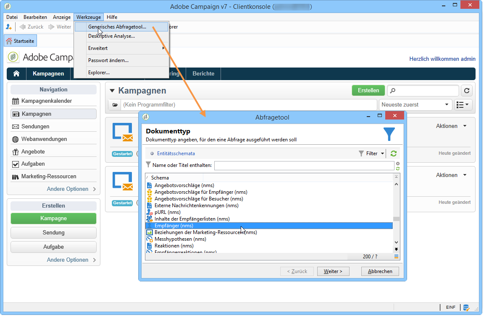

## 2. Schritt - Zu extrahierende Daten auswählen {#step-2---choose-data-to-extract}

Wählen Sie im Fenster **[!UICONTROL Zu extrahierende Daten]** die Felder aus, die als Spalten angezeigt werden sollen.

Wählen Sie beispielsweise: **[!UICONTROL Alter]**, **[!UICONTROL Primärschlüssel]**, **[!UICONTROL E-Mail-Domain]** und **[!UICONTROL Ort]**. Die Ergebnisse werden durch diese Auswahl bestimmt. Die Anzeigereihenfolge der Ausgabespalten kann mithilfe der blauen Pfeile an der rechten Seite des Fensters angepasst werden.

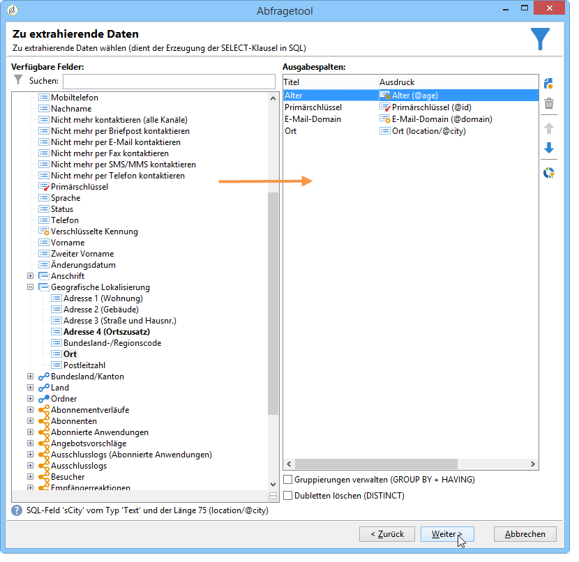

Sie können einen Ausdruck definieren, indem Sie eine Formel oder eine Aggregatfunktion einfügen. Klicken Sie hierfür in der Spalte **[!UICONTROL Ausdruck]** auf **[!UICONTROL Ausdruck bearbeiten]**.

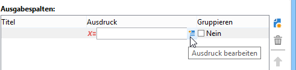

Die Daten der Ausgabespalten können gruppiert werden. Wählen Sie hierfür im Fenster **[!UICONTROL Zu extrahierende Daten]** in der Spalte **[!UICONTROL Gruppieren]** die Option **[!UICONTROL Ja]**. Diese Funktion erzeugt ein Ergebnis für die angekreuzte Gruppierungsachse. Ein Beispiel für eine Abfrage mit Gruppierung wird in [diesem Abschnitt](../../workflow/using/querying-delivery-information.md) dargestellt.

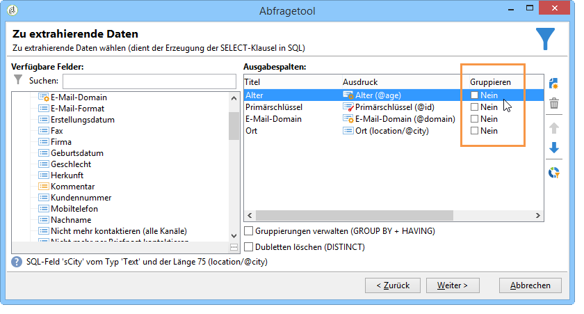

* Die Funktion **[!UICONTROL Gruppierungen verwalten (GROUP BY + HAVING)]** erlaubt sowohl die Gruppierung (&quot;group by&quot;) als auch die Filterung der Daten, die gruppiert wurden (&quot;having&quot;). Sie wird auf die Ausgabespalten angewendet. Beispielsweise können die Empfänger nach Altersklassen gruppiert und nur die Klasse 35 bis 50 Jahre angezeigt werden.

   Weiterführende Informationen hierzu finden Sie in [diesem Abschnitt](../../workflow/using/querying-using-grouping-management.md).

* Die Funktion **[!UICONTROL Dubletten löschen (DISTINCT)]** dedupliziert die Daten in den Ausgabespalten, d. h. doppelte Einträge werden nicht angezeigt. Sollen z. B. Nachname, Vorname und E-Mail-Adresse der Empfänger angezeigt werden, wird für mehrere Datensätze mit identischem Nachnamen, Vornamen und E-Mail-Adresse nur ein Datensatz angezeigt.

## 3. Schritt - Daten sortieren {#step-3---sort-data}

Im Fenster **[!UICONTROL Sortierung]** können Sie die Reihenfolge der Datenanzeige bestimmen. Mithilfe der Pfeile lässt sich die Spaltenreihenfolge verändern:

* Wenn Sie die Option **[!UICONTROL Sortierung]** ankreuzen, wird der Inhalt der jeweiligen Spalte von A bis Z sortiert (oder aufsteigend, wenn es sich um Zahlen handelt).
* Für eine Ordnung von Z bis A (oder absteigend, wenn es sich um Zahlen handelt) muss zusätzlich die Option **[!UICONTROL Absteigende Sortierung]** angekreuzt werden. Eine absteigende Sortierung bietet sich z. B. bei der Anzeige von Verkaufszahlen an, wo die meistverkauften Artikel am Listenanfang angezeigt werden sollen.

Im folgenden Beispiel werden die Daten nach dem Alter der Empfänger, vom jüngsten bis zum ältesten, sortiert.

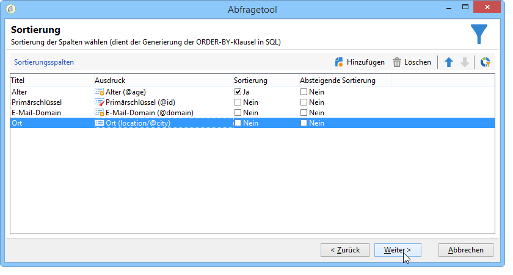

## 4. Schritt - Daten filtern {#step-4---filter-data}

Um die Daten einzuschränken, bietet das Abfragetool die Möglichkeit, Filter zu verwenden.

Die angebotenen Filter hängen von der der Abfrage zugrunde liegenden Tabelle ab.

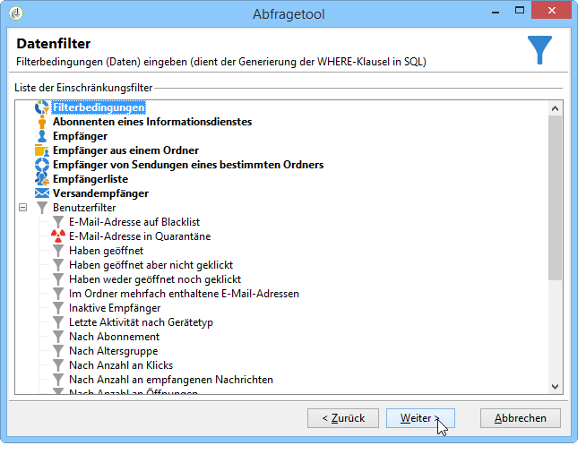

Nach Auswahl der **[!UICONTROL Filterbedingungen]** gelangen Sie zum Abschnitt **[!UICONTROL Zielelemente]**. Hier können Sie festlegen, wie die anzuzeigenden Daten gefiltert werden sollen.

* Um einen neuen Filter zu erstellen, wählen Sie die Felder, Operatoren und Werte aus, die für die Erstellung der zu verifizierenden Formel erforderlich sind, sodass Daten ausgewählt werden können. Es ist möglich, mehrere Bedingungen zu kombinieren (Weitere Informationen hierzu finden Sie unter [Filterbedingungen definieren](../../platform/using/defining-filter-conditions.md)).
* Sie haben auch die Möglichkeit, zuvor erstellte Filter zu verwenden. Öffnen Sie die Dropdown-Liste der Schaltfläche **[!UICONTROL Hinzufügen]**, klicken Sie auf **[!UICONTROL Vordefinierter Filter]** und wählen Sie den gewünschten Filter aus.

   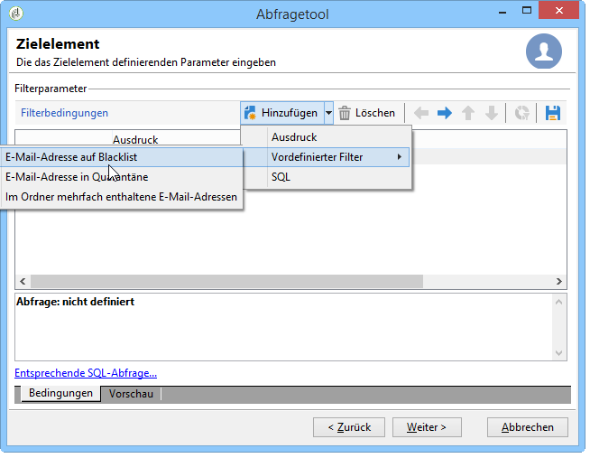

* Die im **[!UICONTROL Generischen Abfragetool]** erstellten Filter können in anderen Abfragen der Anwendung verwendet werden (und umgekehrt). Klicken Sie hierzu auf das Symbol **[!UICONTROL Speichern]**.

   >[!NOTE]
   >
   >Die Erstellung und Verwendung von Filtern wird im Kapitel [Filteroptionen](../../platform/using/filtering-options.md) erläutert.

In unten stehendem Beispiel sollen nur deutschsprachige Empfänger ausgewählt werden. Erstellen Sie also die Bedingung: Sprache **gleich** Deutsch.

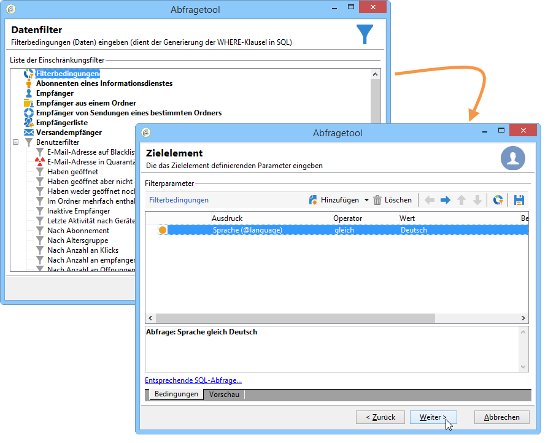

>[!NOTE]
>
>Es besteht die Möglichkeit, direkt auf eine Option zuzugreifen, indem Sie die folgende Formel in das Feld **Wert** eingeben: **$(options:OPTION_NAME).**

Durch Auswahl des Tabs **[!UICONTROL Vorschau]** können Sie das Ergebnis der Filterbedingung überprüfen. In unserem Beispiel werden alle deutschsprachigen Empfänger mit Nachname, Vorname und E-Mail-Adresse angezeigt.

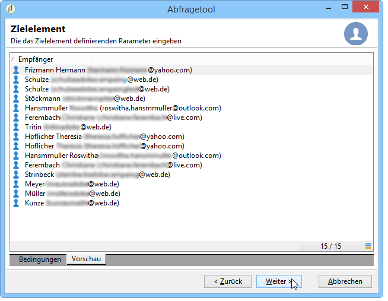

Für Benutzer, die diese Programmiersprache beherrschen, kann die **[!UICONTROL Entsprechende SQL-Abfrage]** angezeigt werden.

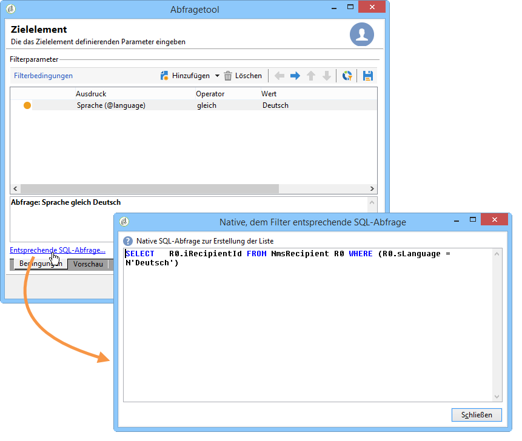

## 5. Schritt - Daten formatieren {#step-5---format-data}

Nach der Auswahl der Einschränkungsfilter gelangen Sie in das Fenster der **[!UICONTROL Datenformatierung]**. Hier können Sie die Anzeigereihenfolge der Ausgabespalten festlegen, die Schreibweise (Groß- oder Kleinschreibung) der Daten ändern oder die Spaltentitel anpassen. Außerdem besteht die Möglichkeit, berechnete Felder hinzuzufügen.

>[!NOTE]
>
>Lesen Sie diesbezüglich den Abschnitt [Erstellung berechneter Felder](../../platform/using/defining-filter-conditions.md#creating-calculated-fields).

Eine nicht-angekreuzte Spalte wird nicht im Datenvorschaufenster angezeigt.

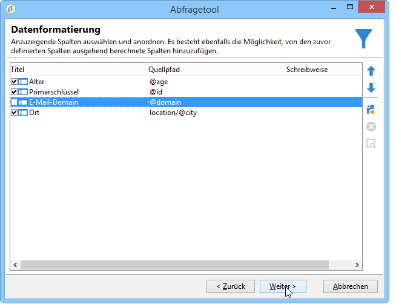

In der Spalte **[!UICONTROL Schreibweise]** haben Sie die Möglichkeit, Groß- und Kleinschreibung zu verändern. Wählen Sie eine Zeile aus und klicken Sie in die Spalte **[!UICONTROL Schreibweise]**. Wählen Sie zwischen:

* **[!UICONTROL Alles in Kleinbuchstaben]**,
* **[!UICONTROL Alles in Großbuchstaben]**,
* **[!UICONTROL Ersten Buchstaben großschreiben]**.

## 6. Schritt - Vorschau der Daten anzeigen {#step-6---preview-data}

Im letzten Schritt, der **[!UICONTROL Datenvorschau]**, können Sie sich das Ergebnis der Abfrage ansehen. Wählen Sie hierfür **[!UICONTROL Datenvorschau starten]** aus. Das Ergebnis liegt in Spalten oder im XML-Format vor. Wählen Sie **[!UICONTROL Erzeugte SQL-Abfragen]** aus, um sich die SQL-Entsprechung der Abfrage anzusehen.

Im vorliegenden Beispiel wurden die Daten nach dem Alter der ausgewählten Empfänger in aufsteigender Reihenfolge geordnet.

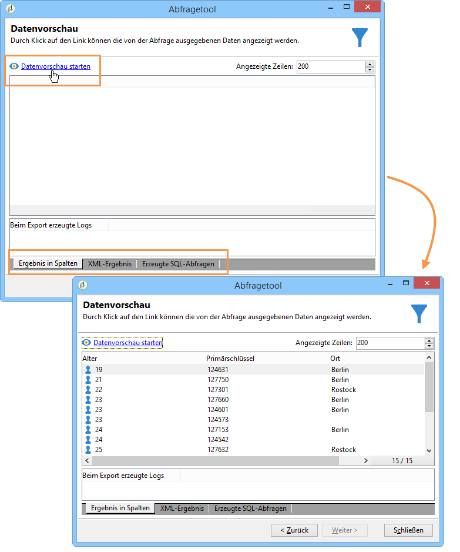

>[!NOTE]
>
>Standardmäßig werden in der **[!UICONTROL Datenvorschau]** die 200 ersten Zeilen des Abfrageergebnisses angezeigt. Durch Eingabe eines anderen Werts im Feld **[!UICONTROL Angezeigte Zeilen]** können Sie die Liste Ihren Bedürfnissen gemäß anpassen. Klicken Sie anschließend auf **[!UICONTROL Datenvorschau starten]**, um die Ergebnisse anzusehen.

