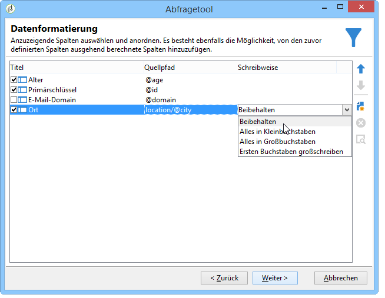

# Schritte zum Erstellen einer Abfrage{#steps-to-create-a-query}

Folgende Schritte sind auszuführen, um eine Abfrage in Adobe Campaign zu erstellen:

1. Wählen Sie die Arbeitstabelle aus. Siehe [Schritt 1 - Tabelle](#step-1---choose-a-table)auswählen.
1. Wählen Sie die zu extrahierenden Daten aus. Siehe [Schritt 2 - Daten extrahieren](#step-2---choose-data-to-extract).
1. Definieren Sie die Datensortierungssequenz. Siehe [Schritt 3 - Daten](#step-3---sort-data)sortieren.
1. Filtern Sie die Daten. Siehe [Schritt 4 - Daten](#step-4---filter-data)filtern.
1. Formatieren Sie die Daten. Siehe [Schritt 5 - Daten](#step-5---format-data)formatieren.
1. Zeigt das Ergebnis an. Siehe [Schritt 6 - Datenvorschau](#step-6---preview-data).

>[!NOTE]
>
>Alle diese Schritte können im generischen Abfragetool durchgeführt werden. In anderen Anwendungskontexten sind u. U. gewisse Schritte nicht nötig.\
>The Query activity is presented in [this section](../../workflow/using/query.md).

## 1. Schritt - Tabelle auswählen {#step-1---choose-a-table}

Wählen Sie die Tabelle mit den Daten aus, die Sie im **[!UICONTROL Document type]** Fenster abfragen möchten. Filtern Sie die Daten gegebenenfalls mithilfe des Filterfelds oder der **[!UICONTROL Filters]** Schaltfläche.

## 2. Schritt - Zu extrahierende Daten auswählen {#step-2---choose-data-to-extract}

In the **[!UICONTROL Data to extract]** window, select the data to display: these fields will make up the output columns.

Wählen Sie beispielsweise **[!UICONTROL Age]**, **[!UICONTROL Primary key]** und **[!UICONTROL Email domain]****[!UICONTROL City]**. Die Ergebnisse werden anhand dieser Auswahl organisiert. Verwenden Sie die blauen Pfeile rechts neben dem Fenster, um die Spaltenreihenfolge zu ändern.

Sie können einen Ausdruck bearbeiten, indem Sie eine Formel darin einfügen oder einen Prozess für eine Aggregationsfunktion ausführen. Klicken Sie dazu auf das **[!UICONTROL Expression]** Spaltenfeld und wählen Sie dann **[!UICONTROL Edit expression]**.

Es ist möglich, die Daten der Ausgabefelder zu gruppieren: um dies zu tun, checken Sie **[!UICONTROL Yes]** in die **[!UICONTROL Group]** Spalte des **[!UICONTROL Data to extract]** Fensters ein. Diese Funktion generiert ein Ergebnis um die Achse der aktivierten Gruppierung. Ein Beispiel einer Abfrage mit Gruppierung ist in [diesem Abschnitt](../../workflow/using/querying-delivery-information.md)verfügbar.

* Mit der **[!UICONTROL Handle groupings (GROUP BY + HAVING)]** Funktion können Sie &quot;gruppieren nach&quot;und auswählen, was gruppiert wurde (&quot;haben&quot;). Diese Funktion gilt für alle Felder in der Spalte &quot;Ausgabe&quot;. Mit dieser Option können Sie beispielsweise alle Auswahlmöglichkeiten einer Ausgabefalte gruppieren und einen bestimmten Informationstyp wiederherstellen, z. B. Empfänger zwischen 35 und 50.

   Weiterführende Informationen hierzu finden Sie in [diesem Abschnitt](../../workflow/using/querying-using-grouping-management.md).

* Mit der **[!UICONTROL Remove duplicate rows (DISTINCT)]** Funktion können Sie identische Ergebnisse deduplizieren, die in der Spalte &quot;Ausgabe&quot;erhalten wurden. Wenn Sie beispielsweise eine Zählung durchführen, indem Sie in der Ausgabspalte die Felder &quot;Nachname&quot;, &quot;Vorname&quot;und &quot;E-Mail&quot;auswählen, werden die Felder mit identischen Daten entfernt, da der gleiche Kontakt mehrere Male in die Datenbank eingegeben wurde: nur ein Ergebnis wird berücksichtigt.

## 3. Schritt - Daten sortieren {#step-3---sort-data}

Im **[!UICONTROL Sorting]** Fenster können Sie Spalteninhalte sortieren. Verwenden Sie die Pfeile, um die Spaltenreihenfolge zu ändern:

* The **[!UICONTROL Sorting]** column enables a simple sort and arranges column content from A to Z or in ascending order.
* Der Inhalt **[!UICONTROL Descending sort]** wird in absteigender Reihenfolge von Z bis A angeordnet. Dies ist zum Beispiel hilfreich, wenn Sie sich die Verkäufe von Datensätzen ansehen möchten: Die höchsten Zahlen werden oben in der Liste angezeigt.

Im folgenden Beispiel werden die Daten nach dem Alter der Empfänger, vom jüngsten bis zum ältesten, sortiert.

## 4. Schritt - Daten filtern {#step-4---filter-data}

Um die Daten einzuschränken, bietet das Abfragetool die Möglichkeit, Filter zu verwenden.

Die angebotenen Filter hängen von der der Abfrage zugrunde liegenden Tabelle ab.

Once you select the **[!UICONTROL Filtering conditions]** you will access the **[!UICONTROL Target elements]** section: this lets you define how to filter the data to collect.

* Um einen neuen Filter zu erstellen, wählen Sie die Felder, Operatoren und Werte aus, die für die Erstellung der Formel erforderlich sind, damit die Daten ausgewählt werden können. Es ist möglich, mehrere Bedingungen zu kombinieren (weitere Informationen dazu finden Sie unter [Definieren von Filterbedingungen](../../platform/using/defining-filter-conditions.md)).
* To use previously saved filters, open the drop-down list by clicking the **[!UICONTROL Add]** button, click **[!UICONTROL Predefined filter]** and select the one you want.

   

* Die in der **[!UICONTROL Generic query editor]** Tabelle erstellten Filter sind in anderen Abfrageanwendungen verfügbar und umgekehrt. Klicken Sie zum Speichern eines Filters auf das **[!UICONTROL Save]** Symbol.

   >[!NOTE]
   >
   >For more on creating and using filters, refer to [Filtering options](../../platform/using/filtering-options.md).

In unten stehendem Beispiel sollen nur deutschsprachige Empfänger ausgewählt werden. Erstellen Sie also die Bedingung: Sprache **gleich** Deutsch.

>[!NOTE]
>
>Es besteht die Möglichkeit, direkt auf eine Option zuzugreifen, indem Sie die folgende Formel in das Feld **Wert** eingeben: **$(options:OPTION_NAME).**

Klicken Sie auf die **[!UICONTROL Preview]** Registerkarte, um das Ergebnis der Filterbedingung anzuzeigen. In diesem Fall werden alle englischsprachigen Empfänger mit ihrem Namen, Vornamen und ihrer E-Mail-Adresse angezeigt.

Users familiar with SQL language can click **[!UICONTROL Generate SQL query]** to view the query in SQL.

## 5. Schritt - Daten formatieren {#step-5---format-data}

Nachdem Sie die Beschränkungsfilter konfiguriert haben, greifen Sie auf das **[!UICONTROL Data formatting]** Fenster zu. In diesem Fenster können Sie Ausgabespalten neu anordnen, Daten transformieren und die Groß-/Kleinschreibung der Spaltenbeschriftungen ändern. Außerdem können Sie mit einem berechneten Feld eine Formel auf das Endergebnis anwenden.

>[!NOTE]
>
>For more information on the types of calculated fields, refer to [Creating calculated fields](../../platform/using/defining-filter-conditions.md#creating-calculated-fields).

Eine nicht-angekreuzte Spalte wird nicht im Datenvorschaufenster angezeigt.

In der **[!UICONTROL Transformation]** Spalte können Sie eine Spaltenbeschriftung in Groß- oder Kleinschreibung ändern. Wählen Sie die Spalte aus und klicken Sie auf die **[!UICONTROL Transformation]** Spalte. Sie haben folgende Möglichkeiten:

* **[!UICONTROL Switch to lower case]**,
* **[!UICONTROL Switch to upper case]**,
* **[!UICONTROL First letter in upper case]**.

## 6. Schritt - Vorschau der Daten anzeigen {#step-6---preview-data}

Das **[!UICONTROL Data preview]** Fenster ist die letzte Phase. Klicken Sie auf **[!UICONTROL Start the preview of the data]** , um Ihr Abfrageergebnis zu erhalten. Es ist in Spalten oder im XML-Format verfügbar. Klicken Sie auf die **[!UICONTROL Generated SQL queries]** Registerkarte, um die Abfrage im SQL-Format anzuzeigen.

Im vorliegenden Beispiel wurden die Daten nach dem Alter der ausgewählten Empfänger in aufsteigender Reihenfolge geordnet.

>[!NOTE]
>
>Standardmäßig werden nur die ersten 200 Zeilen im **[!UICONTROL Data preview]** Fenster angezeigt. Um dies zu ändern, geben Sie eine Zahl in das **[!UICONTROL Lines to display]** Feld ein und klicken Sie auf **[!UICONTROL Start the preview of the data]**.

