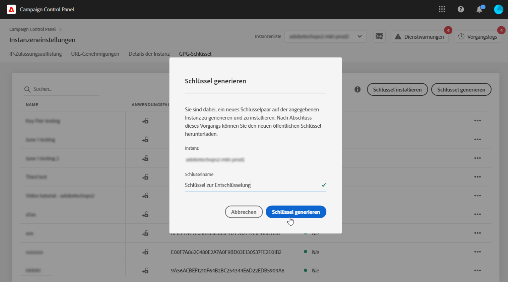
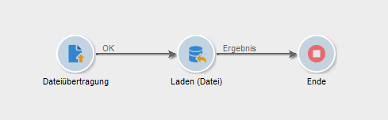
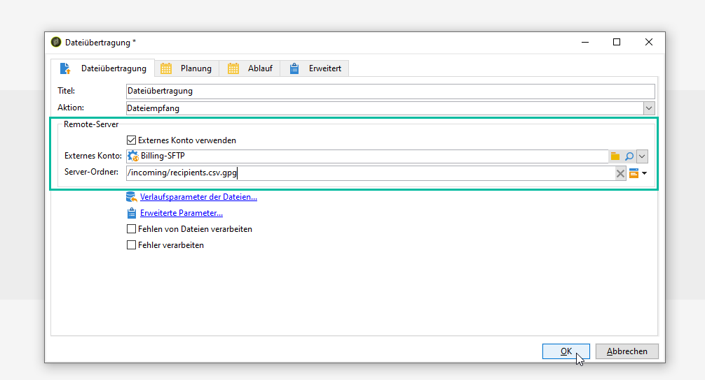
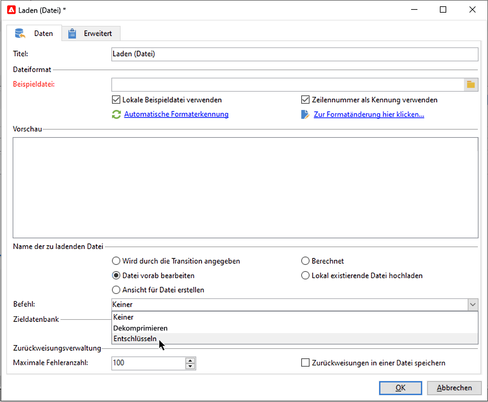
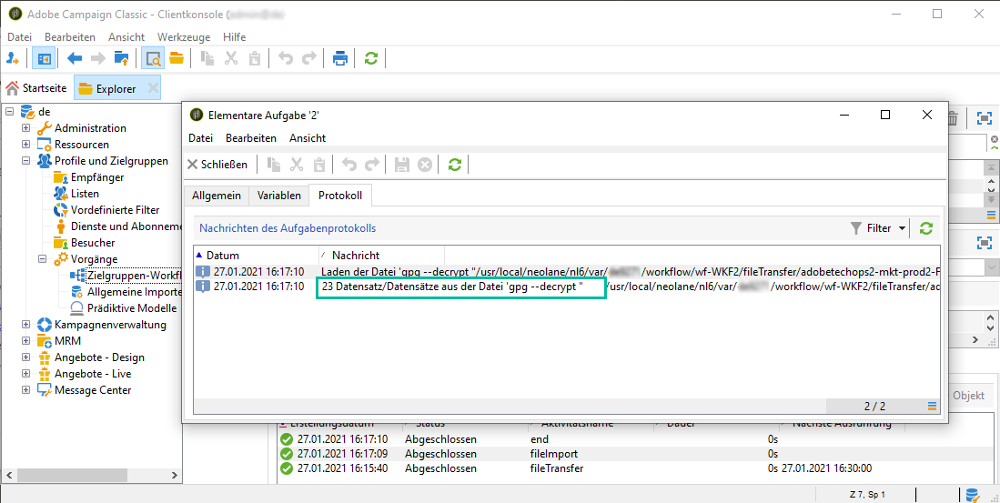

# Entzippen oder Entschlüsseln einer Datei {#unzipping-or-decrypting-a-file-before-processing}

Mit Adobe Campaign können Sie komprimierte oder verschlüsselte Dateien importieren. Damit sie in der Aktivität [Laden (Datei)](../../workflow/using/data-loading--file-.md) gelesen werden können, definieren Sie eine Vorab-Bearbeitung, um die Datei zu dekomprimieren oder zu entschlüsseln.

Gehen Sie dazu folgendermaßen vor:

1. Verwenden Sie das [Control Panel](https://docs.adobe.com/content/help/de-DE/control-panel/using/instances-settings/gpg-keys-management.html#decrypting-data), um ein Schlüsselpaar aus öffentlichem und privatem Schlüssel zu generieren.

   >[!NOTE]
   >
   >Das Control Panel steht allen auf AWS gehosteten Kunden zur Verfügung (mit Ausnahme von Kunden, die ihre Marketing-Instanzen auf einer lokalen Plattform hosten).

1. Wenn Ihre Installation von Adobe Campaign durch Adobe gehostet wird, wenden Sie sich an den [Adobe Kundendienst](https://helpx.adobe.com/de/enterprise/admin-guide.html/enterprise/using/support-for-experience-cloud.ug.html), um die erforderlichen Hilfsprogramme auf dem Server zu installieren.
1. Wenn Sie eine On-Premise-Installation von Adobe Campaign haben: Installieren Sie den gewünschten öffentlichen Dienst (z. B.: GPG, GZIP) sowie die nötigen Schlüssel (zur Verschlüsselung) auf dem Anwendungs-Server.

Anschließend können Sie die gewünschten Vorab-Bearbeitungsbefehle in Ihren Workflows nutzen:

1. Fügen Sie in Ihrem Workflow die Aktivität **[!UICONTROL Dateiübertragung]** hinzu und konfigurieren Sie sie.
1. Fügen Sie die Aktivität **[!UICONTROL Laden (Datei)]** hinzu und definieren Sie das Dateiformat.
1. Aktivieren Sie die Option **[!UICONTROL Vorab-Bearbeitung der Datei vorsehen]**.
1. Geben Sie den Vorab-Bearbeitungsbefehl an, den Sie anwenden möchten.
1. Fügen Sie andere Aktivitäten zur Handhabung der Daten in der Datei hinzu.
1. Speichern und starten Sie Ihren Workflow.

Im folgenden Anwendungsfall wird ein Beispiel dargestellt.

**Verwandte Themen:**

* [Aktivität &quot;Laden (Datei)&quot;](../../workflow/using/data-loading--file-.md).
* [Datei komprimieren oder verschlüsseln](../../workflow/using/how-to-use-workflow-data.md#zipping-or-encrypting-a-file).

## Anwendungsfall: Importieren von Daten, die mit einem vom Control Panel generierten Schlüssel verschlüsselt wurden {#use-case-gpg-decrypt}

In diesem Anwendungsfall erstellen wir einen Workflow, um Daten, die in einem externen System verschlüsselt wurden, mithilfe eines im Control Panel generierten Schlüssels zu importieren.

 [Funktion im Video kennenlernen](#video).

Die Schritte zum Ausführen dieses Anwendungsfalls lauten wie folgt:

1. Verwenden Sie das Control Panel, um ein Schlüsselpaar (öffentlich/privat) zu generieren. Ausführliche Anweisungen finden Sie in der [Control Panel-Dokumentation](https://docs.adobe.com/content/help/en/control-panel/using/instances-settings/gpg-keys-management.html#decrypting-data).

   * Der öffentliche Schlüssel wird mit dem externen System geteilt, das ihn zum Verschlüsseln der an Campaign zu sendenden Daten verwendet.
   * Der private Schlüssel wird von Campaign Classic verwendet, um die eingehenden verschlüsselten Daten zu entschlüsseln.

   

1. Verwenden Sie im externen System den vom Control Panel heruntergeladenen öffentlichen Schlüssel, um die Daten für den Import in Campaign Classic zu verschlüsseln.

1. Erstellen Sie einen Workflow in Campaign Classic, um die verschlüsselten Daten zu importieren und mithilfe des über das Control Panel installierten privaten Schlüssels zu entschlüsseln. Zu diesem Zweck wird folgender Workflow erstellt:

   

   * Aktivität **[!UICONTROL Dateiübertragung]**: Überträgt die Datei von einer externen Quelle an Campaign Classic. In diesem Beispiel soll die Datei von einem SFTP-Server übertragen werden.
   * Aktivität **[!UICONTROL Laden (Datei)]**: Lädt die Daten aus der Datei in die Datenbank und entschlüsselt sie mithilfe des im Control Panel generierten privaten Schlüssels.

1. Öffnen Sie die Aktivität **[!UICONTROL Dateiübertragung]** und geben Sie das externe Konto an, aus dem Sie die verschlüsselte GPG-Datei importieren möchten.

   

   Globale Konzepte zur Konfiguration der Aktivität finden Sie in [diesem Abschnitt](../../workflow/using/file-transfer.md).

1. Öffnen Sie die Aktivität **[!UICONTROL Laden (Datei)]** und konfigurieren Sie sie entsprechend Ihren Anforderungen. Globale Konzepte zur Konfiguration der Aktivität finden Sie in [diesem Abschnitt](../../workflow/using/data-loading--file-.md).

   Fügen Sie der Aktivität eine Vorab-Bearbeitungsetappe hinzu, um die eingehenden Daten zu entschlüsseln. Wählen Sie dazu die Option **[!UICONTROL Vorab-Bearbeitung der Datei vorsehen]** und kopieren Sie den folgenden Entschlüsselungsbefehl in das Feld **[!UICONTROL Befehl]**:

   `gpg --batch --passphrase passphrase --decrypt <%=vars.filename%>`

   

   >[!CAUTION]
   >
   >In diesem Beispiel verwenden wir die Passphrase, die das Control Panel standardmäßig nutzt, nämlich &quot;passphrase&quot;.
   >
   >Wenn per Anfrage an die Kundenunterstützung bereits in der Vergangenheit GPG-Schlüssel in Ihrer Instanz installiert wurden, hat sich die Passphrase möglicherweise geändert und unterscheidet sich von der standardmäßigen Passphrase.

1. Wählen Sie **[!UICONTROL OK]** aus, um die Konfiguration der Aktivität zu bestätigen.

1. Sie können den Workflow jetzt ausführen. Nach der Ausführung können Sie in den Workflow-Logs prüfen, ob die Entschlüsselung ausgeführt wurde und Daten aus der Datei importiert wurden.

   

## Anleitungsvideo {#video}

In diesem Video wird gezeigt, wie Daten mithilfe eines GPG-Schlüssels entschlüsselt werden.

>[!VIDEO](https://video.tv.adobe.com/v/36482?quality=12)

Weitere Anleitungsvideos zu Campaign Classic finden Sie [hier](https://experienceleague.adobe.com/docs/campaign-classic-learn/tutorials/overview.html?lang=de).
