# Daten aktualisieren{#updating-data}

Empfängerprofildaten können manuell oder automatisch aktualisiert werden.

## Automatische Aktualisierung einrichten {#setting-up-an-automatic-update}

Automatische Aktualisierungen lassen sich unter Verwendung von Workflows durchführen. Weiterführende Informationen dazu finden Sie in [diesem Abschnitt](../../workflow/using/update-data.md).

## Gebündeltes Update durchführen {#performing-a-mass-update}

Für eine manuelle Aktualisierung können Sie entweder das Kontextmenü **[!UICONTROL Aktionen]** verwenden (klicken Sie mit der rechten Maustaste auf den oder die ausgewählten Empfänger) oder auf das **[!UICONTROL Aktionen]**-Symbol oben rechts klicken.

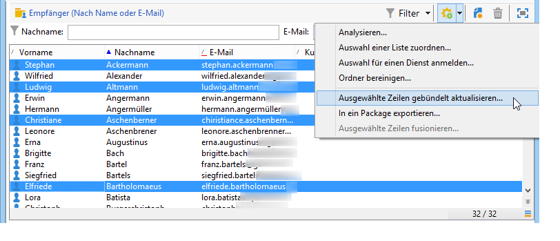

Sie haben die Wahl zwischen einer gebündelten Aktualisierung der ausgewählten Empfänger oder einer Fusion der Datensätze. Ein Assistent ermöglicht es Ihnen jeweils, das Update zu konfigurieren.

### Gebündelte Aktualisierung {#mass-update}

Für eine gebündelte Aktualisierung wählen Sie die Option **[!UICONTROL Aktionen > Ausgewählte Zeilen gebündelt aktualisieren...]**. Ein Assistent ermöglicht es Ihnen, das Update zu konfigurieren und zu starten.

Im ersten Schritt des Assistenten sind die zu aktualisierenden Felder anzugeben.

In der linken Spalte des Assistenten befindet sich die Liste der verfügbaren Felder. Mithilfe des **[!UICONTROL Suchen]**-Feldes haben Sie die Möglichkeit, die Auswahl einzuschränken. Mit der **Enter**-Taste können Sie die Liste durchsuchen. Die Ihrem Suchkriterium entsprechenden Felder erscheinen fettgedruckt wie in unten stehendem Beispiel.

Durch Doppelklick werden die zu aktualisierenden Felder in der rechten Spalte des Assistenten angezeigt.

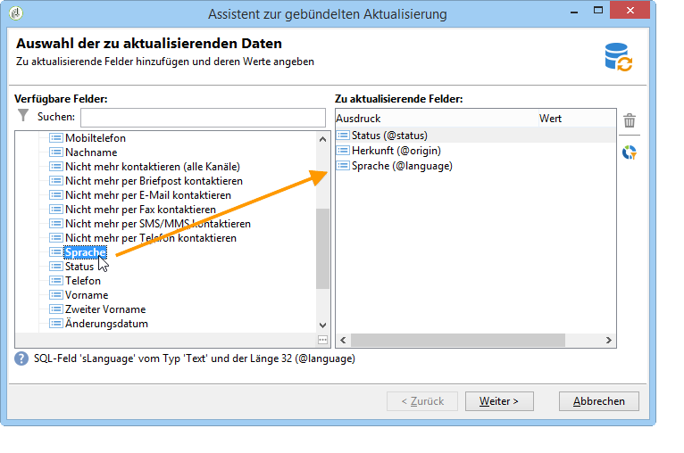

Ein versehentlich ausgewähltes Feld kann durch Klick auf die Schaltfläche **[!UICONTROL Löschen]** wieder aus der Liste der zu aktualisierenden Felder entfernt werden.

Wählen Sie nun die auf die zu aktualisierenden Profile anzuwendenden Werte aus oder geben Sie sie ein.

Wenn Sie auf die Schaltfläche **[!UICONTROL Werteverteilung]** klicken, wird angezeigt, wie sich die im ausgewählten Feld enthaltenen Werte auf die im aktuellen Ordner befindlichen Empfänger (und nicht nur in Bezug auf die zu aktualisierenden Empfänger) verteilen.

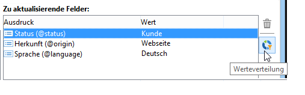

Sie haben die Möglichkeit, die Werteverteilung zu filtern oder den zugrunde liegenden Ordner zu ändern. Diese Aktionen dienen jedoch nur konsultativen Zwecken, die Konfiguration des Updates ist davon nicht betroffen.

Schließen Sie das Fenster und klicken Sie auf die Schaltfläche **[!UICONTROL Weiter]**, um zum zweiten Schritt des Aktualisierungsassistenten überzugehen. Klicken Sie nun zur Ausführung des Updates auf die Schaltfläche **[!UICONTROL Starten]**.

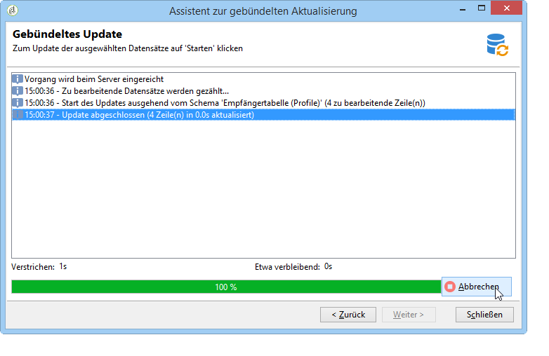

In der oberen Hälfte des Assistenten werden Informationen bezüglich der Durchführung des Updates angezeigt.

Durch Klick auf die Schaltfläche **[!UICONTROL Abbrechen]** kann die Aktualisierung gestoppt werden. Es ist jedoch möglich, dass einzelne Datensätze bereits verarbeitet wurden, diese Aktualisierungen werden durch den Abbruch nicht rückgängig gemacht.

### Daten fusionieren {#merge-data}

Die Option **[!UICONTROL Ausgewählte Zeilen fusionieren...]** ermöglicht die Fusion von zwei zuvor ausgewählten Empfängerprofilen. Ein Assistent ermöglicht es Ihnen, die Zusammenführung zu konfigurieren und zu starten.

Der Assistent listet die Werte aller in mindestens einem der Quelldatensätze ausgefüllten Felder. Bei unterschiedlichen Werten in den jeweiligen Quellen werden diese im Abschnitt **[!UICONTROL Konfliktliste]** angezeigt. Geben Sie unter Verwendung der unter der Liste zur Verfügung stehenden Radiobuttons das Quellprofil an, dessen Werte im Konfliktfall übernommen werden sollen.

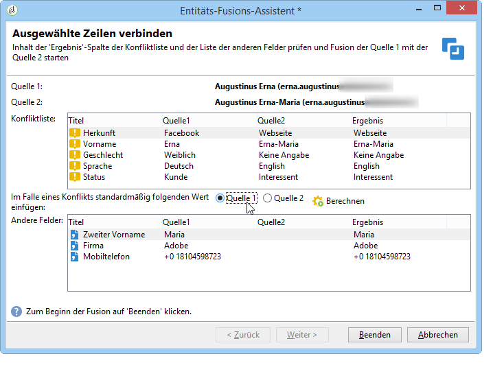

Durch Klick auf die Schaltfläche **[!UICONTROL Berechnen]** wird das Ihrer Wahl entsprechende Ergebnis angezeigt.

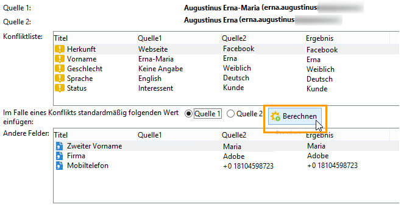

Prüfen Sie die **[!UICONTROL Ergebnis]**-Spalte im oberen und unteren Abschnitt des Fensters und klicken Sie auf die Schaltfläche **[!UICONTROL Beenden]**, um die Zusammenführung zu starten.

## Export von Daten {#exporting-data}

Der Inhalt einer Liste kann exportiert werden. Um den Export zu konfigurieren und zu starten, gehen Sie folgendermaßen vor:

1. Markieren Sie die zu exportierenden Datensätze.
1. Wählen Sie sie mit der rechten Maustaste aus und verwenden Sie danach **[!UICONTROL Exportieren...]**.

   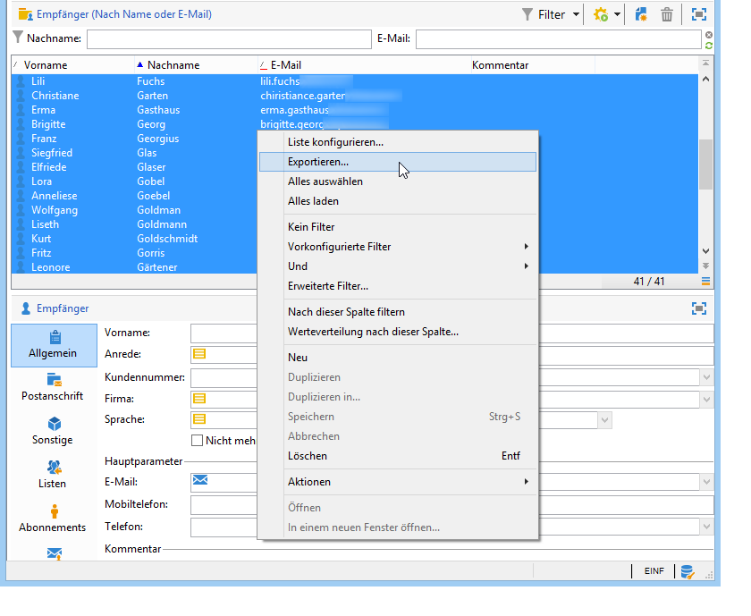

1. Wählen Sie anschließend die zu extrahierenden Daten aus. Die in der Liste angezeigten Spalten werden dabei automatisch zu den Ausgabespalten hinzugefügt.

   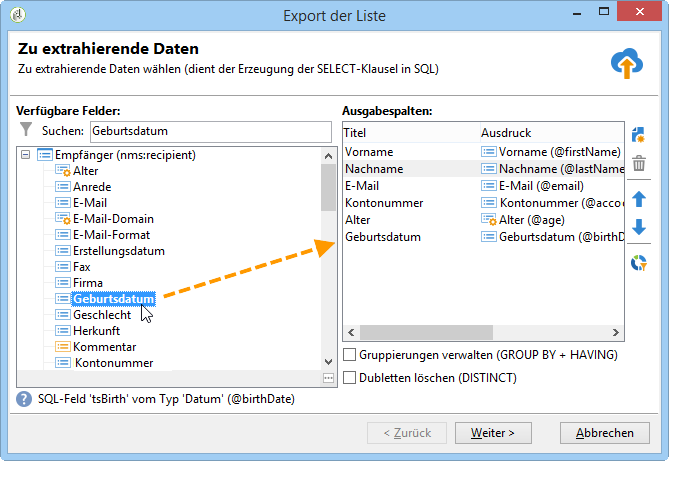

   Informationen zur Konfiguration des Export-Assistenten finden Sie im Abschnitt [Export-Assistent](../../platform/using/exporting-data.md#export-wizard).

## Anmeldung für einen Dienst {#subscribing-to-a-service}

Normalerweise melden sich Empfänger über eine spezielle Landingpage für einen Newsletter an, wie in [diesem Abschnitt](../../delivery/using/managing-subscriptions.md) beschrieben. Empfängerprofile können aber auch manuell für einen Dienst (z. B. Newsletter oder viraler Dienst) angemeldet werden. Gehen Sie dazu folgendermaßen vor:

1. Markieren Sie die gewünschten Empfänger und wählen Sie sie mit der rechten Maustaste aus.
1. Wählen Sie **[!UICONTROL Aktionen > Auswahl für einen Dienst anmelden...]**.

   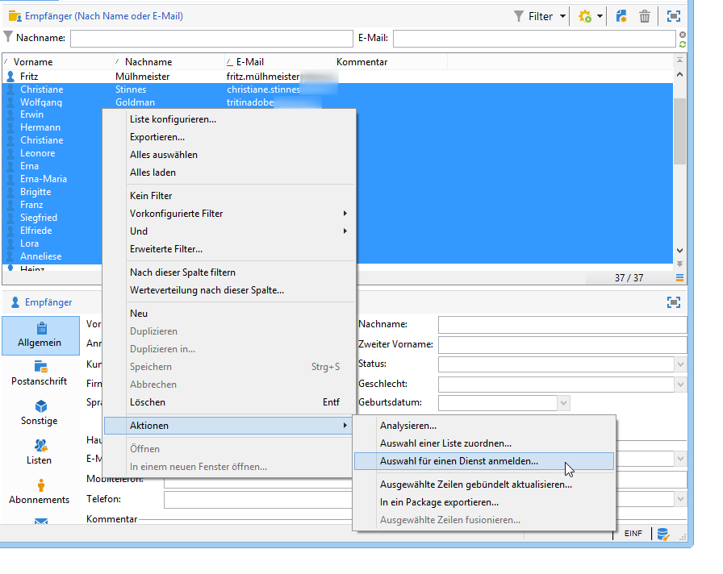

1. Wählen Sie den entsprechenden Dienst und danach **[!UICONTROL Weiter]** aus:

   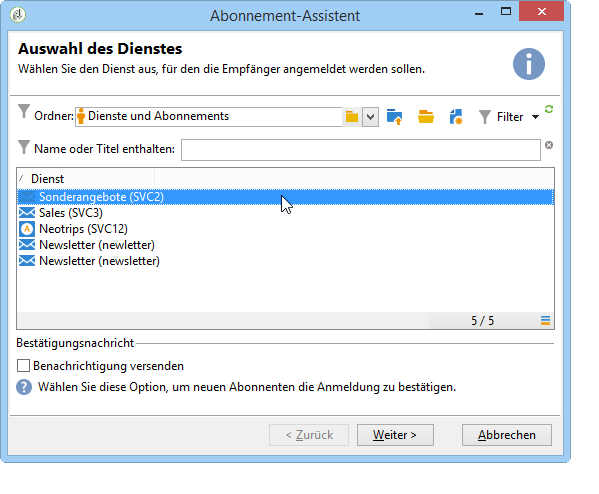

   >[!NOTE]
   >
   >Der Assistent erlaubt auch die Erstellung eines neuen Dienstes. Klicken Sie hierzu auf die Schaltfläche **[!UICONTROL Erstellen]**.

1. Es besteht die Möglichkeit, den Empfängern durch Ankreuzen der Option **[!UICONTROL Benachrichtigung versenden]** die Anmeldung zu bestätigen. Der Inhalt dieser Nachricht wird im dem Dienst zugeordneten Anmeldeszenario konfiguriert.
1. Klicken Sie nun zur Ausführung des Vorgangs auf die Schaltfläche **[!UICONTROL Starten]**.

   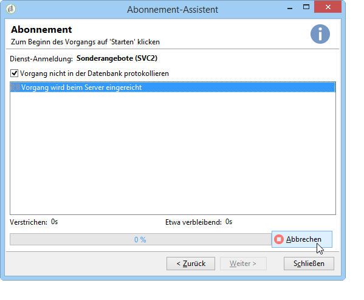

In der oberen Hälfte des Assistenten werden Informationen bezüglich der Ausführung angezeigt. Durch Klick auf die Schaltfläche **[!UICONTROL Abbrechen]** kann der Vorgang gestoppt werden. Bereits verarbeitete Empfänger werden jedoch trotzdem für den entsprechenden Dienst angemeldet.

Wenn Sie die Option **[!UICONTROL Vorgang nicht in der Datenbank protokollieren]** abwählen, ist die Auswahl oder Erstellung eines Ausführungsordners erforderlich, in dem die den Vorgang betreffenden Protokollnachrichten gespeichert werden.

Im Tab **[!UICONTROL Abonnements]******, zugänglich über die vom Vorgang betroffenen Empfängerprofile oder den Verzeichnisknoten **[!UICONTROL Profile und Zielgruppen > Dienste und Abonnements]** kann das Ergebnis der Anmeldung geprüft werden.

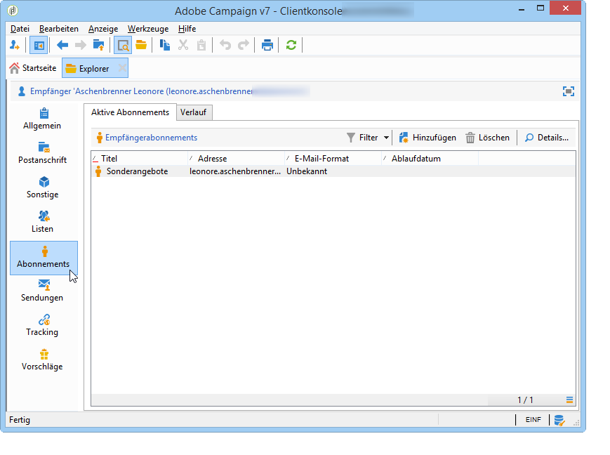

>[!NOTE]
>
>Näheres zur Konfiguration der Informationsdienste wird auf [dieser Seite](../../delivery/using/managing-subscriptions.md) erläutert.

