# Daten-Update{#updating-data}

>[!NOTE]
>
>Diese Seite betrifft nur Benutzende, die mit nativer Authentifizierung eine Verbindung zu Campaign herstellen.

Empfängerprofildaten können manuell oder automatisch aktualisiert werden.

## Automatische Aktualisierung einrichten {#setting-up-an-automatic-update}

Automatische Aktualisierungen lassen sich unter Verwendung von Workflows durchführen. Weiterführende Informationen finden Sie in der [Dokumentation zu Campaign v8](https://experienceleague.adobe.com/docs/campaign/automation/workflows/wf-activities/targeting-activities/update-data.html?lang=de){target="_blank"}.

## Gebündeltes Update durchführen {#performing-a-mass-update}

Um manuelle Aktualisierungen durchzuführen, klicken Sie mit der rechten Maustaste auf den oder die ausgewählten Empfängerinnen und Empfänger, um das Kontextmenü **[!UICONTROL Aktionen]** zu verwenden, oder verwenden Sie das Symbol **[!UICONTROL Aktionen]**.

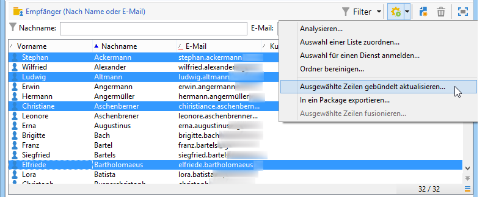

Sie haben die Wahl zwischen einer gebündelten Aktualisierung der ausgewählten Empfänger oder einer Fusion der Datensätze. Ein Assistent ermöglicht es Ihnen jeweils, das Update zu konfigurieren.

### Gebündelte Aktualisierung {#mass-update}

Für eine gebündelte Aktualisierung wählen Sie die Option **[!UICONTROL Aktion > Ausgewählte Zeilen gebündelt aktualisieren…]**. Der Assistent unterstützt Sie beim Konfigurieren und Ausführen der Aktualisierung.

Im ersten Schritt des Assistenten sind die zu aktualisierenden Felder anzugeben.

Im linken Abschnitt des Assistenten wird die Liste der verfügbaren Felder angezeigt. Mithilfe des **[!UICONTROL Suchen]**-Feldes haben Sie die Möglichkeit, die Auswahl einzuschränken. Mit der **Enter**-Taste können Sie die Liste durchsuchen. Die Ihrem Suchkriterium entsprechenden Felder erscheinen fettgedruckt wie in unten stehendem Beispiel.

Durch Doppelklick werden die zu aktualisierenden Felder im rechten Abschnitt des Assistenten angezeigt.

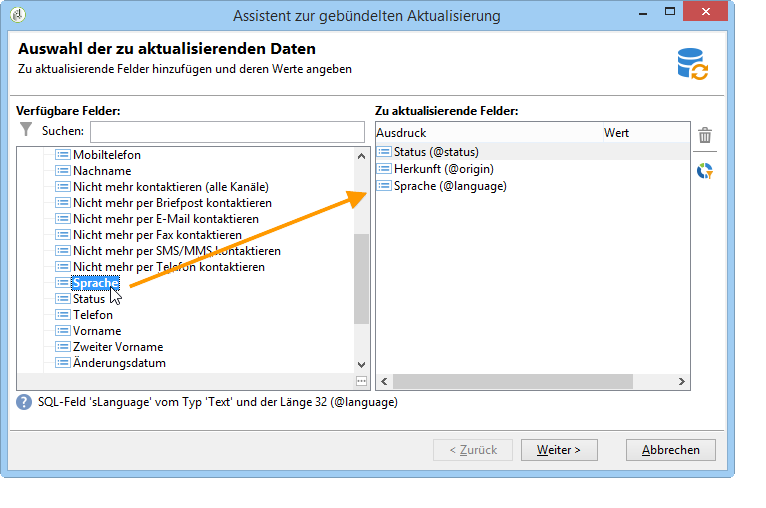

Ein versehentlich ausgewähltes Feld kann durch Klick auf die Schaltfläche **[!UICONTROL Löschen]** wieder aus der Liste der zu aktualisierenden Felder entfernt werden.

Wählen Sie nun die auf die zu aktualisierenden Profile anzuwendenden Werte aus oder geben Sie sie ein.

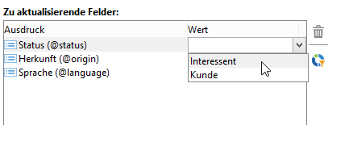

Wenn Sie auf die Schaltfläche **[!UICONTROL Werteverteilung]** klicken, wird angezeigt, wie sich die im ausgewählten Feld enthaltenen Werte auf die im aktuellen Ordner befindlichen Empfänger (und nicht nur in Bezug auf die zu aktualisierenden Empfänger) verteilen.

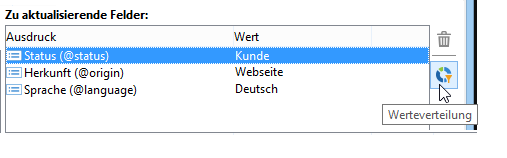

Sie können Filter definieren, um die Werteverteilung in diesem Fenster anzuzeigen, oder den aktuellen Ordner anpassen, um die Werteverteilung in einem anderen Ordner anzuzeigen. Dies sind schreibgeschützte Aktionen, die sich nicht auf die Konfiguration der definierten Aktualisierung auswirken.

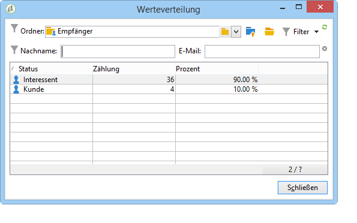

Schließen Sie das Fenster und klicken Sie auf die Schaltfläche **[!UICONTROL Weiter]**, um zum zweiten Schritt des Aktualisierungsassistenten überzugehen. Klicken Sie nun zur Ausführung des Updates auf die Schaltfläche **[!UICONTROL Starten]**.

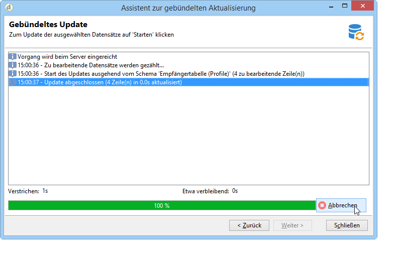

In der oberen Hälfte des Assistenten werden Informationen zur Durchführung des Updates angezeigt.

Mit der Schaltfläche **[!UICONTROL Stoppen]** können Sie die Aktualisierung abbrechen. Es ist jedoch möglich, dass einzelne Einträge bereits verarbeitet wurden, und diese Aktualisierungen werden durch den Abbruch nicht rückgängig gemacht. Die Fortschrittsleiste zeigt an, wie weit der Vorgang fortgeschritten ist.

### Daten zusammenführen {#merge-data}

Wählen Sie **[!UICONTROL Ausgewählte Zeilen zusammenführen…]** aus, um zwei zuvor ausgewählte Empfängerprofile zusammenzuführen. Die Profile, die zusammengeführt werden sollen, müssen vor Auswahl dieser Option ausgewählt werden. Ein Assistent ermöglicht es Ihnen, die Zusammenführung zu konfigurieren und zu starten.

Der Assistent zeigt die Werte an, die für jedes in einem oder mehreren Quellprofilen ausgefüllte Feld abgerufen werden sollen. Bei unterschiedlichen Werten in den jeweiligen Quellen werden diese im Abschnitt **[!UICONTROL Konfliktliste]** angezeigt. Sie können dann das Standardprofil mithilfe der Optionsfelder unter der Liste auswählen, wie im folgenden Beispiel gezeigt:

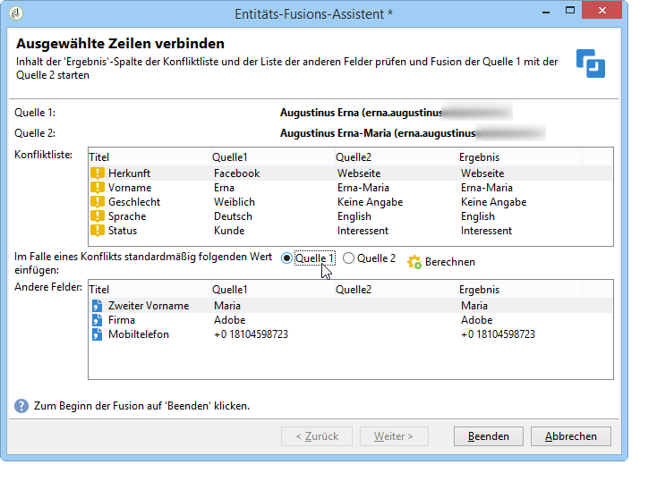

Durch Klick auf die Schaltfläche **[!UICONTROL Berechnen]** wird das Ihrer Wahl entsprechende Ergebnis angezeigt.

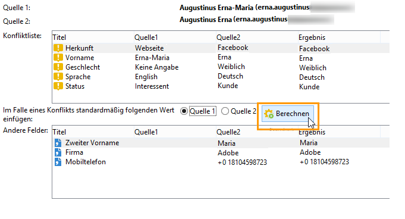

Prüfen Sie die **[!UICONTROL Ergebnis]**-Spalte im oberen und unteren Abschnitt des Fensters und klicken Sie auf die Schaltfläche **[!UICONTROL Beenden]**, um die Zusammenführung zu starten.

## Daten exportieren {#exporting-data}

Der Inhalt einer Liste kann exportiert werden. So konfigurieren Sie den Export und führen ihn aus:

1. Markieren Sie die zu exportierenden Datensätze.
1. Wählen Sie sie mit der rechten Maustaste aus und verwenden Sie danach **[!UICONTROL Exportieren...]**.

   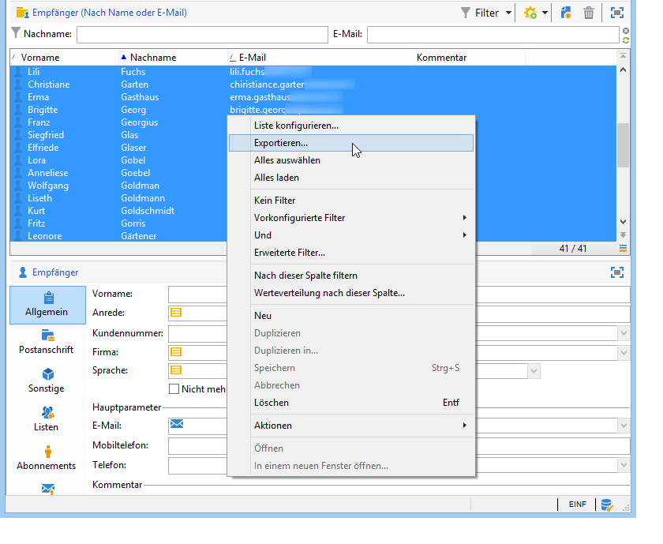

1. Wählen Sie dann die zu extrahierenden Daten aus. Standardmäßig werden den Ausgabespalten alle angezeigten Spalten hinzugefügt.

   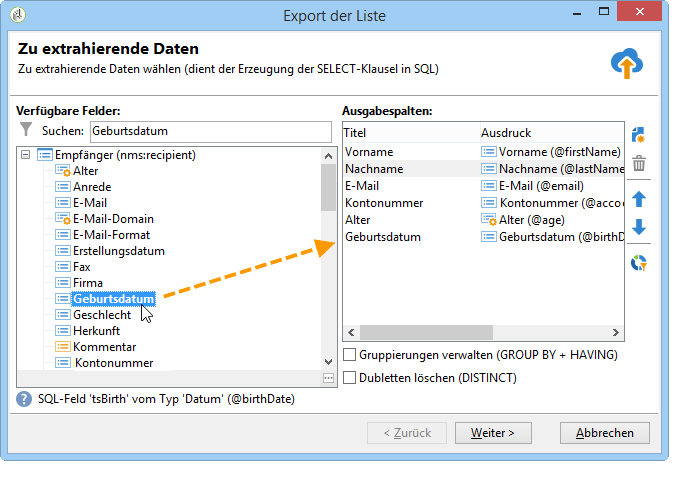

   Weitere Informationen zur Konfiguration des Exportassistenten finden Sie [in diesem Abschnitt](../../platform/using/executing-export-jobs.md).

## Für einen Service anmelden {#subscribing-to-a-service}

Normalerweise melden sich Empfangende über eine spezielle Landingpage für einen Newsletter an, wie [in diesem Abschnitt](../../delivery/using/managing-subscriptions.md) beschrieben. Für die Profile von gefilterten Empfängerinnen und Empfänger kann jedoch manuell ein Dienst (Newsletter oder viraler Dienst) abonniert werden. Gehen Sie dazu wie folgt vor:

1. Markieren Sie die gewünschten Empfänger und wählen Sie sie mit der rechten Maustaste aus.
1. Wählen Sie **[!UICONTROL Aktionen > Auswahl für einen Dienst anmelden...]**.

   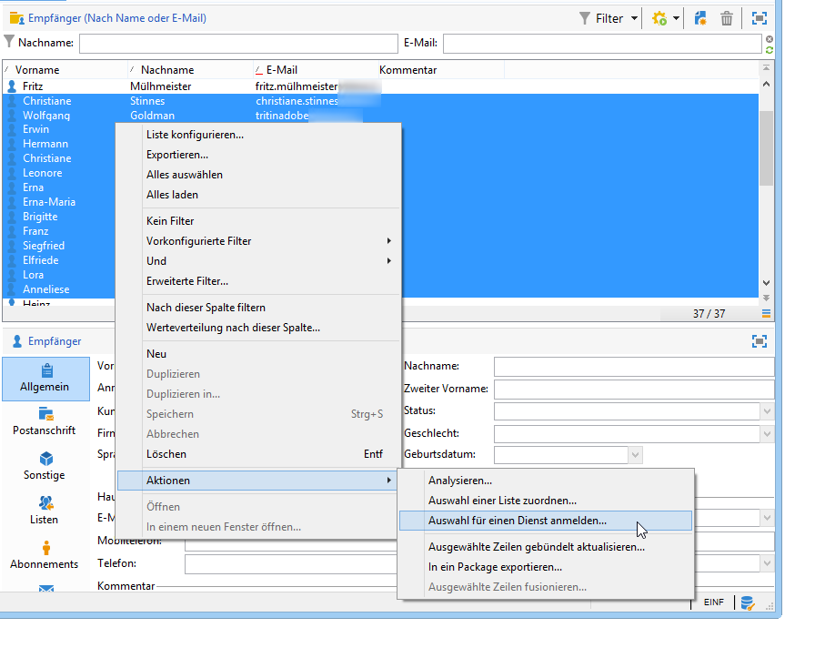

1. Wählen Sie den entsprechenden Dienst und danach **[!UICONTROL Weiter]** aus:

   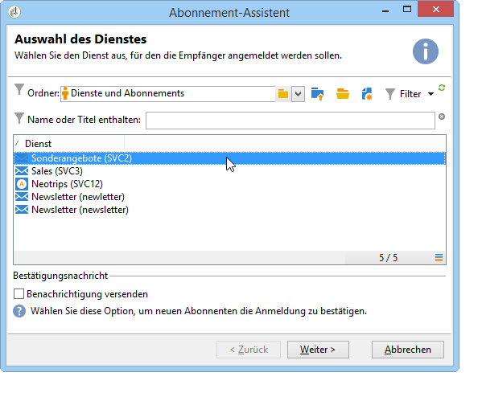

   >[!NOTE]
   >
   >Der Assistent erlaubt auch die Erstellung eines neuen Dienstes. Klicken Sie hierzu auf die Schaltfläche **[!UICONTROL Erstellen]**.

1. Sie können für Empfängerinnen und Empfänger **[!UICONTROL Benachrichtigung versenden]** auswählen. Der Inhalt dieser Nachricht wird im dem Dienst zugeordneten Anmeldeszenario konfiguriert.
1. Klicken Sie nun zur Ausführung des Vorgangs auf die Schaltfläche **[!UICONTROL Starten]**.

   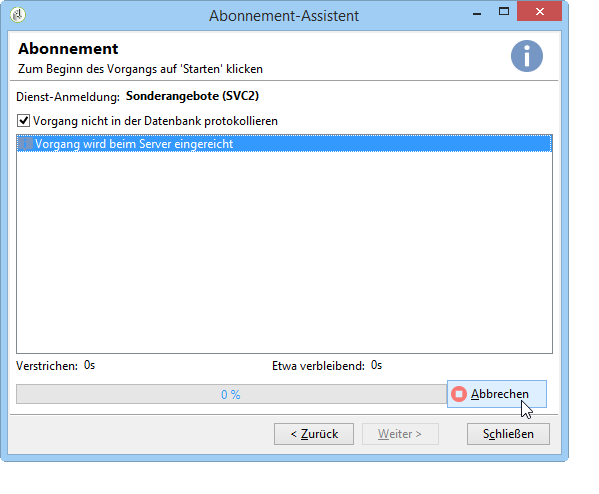

In der oberen Hälfte des Assistenten werden Informationen bezüglich der Ausführung angezeigt. Mit der Schaltfläche **[!UICONTROL Anhalten]** können Sie den Vorgang stoppen. Bereits verarbeitete Empfänger werden jedoch trotzdem für den entsprechenden Dienst angemeldet.

Wenn Sie die Option **[!UICONTROL Auftrag nicht in der Datenbank protokollieren]** abwählen, ist die Auswahl oder Erstellung eines Ausführungsordners erforderlich, in dem die den Auftrag betreffenden Protokollnachrichten gespeichert werden.

Im Tab **[!UICONTROL Abonnements]******, zugänglich über die vom Vorgang betroffenen Empfängerprofile oder den Verzeichnisknoten **[!UICONTROL Profile und Zielgruppen > Dienste und Abonnements]** kann das Ergebnis der Anmeldung geprüft werden.

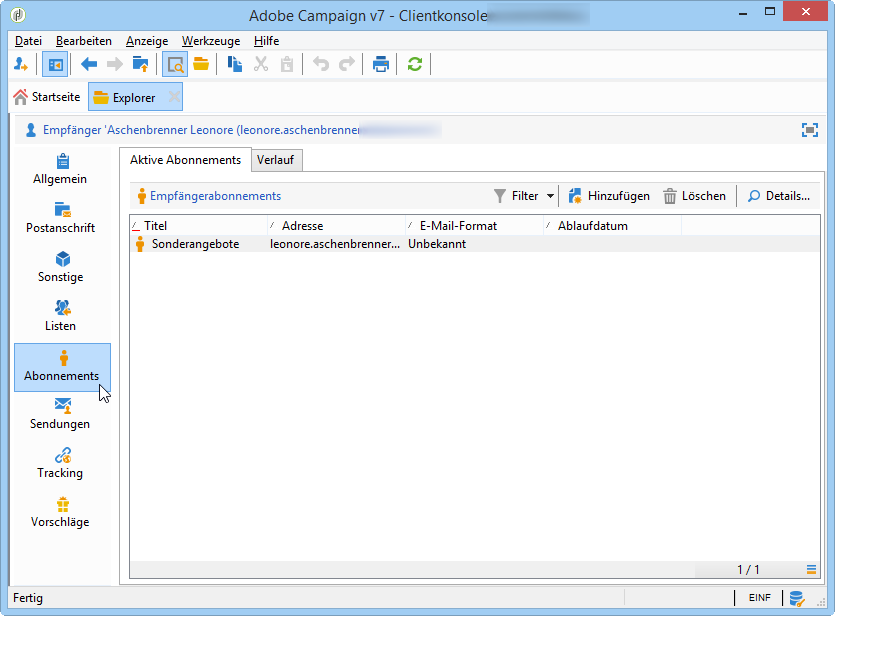

>[!NOTE]
>
>Näheres zur Konfiguration der Informationsdienste wird auf [dieser Seite](../../delivery/using/managing-subscriptions.md) erläutert.
