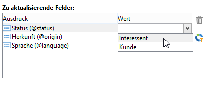
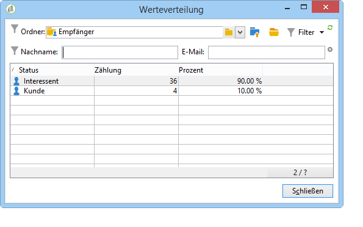

# Daten aktualisieren{#updating-data}

Empfängerprofildaten können manuell oder automatisch aktualisiert werden.

## Automatische Aktualisierung einrichten {#setting-up-an-automatic-update}

Automatische Aktualisierungen lassen sich unter Verwendung von Workflows durchführen. Weiterführende Informationen dazu finden Sie in [diesem Abschnitt](../../workflow/using/update-data.md).

## Gebündeltes Update durchführen {#performing-a-mass-update}

To perform manual updates, right-click the selected recipient(s) to use the **[!UICONTROL Actions]** shortcut menu, or use the **[!UICONTROL Actions]** icon.

Sie haben die Wahl zwischen einer gebündelten Aktualisierung der ausgewählten Empfänger oder einer Fusion der Datensätze. Ein Assistent ermöglicht es Ihnen jeweils, das Update zu konfigurieren.

### Gebündelte Aktualisierung {#mass-update}

Für Massenaktualisierung verwenden **[!UICONTROL Action > Mass update of selected lines...]**. Der Assistent unterstützt Sie beim Konfigurieren und Ausführen des Updates.

Im ersten Schritt des Assistenten sind die zu aktualisierenden Felder anzugeben.

Im linken Bereich des Assistenten wird die Liste der verfügbaren Felder angezeigt. Verwenden Sie das **[!UICONTROL Find]** Feld, um eine Suche nach diesen Feldern durchzuführen. Drücken Sie die **Eingabetaste** , um die Liste zu durchsuchen. Die mit Ihrem Eintrag übereinstimmenden Feldnamen werden wie unten dargestellt fett dargestellt.

Durch Doppelklick werden die zu aktualisierenden Felder in der rechten Spalte des Assistenten angezeigt.

In the event of an error, use the **[!UICONTROL Delete]** button to delete a field from the list of fields to be updated.

Wählen Sie nun die auf die zu aktualisierenden Profile anzuwendenden Werte aus oder geben Sie sie ein.

You can click **[!UICONTROL Distribution of values]** to display the distribution of values of the selected field for the recipients present in the current folder (not only the recipients affected by the update).

Sie haben die Möglichkeit, die Werteverteilung zu filtern oder den zugrunde liegenden Ordner zu ändern. Diese Aktionen dienen jedoch nur konsultativen Zwecken, die Konfiguration des Updates ist davon nicht betroffen.

Schließen Sie dieses Fenster und klicken Sie auf **[!UICONTROL Next]** , um den zweiten Schritt des Aktualisierungsassistenten anzuzeigen. In diesem Schritt können Sie die Aktualisierung starten, indem Sie auf **[!UICONTROL Start]**.

In der oberen Hälfte des Assistenten werden Informationen bezüglich der Durchführung des Updates angezeigt.

Mit dem **[!UICONTROL Stop]** können Sie die Aktualisierung abbrechen, aber bestimmte Datensätze wurden möglicherweise aktualisiert, und das Beenden des Prozesses wird diese Aktualisierungen nicht abbrechen. Die Fortschrittsleiste zeigt an, wie weit der Vorgang fortgeschritten ist.

### Daten fusionieren {#merge-data}

Wählen Sie diese Option, **[!UICONTROL Merge selected lines...]** um das Zusammenführen zweier Empfängerprofile zu starten. Die zusammenzuführenden Profile müssen vor Auswahl der Option ausgewählt werden. Die Zusammenführung wird mithilfe eines Assistenten konfiguriert und gestartet.

Der Assistent zeigt die Werte an, die für jedes Feld abgerufen werden sollen, das in einem oder anderen Quellprofil ausgefüllt wurde. Wenn eines oder mehrere Felder in den zusammenzuführenden Profilen unterschiedliche Werte aufweisen, werden sie im **[!UICONTROL List of conflicts]** Abschnitt angezeigt. Sie können dann das Standardprofil mit den Optionsfeldern unter der Liste auswählen, wie im folgenden Beispiel:

Click **[!UICONTROL Compute]** to display the result of your choice.

Check the **[!UICONTROL Result]** columns of both sections of the window, and click **[!UICONTROL Finish]** to run the merge.

## Export von Daten {#exporting-data}

Der Inhalt einer Liste kann exportiert werden. Um den Export zu konfigurieren und zu starten, gehen Sie folgendermaßen vor:

1. Markieren Sie die zu exportierenden Datensätze.
1. Right-click and select **[!UICONTROL Export...]**.

   

1. Wählen Sie anschließend die zu extrahierenden Daten aus. Die in der Liste angezeigten Spalten werden dabei automatisch zu den Ausgabespalten hinzugefügt.

   

   For more on how to configure the export wizard, refer to [Export wizard](../../platform/using/exporting-data.md#export-wizard).

## Anmeldung für einen Dienst {#subscribing-to-a-service}

Normalerweise melden sich Empfänger über eine spezielle Landingpage für einen Newsletter an, wie in [diesem Abschnitt](../../delivery/using/managing-subscriptions.md) beschrieben. Empfängerprofile können aber auch manuell für einen Dienst (z. B. Newsletter oder viraler Dienst) angemeldet werden. Gehen Sie dazu folgendermaßen vor:

1. Markieren Sie die gewünschten Empfänger und wählen Sie sie mit der rechten Maustaste aus.
1. Auswählen **[!UICONTROL Actions > Subscribe selection to a service]**.

   

1. Select the desired service and click **[!UICONTROL Next]**:

   

   >[!NOTE]
   >
   >This editor lets you create a new service: click the **[!UICONTROL Create]** button.

1. Sie können **[!UICONTROL Send a confirmation message]** zu den Empfängern gelangen. Der Inhalt dieser Nachricht kann im Abonnementszenario konfiguriert werden, das mit dem ausgewählten Dienst verknüpft ist.
1. Click the **[!UICONTROL Start]** button to run the subscription process.

   

Im oberen Bereich des Fensters können Sie den Ausführungsprozess überwachen. Mit der **[!UICONTROL Stop]** Schaltfläche können Sie den Prozess beenden. Die bereits verarbeiteten Empfänger werden jedoch abonniert.

Wenn Sie die **[!UICONTROL Do not keep a trace of this job in the database]** Option deaktivieren, können Sie den Ausführungsordner auswählen (oder erstellen), in dem die Informationen zu diesem Prozess gespeichert werden.

To check on the process, go to the **[!UICONTROL Subscriptions]** tab on the profiles of the recipients concerned by this operation, or to the **[!UICONTROL Subscriptions]** tab accessed via the **[!UICONTROL Profiles and Targets > Services and Subscriptions]** node.

>[!NOTE]
>
>Näheres zur Konfiguration der Informationsdienste wird auf [dieser Seite](../../delivery/using/managing-subscriptions.md) erläutert.

