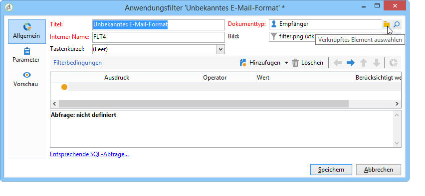
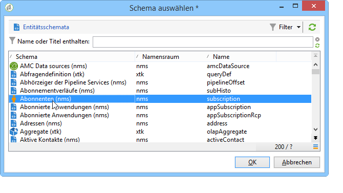
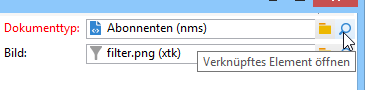
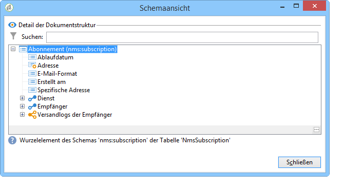
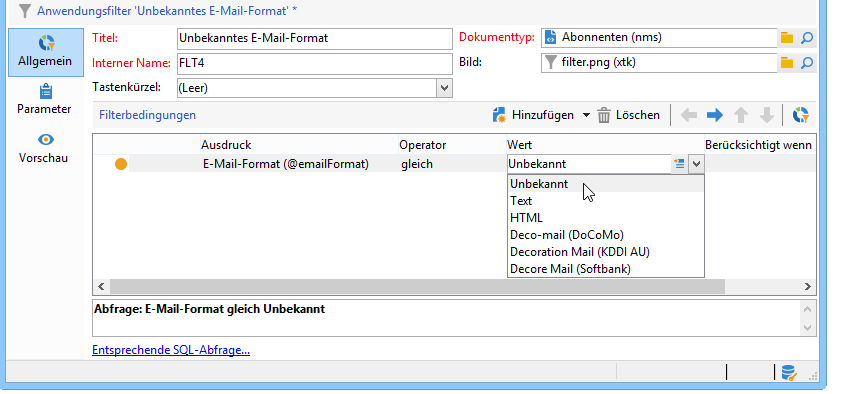
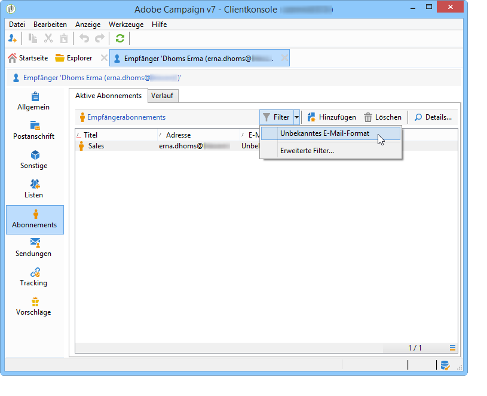
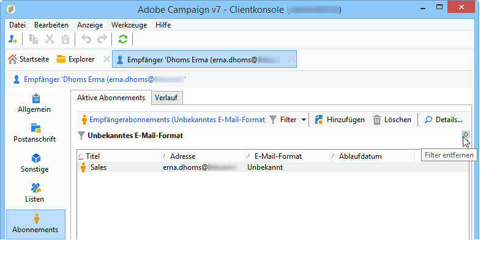

# Anwendungsbeispiel{#use-case}

## Erstellung eines auf das E-Mail-Format bezogenen Filters {#creating-a-filter-on-the-email-format-of-subscribers}

In diesem Anwendungsbeispiel wird die Erstellung eines Filters beschrieben, der Newsletter-Abonnements entsprechend des von den Empfängern angegebenen E-Mail-Formats filtert.

Dazu müssen wir einen vordefinierten Filter verwenden: Diese Filter sind mit einem Dokumenttyp verknüpft und werden über den **[!UICONTROL Administration > Configuration > Predefined filters]** Knoten aufgerufen. Diese Datenfilter können für jeden Typ von Editor (oder Dokument) in der Anwendung verwendet werden.

Datenfilter werden wie vordefinierte Filter erstellt. Ein zusätzliches Feld ermöglicht es jedoch, den Dokumenttyp auszuwählen, für den der Filter angewendet werden soll.

Gehen Sie wie folgt vor:

1. Erstellen Sie einen neuen Filter über den **[!UICONTROL Administration > Configuration > Predefined filters]** Knoten.
1. Click the **[!UICONTROL Select link]** icon to select the concerned document:

   

1. Wählen Sie das Schema Abonnements (nms:subscription) aus und klicken Sie auf **[!UICONTROL OK]**

   

1. Click **[!UICONTROL Edit link]** to view the fields of the selected document.

   

   Sie können nun den Inhalt des gewählten Dokuments einsehen:

   

   Sie können auf diese Felder zugreifen, um Filterbedingungen im Hauptteil des Filter-Editors zu definieren. Ein Anwendungsfilter wird genau wie ein erweiterter Filter definiert. See [Creating an advanced filter](../../platform/using/creating-filters.md#creating-an-advanced-filter).

1. Erstellen Sie einen neuen Abonnementfilter, um nur solche Abonnements anzuzeigen, für die kein E-Mail-Format bestimmt wurde:

   

1. Click **[!UICONTROL Save]** to add a filter to the pre-defined filters for this type of list.
1. You can now use this filter in the **[!UICONTROL Subscriptions]** tab of the recipient profile; you can access the &quot;Unknown e-mail format&quot; filter by clicking the **[!UICONTROL Filters]** button.

   

   Der Name des aktuellen Filters wird über der Liste angezeigt. Um den Filter abzubrechen, klicken Sie auf das **[!UICONTROL Delete this filter]** Symbol.

   

