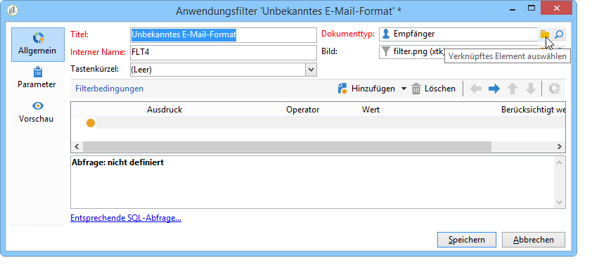
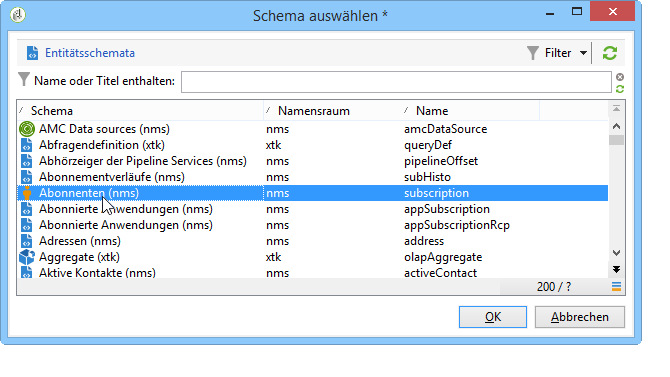
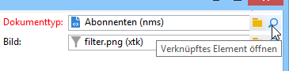
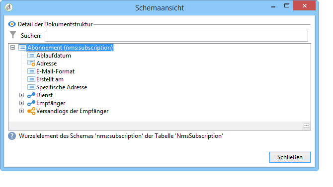
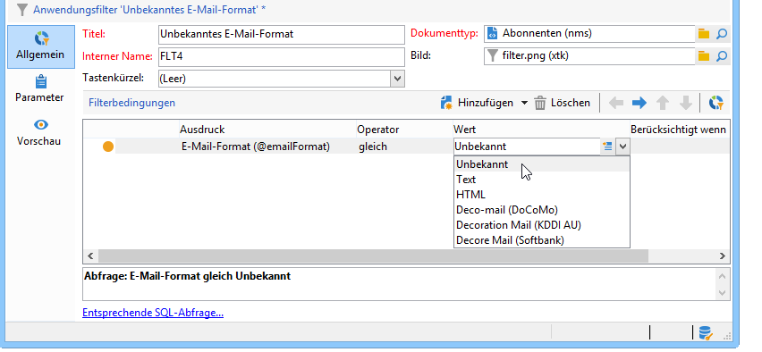
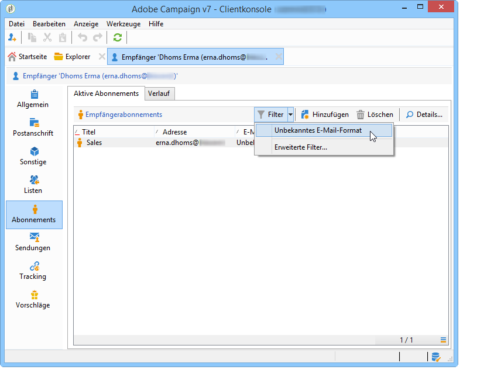
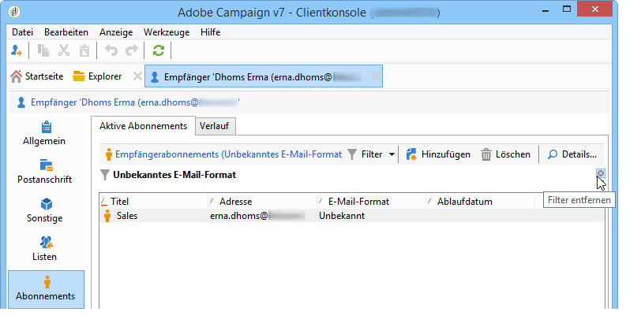

# Anwendungsbeispiel{#use-case}

## Filter für das E-Mail-Format von Abonnenten erstellen {#creating-a-filter-on-the-email-format-of-subscribers}

In diesem Anwendungsbeispiel wird die Erstellung eines Filters beschrieben, der Newsletter-Abonnements entsprechend des von den Empfängern angegebenen E-Mail-Formats filtert.

Dazu müssen wir einen vordefinierten Filter verwenden: Diese Filter sind mit einem Dokumenttyp verknüpft und sind über den Knoten **[!UICONTROL Administration > Konfiguration > Vordefinierte Filter]** zugänglich. Diese Datenfilter können für jeden Editor- (oder Dokument-)Typ in der Anwendung verwendet werden.

Datenfilter werden wie vordefinierte Filter erstellt. Ein zusätzliches Feld ermöglicht es jedoch, den Dokumenttyp auszuwählen, für den der Filter angewendet werden soll.

Gehen Sie wie folgt vor:

1. Erstellen Sie einen neuen Filter ausgehend vom Verzeichnisknoten **[!UICONTROL Administration > Konfiguration > Vordefinierte Filter]**.
1. Klicken Sie auf das Symbol **[!UICONTROL Verknüpfung auswählen]**, um das gewünschte Dokument auszuwählen:

   

1. Wählen Sie das Abonnementschema (nms:subscription) aus und klicken Sie auf **[!UICONTROL OK]**.

   

1. Klicken Sie zur Ansicht der Felder des ausgewählten Dokuments auf das Symbol **[!UICONTROL Verknüpfung ansehen]**.

   

   Sie können nun den Inhalt des gewählten Dokuments einsehen:

   

   Sie können auf diese Felder zugreifen, um Filterbedingungen im Hauptteil des Filter-Editors zu definieren. Ein Anwendungsfilter wird genau wie ein erweiterter Filter definiert. Weitere Informationen zu Filtern finden Sie in der [Dokumentation zu Campaign v8 (Konsole)](https://experienceleague.adobe.com/de/docs/campaign/campaign-v8/audience/create-filters){target=_blank}.

1. Erstellen Sie einen neuen Abonnementfilter, um nur solche Abonnements anzuzeigen, für die kein E-Mail-Format bestimmt wurde:

   

1. Klicken Sie auf **[!UICONTROL Speichern]**, um den Filter den vordefinierten Filtern für diesen Listentyp hinzuzufügen.
1. Der Filter &quot;Unbekanntes E-Mail-Format&quot; kann nun in der Registerkarte **[!UICONTROL Abonnements]** des Empfängerprofils angewendet werden und ist über die Schaltfläche **[!UICONTROL Filter]** zugänglich.

   

   Der Name des aktuellen Filters wird oberhalb der Liste angezeigt. Um den Filter aufzuheben, klicken Sie auf das Symbol **[!UICONTROL Diesen Filter entfernen]**.

   
