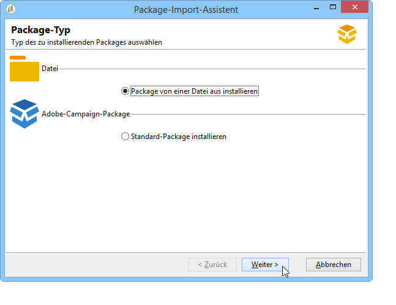

# Datenpackages{#working-with-data-packages}

## Über Datenpackages {#about-data-packages}

Adobe Campaign ermöglicht den Export oder Import von Plattformkonfigurationen und Daten mithilfe eines Package-Systems. Packages können unterschiedliche Konfigurationen und gefilterte oder ungefilterte Elemente enthalten.

Datenpackages ermöglichen den Austausch von Entitäten innerhalb der Adobe-Campaign-Datenbank über XML-Dateien. Jede in einem Package enthaltene Entität wird mit der Gesamtheit ihrer Daten dargestellt.

Das Prinzip der **Daten-Packages** besteht darin, eine Datenkonfiguration zu exportieren und in ein anderes Adobe-Campaign-System zu integrieren. In diesem [Abschnitt](#data-package-best-practices) erfahren Sie, wie Sie einen konsistenten Satz von Daten-Packages aufrechterhalten.

### Typen von Packages {#types-of-packages}

Es gibt drei Arten exportierbarer Packages: Benutzer-Packages, Plattform-Packages und Admin-Packages.

* **Benutzer-Package**: Ermöglicht es, die Liste der zu exportierenden Entitäten auszuwählen. Dieser Package-Typ verwaltet Abhängigkeiten und überprüft Fehler.
* **Plattform-Package**: Enthält alle hinzugefügten (nicht standardmäßigen) technischen Ressourcen: Schemata, JavaScript-Code etc.

   

* **Admin-Package**: Enthält alle hinzugefügten (nicht standardmäßigen) Vorlagen und fachlichen Ressourcen: Vorlagen, Bibliotheken etc.

   

>[!CAUTION]
>
>Die **Plattform**- und **Admin**-Typen enthalten eine vordefinierte Liste von zu exportierenden Entitäten. Jeder exportierbaren Entität sind Filterbedingungen zugeordnet, die es ermöglichen, die Standard-Ressourcen aus dem erstellten Package auszuschließen.

## Datenstruktur {#data-structure}

Die Beschreibung eines Datenpackages ist ein strukturiertes XML-Dokument, das die Grammatik des **xrk:navtree**-Datenschemas einhält.

Datenpackage-Beispiel:

```
<package>
  <entities schema="nms:recipient">
    <recipient email="john.smith@adobe.com" lastName="Smith" firstName="John">      
      <folder _operation="none" name="nmsRootFolder"/>      
      <company _operation="none" name="Adobe"/>
    </recipient>
  </entities>
  <entities schema="sfa:company">
    <company name="Adobe">
      location city="London" zipCode="W11 2BQ"/>
    </company>
  </entities>
</package>
```

Das XML-Dokument muss mit dem **`<package>`**-Element beginnen und enden. Alle nachfolgenden **`<entities>`**-Elemente verteilen die Daten nach Dokumenttyp.

Ein **`<entities>`**-Element enthält Package-Daten, die dem Format des im Attribut **schema** angegebenen Datenschemas entsprechen müssen.

Die Daten eines Packages dürfen keine internen Schlüssel enthalten, die nicht zwischen Datenbanken kompatibel sind, wie beispielsweise automatisch generierte Schlüssel (Option **autopk**).

In unserem Beispiel wurden die Joins der &quot;folder&quot;- und &quot;company&quot;-Relation durch High-Level-Keys in den Zieltabellen ersetzt:

```
<recipient>
  <folder _operation="none" name="nmsRootFolder"/>
  <company _operation="none" name="Adobe"/>
</recipient>
```

Das Attribut **`operation`** mit dem Wert &quot;none&quot; definiert eine Abstimmrelation.

Ein Datenpackage kann manuell über einen beliebigen Texteditor erstellt werden. Es muss nur sichergestellt werden, dass die Struktur des XML-Dokuments mit dem &quot;xtk:navtree&quot;-Datenschema übereinstimmt. Die Adobe-Campaign-Konsole ist mit einem Modul zum Import und Export von Datenpackages ausgestattet.

## Packages exportieren {#exporting-packages}

### Über den Package-Export {#about-package-export}

Für den Export von Packages gibt es drei Möglichkeiten:

* Mit dem **[!UICONTROL Package-Export-Assistenten]** können Sie eine Gruppe von Objekten in ein einzelnes Package exportieren. Weitere Informationen hierzu finden Sie unter [Objekte in ein Package exportieren](#exporting-a-set-of-objects-in-a-package)
* Ein **einzelnes Objekt** kann direkt in einem Package exportiert werden, indem Sie mit der rechten Maustaste darauf klicken und im Kontextmenü **[!UICONTROL Aktionen > In ein Package exportieren]** auswählen.
* Mithilfe von **Package-Definitionen** können Sie eine Package-Struktur erstellen, in der Sie Objekte hinzufügen, die später in einem Package exportiert werden. Weitere Informationen hierzu finden Sie unter [Package-Definitionen verwalten](#managing-package-definitions)

Nachdem ein Package exportiert wurde, können Sie das Package und alle hinzugefügten Entitäten in eine andere Campaign-Instanz importieren.

### Objekte in ein Package exportieren {#exporting-a-set-of-objects-in-a-package}

Der Package-Export-Assistent wird über das Menü **[!UICONTROL Werkzeuge > Erweitert > Package exportieren...]** der Adobe-Campaign-Clientkonsole aufgerufen.


Der Assistent weist für alle drei Packagetypen die gleichen Schritte auf:

1. Geben Sie die zu exportierenden Entitätstypen an:

   

   >[!CAUTION]
   >
   >Beim Export eines Ordners vom Typ **[!UICONTROL Angebotskategorie]**, **[!UICONTROL Angebotsumgebung]**, **[!UICONTROL Programm]** oder **[!UICONTROL Plan]** darf unter keinen Umständen die Entität **xtk:folder** gewählt werden, da dies einen Datenverlust verursachen kann. Wählen Sie stattdessen die jeweils dem Ordner entsprechende Entität aus: **nms:offerCategory** für Angebotskategorien, **nms:offerEnv** für Angebotsumgebungen, **nms:program** für Programme und **nms:plan** für Pläne.

   Die Listenverwaltung ermöglicht das Hinzufügen oder Löschen der Konfiguration der zu exportierenden Entitäten. Klicken Sie auf **[!UICONTROL Hinzufügen]**, um eine neue Entität auszuwählen.

   Über die Schaltfläche **[!UICONTROL Detail]** kann die ausgewählte Konfiguration bearbeitet werden.

   >[!NOTE]
   >
   >Der Abhängigkeitsmechanismus steuert die Exportsequenz der Entitäten. Weitere Informationen hierzu finden Sie unter [Abhängigkeitsverwaltung](#managing-dependencies).

1. Im Eingabebildschirm der Entitätenkonfiguration wird die Filterabfrage des zu extrahierenden Dokumenttyps bestimmt.

   Hier muss die Filterbedingung der Datenextraktion angegeben werden.

   

   >[!NOTE]
   >
   >Der Abfrageeditor wird in [diesem Abschnitt](../../platform/using/about-queries-in-campaign.md) beschrieben.

1. Klicken Sie auf die Schaltfläche **[!UICONTROL Weiter]** und wählen Sie die Sortierungsspalten aus, um die Daten bei der Extraktion zu ordnen:

   

1. Überprüfen Sie die Vorschau der zu extrahierenden Daten, bevor Sie den Export starten.

   

1. Im letzten Schritt des Package-Export-Assistenten wird der Export gestartet. Die Daten werden in der im Feld **[!UICONTROL Datei]** angegebenen Datei gespeichert.

   

### Abhängigkeitsverwaltung {#managing-dependencies}

Der Exportmechanismus ermöglicht es Adobe Campaign, die Relationen zwischen den exportierten Elementen zu verfolgen.

Der Mechanismus wird durch zwei Regeln bestimmt:

* Die über eine Relation mit einer Integrität vom Typ **own** oder **owncopy** verbundenen Objekte werden im gleichen Package exportiert wie das exportierte Objekt.
* Die über eine Relation mit einer Integrität vom Typ **neutral** oder **define** (definierte Relation) verbundenen Objekte müssen separat exportiert werden.

>[!NOTE]
>
>Mit Schemaelementen verknüpfte Integritätstypen werden in [diesem Abschnitt](../../configuration/using/database-mapping.md#links--relation-between-tables) definiert.

#### Kampagne exportieren {#exporting-a-campaign}

Im Folgenden finden Sie ein Beispiel für den Export einer Kampagne. Die zu exportierende Marketingkampagne enthält eine Aufgabe (Titel: &quot;MyTask&quot;) und einen Workflow (Titel: &quot;CampaignWorkflow&quot;) im Ordner &quot;MyWorkflow&quot; (Knoten: Administration > Betreibung > Technische Workflows > Kampagnenprozesse > MyWorkflow).

Die Aufgabe und der Workflow werden im gleichen Package wie die Kampagne exportiert, da die entsprechenden Schemata über Relationen vom Integritätstyp &quot;own&quot; verbunden sind.

Packageinhalt:

```
<?xml version='1.0'?>
<package author="Administrator (admin)" buildNumber="7974" buildVersion="6.1" img=""
label="" name="" namespace="" vendor="">
 <desc></desc>
 <version buildDate="2013-01-09 10:30:18.954Z"/>
 <entities schema="nms:operation">
  <operation duration="432000" end="2013-01-14" internalName="OP1" label="MyCampaign"
  modelName="opEmpty" start="2013-01-09">
   <controlGroup>
    <where filteringSchema=""/>
   </controlGroup>
   <seedList>
    <where filteringSchema="nms:seedMember"></where>
    <seedMember internalName="SDM1"></seedMember>
   </seedList>
   <parameter useAsset="1" useBudget="1" useControlGroup="1" useDeliveryOutline="1"
   useDocument="1" useFCPValidation="0" useSeedMember="1" useTask="1"
   useValidation="1" useWorkflow="1"></parameter>
   <fcpSeed>
    <where filteringSchema="nms:seedMember"></where>
   </fcpSeed>
   <owner _operation="none" name="admin" type="0"/>
   <program _operation="none" name="nmsOperations"/>
   <task end="2013-01-17 10:07:51.000Z" label="MyTask" name="TSK2" start="2013-01-16 10:07:51.000Z"
   status="1">
    <owner _operation="none" name="admin" type="0"/>
    <operation _operation="none" internalName="OP1"/>
    <folder _operation="none" name="nmsTask"/>
   </task>
   <workflow internalName="WKF12" label="CampaignWorkflow" modelName="newOpEmpty"
   order="8982" scenario-cs="Notification of the workflow supervisor (notifySupervisor)"
   schema="nms:recipient">
    <scenario internalName="notifySupervisor"/>
    <desc></desc>
    <folder _operation="none" name="Folder4"/>
    <operation _operation="none" internalName="OP1"/>
   </workflow>
  </operation>
 </entities>
</package>   
```

Die Zugehörigkeit zu einem Packagetyp wird in einem Schema mit dem Attribut **@pkgAdmin und @pkgPlatform** bestimmt. Diese beiden Attribute erhalten einen XTK-Ausdruck, der die Bedingungen der Zugehörigkeit zum Package festlegt.

```
<element name="offerEnv" img="nms:offerEnv.png" 
template="xtk:folder" pkgAdmin="@id != 0">
```

Schließlich können über das Attribut **@pkgStatus** die Exportregeln für diese Elemente oder Attribute bestimmt werden. Entsprechend dem Wert des Attributs wird das Element oder das Attribut im exportierten Package vorhanden sein. Die drei für das Attribut @pkgStatus möglichen Werte sind:

* **never**: exportiert das Feld/die Relation nicht
* **always**: forciert den Export dieses Felds
* **preCreate**: lässt die Erstellung der verbundenen Entität zu

>[!NOTE]
>
>Der Wert **preCreate** ist nur für Elemente vom Typ Relation zugelassen. Er lässt die Erstellung oder den Verweis auf eine Entität zu, die noch nicht in das exportierte Package geladen wurde.

## Package-Definitionen verwalten {#managing-package-definitions}

### Über Package-Definitionen {#about-package-definitions}

Mithilfe von Package-Definitionen können Sie eine Package-Struktur erstellen, in der Sie Entitäten hinzufügen, die später als einzelnes Package exportiert werden. Sie können dann dieses Package und alle hinzugefügten Entitäten in eine andere Campaign-Instanz importieren.

**Verwandte Themen:**

* [Package-Definitionen erstellen](#creating-a-package-definition)
* [Entitäten zu einer Package-Definition hinzufügen](#adding-entities-to-a-package-definition)
* [Erzeugung von Package-Definitionen konfigurieren](#configuring-package-definitions-generation)
* [Packages über eine Package-Definition exportieren](#exporting-packages-from-a-package-definition)

### Package-Definitionen erstellen {#creating-a-package-definition}

Auf Package-Definitionen können Sie über das Menü **[!UICONTROL Administration > Konfiguration > Packageverwaltung > Package-Definition]** zugreifen.

Um eine Package-Definition zu erstellen, klicken Sie auf die Schaltfläche **[!UICONTROL Neu]** und geben Sie die allgemeinen Informationen für die Package-Definition ein.


Anschließend können Sie Entitäten zur Package-Definition hinzufügen und diese in ein XML-Datei-Package exportieren.

**Verwandte Themen:**

* [Entitäten zu einer Package-Definition hinzufügen](#adding-entities-to-a-package-definition)
* [Erzeugung von Package-Definitionen konfigurieren](#configuring-package-definitions-generation)
* [Packages über eine Package-Definition exportieren](#exporting-packages-from-a-package-definition)

### Entitäten zu einer Package-Definition hinzufügen {#adding-entities-to-a-package-definition}

Klicken Sie im Tab **[!UICONTROL Inhalt]** auf die Schaltfläche **[!UICONTROL Hinzufügen]**, um die Entitäten auszuwählen, die mit dem Package exportiert werden sollen. Best Practices bei der Auswahl von Entitäten werden im Abschnitt [Objekte in ein Package exportieren](#exporting-a-set-of-objects-in-a-package) beschrieben.


Entitäten können direkt über ihren Speicherort in der Instanz zu einer Package-Definition hinzugefügt werden. Gehen Sie dazu wie folgt vor:

1. Klicken Sie mit der rechten Maustaste auf die gewünschte Entität und wählen Sie dann **[!UICONTROL Aktionen > In ein Package exportieren]** aus.

   

1. Wählen Sie **[!UICONTROL Einer Package-Definition hinzufügen]** und anschließend die Package-Definition, zu der Sie die Entität hinzufügen möchten.

   

1. Die Entität wird der Package-Definition hinzugefügt und wird mit dem Package exportiert (siehe [Packages über eine Package-Definition exportieren](#exporting-packages-from-a-package-definition)).

   

### Erzeugung von Package-Definitionen konfigurieren {#configuring-package-definitions-generation}

Die Package-Erzeugung kann über den Tab **[!UICONTROL Inhalt]** der Package-Definition konfiguriert werden. Klicken Sie dazu auf den Link **[!UICONTROL Erzeugungsparameter]**.


* **[!UICONTROL Definition einschließen]**: Hiermit wird die aktuell verwendete Definition in die Package-Definition eingeschlossen.
* **[!UICONTROL Installationsscript einschließen]**: Hiermit können Sie ein JavaScript-Script hinzufügen, das beim Package-Import ausgeführt wird. Wenn diese Option ausgewählt ist, wird der Tab **[!UICONTROL Script]** im Bildschirm für die Package-Definition hinzugefügt.
* **[!UICONTROL Standardwerte einschließen]**: Hiermit werden dem Package die Werte der Attribute aller Entitäten hinzugefügt.

   Diese Option ist standardmäßig nicht ausgewählt, um lange Exporte zu vermeiden. Dies bedeutet, dass Attribute mit Standardwerten (&quot;Leerstring&quot;, &quot;0&quot; und &quot;false&quot;, wenn im Schema nichts anderes definiert ist) von Entitäten nicht zum Package hinzugefügt und deshalb nicht exportiert werden.

   >[!CAUTION]
   >
   >Durch Deaktivieren dieser Option werden möglicherweise lokale und importierte Versionen zusammengeführt.
   >
   >Wenn die Instanz, in der das Package importiert wird, identische Entitäten wie das Package enthält (z. B. mit derselben externen ID), werden die zugehörigen Attribute nicht aktualisiert. Dies kann passieren, wenn die Attribute der vorherigen Instanz Standardwerte aufweisen, da sie nicht im Package enthalten sind.
   >
   >In diesem Fall würde durch Auswählen der Option **[!UICONTROL Standardwerte einschließen]** die Versionszusammenführung verhindert, da alle Attribute der vorherigen Instanz mit dem Package exportiert würden.

### Packages über eine Package-Definition exportieren {#exporting-packages-from-a-package-definition}

Gehen Sie wie folgt vor, um ein Package über eine Package-Definition zu exportieren:

1. Wählen Sie die zu exportierende Package-Definition aus. Klicken Sie dann auf die Schaltfläche **[!UICONTROL Aktionen]** und wählen Sie **[!UICONTROL Package exportieren]** aus.
1. Standardmäßig wird eine dem exportierten Package entsprechende XML-Datei ausgewählt. Ihr Name entspricht dem Namensraum und dem Namen der Package-Definition.
1. Nachdem der Package-Name und der Speicherort definiert wurden, klicken Sie auf die Schaltfläche **[!UICONTROL Starten]**, um den Export zu starten.

   

## Packages importieren {#importing-packages}

### Über den Package-Import {#about-package-import}

Der Package-Import-Assistent wird über das Hauptmenü und die Rubrik **[!UICONTROL Werkzeuge > Erweitert > Package importieren...]** der Adobe-Campaign-Clientkonsole aufgerufen.

Sie können ein Package aus einem zuvor durchgeführten Export, zum Beispiel aus einer anderen Adobe Campaign-Instanz, oder je nach Ihren Lizenzbedingungen ein [natives Package](../../installation/using/installing-campaign-standard-packages.md) importieren.



### Package-Installation ausgehend von einer Datei {#installing-a-package-from-a-file}

Um ein vorhandenes Datenpackage zu importieren, wählen Sie die entsprechende XML-Datei aus und klicken Sie auf **[!UICONTROL Öffnen]**.


Der Inhalt des zu importierenden Packages wird daraufhin im mittleren Bereich des Assistenten angezeigt.

Klicken Sie auf **[!UICONTROL Weiter]** und **[!UICONTROL Starten]**, um den Import zu beginnen.


### Installieren eines nativen Packages {#installing-a-standard-package}

Standardmäßige Packages sind native Packages, die bei der Konfiguration von Adobe Campaign installiert werden. Je nach Ihren Berechtigungen und Ihrem Bereitstellungsmodell können Sie neue Standard-Packages importieren, wenn Sie neue Optionen oder Add-ons erwerben oder ein Upgrade auf ein neues Produkt vornehmen.

Entnehmen Sie Ihrem Lizenzvertrag, welche Packages Sie installieren können.

Weitere Informationen zu nativen Packages finden Sie auf [dieser Seite](../../installation/using/installing-campaign-standard-packages.md).

## Best Practices für Datenpackages {#data-package-best-practices}

In diesem Abschnitt wird beschrieben, wie Sie Datenpackages während der ganzen Projektlaufzeit einheitlich organisieren können.

Packages können verschiedene Arten von Konfigurationen und Elementen enthalten, die gefiltert sein können. Wenn einzelne Elemente fehlen oder Elemente/Packages nicht in der richtigen Reihenfolge importiert werden, kann die Plattformkonfiguration beschädigt werden.

Zudem kann der Ordner mit Package-Spezifikationen schnell komplex werden, wenn mehrere Personen auf derselben Plattform viele verschiedene Funktionen nutzen.

In diesem Abschnitt wird eine Lösung beschrieben, mit der Sie Packages in Adobe Campaign für große Projekte organisieren und sinnvoll nutzen können. Diese Lösung wird empfohlen, ist aber nicht zwingend erforderlich.

Die wichtigsten Punkte sind folgende:
* Organisieren Sie Packages und protokollieren Sie, was wann geändert wird.
* Minimieren Sie beim Aktualisieren einer Konfiguration das Risiko, Elemente zu beschädigen, die nicht direkt mit der Aktualisierung verbunden sind.

>[!NOTE]
>
>Weiterführende Informationen zum Einrichten eines Workflows für das automatische Exportieren von Packages finden Sie auf [dieser Seite](https://helpx.adobe.com/de/campaign/kb/export-packages-automatically.html).

### Empfehlungen    {#data-package-recommendations}

Führen Sie Importe stets innerhalb derselben Version der Plattform durch. Sie müssen Ihre Packages zwischen zwei Instanzen bereitstellen, die denselben Build aufweisen. Erzwingen Sie den Import niemals und aktualisieren Sie immer zuerst die Plattform (wenn der Build abweicht).

>[!IMPORTANT]
>
>Das Importieren zwischen verschiedenen Versionen wird von Adobe nicht unterstützt.
<!--This is not allowed. Importing from 6.02 to 6.1, for example, is prohibited. If you do so, R&D won’t be able to help you resolve any issues you encounter.-->

Achten Sie auf das Schema und die Datenbankstruktur. Nach dem Importieren von Packages mit einem Schema muss ein Schema erstellt werden.

### Lösung {#data-package-solution}

#### Package-Typen {#package-types}

Definieren Sie zunächst verschiedene Package-Typen. Es werden nur vier Typen verwendet:

**Entitäten**
* Alle &quot;xtk&quot;- und &quot;nms&quot;-spezifischen Elemente in Adobe Campaign wie Schemas, Formulare, Ordner, Versandvorlagen usw.
* Sie können eine Entität sowohl als &quot;Admin&quot;- als auch als &quot;Plattform&quot;-Element betrachten.
* Sie sollten in ein Package, das Sie in eine Campaign-Instanz hochladen möchten, nicht mehr als eine Entität einschließen.

<!--Nothing “works” alone. An entity package does not have a specific role or objective.-->

Wenn Sie Ihre Konfiguration in einer neuen Instanz bereitstellen müssen, können Sie alle Ihre Entitäts-Packages importieren.

**Funktionen**

Dieser Package-Typ:
* Ist eine Reaktion auf eine Kundenanfrage/Spezifikation.
* Enthält eine oder mehrere Funktionen.
* Sollte alle Abhängigkeiten enthalten, um die Funktionen ohne weitere Packages ausführen zu können.

**Kampagnen**

Dieses Package ist nicht obligatorisch. Manchmal ist es sinnvoll, einen bestimmten Typ für alle Kampagnen zu erstellen, selbst wenn eine Kampagne als Funktion betrachtet werden kann.

**Aktualisierungen**

Nach der Konfiguration kann eine Funktion in eine andere Umgebung exportiert werden. Beispielsweise kann das Package aus einer Entwicklungsumgebung in eine Testumgebung exportiert werden. Bei diesem Test wurde ein Fehler festgestellt. Zunächst muss er in der Entwicklungsumgebung behoben werden. Dann muss der Patch auf die Testplattform angewendet werden.

Die erste Lösung bestünde darin, die gesamte Funktion erneut zu exportieren. Um jedoch jegliches Risiko zu vermeiden (d. h. Aktualisieren unerwünschter Elemente), ist es sicherer, ein Package zu nutzen, das nur die Korrektur enthält.

Daher empfehlen wir, ein &quot;Aktualisierungs&quot;-Package zu erstellen, das nur einen Entitätstyp der Funktion enthält.

Eine Aktualisierung kann nicht nur aus einer Fehlerbehebung, sondern auch aus einem neuen Element Ihrer Entität/Funktion bzw. Ihres Kampagnen-Packages bestehen. Um eine Bereitstellung des gesamten Packages zu vermeiden, können Sie ein Aktualisierungs-Package exportieren.

### Namenskonventionen {#data-package-naming}

Da die Typen jetzt definiert sind, sollte nun eine Namenskonvention festgelegt werden. Adobe Campaign erlaubt keine Erstellung von Unterordnern für Package-Spezifikationen, d. h. Zahlen sind die beste Lösung, um eine übersichtliche Struktur beizubehalten. Zahlen werden Package-Namen als Präfix vorangestellt. Sie können die folgende Konvention verwenden:

* Entität: 1 bis 99
* Funktion: 100 bis 199
* Kampagne: von 200 bis 299
* Aktualisierung: 5000 bis 5999

### Packages    {#data-packages}

>[!NOTE]
>
>Es ist empfehlenswert, Regeln zur Definition der richtigen Zahl von Packages festzulegen.

#### Reihenfolge von Entitäts-Packages {#entity-packages-order}

Um den Import zu erleichtern, sollten Entitäts-Packages beim Importieren geordnet werden. Beispiel:
* 001 – Schema
* 002 – Formular
* 003 – Bilder
* etc.

>[!NOTE]
>
>Formulare sollten erst nach Schemaaktualisierungen importiert werden.

#### Package 200 {#package-200}

Package-Nummer 200 sollte nicht für spezifische Kampagnen verwendet werden; diese Nummer wird verwendet, um Aspekte zu aktualisieren, die alle Kampagnen betreffen.

#### Package aktualisieren {#update-package}

Der letzte Punkt betrifft die Aktualisierung der Package-Nummerierung. Das ist Ihre Package-Nummer (Entität, Funktion oder Kampagne) mit einer 5 als Präfix. Beispiel:
* 5001 zum Aktualisieren eines Schemas
* 5200 zum Aktualisieren aller Kampagnen
* 5101 zum Aktualisieren der 101-Funktion

Das Aktualisierungs-Package sollte nur eine spezifische Entität enthalten, um einfach wiederverwendbar zu sein. Um sie aufzuteilen, fügen Sie eine neue Nummer hinzu (beginnen Sie bei 1). Für diese Packages gelten keine speziellen Ordnungsregeln. Stellen Sie sich zum besseren Verständnis vor, dass eine 101-Funktion verwendet wird, eine Social-Anwendung:
* Sie enthält eine webApp und ein externes Konto.
   * Die Package-Bezeichnung lautet: 101 – Social-Anwendung (socialApplication).
* Die webApp weist einen Fehler auf.
   * Die webApp wird korrigiert.
   * Ein Package für die Fehlerbehebung mit folgendem Namen muss erstellt werden: 5101 – 1 – Social-Anwendung webApp (socialApplication_webApp).
* Für die Funktion &quot;Social&quot; muss ein neues externes Konto hinzugefügt werden.
   * Das externe Konto wird erstellt.
   * Das neue Package heißt: 5101 – 2 – Social-Anwendung Externes Konto (socialApplication_extAccount).
   * Parallel dazu wird das 101-Package aktualisiert und dem externen Konto hinzugefügt; es wird jedoch nicht bereitgestellt.
      

#### Package-Dokumentation {#package-documentation}

Wenn Sie ein Package aktualisieren, sollten Sie stets einen Kommentar in das Beschreibungsfeld eingeben, um sämtliche Änderungen und Gründe (z. B. &quot;Hinzufügen eines neuen Schemas&quot; oder &quot;Beheben eines Fehlers&quot;) genau zu dokumentieren.


Sie sollten auch das Datum des Kommentars angeben. Melden Sie Ihren Kommentar zu einem Aktualisierungs-Package immer an das &quot;übergeordnete&quot; Element (Package ohne Präfix 5).

>[!IMPORTANT]
>
>Das Beschreibungsfeld darf maximal 2.000 Zeichen enthalten.