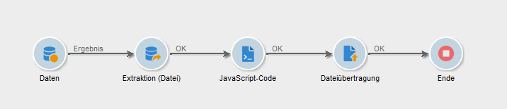
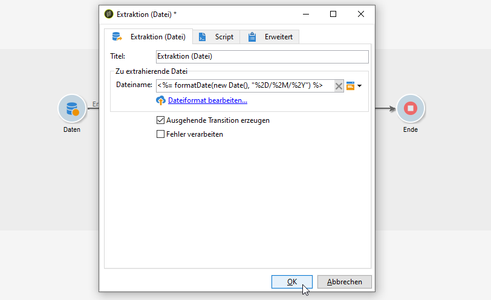
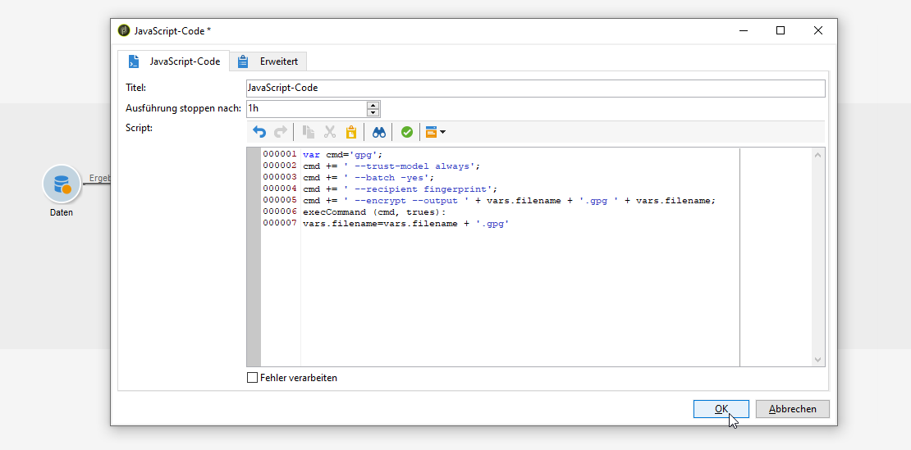
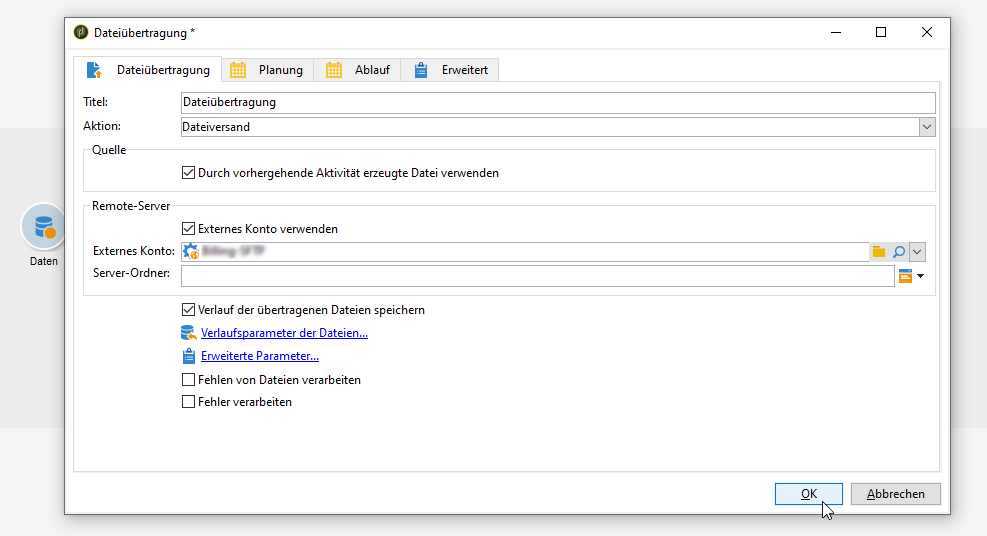

# Eine Datei {#zipping-or-encrypting-a-file} komprimieren oder verschlüsseln

Mit Adobe Campaign können Sie komprimierte oder verschlüsselte Dateien exportieren. Wenn Sie einen Export über die Aktivität **[!UICONTROL Extraktion (Datei)]** planen, können Sie eine Nachbearbeitung definieren, um die Datei zu komprimieren oder zu verschlüsseln.

Gehen Sie dazu folgendermaßen vor:

1. Installieren Sie mit dem [Control Panel](https://docs.adobe.com/content/help/de-DE/control-panel/using/instances-settings/gpg-keys-management.html#encrypting-data) ein GPG-Schlüsselpaar für Ihre Instanz.

   >[!NOTE]
   >
   >Die Systemsteuerung steht allen Administratoren zur Verfügung. Die Schritte zum Gewähren des Administratorzugriffs für einen Benutzer sind in [dieser Seite](https://experienceleague.adobe.com/docs/control-panel/using/discover-control-panel/managing-permissions.html?lang=en#discover-control-panel) beschrieben.
   >
   >Beachten Sie, dass Ihre Instanz auf AWS gehostet und mit dem neuesten [Gold Standard](../../rn/using/gs-overview.md) Build oder dem [neuesten GA-Build (21.1)](../../rn/using/latest-release.md) aktualisiert werden muss. Erfahren Sie, wie Sie Ihre Version in [diesem Abschnitt](../../platform/using/launching-adobe-campaign.md#getting-your-campaign-version) überprüfen. Um zu überprüfen, ob Ihre Instanz auf AWS gehostet wird, führen Sie die unter [Diese Seite](https://experienceleague.adobe.com/docs/control-panel/using/faq.html) beschriebenen Schritte aus.

1. Wenn Ihre Adobe Campaign-Installation von Adobe gehostet wird, wenden Sie sich an die [Adobe-Kundenunterstützung](https://helpx.adobe.com/de/enterprise/admin-guide.html/enterprise/using/support-for-experience-cloud.ug.html), damit die nötigen öffentlichen Dienste auf dem Server installiert werden.
1. Wenn Sie eine On-Premise-Installation von Adobe Campaign haben, installieren Sie den gewünschten öffentlichen Dienst (z. B.: GPG, GZIP) sowie die nötigen Schlüssel (zur Verschlüsselung) auf dem Anwendungs-Server.

Sie können dann auf der Registerkarte **[!UICONTROL Skript]** der Aktivität oder in einer **[!UICONTROL JavaScript-Code]**-Aktivität Befehle bzw. Code verwenden. Im folgenden Anwendungsfall wird ein Beispiel dargestellt.

**Verwandte Themen:**

* [Entpacken oder Entschlüsseln von Dateien vor der Verarbeitung](../../platform/using/unzip-decrypt.md)
* [Aktivität &quot;Extraktion (Datei)&quot;](../../workflow/using/extraction--file-.md).

## Verwendungsfall: Verschlüsseln und Exportieren von Daten mithilfe eines Schlüssels, der auf der Systemsteuerung {#use-case-gpg-encrypt} installiert ist

In diesem Anwendungsfall wird ein Workflow erstellt, um Daten mit einem im Control Panel installierten Schlüssel zu verschlüsseln und zu exportieren.

 [Funktion im Video kennenlernen](#video).

Die Schritte zum Ausführen dieses Anwendungsfalls lauten wie folgt:

1. Generieren Sie ein GPG-Schlüsselpaar (öffentlich/privat) mit einem GPG-Dienstprogramm und installieren Sie dann den öffentlichen Schlüssel im Control Panel. Ausführliche Anweisungen finden Sie in der [Control Panel-Dokumentation](https://docs.adobe.com/content/help/en/control-panel/using/instances-settings/gpg-keys-management.html#encrypting-data).

1. Erstellen Sie einen Workflow in Campaign Classic, um die Daten zu exportieren und mithilfe des über das Control Panel installierten privaten Schlüssels zu verschlüsseln. Zu diesem Zweck wird folgender Workflow erstellt:

   

   * Aktivität **[!UICONTROL Abfrage]**: In diesem Beispiel möchten wir eine Abfrage ausführen, die auf die Daten aus der Datenbank abzielt, die wir exportieren möchten.
   * Aktivität **[!UICONTROL Extraktion (Datei)]**: Extrahiert die Daten in eine Datei.
   * Aktivität **[!UICONTROL JavaScript-Code]**: Verschlüsselt die zu extrahierenden Daten.
   * Aktivität **[!UICONTROL Dateiübertragung]**: Sendet die Daten an eine externe Quelle (in diesem Beispiel an einen SFTP-Server).

1. Konfigurieren Sie die Aktivität **[!UICONTROL Abfrage]** so, dass sie auf die gewünschten Daten aus der Datenbank abzielt. Weiterführende Informationen hierzu finden Sie in [diesem Abschnitt](../../workflow/using/query.md).

1. Öffnen Sie die Aktivität **[!UICONTROL Extraktion (Datei)]** und konfigurieren Sie sie entsprechend Ihren Anforderungen. Globale Konzepte zur Konfiguration der Aktivität finden Sie in [diesem Abschnitt](../../workflow/using/extraction--file-.md).

   

1. Öffnen Sie die Aktivität **[!UICONTROL JavaScript-Code]** und fügen Sie den unten stehenden Befehl ein, um die zu extrahierenden Daten zu verschlüsseln.

   >[!IMPORTANT]
   >
   >Vergessen Sie nicht, den Wert **fingerprint** im Befehl durch den Fingerabdruck des öffentlichen, im Control Panel installierten Schlüssels zu ersetzen.

   ```
   var cmd='gpg ';
   cmd += ' --trust-model always';
   cmd += ' --batch --yes';
   cmd += ' --recipient fingerprint';
   cmd += ' --encrypt --output ' + vars.filename + '.gpg ' + vars.filename;
   execCommand(cmd,true);
   vars.filename=vars.filename + '.gpg'
   ```

   

1. Öffnen Sie die Aktivität **[!UICONTROL Dateiübertragung]** und geben Sie dann den SFTP-Server an, an den Sie die Datei senden möchten. Globale Konzepte zur Konfiguration der Aktivität finden Sie in [diesem Abschnitt](../../workflow/using/file-transfer.md).

   

1. Sie können den Workflow jetzt ausführen. Nach der Ausführung werden die über die Abfrage abgerufenen Daten in eine verschlüsselte .gpg-Datei für den SFTP-Server exportiert.

## Anleitungsvideo {#video}

In diesem Video wird gezeigt, wie Daten mit einem GPG-Schlüssel verschlüsselt werden können.

>[!VIDEO](https://video.tv.adobe.com/v/36399?quality=12)

Weitere Anleitungsvideos zu Campaign Classic finden Sie [hier](https://experienceleague.adobe.com/docs/campaign-classic-learn/tutorials/overview.html?lang=de).
