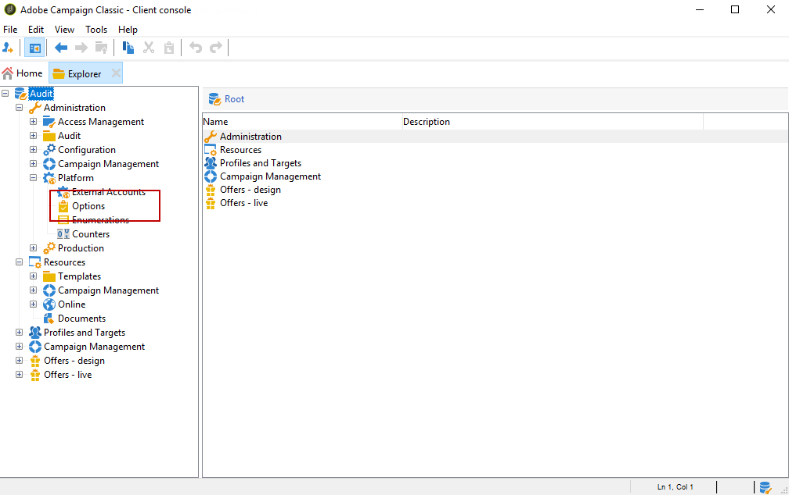

# Audit trail{#audit-trail}

In Adobe Campaign **[!UICONTROL Audit trail]** erhalten Sie Zugriff auf den vollständigen Verlauf der in Ihrer Instanz vorgenommenen Änderungen.

**[!UICONTROL Audit trail]** erfasst in Echtzeit eine umfassende Liste von Aktionen und Ereignissen, die in Ihrer Adobe Campaign-Instanz auftreten. Es bietet eine Self-Service-Möglichkeit zum Zugriff auf einen Verlauf von Daten, um Antworten auf Fragen wie: was mit Ihren Workflows passiert ist und wer sie zuletzt aktualisiert hat oder was Ihre Benutzer in der Instanz getan haben.

>[!NOTE]
>
>Adobe Campaign prüft keine Änderungen an Benutzerrechten, Vorlagen, Personalisierungen oder Kampagnen.\
>Prüfpfad kann nur von Administratoren der Instanz verwaltet werden.

Prüfpfad besteht aus drei Komponenten:

* **Schema-Prüfpfad**: Überprüfen Sie die Aktivitäten und zuletzt vorgenommenen Änderungen an Ihren Schemata.

   For more information on schemas, refer to this [page](../../configuration/using/data-schemas.md).

* **Workflow-Prüfpfad**: Überprüfen Sie Aktivitäten und letzte Änderungen an Workflows sowie zusätzlich den Status Ihrer Workflows, z. B.:

   * Starten
   * Aussetzen
   * Anhalten
   * Neu starten
   * Bereinigung, die der Aktion entspricht Bereinigungsverlauf
   * Simulieren, welche der Aktion Start im Simulationsmodus entspricht
   * Wakeup, der der Aktion Ausstehende Aufgaben jetzt ausführen entspricht
   * Nicht bedingter Stopp
   For more information on workflows, refer to this [page](../../workflow/using/about-workflows.md).

   For more on how to monitor workflows, refer to the [dedicated section](../../workflow/using/monitoring-workflow-execution.md).

* **Optionsprüfungspfad**: Überprüfen Sie die Aktivitäten und zuletzt vorgenommenen Änderungen an Ihren Optionen.

   For more information on options, refer to this [page](../../installation/using/configuring-campaign-options.md).

## Zugriff auf Prüfpfad {#accessing-audit-trail}

So greifen Sie auf die Instanz zu **[!UICONTROL Audit trail]** :

1. Rufen Sie das **[!UICONTROL Explorer]** Menü Ihrer Instanz auf.
1. Wählen Sie im **[!UICONTROL Administration]** Menü die Option **[!UICONTROL Audit]** .

   

1. Das **[!UICONTROL Audit trail]** Fenster wird mit der Liste Ihrer Entitäten geöffnet. Adobe Campaign prüft die Aktionen zum Erstellen, Bearbeiten und Löschen von Workflows, Optionen und Schemas.

   Wählen Sie eine der Entitäten aus, um mehr über die letzten Änderungen zu erfahren.

   

1. Das **[!UICONTROL Audit entity]** Fenster enthält detailliertere Informationen zu der ausgewählten Entität, z. B.:

   * **[!UICONTROL Type]** : Workflow, Optionen oder Schemas.
   * **[!UICONTROL Entity]** : Interner Name Ihrer Aktivitäten.
   * **[!UICONTROL Modified by]** : Benutzername der letzten Person, die diese Entität zuletzt geändert hat.
   * **[!UICONTROL Action]** : Letzte Aktion, die für diese Entität ausgeführt wurde, entweder &quot;Erstellt&quot;, &quot;Bearbeitet&quot;oder &quot;Gelöscht&quot;.
   * **[!UICONTROL Modification date]** : Datum der letzten an dieser Entität durchgeführten Aktion.
   Der Codeblock enthält weitere Informationen darüber, was genau in Ihrer Entität geändert wurde.

   

>[!NOTE]
>
>Standardmäßig ist die Retentionszeit für **[!UICONTROL Audit logs]** auf 180 Tage eingestellt. Weitere Informationen zum Ändern der Aufbewahrungszeit finden Sie auf dieser [Seite](../../production/using/database-cleanup-workflow.md#deployment-wizard).

## Prüfpfad aktivieren/deaktivieren {#enable-disable-audit-trail}

Prüfpfad kann für eine bestimmte Aktivität einfach aktiviert oder deaktiviert werden, wenn Sie z. B. Speicherplatz in der Datenbank speichern möchten.

Gehen Sie dabei folgendermaßen vor:

1. Rufen Sie das **[!UICONTROL Explorer]** Menü Ihrer Instanz auf.
1. Wählen Sie unter dem **[!UICONTROL Administration]** Menü **[!UICONTROL Platform]** dann **[!UICONTROL Options]** .

   

1. Wählen Sie je nach Entität, die Sie aktivieren/deaktivieren möchten, eine der folgenden Optionen aus:

   * Für Workflow: **[!UICONTROL XtkAudit_Workflows]**
   * Bei Schemas: **[!UICONTROL XtkAudit_DataSchema]**
   * Für Optionen: **[!UICONTROL XtkAudit_Option]**
   * Für jede Entität: **[!UICONTROL XtkAudit_Enable_All]**
   

1. Ändern Sie den Wert **[!UICONTROL Value]** in 1, wenn Sie die Entität aktivieren möchten, oder in 0, wenn Sie sie deaktivieren möchten.

   

1. Klicks **[!UICONTROL Save]** .

