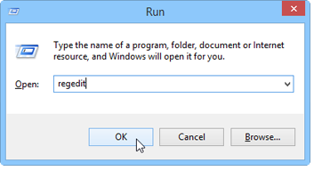

# Konsolenaktualisierung{#console-update}

Wenn Sie die Option **[!UICONTROL Keine Anforderung der Aktualisierung]** der Konsole aktivieren und die Aktualisierungsanforderung erneut aktivieren möchten, führen Sie folgendes Verfahren aus:

1. Öffnen Sie den Editor der Registrierungsdatenbank mit dem Befehl **regedit** im Menü Windows **[!UICONTROL Beginn > Ausführen]** .

   

1. Zeigen Sie in der Struktur die Optionen des Knotens **[!UICONTROL HKEY_CURRENT_USERSoftwareneolaneNL_6nlclient]** an.
1. Löschen Sie den Eintrag **[!UICONTROL confAdvisedUpgrade]** und schließen Sie den Registrierungseditor.

   

