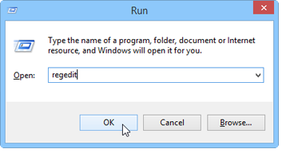
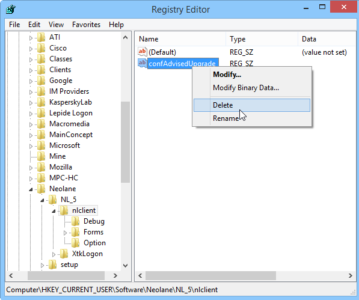

# Konsolenaktualisierung{#console-update}

Wenn Sie die Option **[!UICONTROL Konsolenaktualisierung nicht anfordern]** ausgewählt haben und die Aktualisierungsanfrage erneut aktivieren möchten, gehen Sie wie folgt vor:

1. Öffnen Sie den Editor der Registrierungsdatenbank mit dem Befehl **regedit** im Menü Windows **[!UICONTROL Start > Ausführen]**.

   

1. Zeigen Sie in der Baumstruktur die Optionen des Knotens **[!UICONTROL HKEY_CURRENT_USERSsoftwareneolaneNL_6nlclient]** an.
1. Löschen Sie den **[!UICONTROL confAdvisedUpgrade]**-Eintrag und schließen Sie den Registrierungs-Editor.

   
