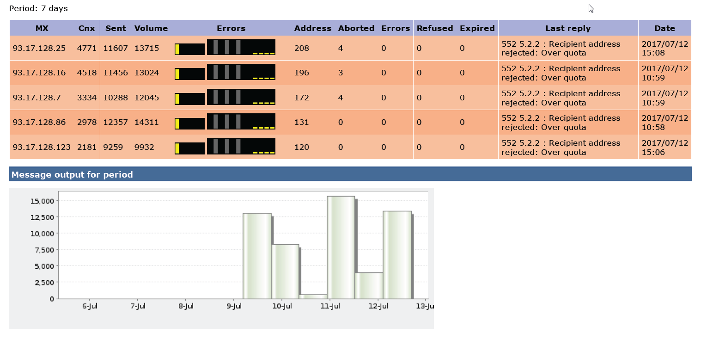

# Überwachungsprozesse{#monitoring-processes}


Der Anwendungs-Server und der Weiterleitungs-Server **tracking** können manuell oder automatisch überwacht werden.

## Manuelle Überwachung {#manual-monitoring}

Um auf die Adobe Campaign-Prozessüberwachungsseite zuzugreifen, wechseln Sie zur Registerkarte **[!UICONTROL Überwachung]** und klicken Sie auf den Link **[!UICONTROL Übersicht]**.


Auf der angezeigten Seite können Sie den Status der verbundenen Instanz anzeigen, d. h.:

* Informationen über die Instanz: Version, Name, Datenbank-Engine, installierte Pakete, Server-Systemindikatoren,
* die Liste der fehlenden Prozesse und Ausführungsinformationen (Startdatum, PID usw.),
* Eine Ansicht von Workflows und Sendungen.

Weitere Möglichkeiten zur Überwachung von Campaign-Prozessen finden Sie auf [dieser Seite](../../production/using/monitoring-guidelines.md).

### Logbuch {#log-journal}

Um das Protokoll anzuzeigen, das mit einem Prozess verbunden ist, klicken Sie auf den Prozess, **mta** und wählen Sie dann **[!UICONTROL Protokoll öffnen]** aus.


### Systemindikator {#system-indicators}

Navigieren Sie zur Liste der Systemindikatoren, um Informationen zum Computer anzuzeigen, z. B. dessen physischer und virtueller Speicher, aktive Prozesse und verfügbarer Festplattenspeicher. Die Indikatoren sind für Linux- und Windows-Betriebssysteme unterschiedlich. Gehen Sie zur Seite **[!UICONTROL Instanz-Monitoring]** und klicken Sie auf den Link **[!UICONTROL Anzeigen]**, um die Liste der Indikatoren zu öffnen.

#### Windows {#in-windows}

* **[!UICONTROL Ausstehende Ereignisse in der]**: Indikator, der spezifisch für **Message Center** ist. [Weitere Informationen](../../message-center/using/additional-configurations.md#monitoring-thresholds)

* **[!UICONTROL Arbeitsspeicher]**: Informationen zum physischen Arbeitsspeicher (RAM).

  **[!UICONTROL Aktueller Wert]**: aktueller Speicherverbrauch.

  **[!UICONTROL Max Value]**: Gesamtspeichermenge, die installiert wird.

  **[!UICONTROL Verfügbar]**: Menge des verfügbaren Speichers.

  **[!UICONTROL Warnung]**: Diese Anzeige wird angezeigt, wenn der Speicherverbrauch 80 % der Gesamtmenge erreicht.

  **[!UICONTROL Warnhinweis]**: Diese Anzeige wird angezeigt, wenn der Speicherverbrauch 90 % der Gesamtmenge erreicht.

  Wenn die **[!UICONTROL Warnung]** und **[!UICONTROL Warnhinweis]** angezeigt werden, können Sie das Problem beheben, indem Sie RAM zu dem Computer hinzufügen, auf dem der Adobe Campaign-Server installiert ist. Sie können sich auch dafür entscheiden, den Adobe Campaign-Server auf einem dedizierten Computer zu installieren.

* **[!UICONTROL Arbeitsspeicher wechseln]**: Informationen zum virtuellen Arbeitsspeicher, der mit einer Auslagerungsdatei übereinstimmt: ein Bereich auf der Festplatte, der von Windows als RAM verwendet wird.

  **[!UICONTROL Aktueller Wert]**: tatsächlicher Speicherverbrauch.

  **[!UICONTROL Max Value]**: Gesamtspeichermenge.

  **[!UICONTROL Verfügbar]**: Menge des verfügbaren Speichers.

  **[!UICONTROL Warnung]**: Diese Anzeige wird angezeigt, wenn der Speicherverbrauch 80 % der Gesamtmenge erreicht.

  **[!UICONTROL Warnhinweis]**: Diese Anzeige wird angezeigt, wenn der Speicherverbrauch 90 % der Gesamtmenge erreicht.

  Wenn die Indikatoren **[!UICONTROL Warnung]** und **[!UICONTROL Warnhinweis]** angezeigt werden, können Sie das Problem beheben, indem Sie die Größe der Austauschdatei in den erweiterten Windows-Einstellungen erhöhen.

* **[!UICONTROL Disc XXX]**: Informationen zu Maschinenlesegeräten.

  **[!UICONTROL Aktueller Wert]**: Tatsächlich belegter Speicherplatz.

  **[!UICONTROL Max Value]**: Gesamtfestplattenkapazität.

  **[!UICONTROL Available]**: Verfügbarer Speicherplatz.

  **[!UICONTROL Verwendet]**: Prozentsatz der verwendeten Festplatte.

  **[!UICONTROL Warnung]**: Diese Anzeige wird angezeigt, wenn der verfügbare Speicherplatz 80 % der Gesamtkapazität erreicht.

  **[!UICONTROL Warnhinweis]**: Diese Anzeige wird angezeigt, wenn der verfügbare Speicherplatz 90 % der Gesamtkapazität erreicht.

* **[!UICONTROL Anzahl der Prozesse zu alt]**: Informationen zu Adobe Campaign-Prozessen, die seit mehr als einem Tag aktiv sind.

  **[!UICONTROL Aktueller Wert]**: Anzahl der derzeit aktiven Prozesse.

  **[!UICONTROL Max Value]**: Maximale Anzahl autorisierter Prozesse (1).

  **[!UICONTROL Warnhinweis]**: Diese Anzeige wird angezeigt, wenn die Anzahl der Prozesse gleich 1 ist.

  Wenn der **[!UICONTROL Warnhinweis]** angezeigt wird, kann es sein, dass der betreffende Prozess durch die SQL-Datenbank-Engine gesperrt ist oder dass er in einer Endlosschleife steckt. Der **watchdog**-Prozess von Adobe Campaign startet automatisch jeden Tag alle Prozesse neu und ermöglicht Ihnen, dieses Problem zu lösen. Sie können den betreffenden Prozess jedoch auch selbst stoppen, um einen Neustart zu erzwingen.

#### Linux {#in-linux}


* **[!UICONTROL Ausstehende Ereignisse in der]**: Indikator, der spezifisch für **Message Center** ist. Weitere Informationen finden Sie in [diesem Abschnitt](../../message-center/using/additional-configurations.md#monitoring-thresholds).

* **[!UICONTROL Lastdurchschnitt (1/5/15 Minuten)]**: Informationen zur Last, d. h. die Nutzungsrate des Prozessors durch die Prozesse, die auf dem Computer in der letzten Minute, fünf Minuten oder fünfzehn Minuten ausgeführt werden

  **[!UICONTROL Aktueller Wert]**: tatsächliche Last der Maschine.

  **[!UICONTROL Maximalwert]**: Maximale Auslastung der Prozesse auf der Maschine

  **[!UICONTROL Warnung]**: Dieser Indikator wird angezeigt, wenn die Last in der letzten Minute, fünf Minuten oder fünfzehn Minuten 80 % des maximal zulässigen Werts erreicht.

  **[!UICONTROL Warnhinweis]**: Diese Anzeige wird angezeigt, wenn die Last 90 % des maximal zulässigen Werts der letzten Minute, fünf Minuten oder fünfzehn Minuten erreicht.

* **[!UICONTROL Arbeitsspeicher]** Informationen über den physischen Arbeitsspeicher (RAM).

  **[!UICONTROL Aktueller Wert]**: tatsächlicher Speicherverbrauch.

  **[!UICONTROL Max Value]**: Gesamtspeichermenge, die installiert wird.

  **[!UICONTROL Verfügbar]**: Menge des verfügbaren Speichers.

  **[!UICONTROL Warnung]**: Diese Anzeige wird angezeigt, wenn der Speicherverbrauch 80 % der Gesamtmenge erreicht.

  **[!UICONTROL Warnhinweis]**: Diese Anzeige wird angezeigt, wenn der Speicherverbrauch 90 % der Gesamtmenge erreicht.

  Wenn die **[!UICONTROL Warnung]** und **[!UICONTROL Warnhinweis]** angezeigt werden, können Sie das Problem beheben, indem Sie RAM zu dem Computer hinzufügen, auf dem der Adobe Campaign-Server installiert ist. Sie können sich auch dafür entscheiden, den Adobe Campaign-Server auf einem dedizierten Computer zu installieren.

* **[!UICONTROL Arbeitsspeicher wechseln]**: Informationen zum virtuellen Arbeitsspeicher, der mit einer Auslagerungsdatei übereinstimmt: ein Bereich auf der Festplatte, der von Windows als RAM verwendet wird.

  **[!UICONTROL Aktueller Wert]**: tatsächlicher Speicherverbrauch.

  **[!UICONTROL Max Value]**: Gesamtspeichermenge.

  **[!UICONTROL Verfügbar]**: Menge des verfügbaren Speichers.

  **[!UICONTROL Warnung]**: Diese Anzeige wird angezeigt, wenn der Speicherverbrauch 80 % der Gesamtmenge erreicht.

  **[!UICONTROL Warnhinweis]**: Diese Anzeige wird angezeigt, wenn der Speicherverbrauch 90 % der Gesamtmenge erreicht.

  Wenn die Indikatoren **[!UICONTROL Warnung]** und **[!UICONTROL Warnhinweis]** angezeigt werden, können Sie das Problem beheben, indem Sie die Größe der Austauschdatei erhöhen.

* **[!UICONTROL Kerndateien]**: Informationen zu den Dateien, die nach dem Absturz eines Adobe Campaign-Prozesses generiert wurden. Mit diesen Dateien können Sie die Ursachen des Absturzes diagnostizieren.

  **[!UICONTROL Aktueller Wert]**: Anzahl der vorhandenen Dateien.

  **[!UICONTROL Max Value]**: Maximale Anzahl autorisierter Dateien (1).

  **[!UICONTROL Warnung]**: Diese Anzeige wird angezeigt, wenn die Anzahl der Dateien sich 1 nähert.

  **[!UICONTROL Warnhinweis]**: Diese Anzeige wird angezeigt, wenn die Anzahl der Dateien 1 entspricht.

  Wenn ein Prozess aufgrund eines Absturzes fehlt, wird er in der Liste der Prozesse rot angezeigt und von dem von Adobe Campaign bereitgestellten **watchdog**-Prozess automatisch neu gestartet.

* **[!UICONTROL Anzahl an Segmenten des geteilten Speichers]**: Informationen zu den Speichersegmenten, die von allen Adobe Campaign-Prozessen geteilt werden.

  **[!UICONTROL Aktueller Wert]**: Anzahl der derzeit verwendeten Speichersegmente.

  **[!UICONTROL Max Value]**: Maximale Anzahl von autorisierten Speichersegmenten (2).

  **[!UICONTROL Warnung]**: Diese Anzeige wird angezeigt, wenn die Anzahl der Speichersegmente 1 erreicht.

  **[!UICONTROL Warnhinweis]**: Diese Anzeige wird angezeigt, wenn die Anzahl der Speichersegmente 2 erreicht.

* **[!UICONTROL Anzahl der Prozesse zu alt]**: Informationen zu Prozessen, die seit mehr als einem Tag aktiv sind.

  **[!UICONTROL Aktueller Wert]**: Anzahl der derzeit aktiven Prozesse.

  **[!UICONTROL Max Value]**: Maximale Anzahl autorisierter Prozesse.

  **[!UICONTROL Warnung]**: Diese Anzeige wird angezeigt, wenn die Anzahl der Prozesse 80 % des zulässigen Schwellenwerts erreicht.

  **[!UICONTROL Warnhinweis]**: Diese Anzeige wird angezeigt, wenn die Anzahl der Prozesse 90 % des zulässigen Schwellenwerts erreicht.

* **[!UICONTROL Datei-]**: Informationen zu den Dateideskriptoren, d. h. die Anzahl der pro Prozess geöffneten Dateien.

  **[!UICONTROL Aktueller Wert]**: aktuelle Anzahl von Dateideskriptoren.

  **[!UICONTROL Max Value]**: Maximale Anzahl von Dateideskriptoren, die vom Betriebssystem autorisiert sind.

  **[!UICONTROL Warnung]**: Diese Anzeige wird angezeigt, wenn die Anzahl der autorisierten Dateideskriptoren den Schwellenwert von 80 % erreicht.

  **[!UICONTROL Warnhinweis]**: Diese Anzeige wird angezeigt, wenn die Anzahl der autorisierten Dateideskriptoren den Schwellenwert von 90 % erreicht.

* **[!UICONTROL Prozesse]**: Informationen zu den maschinellen Prozessen.

  **[!UICONTROL Aktueller Wert]**: Anzahl der derzeit aktiven Prozesse.

  **[!UICONTROL Max Value]**: Maximale Anzahl autorisierter Prozesse.

  **[!UICONTROL Aktive]**: Anzahl der aktiven Prozesse.

  **[!UICONTROL Inaktive]**: Anzahl der inaktiven Prozesse.

  **[!UICONTROL Warnung]**: Diese Anzeige wird angezeigt, wenn die Anzahl der autorisierten Prozesse den Schwellenwert von 80 % erreicht.

  **[!UICONTROL Warnhinweis]**: Diese Anzeige wird angezeigt, wenn die Anzahl der autorisierten Prozesse den Schwellenwert von 90 % erreicht.

* **[!UICONTROL Zombie-Prozesse]**: Informationen zu den Prozessen, die angehalten wurden, aber noch eine Prozesskennung (PID) haben und in der Prozesstabelle sichtbar bleiben.

  **[!UICONTROL Aktueller Wert]**: Anzahl der Zombie-Prozesse, die derzeit aktiv sind.

  **[!UICONTROL Max Value]**: Maximale Anzahl an autorisierten Zombie-Prozessen (2).

  **[!UICONTROL Warnung]**: Diese Anzeige wird angezeigt, wenn die Anzahl der Zombie-Prozesse sich 2 nähert.

  **[!UICONTROL Warnhinweis]**: Diese Anzeige wird angezeigt, wenn die Anzahl der Zombie-Prozesse 2 erreicht.

#### Indikatoren anpassen {#customized-indicators}

Mit Adobe Campaign können Sie Indikatoren anpassen, wie unten beschrieben:

1. Erstellen Sie eine **.sh**-Datei und nennen Sie sie **[!UICONTROL cust_indicators.sh]** .
1. Fügen Sie Ihre benutzerdefinierten Indikatoren zu dieser Datei hinzu. Beispiel:

   ```
   #!/bin/bash 
   echo "<indicator name='Zombie Processes'>  
   <current label='Current Value' value='0' display=''/>  
   <warning value='2'/>  <alert value='2'/>  
   <max label='Max Value' value='2'/>
   </indicator>"
   ```

   oder

   ```
   #!/bin/bash 
   echo "<indicator name='Availability'>  
   <current label='Last update of data' display='2012-09-03 10:00'/>  
   <current label='Availability last month' display='100.00%'/>  
   <current label='Availability this month' display='100.00%'/> 
   <current label='Recent downtime periods' display='2012-07-04 11:10:00 - 11:19:59'/>
   </indicator>"
   ```

1. Speichern Sie die Datei im Ordner **[!UICONTROL usr/local/neolane/nl6]**.

Diese Datei wird von Adobe Campaign aufgerufen.

## SMTP-Berichte {#smtp-reports}

Berichte zur SMTP-Versandüberwachung sind in die Adobe Campaign-Plattform integriert. Der Zugriff kann über die Konsole oder über den Web-Zugriff erfolgen.

Diese Berichte zeigen SMTP-Versandstatistiken und SMTP-Fehler nach Domain an. Um darauf zugreifen zu können, muss der Benutzer über **Administration**-Rechte verfügen.

Sie sind unter &quot;**&quot;** „SMTP-Überwachung“ gruppiert.


>[!IMPORTANT]
>
>* Informationen zur SMTP-Überwachung sind nur verfügbar, wenn der E-Mail-Kanal aktiviert wurde.
>* Die **[!UICONTROL SMTP-Versandstatistiken]** werden nur angeboten, wenn der Statistikserver auf der Instanz gestartet wird.
>

### SMTP-Versandstatistiken {#smtp-sending-statistics}

Der **[!UICONTROL SMTP-Versandstatistiken]** ermöglicht die Steuerung der Serveraktivität. Es zeigt eine Synthese der einzelnen MatchChild an.


Die Liste der Indikatoren für diesen Bericht ist unter dem Diagramm zu sehen.

1. Anzahl gesendeter Nachrichten insgesamt
1. Stellt ein-/ausgehende Nachrichten dar:

   * Blaue Linie: für den Versand bereite Nachrichten, die im Shaper eingetroffen sind, d. h. letzte Phase vor dem Versand von SMTP (entspricht den eingehenden Daten).

   * Grüne Linie: erfolgreich gesendete Nachrichten (entspricht den ausgehenden Daten).

   * Rote Linie: Nachrichten, die vom Shaper zurückgelassen wurden, an den **mta** zurückgegeben (entspricht den bei dieser Wiederherstellung zurückgewiesenen Daten).

   Diese Werte werden in der Anzahl der Nachrichten pro Stunde ausgedrückt.

1. Stellt zwei Warteschlangen des Shapers dar:

   * Blaue Kurve: Warteschlange aktiver Nachrichten. Diese Nachrichten werden so schnell wie möglich gesendet.

   * Kaki-Kurve: die „verzögerte“ Warteschlange. Diese Nachrichten können derzeit aufgrund von Einschränkungen oder aufgrund fehlender Zielgruppenverbindung nicht zurückgegeben werden. Weitere Zustellversuche erfolgen alle 5 Sekunden, 10 Sekunden, 20 Sekunden, 40 Sekunden, 2 Minuten usw. für die definierte **MaxAgeSec** Zeit vor dem Abbruch.

1. Dieses Diagramm zeigt ein Detail der abgebrochenen Nachrichten (rote Kurve im 2. Diagramm): Es zeigt den Anteil der abgebrochenen Nachrichten ohne erneute Zustellversuche (violett) im Vergleich zu den Nachrichten, deren Versand fehlgeschlagen ist (rot). Auf diese Weise können Sie den Anteil der Nachrichten anzeigen, die innerhalb des gewährten Zeitraums aufgrund von Einschränkungen durch den Statistikserver (Drosselung) oder aufgrund der Nichtverfügbarkeit des Remote-Servers nicht verarbeitet wurden.
1. SMTP-Verbindungen, die offen sind oder geöffnet werden
1. Geschätzte Anzahl von &quot;**&quot;**.

>[!NOTE]
>
>Dieser Bericht bezieht sich auf den Status der E-Mail-Traffic-Shaper-Komponente.

### SMTP-Fehler nach Domain {#smtp-errors-per-domain}

Dieser Bericht zeigt die über einen bestimmten Zeitraum aufgeteilten Versandfehler nach Domain an.

>[!NOTE]
>
>Die Optionen **minConnectionsToLog**, **minErrorsToLog** und **minMessagesToLog** der Datei **serverConf.xml** definieren die Schwellenwerte, bei deren Überschreitung Verbindungsstatistiken berücksichtigt werden.


Die Liste der Indikatoren für diesen Bericht ist unter der Tabelle aufgeführt.

* Die Spalte **Domain** enthält den Namen der Domain, an die die Nachrichten gesendet werden (oder den tatsächlichen Domain-Namen, z. B. yahoo.com für yahoo.fr),
* Die Spalte **Cnx** zeigt die Anzahl der für diese Domain geöffneten SMTP-Verbindungen an.
* Die Spalte **Gesendet** entspricht der Anzahl der an diese Domain gesendeten Nachrichten.
* Die Spalte **Volume** zeigt die Anzahl der Nachrichten an, die an diese Domain gesendet werden sollten (ungefährer Wert).
* Die Spalte **Fehler** zeigt einen Volumenindikator für Fehler in dieser Domain über den Zeitraum an.
* Die Spalte **Letzte Antwort** zeigt die letzte SMTP-Antwortnachricht an, die für diese Domain empfangen wurde.
* Die Spalte **Datum** zeigt das Datum der letzten SMTP-Antwort an, die für diese Domain empfangen wurde.

>[!NOTE]
>
>Die in den Spalten **Cnx**, **Gesendet** und **Volumen** angezeigten Werte werden anhand des im Feld **[!UICONTROL Zeitraum]** ausgewählten Zeitraums berechnet.

Klicken Sie auf einen Domain-Namen, um dessen Fehler anzuzeigen.

Sie werden nach PublicId kategorisiert: Diese Kennung entspricht einer IP-Adresse, die von mehreren Adobe Campaign-MTAs hinter einem Router gemeinsam genutzt wird. Der Statistikserver verwendet diese Kennung, um die Verbindungs- und Versandstatistiken zwischen diesem Ausgangspunkt und dem Zielserver zu speichern.


Das Feld **[!UICONTROL Eigentümer der Domain]** ermöglicht es Ihnen, verschiedene Domain-Namen unter derselben Bezeichnung zu gruppieren. In der Ansicht Erster Bericht werden alle MX-Domain-Namen mit diesem Eigentümer verknüpft.

Klicken Sie auf eine PublicId-Kennung, um weitere Details anzuzeigen.



>[!NOTE]
>
>Der Prozentsatz der Fehler wird durch zwei Diagramme dargestellt. Das erste ist eine horizontale Fortschrittsleiste auf einem schwarzen Hintergrund. Die zweite Grafik ist chronologisch. Der ausgewählte Zeitraum wird in zwölf Zeitintervalle unterteilt, die jeweils durch eine vertikale Fortschrittsleiste dargestellt werden. Wenn in beiden Darstellungen kein Fehler erkannt wurde, ist der Balken schwarz. Die Farbe des Balkens hängt vom Prozentsatz der aufgetretenen Fehler ab (gelb, dann orange und schließlich rot). Die Farbe Grau bedeutet, dass kein signifikantes Datenvolumen gefunden wurde. Sie können den genauen Fehlerprozentsatz anzeigen, indem Sie den Cursor auf das Diagramm setzen.

>[!NOTE]
>
>Weitere Informationen zu SMTP-Fehlern und deren Verwaltung in Adobe Campaign finden Sie [diesem Abschnitt](../../installation/using/email-deliverability.md).

## Rechnungsstellungsbericht {#billing-report}

Der technische **[!UICONTROL „Abrechnung]** sendet den Systemaktivitätsbericht per E-Mail an den fakturierungsverantwortlichen Benutzer. Sie wird standardmäßig am 25. jedes Monats in der Marketing-Instanz ausgelöst.

Der technische Workflow befindet sich in einem Unterordner des folgenden Knotens: **Administration** > **** > **Technische Workflows**.


Sobald der Workflow jeden 25. des Monats gestartet wurde, erhält Ihr Abrechnungsoperator den folgenden Bericht in seinem Posteingang.


Die folgenden Metriken stehen zur Verfolgung Ihrer Sendungen zur Verfügung:

* **[!UICONTROL Startdatum]** : Startdatum des Versands. Beachten Sie, dass es vor dem „Von“-Datum des Berichts liegen kann.
* **[!UICONTROL label]** : Bezeichnung des Versands. Sendungen, die weniger als 100 zu versendende Nachrichten aufweisen, werden als zu klein angesehen und daher nach Startdatum aggregiert. In diesem Fall wird die Anzahl der Aggregate auf dem Titel angezeigt, z. B. [Aggregation von 3 kleinen Sendungen].
* **[!UICONTROL Gesamtvolumen]** : Gesamtvolumen der für den Versand übertragenen Bytes.
* **[!UICONTROL Durchschnittliches Volumen]** : Durchschnittliches Volumen der übertragenen Bytes. Dies ist das Ergebnis der folgenden Formel **(Gesamtvolumen / Nachrichten)** die die Berechnungsgrundlage der Metrik **[!UICONTROL Multiplikator]** darstellt.
* **[!UICONTROL Nachrichten]** : Anzahl der gesendeten Nachrichten. Dazu gehören sowohl erfolgreich gesendete Nachrichten als auch erneute Zustellversuche (nach dem Empfang einer Bounce-Nachricht vom kontaktierten Server).
* **[!UICONTROL Multiplikator (x)]** : Der Wert des Multiplikators wird vom durchschnittlichen Volumen der Nachrichten abgeleitet.
* **[!UICONTROL count]** : Ergebnis der Multiplikation der Nachrichten und des Multiplikators.

## Automatische Überwachung {#automatic-monitoring}

Adobe Campaign bietet mehrere automatische Überwachungsmethoden, die unten beschrieben werden.

### Befehlszeile {#command-line}

Befehl

**nlserver-Monitor**

Hiermit können Sie eine Reihe von Indikatoren zu den Adobe Campaign-Modulen und dem System auflisten.

Er erzeugt eine Ausgabe in einem einfach zu verarbeitenden XML-Format.

Dieser Befehl kann auch mit dem Parameter **-missing** ausgeführt werden, der die in dieser Instanz fehlenden Prozesse auflistet, wenn die Konfigurationsdateien angeben, dass sie ausgeführt werden sollen.

```sql
nlserver monitor -missing
HH:MM:SS > Application server for Adobe Campaign Classic (7.X YY.R build XXX@SHA1) of DD/MM/YYYY
mta@prod
stat@prod
wfserver@prod
```

### Vom Server veröffentlichte Informationen {#information-published-by-the-server}

#### /r/test {#r-test}

Die Seite **http(s)://`<application>`/r/test** wird zum Testen des Weiterleitungsservers verwendet. Es wird empfohlen, dieselbe Methode zum Testen der für das Tracking verwendeten Frontserver zu verwenden. Diese Seite kann auch zum Testen eines Lastdispatchers verwendet werden.

Es wird eine Zeile wie diese im XML-Format angezeigt:

```
<redir status='OK' date='YYYY-MM-DD HH:MM:SS.112Z' build='XXXX' host='<hostname>' localHost='<servername>'/>
```

**Häufigkeit**: Dieser Test nutzt keine Last und kann daher sehr häufig ausgeführt werden (z. B. einmal pro Sekunde).

#### /nl/jsp/ping.jsp {#nl-jsp-ping-jsp}

Diese **http(s)://`<Application server url>`/nl/jsp/ping.jsp**-Seite funktioniert genauso wie die entsprechende Netzwerkseite: Sie testet eine vollständige Abfrage, die über Apache/Tomcat/Web-Modul/Datenbank läuft und auf den Client hochlädt. Wenn alles ordnungsgemäß funktioniert, wird ein „OK“ zurückgegeben. Es wird empfohlen, diesen Test auf Computern mit Zugriff auf die Datenbanken (z. B. MTAs und Umfragen) durchzuführen.

**Nutzung**: Ein Sitzungs-Token, das einem Benutzerlogin zugeordnet ist, muss als Argument übergeben werden, um sich remote anzumelden (siehe den Tipp in [Automatische Überwachung über Adobe Campaign-Skripte](#automatic-monitoring-via-adobe-campaign-scripts)).

Beispiel:


Der Benutzername und die Anmeldung müssen zuvor in der Adobe Campaign-Client-Konsole mit Datenbankrechten konfiguriert werden.


**Frequenz**: Dies ist ein Test, der sehr wenig Bandbreite verbraucht. Es kann daher ziemlich oft ausgeführt werden, wenn auch nicht öfter als einmal pro Minute.

#### /nl/jsp/monitor.jsp {#nl-jsp-monitor-jsp}

Hierbei handelt es sich um eine Prüfung, mit der überprüft werden soll, ob ein Benutzer über eine Webseite auf den Adobe Campaign-Server zugreifen kann. Dabei handelt es sich um dieselbe Webseite wie die, auf die über die Menüs der Client-Konsole zugegriffen wird. Sie können diese Seite über Ihre Überwachungs-Tools (Tivoli, Nagios, etc.) aufrufen.


**Nutzung**: Ein Sitzungs-Token, das mit einem Benutzerlogin verknüpft ist, über das Sie eine Verbindung zur Instanz herstellen können, muss als Argument verwendet werden (siehe den Tipp in [Automatische Überwachung über Adobe Campaign-Skripte](#automatic-monitoring-via-adobe-campaign-scripts)).

Der Operator und sein Login müssen zuvor in der Adobe Campaign-Client-Konsole mit den entsprechenden Datenbankrechten und -beschränkungen konfiguriert werden.

**Häufigkeit**: Dies ist ein vollständiger Server-Test und muss nicht häufig ausgeführt werden (er kann z. B. einmal alle zehn Minuten ausgeführt werden).

#### /nl/jsp/soaprouter.jsp {#nl-jsp-soaprouter-jsp}

Dieses **jsp** stellt den Einstiegspunkt für Adobe Campaign-Anwendungs-APIs dar. Es kann daher eine detaillierte Überwachung der Anwendung bereitstellen. Sie kann auch zur Überwachung von Adobe Campaign-Web-Services verwendet werden. Es wird in unseren Überwachungsskripten verwendet, aber beachten Sie, dass es nur für Power-User ist.

### Überwachung anhand von Bereitstellungstypen {#monitoring-based-on-deployment-types}

Adobe Campaign ermöglicht verschiedene Bereitstellungskonfigurationen (weitere Informationen hierzu finden Sie in [diesem Abschnitt](../../installation/using/hosting-models.md)). In diesem Abschnitt werden die verschiedenen automatischen Überwachungstechniken beschrieben, die je nach Art der Installation anzuwenden sind.

<table> 
 <thead> 
  <tr> 
   <th> Bereitstellungstyp </th> 
   <th> Monitoring </th> 
  </tr> 
 </thead> 
 <tbody> 
  <tr> 
   <td> Standalone </td> 
   <td> 
    <ul> 
     <li><p> <span class="uicontrol">/r/</span> und <span class="uicontrol">/nl/jsp/monitor.jsp</span> auf dem Adobe Campaign-Server</p> </li> 
    </ul> </td> 
  </tr> 
  <tr> 
   <td> Standard </td> 
   <td> 
    <ul> 
     <li><p> <span class="uicontrol">/r/test</span> und <span class="uicontrol">/nl/jsp/ping.jsp</span> auf den Frontservern</p> </li> 
     <li><p> <span class="uicontrol">/nl/jsp/monitor.jsp</span> auf dem Anwendungsserver</p> </li> 
    </ul> </td> 
  </tr> 
  <tr> 
   <td> Unternehmen </td> 
   <td> 
    <ul> 
     <li><p> <span class="uicontrol">/r/test</span> und <span class="uicontrol">/nl/jsp/ping.jsp</span> auf den Frontservern</p> </li> 
     <li><p> <span class="uicontrol">/r/test</span> und <span class="uicontrol">/nl/jsp/monitor.jsp</span> auf dem Anwendungsserver</p> </li> 
    </ul> </td> 
  </tr> 
  <tr> 
   <td> Mid-Sourcing </td> 
   <td> 
    <ul> 
     <li><p> <span class="uicontrol">/nl/jsp/monitor.jsp</span> auf dem Anwendungsserver</p> </li> 
    </ul> </td> 
  </tr> 
 </tbody> 
</table>

## Automatische Überwachung über Adobe Campaign-Skripte {#automatic-monitoring-via-adobe-campaign-scripts}

Adobe Campaign kann ein Tool zur Instanzüberwachung (NetReport) bereitstellen, mit dem Sie einen Bericht zu den erkannten Anomalien per E-Mail senden können.


>[!IMPORTANT]
>
>Dieses Tool kann zur Überwachung Ihrer Instanzen verwendet werden, wird jedoch von Adobe Campaign nicht unterstützt. Weitere Informationen erhalten Sie von Ihrem Campaign-Administrator.

### Erforderliche Elemente {#required-elements}

Für die automatische Überwachung sind die folgenden Vorsichtsmaßnahmen vor der Installation erforderlich:

* Sie müssen über die Dateien **netreport.tgz** (Linux-Installation) oder **netreport.zip** (Windows-Installation) verfügen.
* Wir empfehlen Ihnen dringend, keine Überwachung auf der zu überwachenden Maschine zu installieren,
* es muss auf einem Computer mit JRE oder JDK installiert sein,
* Unter Linux muss der zu überwachende Computer über das Paket **bc** verfügen. Weiterführende Informationen hierzu finden Sie in [diesem Abschnitt](../../installation/using/installing-packages-with-linux.md#distribution-based-on-rpm--packages).

### Installationsverfahren {#installation-procedure}

Der Installationsvorgang läuft wie folgt ab:

1. Erstellen Sie in der Konsole ggf. einen neuen Benutzer (der Benutzer „Monitoring“ existiert bereits), weisen Sie jedoch keine Rechte zu.
1. Führen Sie die Archivextraktion aus.
1. Lies die **README**-Datei.
1. Aktualisieren Sie die Konfigurationsdatei **netconf.**&quot;.
1. Aktualisieren Sie die Datei **netreport.bat** (Windows) oder **netreport.sh** (Linux).

### Konfigurieren der Datei netconf.xml {#configuring-the-netconf-xml-file}

Die XML-Konfigurationsdatei enthält die folgenden Elemente:

* [&#39;properties&#39;-Element](#properties--element)
* [Element &#39;Instance&#39;](#instance--element)
* [&#39;Host&#39;-Element](#host--element)
* [Unterelemente](#sub-elements)

Im Folgenden finden Sie ein Konfigurationsbeispiel:

```
<?xml version="1.0" encoding="ISO-8859-1"?>
<netconf>
  <properties mailServer="mail.adobe.net" mailFrom="mail@adobe.com" recipientList="recipient@adobe.com">
    <nightMode start="00:00 am" end="07:00 am"/>
    <buildRange minimum="7829" maximum="8180"/>
    <buildRange minimum="8300" maximum="8400"/>
    <sla/>
  </properties>

  <instance name="dev" recipientList="mail@mail.com,mail2@mail.com">
                <host name="devrd.domain.com" alias="devrd" sessiontoken="monitoring" criticalLevel="1" filter="wkf;new">
                                <ncs instance="devrd" url="/nl/jsp/soaprouter.jsp" includeDead="false" isSecure="false"/>
                                <redir url="/r/test"/>
                                <http url="/nl/jsp/ping.jsp"/>
                </host>
                <host name="devtrk.domain.com" alias="devtrk" sessiontoken="monitoring" criticalLevel="0" filter="wkf;new">
                                <ncs instance="devrd" url="/nl/jsp/soaprouter.jsp" includeDead="true" isSecure="false"/>
                </host>
  </instance>
  <host name="dev-test" alias="dev-test" sessiontoken="monitoring" criticalLevel="2">
                <ncs instance="dev" url="/nl/jsp/soaprouter.jsp" includeDead="false"/>
  </host>
</netconf>
```

>[!NOTE]
>
>Sie können verschiedene Konfigurationen angeben, indem Sie der Datei **netconf.xml** ein Suffix hinzufügen, z. B. **netconf-dev.xml**, **netconf-prod.xml** usw. Geben Sie dann die Konfiguration für die Ausführung des NetReport in den Dateien **netreport.bat** oder **netreport.sh** an, indem Sie **$JAVA_HOME/bin/java netreport dev** oder **@%JAVA_HOME%binjava netreport prod** hinzufügen.

>[!IMPORTANT]
>
>Damit der **monitoring**-Operator funktioniert, muss sich der Computer, auf dem der netreport ausgeführt wird, in einer Sicherheitszone im Modus **sessionTokenOnly** befinden. Wenn für diesen Operator keine vertrauenswürdige IP-Maske angegeben wurde, muss sich die Sicherheitszone auch im Modus **allowEmptyPassword** und **allowUserPassword** befinden.

#### &#39;properties&#39;-Element {#properties--element}

Dieses Element wird verwendet, um die Konfiguration von E-Mails auszufüllen, d. h.

* **mailServer**: SMTP-Server zum Senden von E-Mails (z. B.: smtp.domain.net).
* **mailFrom**: E-Mail-Adresse des Absenders des Berichts (z. B.: monitoring@domain.net).
* **recipientList**: Die Liste der E-Mail-Adressen, die von überwachten Empfängern verwendet werden. Adressen müssen durch Kommas getrennt sein (keine Leerzeichen).
* Der **Nacht**-Modus (optional) wird verwendet, um den Versand von E-Mails zwischen den angegebenen Zeiträumen zu vermeiden. Stattdessen werden die Daten konsolidiert und nach der Endzeit (standardmäßig 7:00 Uhr) wird eine E-Mail zu den Aktivitäten der Nacht gesendet.
* Mit **Unterelement** buildRange“ (optional) können Sie eine Mindest- und eine Höchstbuildnummer angeben. Ein Fehler wird für alle Computer generiert, deren Build-Nummer nicht in diesen Bereich fällt

  ```
  <buildRange minimum="0000" maximum="9999"/>
  ```

* Sie können ein **`<sla>`** (optionales) Unterelement im Element **properties** hinzufügen. Bei jeder Ausführung des NetReport wird eine Protokolldatei generiert. Der Name der Datei enthält den Konfigurationsnamen sowie das Datum und die Uhrzeit, z. B. **dev_06_12_13_16_47_05.tmp**. Die Datei enthält die folgenden Informationen: Instanzname, Computername, Schweregrad (0 bis 3, von der niedrigsten bis zur kritischsten), Datum (Zeitstempelformat), verstrichene Zeit (in Millisekunden) zwischen der Abfrage und der Antwort, verwendeter Service (http, ncs, ncsex, redir). Diese Informationen werden durch Tabulatormarken und Zeilenumbrüche am Ende jedes Dienstes getrennt.

>[!NOTE]
>
>Das **persistHtmlFile**-Attribut mit dem Wert „true“ im **`<property>`**-Element wird verwendet, um den neuesten Überwachungsstatus in der Datei &quot;**.md“**. Diese Datei wird im Installationsverzeichnis gespeichert.

#### Element &#39;Instance&#39; {#instance--element}

Mit diesem Element können Sie mehrere Computer (Hosts) in derselben Instanz neu gruppieren. Die Instanznamen werden im ersten Teil der Überwachungs-E-Mail angezeigt. Sie können auf den Namen einer Instanz klicken, um auf Details zu jedem Computer zuzugreifen.

```
instance name="instance-name" recipientList="mail@mail.com,mail2@mail.com">
                <host name="devcamp.domain.com" ...>
                       ...
                </host>
                <host name="devtrack.domain.com" ...>
                       ...
                </host>
</instance
```

* **name**: Instanzname, der im ersten Teil der E-Mail angezeigt wird.
* **recipientList** (optional): sendet per E-Mail einen Überwachungsbericht für eine bestimmte Instanz.

#### &#39;Host&#39;-Element {#host--element}

Dieses Element konfiguriert die Überwachung eines bestimmten Servers auf dem Host, d.h.

* **name**: Name des zu überwachenden Computers.
* **alias** (optional): Name des überwachten Computers, wie er im Bericht angezeigt wird.
* **sessionToken**: Bietet Anmeldeauthentifizierung über ein autorisiertes Sitzungs-Token.

  Adobe Campaign Um das Sitzungs-Token zu konfigurieren, wählen Sie in der **-Konsole den** Monitoring“ aus. Geben **auf der Registerkarte** Zugriffsrechte“ die IP-Adressen der Computer an, die zur Überwachung dieser Instanz berechtigt sind. Sie können dann von diesen Computern aus über die Überwachungs-ID eine Verbindung zur Überwachungs **Seite herstellen** ohne ein Kennwort angeben zu müssen.

  

* **criticalLevel** (optional): Hiermit können Sie Fehler so sortieren, dass sie nach Schweregrad angezeigt werden. Mögliche Werte sind &#39;0&#39; (alle Ebenen angezeigt), &#39;1&#39; (nur hohe und kritische Fehler angezeigt) und &#39;2&#39; (nur kritische Fehler angezeigt). Wenn dieses Attribut nicht angegeben wird, werden alle Fehlerebenen angezeigt.
* **filter** (optional): Hiermit können Sie bestimmte Workflow-Fehler ausschließen, z. B. **filter=„wkf;wkf1“**. Workflow-Beschriftungen müssen durch Semikolons getrennt werden.

#### Unterelemente {#sub-elements}

* **tcp**: Prüft, ob der Server hochgefahren oder heruntergefahren ist. Sie müssen eine Portnummer eingeben.
* **http**: Prüft, ob der Webserver vorhanden ist (der Anwendungsserver funktioniert).
* **NCS**: Überprüft die Prozesse in der Instanz, die im Attribut „instance“ eingegeben wurden (Workflow-Fehler, Speicherauslastung usw.). Das **Included**-Attribut (obligatorisch) bietet Ihnen die Möglichkeit, inaktive Prozesse anzuzeigen („true“ oder „false“-Werte).
* **redir**: Überprüft das Tracking.

In den meisten Fällen können nur **Unterelemente** ncs **und redir** beibehalten werden.

In jedem Fall können bestimmte Knoten in den Unterelementen überladen werden (z. B. der Knoten **port=75**, um den für die http-, ncs- oder redir-Verbindung verwendeten Port zu überladen):

```
<ncs instance="clap40" url="/nl/jsp/soaprouter.jsp" includeDead="false" port="80"/>
```

In den **ncs**-, **redir**- und **http**-Unterelementen können Sie das Attribut **isSecure** (optional) hinzufügen, um zu entscheiden, ob das HTTPS-Protokoll verwendet werden soll (Werte „true“ oder „false„). Wenn dieses Attribut nicht angegeben wird, wird das HTTP-Protokoll verwendet.

### Konfigurieren der Datei „netreport.bat“ oder „netreport.sh“ {#configuring-the-netreport-bat-or-netreport-sh--file}

Bearbeiten Sie diese Datei, um sie zu konfigurieren, und geben Sie an, in welchem Verzeichnis JRE oder JDK installiert ist.

### Monitoring starten {#launching-monitoring}

Um die Überwachung zu starten, führen Sie **netreport.bat** oder **netreport.sh** in regelmäßigen Abständen über ein Skript aus. Ein Bericht wird nach der ersten Ausführung und nur im Falle einer Statusänderung gesendet.

### Überwachung von Tests {#testing-monitoring}

Um die Überwachung zu testen, führen Sie die Datei **netreport.bat** oder **netreport.sh** aus.

Eine E-Mail wird an die in der **recipientList** der Datei **netconf.xml** angegebenen Empfänger gesendet.
