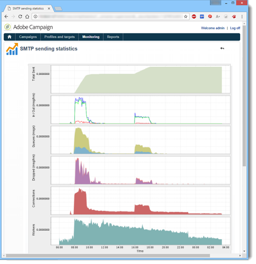
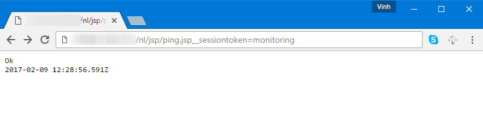

# Überwachungsverfahren{#monitoring-processes}

Der Anwendungsserver und der Weiterleitungsserver (**Tracking**) können manuell oder automatisch überwacht werden.

## Manuelle Überwachung {#manual-monitoring}

Go to **[!UICONTROL Monitoring]** and click the **[!UICONTROL Overview]** link to display the Adobe Campaign process monitoring page.


Auf der angezeigten Seite können Sie den Status der verbundenen Instanz, d. h.:

* Informationen zum Exemplar: Version, Name, Datenbank-Engine, installierte Pakete, Serversystemindikatoren,
* liste fehlender Prozesse und Ausführungsinformationen (Beginn, PID usw.),
* eine Ansicht von Workflows und Versänden.

Weitere Möglichkeiten zur Überwachung der verschiedenen Campaign-Prozesse werden auf [dieser Seite](../../production/using/monitoring-guidelines.md) vorgestellt.

### Protokoll protokollieren {#log-journal}

Es ist möglich, das Protokoll-Protokoll für einen Prozess anzuzeigen. Klicken Sie dazu auf den Prozess, z. B. **mta** , und klicken Sie dann auf das Protokoll-Protokoll **** öffnen.


### Systemindikatoren {#system-indicators}

Die Liste von Systemindikatoren ermöglicht die Anzeige von Informationen über den Rechner, wie z.B. den physischen und virtuellen Speicher, die aktiven Prozesse und den verfügbaren Speicherplatz. Indikatoren unterscheiden sich für Linux- und Windows-Betriebssysteme. Rufen Sie die Seite &quot; **[!UICONTROL Instanzüberwachung]** &quot;auf und klicken Sie auf den Link &quot; **[!UICONTROL Anzeigen]** &quot;, um die Liste der Indikatoren zu öffnen

#### Windows {#in-windows}

* **[!UICONTROL Ausstehende Ereignisse in die Warteschlange]** : für das **Nachrichtencenter**. Weitere Informationen finden Sie in [diesem Abschnitt](../../message-center/using/monitoring-thresholds.md).
* **[!UICONTROL Speicher]** : Informationen zum physischen Speicher (RAM).

   **[!UICONTROL Aktueller Wert]** : tatsächlicher Speicherverbrauch.

   **[!UICONTROL Max. Wert]** : Gesamtspeicherkapazität installiert.

   **[!UICONTROL Verfügbar]** : verfügbare Speicherkapazität.

   **[!UICONTROL Warnung]** : Dieser Indikator wird angezeigt, wenn der Speicherverbrauch 80 % des Gesamtbetrags erreicht.

   **[!UICONTROL Warnung]** : Dieser Indikator wird angezeigt, wenn der Speicherverbrauch 90 % des Gesamtbetrags erreicht.

   Wenn die **[!UICONTROL Warnungs]** - und **[!UICONTROL Warnhinweisanzeigen]** angezeigt werden, können Sie das Problem lösen, indem Sie dem Computer, auf dem der Adobe Campaign-Server installiert ist, RAM hinzufügen. Sie können sich auch entscheiden, den Adobe Campaign-Server auf einem dedizierten Computer zu installieren.

* **[!UICONTROL Speicher]** austauschen: Informationen zum virtuellen Speicher, der mit einer Paging-Datei übereinstimmt: ein Bereich auf der Festplatte, den Windows verwendet, als wäre es RAM.

   **[!UICONTROL Aktueller Wert]** : tatsächlicher Speicherverbrauch.

   **[!UICONTROL Max. Wert]** : Gesamtspeicherkapazität.

   **[!UICONTROL Verfügbar]** : verfügbare Speicherkapazität.

   **[!UICONTROL Warnung]** : Dieser Indikator wird angezeigt, wenn der Speicherverbrauch 80 % des Gesamtbetrags erreicht.

   **[!UICONTROL Warnung]** : Dieser Indikator wird angezeigt, wenn der Speicherverbrauch 90 % des Gesamtbetrags erreicht.

   Wenn die **[!UICONTROL Warn]** - und **[!UICONTROL Warnhinweisindikatoren]** angezeigt werden, können Sie das Problem lösen, indem Sie die Größe der Austauschdatei in den erweiterten Windows-Einstellungen erhöhen.

* **[!UICONTROL Datenträger XXX]** : Informationen über die Lesegeräte.

   **[!UICONTROL Aktueller Wert]** : tatsächlich verwendeter Speicherplatz.

   **[!UICONTROL Max. Wert]** : Gesamtkapazität der Festplatte.

   **[!UICONTROL Verfügbar]** : Speicherplatz verfügbar

   **[!UICONTROL Verwendet]** : prozentualer Anteil des verwendeten Datenträgers.

   **[!UICONTROL Warnung]** : Dieser Indikator wird angezeigt, wenn der verfügbare Speicherplatz 80 % der Gesamtkapazität erreicht.

   **[!UICONTROL Warnung]** : Dieser Indikator wird angezeigt, wenn der verfügbare Speicherplatz 90 % der Gesamtkapazität erreicht.

* **[!UICONTROL Anzahl der Prozesse zu alt]** : Informationen zu Adobe Campaign-Prozessen, die seit mehr als einem Tag aktiv sind.

   **[!UICONTROL Aktueller Wert]** : Anzahl der derzeit aktiven Prozesse.

   **[!UICONTROL Max. Wert]** : Höchstzahl der zugelassenen Prozesse (1).

   **[!UICONTROL Warnung]** : Dieser Indikator wird angezeigt, wenn die Anzahl der Prozesse gleich 1 ist.

   Wenn der **[!UICONTROL Warnhinweis]** angezeigt wird, kann es sein, dass der betreffende Prozess durch die SQL-Datenbank-Engine gesperrt wird oder dass er in einer unendlichen Schleife feststeckt. Der von Adobe Campaign bereitgestellte **Watchdog** -Prozess führt automatisch zu einem erneuten Beginn aller Prozesse und ermöglicht Ihnen, dieses Problem zu lösen. Sie können jedoch auch den entsprechenden Prozess selbst stoppen, um einen erneuten Beginn zu erzwingen.

#### Unter Linux {#in-linux}


* **[!UICONTROL Ausstehende Ereignisse in die Warteschlange]** : für das **Nachrichtencenter**. Weitere Informationen finden Sie in [diesem Abschnitt](../../message-center/using/monitoring-thresholds.md).
* **[!UICONTROL Lastdurchschnitt (1/5/15 Minuten)]** : Informationen zur Last, d. h. der Nutzgeschwindigkeit des Prozessors durch die Prozesse, die auf dem Computer während der letzten Minute, fünf Minuten oder fünfzehn Minuten ausgeführt werden

   **[!UICONTROL Aktueller Wert]** : tatsächliche Belastung der Maschine.

   **[!UICONTROL Max. Wert]** : maximale Nutzlast des Prozesses/der Prozesse auf dem Computer

   **[!UICONTROL Warnung]** : dieser Indikator wird angezeigt, wenn die Last 80 % des maximal zulässigen Wertes über die letzte Minute, fünf Minuten oder fünfzehn Minuten erreicht.

   **[!UICONTROL Warnung]** : dieser Indikator wird angezeigt, wenn die Last 90 % des maximal zulässigen Wertes der letzten Minute, fünf Minuten oder fünfzehn Minuten erreicht.

* **[!UICONTROL Speicher]** : Informationen zum physischen Speicher (RAM).

   **[!UICONTROL Aktueller Wert]** : tatsächlicher Speicherverbrauch.

   **[!UICONTROL Max. Wert]** : Gesamtspeicherkapazität installiert.

   **[!UICONTROL Verfügbar]** : verfügbare Speicherkapazität.

   **[!UICONTROL Warnung]** : Dieser Indikator wird angezeigt, wenn der Speicherverbrauch 80 % des Gesamtbetrags erreicht.

   **[!UICONTROL Warnung]** : Dieser Indikator wird angezeigt, wenn der Speicherverbrauch 90 % des Gesamtbetrags erreicht.

   Wenn die **[!UICONTROL Warnungs]** - und **[!UICONTROL Warnhinweisanzeigen]** angezeigt werden, können Sie das Problem lösen, indem Sie dem Computer, auf dem der Adobe Campaign-Server installiert ist, RAM hinzufügen. Sie können sich auch entscheiden, den Adobe Campaign-Server auf einem dedizierten Computer zu installieren.

* **[!UICONTROL Speicher]** austauschen: Informationen zum virtuellen Speicher, der mit einer Paging-Datei übereinstimmt: ein Bereich auf der Festplatte, den Windows verwendet, als wäre es RAM.

   **[!UICONTROL Aktueller Wert]** : tatsächlicher Speicherverbrauch.

   **[!UICONTROL Max. Wert]** : Gesamtspeicherkapazität.

   **[!UICONTROL Verfügbar]** : verfügbare Speicherkapazität.

   **[!UICONTROL Warnung]** : Dieser Indikator wird angezeigt, wenn der Speicherverbrauch 80 % des Gesamtbetrags erreicht.

   **[!UICONTROL Warnung]** : Dieser Indikator wird angezeigt, wenn der Speicherverbrauch 90 % des Gesamtbetrags erreicht.

   Wenn die **[!UICONTROL Warn]** - und **[!UICONTROL Warnhinweisindikatoren]** angezeigt werden, können Sie das Problem lösen, indem Sie die Größe der Austauschdatei erhöhen.

* **[!UICONTROL Core-Dateien]** : Informationen zu den Dateien, die nach dem Absturz eines Adobe Campaigns generiert wurden. Mit diesen Dateien können Sie die Ursachen des Absturzes ermitteln.

   **[!UICONTROL Aktueller Wert]** : Anzahl der vorhandenen Dateien.

   **[!UICONTROL Max. Wert]** : maximale Anzahl autorisierter Dateien (1).

   **[!UICONTROL Warnung]** : dieser Indikator wird angezeigt, wenn sich die Anzahl der Dateien auf 1 nähert.

   **[!UICONTROL Warnung]** : Dieser Indikator wird angezeigt, wenn die Anzahl der Dateien gleich 1 ist.

   Wenn ein Prozess aufgrund eines Absturzes fehlt, wird er auf der Liste von Prozessen rot angezeigt und automatisch durch den von Adobe Campaign bereitgestellten **Watchdog** -Prozess neu gestartet.

* **[!UICONTROL Anzahl der gemeinsamen Speichersegmente]** : Informationen zu den Speichersegmenten, die von allen Adobe Campaign-Prozessen gemeinsam genutzt werden.

   **[!UICONTROL Aktueller Wert]** : Anzahl der derzeit verwendeten Speichersegmente.

   **[!UICONTROL Max. Wert]** : maximale Anzahl autorisierter Speichersegmente (2).

   **[!UICONTROL Warnung]** : Dieser Indikator wird angezeigt, wenn die Anzahl der Speichersegmente 1 erreicht.

   **[!UICONTROL Warnung]** : Dieser Indikator wird angezeigt, wenn die Anzahl der Speichersegmente 2 erreicht.

* **[!UICONTROL Anzahl der Prozesse zu alt]** : Informationen zu Prozessen, die seit mehr als einem Tag aktiv sind.

   **[!UICONTROL Aktueller Wert]** : Anzahl der derzeit aktiven Prozesse.

   **[!UICONTROL Max. Wert]** : maximale Anzahl genehmigter Prozesse.

   **[!UICONTROL Warnung]** : Dieser Indikator wird angezeigt, wenn die Anzahl der Prozesse 80 % des zulässigen Schwellenwerts erreicht.

   **[!UICONTROL Warnung]** : Dieser Indikator wird angezeigt, wenn die Anzahl der Prozesse 90 % des zulässigen Schwellenwerts erreicht.

* **[!UICONTROL Dateihandles]** : Informationen zu den Dateideskriptoren, d. h. die Anzahl der pro Prozess geöffneten Dateien.

   **[!UICONTROL Aktueller Wert]** : aktuelle Anzahl der Dateideskriptoren.

   **[!UICONTROL Max. Wert]** : maximale Anzahl von Dateideskriptoren, die vom Betriebssystem autorisiert wurden.

   **[!UICONTROL Warnung]** : Dieser Indikator wird angezeigt, wenn die Anzahl der autorisierten Dateideskriptoren den Schwellenwert von 80 % erreicht.

   **[!UICONTROL Warnung]** : Dieser Indikator wird angezeigt, wenn die Anzahl der autorisierten Dateideskriptoren den Schwellenwert von 90 % erreicht.

* **[!UICONTROL Prozesse]** : Informationen über die Maschinenprozesse.

   **[!UICONTROL Aktueller Wert]** : Anzahl der derzeit aktiven Prozesse.

   **[!UICONTROL Max. Wert]** : maximale Anzahl genehmigter Prozesse.

   **[!UICONTROL Aktive Prozesse]** : Anzahl der aktiven Prozesse.

   **[!UICONTROL Inaktive Prozesse]** : Anzahl der inaktiven Prozesse.

   **[!UICONTROL Warnung]** : Dieser Indikator wird angezeigt, wenn die Anzahl der autorisierten Prozesse den Schwellenwert von 80 % erreicht.

   **[!UICONTROL Warnung]** : Dieser Indikator wird angezeigt, wenn die Anzahl der zulässigen Prozesse den Schwellenwert von 90 % erreicht.

* **[!UICONTROL Zombie-Prozesse]** : Informationen zu den Prozessen, die gestoppt wurden, aber dennoch über eine Prozess-ID (PID) verfügen und in der Prozesstabelle sichtbar bleiben.

   **[!UICONTROL Aktueller Wert]** : Anzahl der derzeit aktiven Zombie-Prozesse.

   **[!UICONTROL Max. Wert]** : maximale Anzahl von autorisierten Zombie-Prozessen (2).

   **[!UICONTROL Warnung]** : Dieser Indikator wird angezeigt, wenn die Anzahl der Zombie-Prozesse näher an 2 liegt.

   **[!UICONTROL Warnung]** : Dieser Indikator wird angezeigt, wenn die Anzahl der Zombie-Prozesse 2 erreicht.

#### Benutzerdefinierte Indikatoren {#customized-indicators}

Mit Adobe Campaign können Sie Indikatoren anpassen. Gehen Sie dazu wie folgt vor:

1. Erstellen Sie eine **.sh** -Datei und benennen Sie sie **[!UICONTROL cust_indicator.sh]** .
1. hinzufügen Sie Ihre benutzerdefinierten Indikatoren in diese Datei ein. Beispiel:

   ```
   #!/bin/bash 
   echo "<indicator name='Zombie Processes'>  
   <current label='Current Value' value='0' display=''/>  
   <warning value='2'/>  <alert value='2'/>  
   <max label='Max Value' value='2'/>
   </indicator>"
   ```

   oder

   ```
   #!/bin/bash 
   echo "<indicator name='Availability'>  
   <current label='Last update of data' display='2012-09-03 10:00'/>  
   <current label='Availability last month' display='100.00%'/>  
   <current label='Availability this month' display='100.00%'/> 
   <current label='Recent downtime periods' display='2012-07-04 11:10:00 - 11:19:59'/>
   </indicator>"
   ```

1. Legen Sie die Datei im Ordner **[!UICONTROL usr/local/neolane/nl6]** ab.

Diese Datei wird von Adobe Campaign aufgerufen.

## SMTP-Berichte {#smtp-reports}

SMTP-Versand-Überwachungsberichte sind in die Adobe Campaign-Plattform integriert. Sie können über die Konsole oder über Web-Zugriff aufgerufen werden.

Diese Berichte zeigen die Statistiken zu SMTP-Versänden und SMTP-Fehler nach Domäne an.

Um darauf zugreifen zu können, muss der Operator über Administratorrechte verfügen.

Sie werden unter **Überwachung** > &quot;SMTP-Überwachung&quot;gruppiert.


>[!CAUTION]
>
>* Informationen zur SMTP-Überwachung sind nur verfügbar, wenn der E-Mail-Kanal aktiviert wurde.
>* Die **[!UICONTROL SMTP-Versandstatistik]** wird nur angeboten, wenn der Statistikserver auf der Instanz gestartet wird.

>


### SMTP-Entsendungsstatistik {#smtp-sending-statistics}

Mit dem **[!UICONTROL SMTP-Bericht zur]** Datenübertragung können Sie die Aktivität des Servers steuern. Es zeigt eine Synthese der einzelnen Mtachilds an.



Die Liste der Indikatoren für diesen Bericht ist im Diagramm dargestellt.

1. Gesamtzahl der gesendeten Nachrichten.
1. 
   * Blaue Linie: Nachrichten, die zum Senden bereit sind, die in den Shaper eintrafen, d.h. die letzte Phase vor dem Senden SMTP (fällt mit den eingehenden Daten zusammen).

   * Grüne Linie: erfolgreich gesendete Nachrichten (zeitgleich mit den ausgehenden Daten).

   * Rote Linie: Meldungen, die vom Shaper abgebrochen und an die **mta** zurückgegeben wurden (zeitgleich mit den bei dieser Wiederherstellung abgelehnten Daten).

   Diese Werte werden in Anzahl der Meldungen pro Stunde ausgedrückt.

1. Stellt zwei Warteschlangen des Shapers dar:

   * Blaue Kurve: Warteschlange aktiver Nachrichten. Diese Nachrichten werden so bald wie möglich gesendet.

   * Kaki-Kurve: die Warteschlange &quot;aufgeschoben&quot;. Diese Meldungen können aufgrund von Einschränkungen oder weil keine Verbindung zur Zielgruppe verfügbar ist, momentan nicht zurückgegeben werden. Weitere Zustellversuche finden alle 5, 10, 20, 40, 2 Min. usw. statt. für die definierte **MaxAgeSec** -Zeit vor dem Abbrechen.

1. Diese Diagramme zeigen eine Detailansicht der abgebrochenen Meldungen (rote Kurve auf der zweiten Grafik): es zeigt den Anteil der Nachrichten ohne weitere Zustellversuche (mauve) verlassen, verglichen mit Nachrichten, deren Senden fehlgeschlagen (rot). Auf diese Weise können Sie den Anteil der Nachrichten, die nicht innerhalb des angegebenen Zeitraums verarbeitet werden, aufgrund von Einschränkungen durch den Statistikserver (Einschränken) oder aufgrund der Nichtverfügbarkeit des Remote-Servers Ansicht werden.
1. SMTP-Verbindungen werden geöffnet oder geöffnet.
1. Schätzen der Anzahl der **mtachild**.

>[!NOTE]
>
>Dieser Bericht bezieht sich auf den Status der Komponente &quot;E-Mail-Traffic-Shaper&quot;.

### SMTP-Fehler pro Domäne {#smtp-errors-per-domain}

Mit diesem Bericht können Sie die Versand-Fehler über einen bestimmten Zeitraum nach Domäne aufschlüsseln.

>[!NOTE]
>
>Die **Optionen minConnectionsToLog**, **minErrorsToLog** und **minMessagesToLog** der Datei **serverConf.xml** definieren die Schwellenwerte, oberhalb derer Verbindungsstatistiken berücksichtigt werden.


Die Liste der Indikatoren für diesen Bericht ist nachstehend aufgeführt.

* Die Spalte **Domäne** enthält den Namen der Domäne, an die die Nachrichten gesendet werden (oder den tatsächlichen Domänennamen, z. B. yahoo.com für yahoo.fr),
* In der **Spalte &quot;Anhang** &quot;wird die Anzahl der für diese Domäne geöffneten SMTP-Verbindungen angezeigt.
* Die Spalte **Gesendet** entspricht der Anzahl der an diese Domäne gesendeten Nachrichten,
* In der Spalte &quot; **Lautstärke** &quot;wird das Volumen der Meldungen angezeigt, die an diese Domäne gesendet werden sollen (Näherungswert),
* In der Spalte &quot; **Fehler** &quot;wird ein Volumenindikator für Fehler in dieser Domäne im Zeitraum angezeigt.
* In der Spalte **Letzte Antwort** wird die letzte SMTP-Antwortmeldung angezeigt, die für diese Domäne empfangen wurde.
* In der Spalte &quot; **Datum** &quot;wird das Datum der letzten SMTP-Antwort angezeigt, die für diese Domäne eingegangen ist.

>[!NOTE]
>
>Die in den Spalten **Anhang**, **Gesendet** und **Volumen** angezeigten Werte werden anhand des im Feld **[!UICONTROL Zeitraum]** ausgewählten Zeitraums berechnet.

Klicken Sie auf einen Domänennamen, um dessen Fehler Ansicht.

Sie werden nach PublicId kategorisiert: Diese Kennung entspricht einer IP-Adresse, die von mehreren Adobe Campaign-Mtas hinter einem Router gemeinsam verwendet wird. Der Statistikserver verwendet diese Kennung, um die Verbindungs- und Versand-Statistik zwischen diesem Startpunkt und dem Zielgruppen-Server zu speichern.


Im Feld **[!UICONTROL Inhaber der Domäne]** können Sie verschiedene Domänennamen unter derselben Bezeichnung gruppieren. In der ersten Ansicht des Berichts werden alle MX-Domänennamen diesem Inhaber zugeordnet.

Klicken Sie auf einen PublicId-Bezeichner, um weitere Ansichten anzuzeigen.


>[!NOTE]
>
>Der Prozentsatz der Fehler wird durch zwei Diagramme dargestellt. Die erste ist eine horizontale Fortschrittsleiste auf einem schwarzen Hintergrund. Das zweite Diagramm ist chronologisch. Der ausgewählte Zeitraum ist in zwölf Zeitintervalle unterteilt, die jeweils durch eine vertikale Fortschrittsleiste dargestellt werden. Wenn in beiden Darstellungen kein Fehler erkannt wurde, ist der Balken schwarz. Die Farbe der Leiste hängt vom Prozentsatz der aufgetretenen Fehler ab (gelb, dann orange und schließlich rot). Die Farbe Grau bedeutet, dass kein erhebliches Datenvolumen gefunden wurde. Sie können den genauen Prozentsatz der Fehler anzeigen, indem Sie den Cursor auf das Diagramm setzen.

>[!NOTE]
>
>Weitere Informationen zu SMTP-Fehlern und deren Verwaltung im Adobe Campaign finden Sie in [diesem Abschnitt](../../installation/using/email-deliverability.md).

## Rechnungsstellungsbericht {#billing-report}

Der technische Arbeitsablauf für die **[!UICONTROL Rechnungsstellung]** sendet den Systembericht per E-Mail an den Rechnungs-Aktivität-Operator. Er wird standardmäßig am 25. jedes Monats ausgelöst.

Der technische Arbeitsablauf befindet sich in einem Unterordner des folgenden Knotens: **Administration** > **Produktion** > **Technischen Workflows**.


Sobald der Workflow alle 25 Monate gestartet wird, erhält Ihr Rechnungsführer den folgenden Bericht in seinem Posteingang.


Die folgenden Metriken stehen zur Verfolgung Ihrer Versand zur Verfügung:

* **[!UICONTROL Beginn]** : Beginn des Versands. Beachten Sie, dass es früher als das &quot;Von&quot;-Datum des Berichts sein kann.
* **[!UICONTROL Beschriftung]** : Etikett des Versands. Versand mit weniger als 100 zu sendenden Meldungen gelten als zu klein und werden daher nach dem Datum des Beginns aggregiert. In diesem Fall zeigt das Etikett die Anzahl der Aggregat an, z. B. die [Aggregation von 3 kleinen Versänden].
* **[!UICONTROL Gesamtvolumen]** : Gesamtvolumen der für den Versand übertragenen Bytes.
* **[!UICONTROL Durchschn. Volumen]** : Durchschnittliches Volumen der übertragenen Bytes. Dies ist das Ergebnis der folgenden Formel **(Gesamtvolumen/Meldungen)**, die die Berechnungsgrundlage der **[!UICONTROL Multiplikator]** -Metrik darstellt.
* **[!UICONTROL Nachrichten]** : Anzahl der gesendeten Nachrichten. Dazu gehören sowohl Nachrichten, die erfolgreich gesendet wurden, als auch weitere Zustellversuche (nach dem Empfang einer Absprungmeldung vom kontaktierten Server).
* **[!UICONTROL Multiplikator (x)]** : Der Wert des Multiplikators wird vom durchschnittlichen Volumen der Nachrichten abgezogen.
* **[!UICONTROL Anzahl]** : Ergebnis der Multiplikation der Nachrichten und der Multiplikator.

## Automatische Überwachung {#automatic-monitoring}

Adobe Campaign Angebot mehrere automatische Überwachungsmethoden, die nachfolgend beschrieben werden.

### Befehlszeile {#command-line}

Befehl

**nlserver-Monitor**

Ermöglicht die Liste einer Reihe von Indikatoren auf den Adobe Campaign- und Systemmodulen.

Die Ausgabe wird in einem einfach zu verarbeitenden XML-Format generiert.

Dieser Befehl kann auch mit dem **fehlenden** Parameter ausgeführt werden, der die in dieser Instanz fehlenden Prozesse Liste, wenn die Konfigurationsdateien angeben, dass sie ausgeführt werden sollen.

```
nlserver monitor -missing
HH:MM:SS > Application server for Adobe Campaign Classic (7.X YY.R build XXX@SHA1) of DD/MM/YYYY
mta@prod
stat@prod
wfserver@prod
```

### Vom Server veröffentlichte Informationen {#information-published-by-the-server}

#### /r/test {#r-test}

Die Seite **http(s)://`<application>`/r/test** wird zum Testen des Umleitungsservers verwendet. Es wird empfohlen, die zur Verfolgung verwendeten Frontserver mit derselben Methode zu testen. Diese Seite kann auch zum Testen eines Load Dispatchers verwendet werden.

Es wird eine Zeile wie die folgende im XML-Format angezeigt:

```
<redir status='OK' date='YYYY-MM-DD HH:MM:SS.112Z' build='XXXX' host='<hostname>' localHost='<servername>'/>
```

**Häufigkeit**: dieser Test nutzt keine Last und kann daher sehr oft ausgeführt werden (z.B. einmal pro Sekunde).

#### /nl/jsp/ping.jsp {#nl-jsp-ping-jsp}

Diese **Seite http(s)://`<Application server url>`/nl/jsp/ping.jsp** funktioniert genauso wie das entsprechende Netzwerkunternehmen: Es testet eine komplette Abfrage, die durch apache/tomcat/web module/database läuft und auf den Client hochgeladen wird. Wenn alles korrekt funktioniert, wird &quot;OK&quot;zurückgegeben. Wir empfehlen, diesen Test auf Computern mit Zugriff auf die Datenbanken (z.B. mtas und Umfragen) durchzuführen.

**Nutzung**: Ein Sitzungstoken, das mit einer Operatoranmeldung verknüpft ist, muss als Argument übergeben werden, um sich remote anmelden zu können (siehe Tipp in [Automatische Überwachung über Adobe Campaign-Skripte](#automatic-monitoring-via-adobe-campaign-scripts)).

Beispiel:



Der Operatorname und die Anmeldung müssen zuvor in der Adobe Campaign-Client-Konsole mit Datenbankrechten konfiguriert werden.


**Häufigkeit**: dies ist ein Test, der sehr wenig Bandbreite verwendet. Es kann also ziemlich oft, aber nicht mehr als einmal pro Minute ausgeführt werden.

#### /nl/jsp/monitor.jsp {#nl-jsp-monitor-jsp}

Dies ist ein Test, um zu überprüfen, ob ein Operator über eine Webseite auf den Adobe Campaign-Server zugreifen kann. dieselbe Webseite wie die über die Menüs in der Client-Konsole. Sie können diese Seite über Ihre Überwachungstools (Tivoli, Nagios usw.) aufrufen.


**Nutzung**: Ein Sitzungstoken, das mit einer Operatoranmeldung verknüpft ist, mit der Sie eine Verbindung zur Instanz herstellen können, muss als Argument verwendet werden (siehe die Tipps in [Automatische Überwachung über Adobe Campaign-Skripte](#automatic-monitoring-via-adobe-campaign-scripts)).

Der Operator und seine Anmeldung müssen zuvor in der Adobe Campaign-Client-Konsole mit den entsprechenden Datenbankrechten und -beschränkungen konfiguriert werden.

**Häufigkeit**: Dies ist ein vollständiger Servertest und muss nicht oft ausgeführt werden (z. B. alle zehn Minuten).

#### /nl/jsp/soaprouter.jsp {#nl-jsp-soaprouter-jsp}

Diese **jsp** -Datei stellt den Einstiegspunkt der Adobe Campaign-Anwendungs-APIs dar. Sie kann daher eine detaillierte Überwachung des Antrags vornehmen. Es kann auch zur Überwachung von Adobe Campaign-Webdiensten verwendet werden. Es wird in unseren Überwachungs-Skripten verwendet, aber beachten Sie, dass es nur für Strombenutzer gilt.

### Überwachung anhand von Bereitstellungstypen {#monitoring-based-on-deployment-types}

Adobe Campaign ermöglicht verschiedene Bereitstellungskonfigurationen (weitere Informationen finden Sie in [diesem Abschnitt](../../installation/using/hosting-models.md)). In diesem Abschnitt werden die verschiedenen automatischen Überwachungstechniken beschrieben, die je nach Installationstyp anzuwenden sind.

<table> 
 <thead> 
  <tr> 
   <th> Bereitstellungstyp </th> 
   <th> Monitoring    </th> 
  </tr> 
 </thead> 
 <tbody> 
  <tr> 
   <td> Eigenständig </td> 
   <td> 
    <ul> 
     <li><p> <span class="uicontrol">/r/test</span> und <span class="uicontrol">/nl/jsp/monitor.jsp</span> auf dem Adobe Campaign-Server</p> </li> 
    </ul> </td> 
  </tr> 
  <tr> 
   <td> Standard </td> 
   <td> 
    <ul> 
     <li><p> <span class="uicontrol">/r/test</span> und <span class="uicontrol">/nl/jsp/ping.jsp</span> auf den Frontservern</p> </li> 
     <li><p> <span class="uicontrol">/nl/jsp/monitor.jsp</span> auf dem Anwendungsserver</p> </li> 
    </ul> </td> 
  </tr> 
  <tr> 
   <td> Unternehmen </td> 
   <td> 
    <ul> 
     <li><p> <span class="uicontrol">/r/test</span> und <span class="uicontrol">/nl/jsp/ping.jsp</span> auf den Frontservern</p> </li> 
     <li><p> <span class="uicontrol">/r/test</span> und <span class="uicontrol">/nl/jsp/monitor.jsp</span> auf dem Anwendungsserver</p> </li> 
    </ul> </td> 
  </tr> 
  <tr> 
   <td> Mid-Sourcing </td> 
   <td> 
    <ul> 
     <li><p> <span class="uicontrol">/nl/jsp/monitor.jsp</span> auf dem Anwendungsserver</p> </li> 
    </ul> </td> 
  </tr> 
 </tbody> 
</table>

## Automatische Überwachung über Adobe Campaign-Skripte {#automatic-monitoring-via-adobe-campaign-scripts}

Adobe Campaign kann ein Instanzenüberwachungstool (netreport) bereitstellen, mit dem Sie einen Bericht über die erkannten Anomalien per E-Mail senden können.


>[!CAUTION]
>
>Dieses Tool kann zur Überwachung Ihrer Instanzen verwendet werden, wird jedoch nicht von Adobe Campaign unterstützt. Weitere Informationen erhalten Sie von Ihrem Kampagne-Administrator.

### Erforderliche Elemente {#required-elements}

Für die automatische Überwachung sind folgende Vorsichtsmaßnahmen vor der Installation erforderlich:

* Sie müssen über die Dateien **netreport.tgz** (Linux-Installation) oder **netreport.zip** (Windows-Installation) verfügen,
* Wir empfehlen Ihnen dringend, keine Überwachung auf dem zu überwachenden Rechner zu installieren.
* Es muss auf einem Computer mit JRE oder JDK installiert sein,
* unter Linux muss der zu überwachende Rechner das **bc** -Paket haben. Weiterführende Informationen hierzu finden Sie in [diesem Abschnitt](../../installation/using/installing-packages-with-linux.md#distribution-based-on-rpm--packages).

### Installationsverfahren {#installation-procedure}

Das Installationsverfahren sieht wie folgt aus:

1. Erstellen Sie in der Konsole bei Bedarf einen neuen Operator (der &quot;Überwachungsbenutzer&quot;ist bereits vorhanden), weisen Sie jedoch keine Rechte zu.
1. Führen Sie Archiv-Extraktion aus.
1. Lesen Sie die **Readme** -Datei.
1. Aktualisieren Sie die Konfigurationsdatei &quot; **netconf.xml** &quot;.
1. Aktualisieren Sie die Datei **netreport.bat** (Windows) oder **netreport.sh** (Linux).

### Konfigurieren der Datei &quot;netconf.xml&quot; {#configuring-the-netconf-xml-file}

Die XML-Konfigurationsdatei enthält die folgenden Elemente:

* [Element &quot;Eigenschaften&quot;](#properties--element)
* [&#39;Instance&#39;-Element](#instance--element)
* [&#39;Host&#39;-Element](#host--element)
* [Unterelemente](#sub-elements)

Im Folgenden finden Sie ein Konfigurationsbeispiel:

```
<?xml version="1.0" encoding="ISO-8859-1"?>
<netconf>
  <properties mailServer="mail.adobe.net" mailFrom="mail@adobe.com" recipientList="recipient@adobe.com">
    <nightMode start="00:00 am" end="07:00 am"/>
    <buildRange minimum="7829" maximum="8180"/>
    <buildRange minimum="8300" maximum="8400"/>
    <sla/>
  </properties>

  <instance name="dev" recipientList="mail@mail.com,mail2@mail.com">
                <host name="devrd.domain.com" alias="devrd" sessiontoken="monitoring" criticalLevel="1" filter="wkf;new">
                                <ncs instance="devrd" url="/nl/jsp/soaprouter.jsp" includeDead="false" isSecure="false"/>
                                <redir url="/r/test"/>
                                <http url="/nl/jsp/ping.jsp"/>
                </host>
                <host name="devtrk.domain.com" alias="devtrk" sessiontoken="monitoring" criticalLevel="0" filter="wkf;new">
                                <ncs instance="devrd" url="/nl/jsp/soaprouter.jsp" includeDead="true" isSecure="false"/>
                </host>
  </instance>
  <host name="dev-test" alias="dev-test" sessiontoken="monitoring" criticalLevel="2">
                <ncs instance="dev" url="/nl/jsp/soaprouter.jsp" includeDead="false"/>
  </host>
</netconf>
```

>[!NOTE]
>
>Sie können verschiedene Konfigurationen angeben, indem Sie der Datei &quot; **netconf.xml** &quot;ein Suffix hinzufügen, z. B. **netconf-dev.xml**, **netconf-prod.xml** usw. Geben Sie dann die Konfiguration für die Ausführung des Berichts netreport in den **netreport.bat** - oder **netreport.sh** -Dateien an, indem Sie **$JAVA_HOME/bin/java netreport dev** oder **@%JAVA_HOME%binjava netreport prod** hinzufügen.

>[!CAUTION]
>
>Damit der **Überwachungsoperator** funktioniert, muss sich der Computer, auf dem der Netzwerkbericht ausgeführt wird, in einer Sicherheitszone befinden, die sich im **sessionTokenOnly** -Modus befindet. Wenn für diesen Operator keine vertrauenswürdige IP-Maske angegeben wurde, muss sich die Sicherheitszone auch im **allowEmptyPassword** - und **allowUserPassword** -Modus befinden.

#### Element &quot;Eigenschaften&quot; {#properties--element}

Dieses Element wird verwendet, um die Konfiguration von E-Mails, d.h.

* **mailServer**: SMTP-Server zum Senden von E-Mails (z. B.: smtp.domain.net).
* **mailFrom**: E-Mail-Adresse des Berichtssenders (z. B.: monitoring@domain.net).
* **empfängerList**: die Liste der E-Mail-Adressen der Empfänger zur Überwachung. Die Adressen müssen durch Kommas getrennt werden (keine Leerzeichen).
* Der Modus &quot;**Nacht**&quot;(optional) wird verwendet, um das Senden von E-Mails zwischen dem angegebenen Zeitraum zu vermeiden. Stattdessen werden die Daten konsolidiert, und nach Ablauf der Aktivität wird eine E-Mail zur Nachtzeit gesendet (standardmäßig 7:00 Uhr).
* Mit dem **BuildRange** -Unterelement (optional) können Sie eine Mindest- und eine Höchstaufbaunummer angeben. Für alle Computer, deren Build-Nummer nicht in diesen Bereich fällt, wird ein Fehler generiert.

   ```
   <buildRange minimum="0000" maximum="9999"/>
   ```

* Sie können ein **`<sla>`** (optionales) Unterelement zum **properties** -Element hinzufügen. Eine Protokolldatei wird jedes Mal generiert, wenn der netreport ausgeführt wird. Der Name der Datei enthält den Konfigurationsnamen sowie Datum und Uhrzeit, z. B. **dev_06_12_13_16_47_05.tmp**. Die Datei enthält die folgenden Informationen: Instanzname, Computername, Schweregrad, (0 bis 3, vom kritischsten zum kritischsten), Datum (Zeitstempelformat), Zeitraum (in Millisekunden) zwischen der Abfrage und der Antwort, Dienst verwendet (http, ncs, ncsex, redir). Diese Informationen werden am Ende jedes Dienstes durch Tabulatorzeichen und Zeilenumbrüche getrennt.

>[!NOTE]
>
>Das **Attribut persistHtmlFile** mit dem Wert &quot;true&quot;im **`<property>`** -Element wird verwendet, um den neuesten Überwachungsstatus in der Datei **netreport.md** aufzuzeichnen. Diese Datei wird im Installationsverzeichnis gespeichert.

#### &#39;Instance&#39;-Element {#instance--element}

Mit diesem Element können Sie mehrere Computer (Hosts) in derselben Instanz gruppieren. Die Instanznamen werden im ersten Teil der Überwachungs-E-Mail angezeigt. Sie können auf den Namen einer Instanz klicken, um Details zu den einzelnen Computern aufzurufen.

```
instance name="instanceName" recipientList="mail@mail.com,mail2@mail.com">
                <host name="devcamp.domain.com" ...>
                       ...
                </host>
                <host name="devtrack.domain.com" ...>
                       ...
                </host>
</instance
```

* **name**: Instanzname, der im ersten Teil der E-Mail angezeigt wird.
* **empfängerList** (optional): können Sie einen Überwachungsbericht zu einer bestimmten Instanz per E-Mail senden.

#### &#39;Host&#39;-Element {#host--element}

Dieses Element konfiguriert die Überwachung eines bestimmten Servers auf dem Host, d.h.

* **name**: Name des zu überwachenden Geräts.
* **alias** (optional): Name des überwachten Computers, wie er im Bericht angezeigt wird.
* **sessionToken**: stellt die Authentifizierung über ein autorisiertes Sitzungstoken bereit.

   Um das Sitzungstoken zu konfigurieren, wählen Sie den **Überwachungs** -Operator in der Adobe Campaign-Konsole aus. Geben Sie auf der Registerkarte &quot; **Zugriffsrechte** &quot;die IP-Adressen der Computer an, die berechtigt sind, diese Instanz zu überwachen. Anschließend können Sie mit dem **Überwachungsbezeichner und ohne Angabe eines Kennworts eine Verbindung zur Überwachungsseite herstellen** .

   

* **criticalLevel** (optional): können Sie Fehler sortieren, die nach der Schwere angezeigt werden sollen. Mögliche Werte sind &quot;0&quot;(alle Ebenen werden angezeigt), &quot;1&quot;(nur hohe und kritische Fehler) und &quot;2&quot;(nur kritische Fehler angezeigt). Wenn dieses Attribut nicht angegeben ist, werden alle Fehlerebenen angezeigt.
* **filter** (optional): können Sie bestimmte Workflow-Fehler ausschließen, z. B. **filter=&quot;wkf;wkf1&quot;**. Workflow-Beschriftungen müssen durch Semikolons getrennt werden.

#### Unterelemente {#sub-elements}

* **tcp**: überprüft, ob der Server ausfällt oder nicht. Sie müssen eine Anschlussnummer eingeben.
* **http**: überprüft, ob der Webserver vorhanden ist (Anwendungsserver betriebsbereit).
* **ncs**: prüft die Prozesse für die Instanz, die im Attribut &quot;instance&quot;eingegeben wurde (Workflow-Fehler, Speicherbelegung usw.). Mit dem Attribut **include** (mandatory) können Sie tote Prozesse anzeigen (&quot;true&quot;- oder &quot;false&quot;-Werte).
* **redir**: überprüft die Verfolgung.

In den meisten Fällen können nur die Unterelemente **ncs** und **redir** beibehalten werden.

In jedem Fall können bestimmte Knoten in den Unterelementen überladen werden (z. B. der Knoten **port=75** , um den für die Verbindung http, ncs oder redir verwendeten Anschluss zu überladen):

```
<ncs instance="clap40" url="/nl/jsp/soaprouter.jsp" includeDead="false" port="80"/>
```

In den **Unterelementen ncs**, **redir** und **http** können Sie das Attribut **isSecure** (optional) hinzufügen, um zu entscheiden, ob das HTTPS-Protokoll (&quot;true&quot;- oder &quot;false&quot;-Werte) verwendet werden soll oder nicht. Wenn dieses Attribut nicht angegeben ist, wird das HTTP-Protokoll verwendet.

### Konfigurieren der Datei &quot;netreport.bat&quot;oder &quot;netreport.sh&quot; {#configuring-the-netreport-bat-or-netreport-sh--file}

Um sie zu konfigurieren, bearbeiten Sie diese Datei und geben Sie an, in welchem Ordner JRE oder JDK installiert ist.

### Starten der Überwachung {#launching-monitoring}

Um die Überwachung zu starten, führen Sie die Datei **netreport.bat** oder **netreport.sh** in regelmäßigen Abständen über ein Skript aus. Ein Bericht wird nach der ersten Ausführung und dann nur im Ereignis einer Statusänderung gesendet.

### Überwachung testen {#testing-monitoring}

Führen Sie zum Testen der Überwachung die Datei **netreport.bat** oder **netreport.sh** aus.

Eine E-Mail wird an die Empfänger gesendet, die in der **Datei** netconf.xml **in der Datei** empfängerListangegeben sind.
