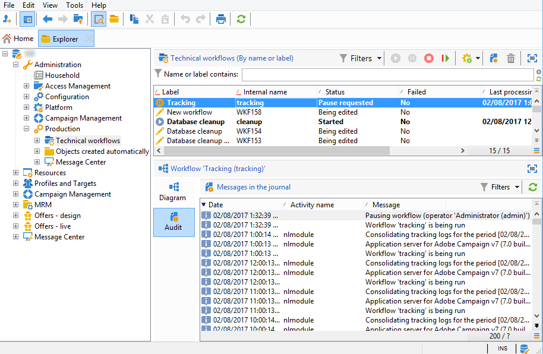

# Probleme mit Trackinglogs{#tracking-logs-issues}

Es kann mehrere Gründe dafür geben, dass Trackinglogs nicht weitergeleitet werden. Es wird empfohlen, die folgenden Informationen zu überprüfen:

* **Enthält der** Tracking **-Workflow Fehler?**

Weitere Informationen finden Sie in der [Dokumentation zu Campaign v8](https://experienceleague.adobe.com/docs/campaign/automation/workflows/monitoring-workflows/monitor-technical-workflows.html?lang=de){target="_blank"}.

* **Läuft das Modul** trackinglogd **auf dem Server?**

  Siehe [Protokolldateien](../../production/using/log-files.md).

* **Wurden Änderungen vorgenommen?**

  Sie können einen Verbindungsverlust zu den Servern durch die Verwendung des Tracking-Alias in Trigger bringen.
