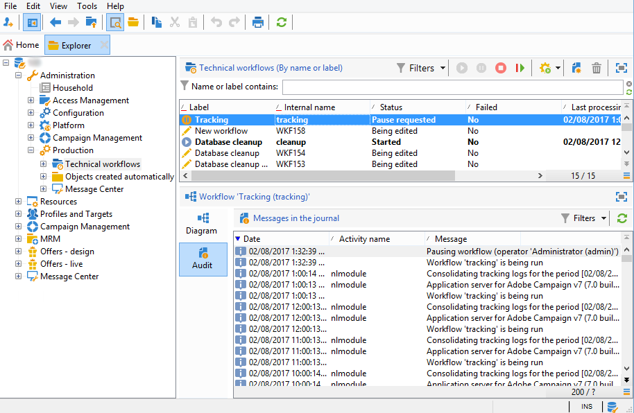

# Probleme mit Trackingprotokollen{#tracking-logs-issues}

Es kann mehrere Gründe geben, warum Verfolgungsprotokolle nicht weitergeleitet werden. Es wird empfohlen, die folgenden Informationen zu überprüfen:

* Hat der **Tracking** -Arbeitsablauf Fehler?

   Weitere Informationen finden Sie unter Technische Arbeitsabläufe [überwachen](../../workflow/using/monitoring-technical-workflows.md).

   

* Wird das Modul **trackinglogd** auf dem Server ausgeführt?

   Siehe [Protokolldateien](../../production/using/log-files.md).

* Wurden Änderungen vorgenommen? Sie können mithilfe des Verfolgungsalias einen Verlust der Verbindung zu den Servern auslösen.

