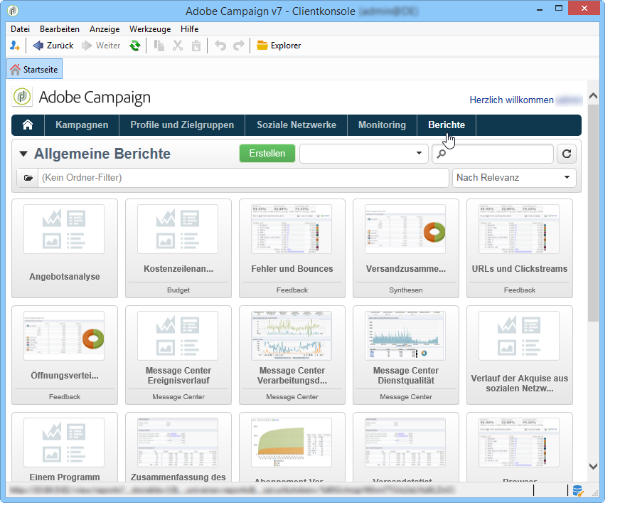
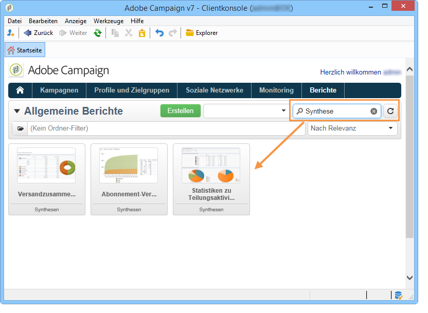
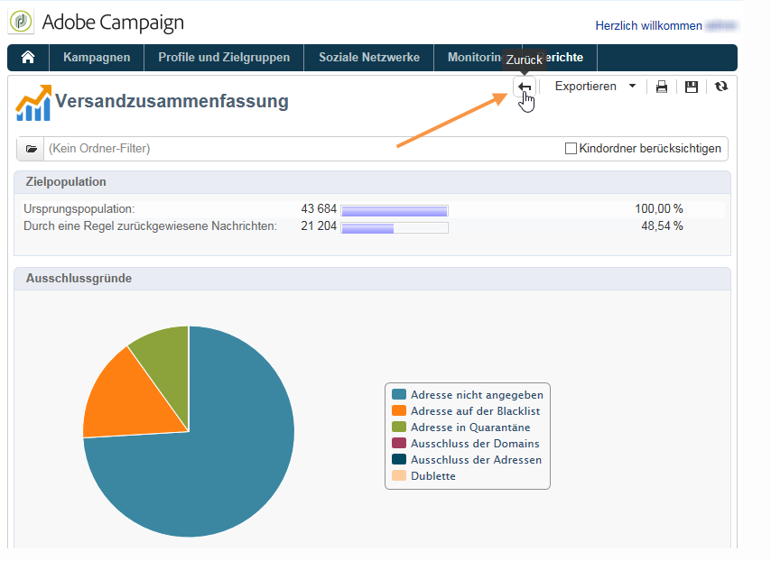
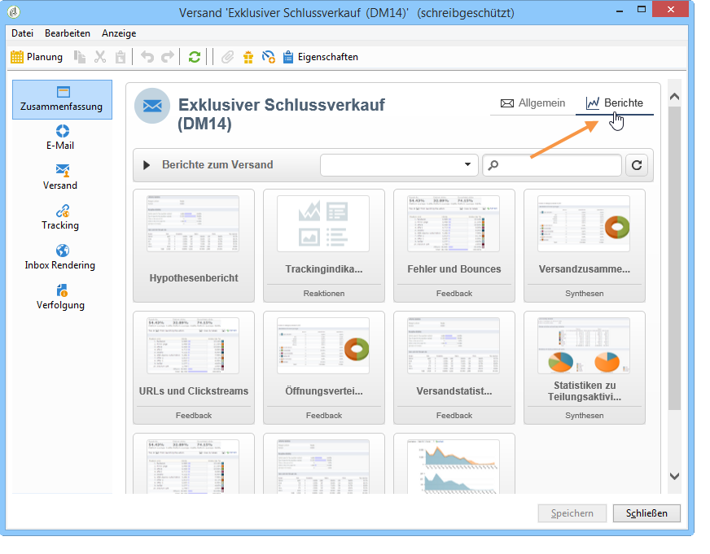
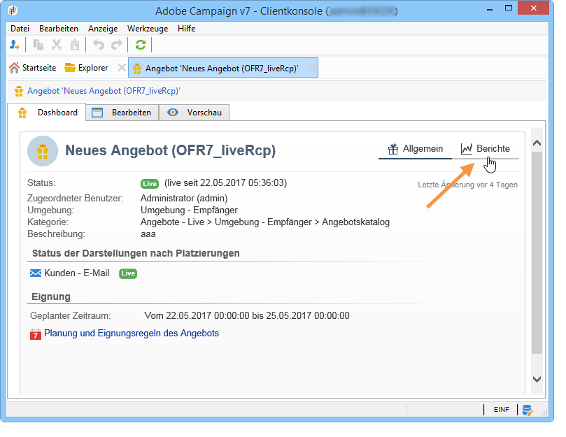

# Über native Berichte in Campaign{#about-campaign-built-in-reports}

Dieses Kapitel enthält eine Liste der nativen Adobe-Campaign-Berichte, ihren Inhalt und den Kontext ihrer Verwendung. Die nachfolgenden Erläuterungen sollen es den Benutzern ermöglichen, standardmäßig in der Plattform verfügbare Berichte zu nutzen und somit unnötigen Konfigurationsaufwand zu vermeiden.

>[!NOTE]
>
>Außerdem erfahren Sie, wie Sie Ihre eigenen Berichte zum Tab **[!UICONTROL Berichte]** hinzufügen. Weiterführende Informationen dazu finden Sie auf dieser [Seite](../../reporting/using/configuring-access-to-the-report.md#defining-the-filtering-options).

Eine detaillierte Darstellung dieser Berichte findet sich in den der jeweiligen Funktion entsprechenden Handbüchern.

Adobe Campaign bietet diverse Berichte, auf die über die Konsole oder einen Webbrowser Zugriff besteht.

Folgende Berichttypen stehen zur Verfügung:

* Berichte zur gesamten Plattform, siehe [Allgemeine Berichte](../../reporting/using/global-reports.md).
* Versandberichte, siehe [Versandberichte](../../reporting/using/delivery-reports.md).
* Zusammenfassende Berichte, siehe [Zusammenfassende Berichte](../../reporting/using/cumulative-reports.md).

Der Zugriff auf Berichte ist über die Startseite der Clientkonsole, das Bericht-Dashboard oder die Versandliste möglich. Der Anzeigemodus eines Berichts hängt vom Kontext ab. Die wichtigsten Berichte stehen auf der Startseite zur Verfügung und ermöglichen einen schnellen Zugang zu Versanddaten. Die zugrunde liegende Liste kann Ihren Bedürfnissen entsprechend angepasst werden. Weitere Informationen dazu finden Sie in [diesem Abschnitt](../../reporting/using/about-reports-creation-in-campaign.md).

Zugriff auf native Campaign-Berichte:

1. Wählen Sie in der Benutzeroberfläche von Adobe Campaign den Tab **[!UICONTROL Berichte]** aus.

   

1. Mithilfe des Suchfelds können die angezeigten Berichte gefiltert werden.

1. Durch Klick auf einen Bericht wird dieser geöffnet.

   

1. Klicken Sie oben im Bildschirm auf den Link **[!UICONTROL Zurück]**, der wieder zur Berichtsliste zurückführt.

   

Andere Möglichkeiten zur Bearbeitung eines Berichts werden auf dieser [Seite](../../reporting/using/actions-on-reports.md) beschrieben.

Kampagnen- oder versandspezifische Berichte können über die jeweiligen Dashboards eingesehen werden.

Der Zugriff auf Berichte über Listen, Dienste, Angebote etc. erfolgt auf die gleiche Weise:

