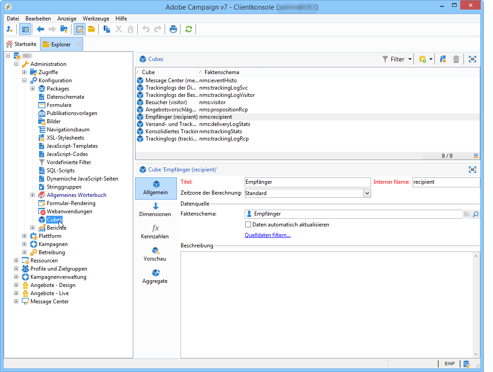
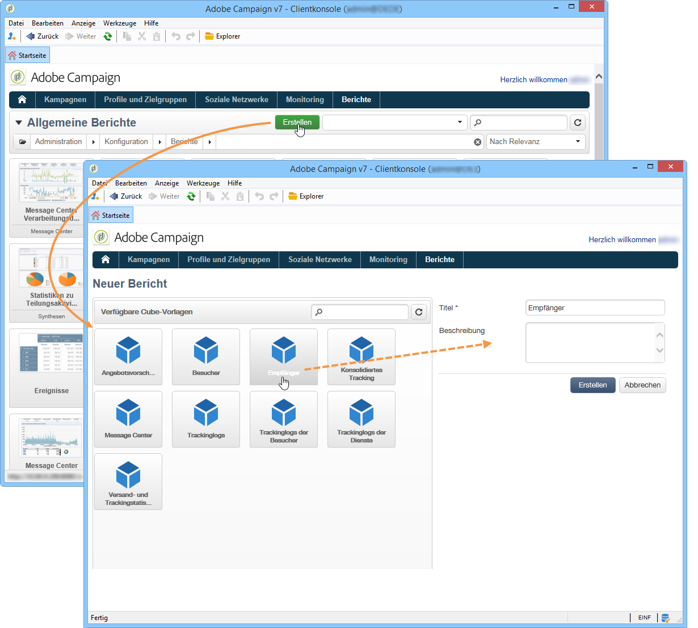
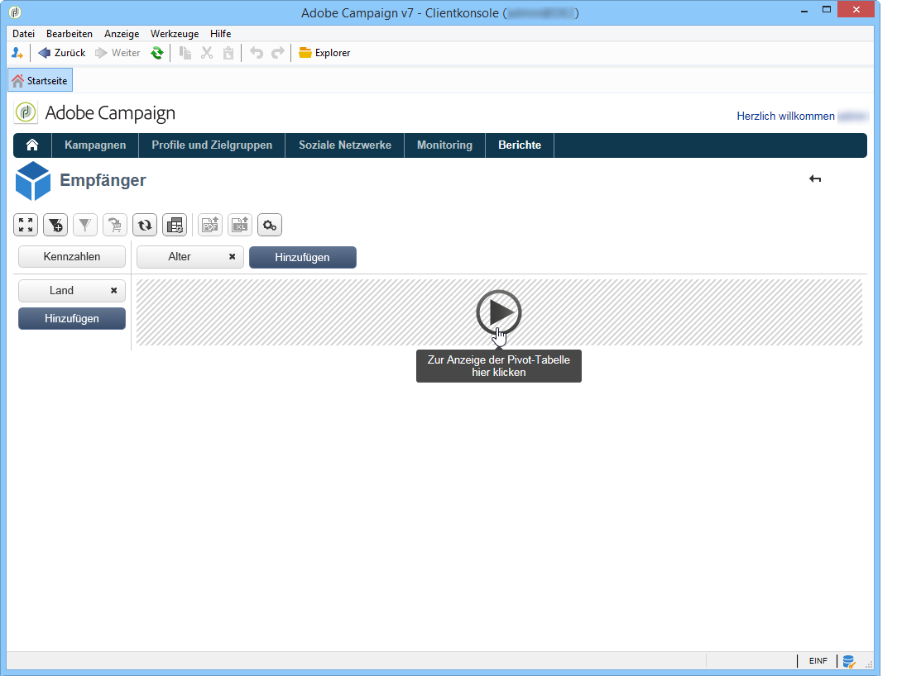
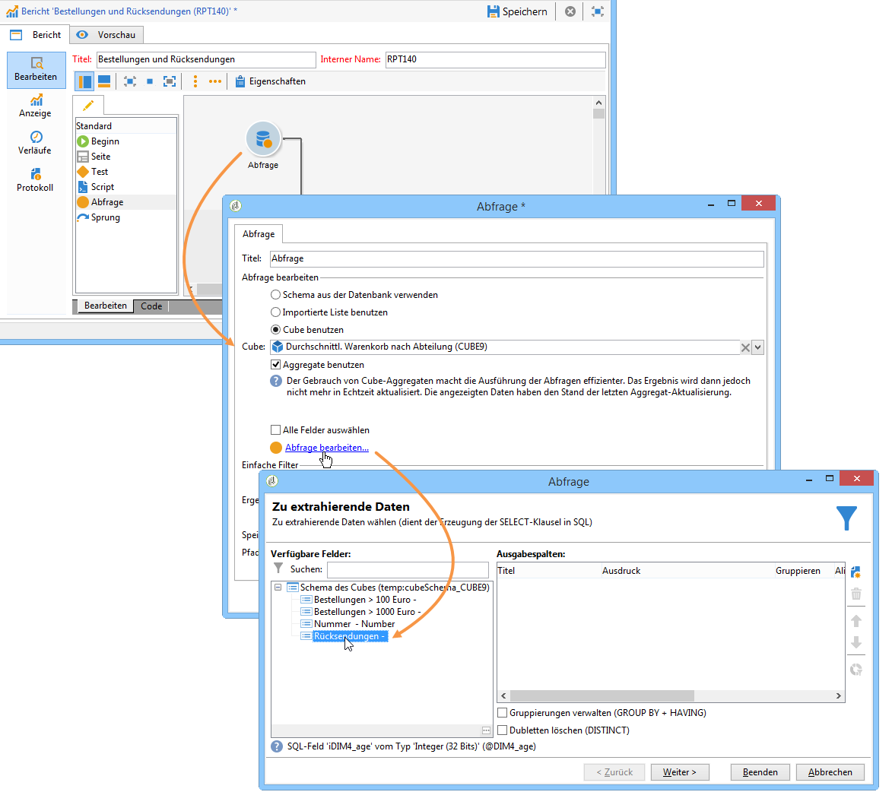
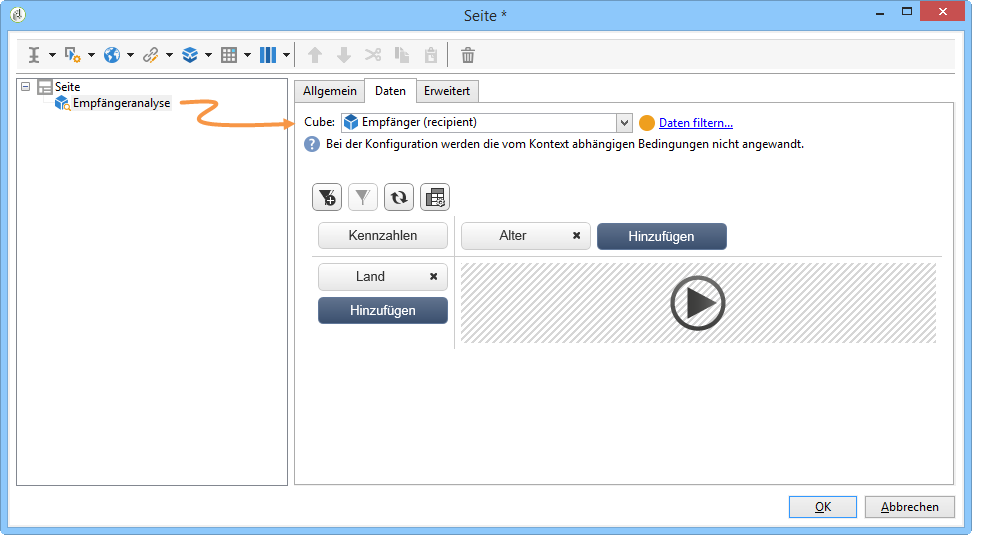

# Über Cubes{#about-cubes}

Die Analyse von Daten aus der Datenbank ist mithilfe des Moduls **Marketing Analytics** möglich. Damit können Daten analysiert und gemessen, Statistiken berechnet sowie die Erstellung und Berechnung von Berichten vereinfacht und optimiert werden. Ergänzend bietet Marketing Analytics die Möglichkeit, Berichte zu erstellen und darin Zielpopulationen zu konstruieren. Letztere können daraufhin in Listen gespeichert und z. B. als Zielgruppen von Sendungen in Adobe Campaign genutzt werden.

Cubes werden zur Erzeugung von bestimmten nativen Berichten genutzt, insbesondere in den Versandberichten (Versand-, Klick-, Öffnungsverfolgung etc.). Auf Cubes basierende Berichte dürfen standardmäßig nur für Datenvolumen unter 5 Millionen Zeilen genutzt werden.

Dies ermöglicht es, die Kapazitäten zur Datenexploration und -analyse optimal zu nutzen. Gleichzeitig wird die Konfiguration der Berichte und Tabellen für den Endbenutzer vereinfacht: Es muss nur ein existierender, vollständig konfigurierter Cube bei der Bericht- oder Tabellenerstellung ausgewählt werden, um dessen Berechnungen, Kennzahlen und Statistiken zu übernehmen.

Nach ihrer Erstellung und Konfiguration werden die Cubes in den Abfrage-Aktivitäten der Berichte und Webanwendungen genutzt. Sie können außerdem in Pivot-Tabellen verwendet und verändert werden.

>[!CAUTION]
>
>**Marketing Analytics** ist ein Adobe-Campaign-Modul. Es muss auf Ihrer Instanz installiert sein, damit Sie die unten beschriebenen Funktionen nutzen können.

Mit dem Marketing-Analytics-Modul bietet Campaign die folgenden Möglichkeiten:

1. Die Erstellung von Cubes, um

   * Daten zu aggregieren und in einer Arbeitstabelle zu speichern, um Indikatoren im Voraus zu berechnen;
   * auf diese Weise das in den verschiedenen Berechnungen der Berichte und Abfragen bewegte Datenenvolumen zu reduzieren und die Berechnungszeit der Indikatoren deutlich zu optimieren;
   * den Datenzugriff zu erleichtern und Benutzern nach verschiedenen Dimensionen geordnete - unter Umständen voraggregierte - Daten zur Verfügung zu stellen.

   Weitere Informationen hierzu finden Sie im Abschnitt [Cubes erstellen](../../reporting/using/creating-indicators.md).

1. Die Erstellung von Pivot-Tabellen, um

   * berechnete Daten und konfigurierte Kennzahlen zu analysieren,
   * die anzuzeigenden Daten sowie ihren Anzeigemodus auszuwählen,
   * die verwendeten Kennzahlen anzupassen,
   * nicht technischen Benutzern interaktive Analyse-Tools anzubieten.

   Weitere Informationen hierzu finden Sie unter [Cubes zur Datenanalyse verwenden](../../reporting/using/using-cubes-to-explore-data.md).

1. Die Erstellung von Abfragen über in einem Cube berechnete und aggregierte Daten.
1. Die Identifizierung von Populationen und deren Referenzierung in Listen.

## Terminologie {#terminology}

Im Kontext von Cubes sind folgende Grundbegriffe von Bedeutung:

* Cube

   Ein Cube ist eine multidimensionelle Darstellung von Informationen: Er stellt Endbenutzern für die interaktive Datenanalyse konzipierte Strukturen zur Verfügung.

* Faktentabelle/-schema

   Die Faktentabelle (oder das Faktenschema) enthält Roh- oder Elementardaten, die als Basis für Analysen dienen. Es handelt sich insbesondere um Tabellen, die hohe Datenvolumen enthalten (ggf. mit verknüpften Tabellen) und deren Berechnungen zeitintensiv sein können.

   Die Broadlog- oder die Bestelltabelle sind Beispiele für Faktentabellen.

* Dimension

   Dimensionen ermöglichen die Segmentierung der Daten in Gruppen: Nach ihrer Erstellung werden die Dimensionen zu Analyseachsen. In den meisten Fällen werden für eine Dimension mehrere Ebenen bestimmt. Für eine zeitliche Dimension beispielsweise sind Monate, Tage, Stunden etc. mögliche Ebenen. Diese Ebenen stellen die Hierarchie der Dimension dar und ermöglichen eine mehr oder weniger detaillierte Datenanalyse.

* Klassierung

   Für bestimmte Felder können Klassierungen bestimmt werden, die eine Gruppierung der Werte ermöglichen und die Lesbarkeit der Informationen erleichtern. Die Klassierungen erfolgen in Bezug auf verschiedene Niveaus.

   Es wird empfohlen, eine Klassierung zu definieren, wenn es viele verschiedene Werte gibt.

* Kennzahl

   Gängige Kennzahlen sind Summe, Durchschnitt, Maximum, Minimum, Standardabweichung etc.

   Kennzahlen können berechnet werden: Zum Beispiel wäre die Annahmerate eines Angebots das Verhältnis von der Anzahl der Vorschläge dieses Angebots zu der Anzahl von Annahmen.

## Arbeitsbereich Cube {#cube-workspace}

Cubes befinden sich im Knoten **[!UICONTROL Administration > Konfiguration > Cubes]**.

Die hauptsächlichen Verwendungskontexte der Cubes sind folgende:

* Datenanalyse innerhalb von Berichten. Diese werden in der gleichnamigen Rubrik ausgehend von der Plattform-Startseite entworfen.****

   Erstellen Sie hierzu einen neuen Bericht und wählen Sie den zu verwendenden Cube.

   

   Cubes stellen Vorlagen dar, auf deren Basis Berichte erstellt werden. Klicken Sie nach der Auswahl einer Vorlage auf die Schaltfläche **[!UICONTROL Erstellen]**, um den entsprechenden Bericht zu konfigurieren und zu visualisieren.

   Sie können die Kennzahlen anpassen, den Anzeigemodus ändern oder eine Tabelle konfigurieren und dann den Bericht über die zentrale Schaltfläche erzeugen.

   

* Referenzierung in **[!UICONTROL Abfrage]**-Aktivitäten von Berichten zur Nutzung der Cube-Indikatoren:

   

* Sie können außerdem eine auf einem Cube basierte Pivot-Tabelle in eine beliebige Seite eines Berichts einfügen. Referenzieren Sie hierzu den zu verwendenden Cube im Tab **[!UICONTROL Daten]** der Pivot-Tabelle der betreffenden Seite.

   

   Weitere Informationen hierzu finden Sie unter [Daten eines Berichts analysieren](../../reporting/using/using-cubes-to-explore-data.md#exploring-the-data-in-a-report).

