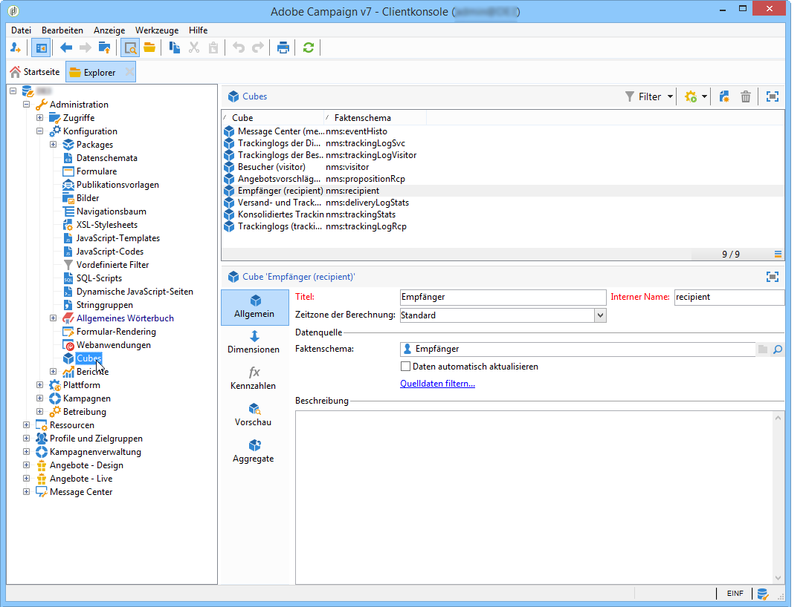
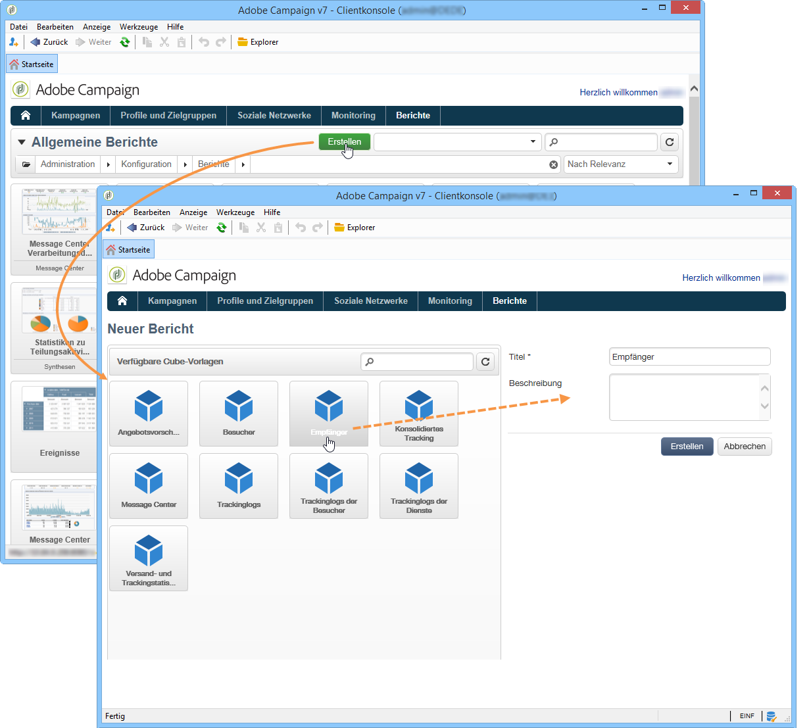
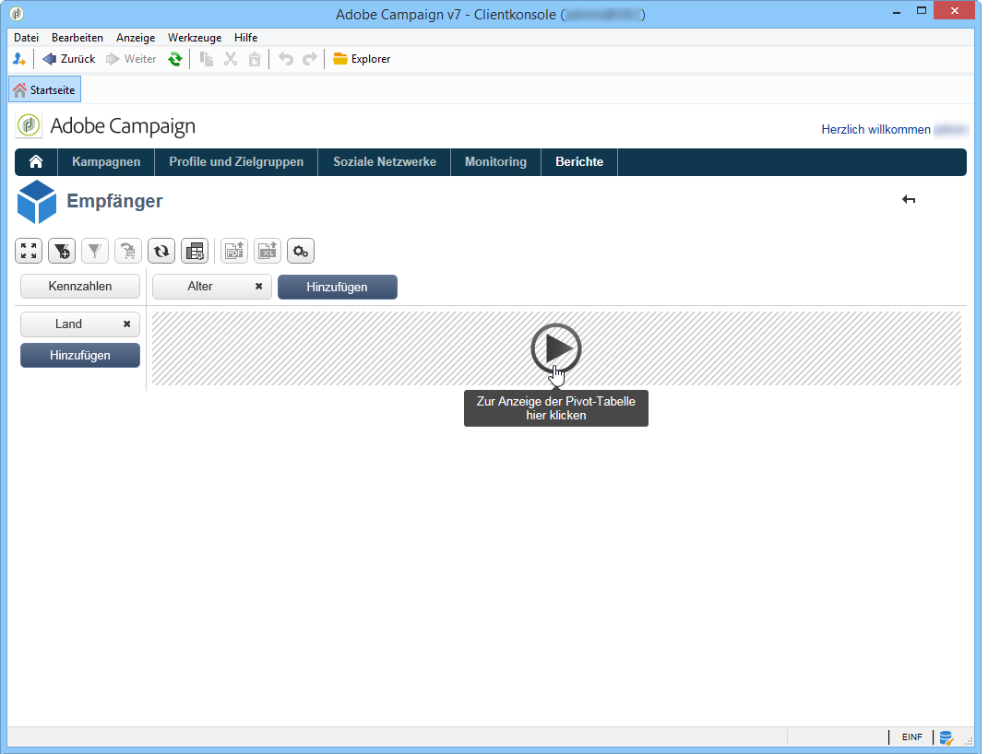
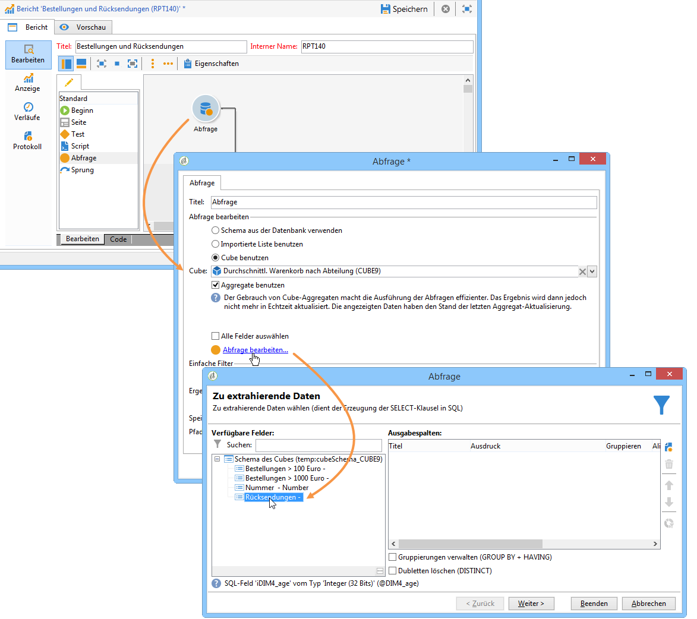
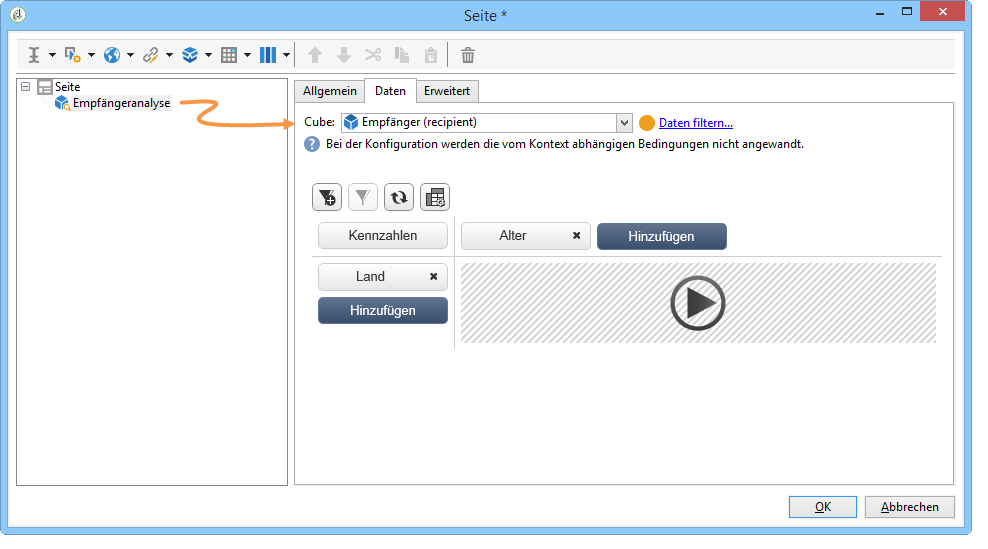

# Erste Schritte mit Cubes{#about-cubes}

## Terminologie {#terminology}

Unten finden Sie eine Liste der spezifischen Begriffe bei der Arbeit mit Cubes.

* **Cube** – Ein Cube ist eine Darstellung mehrdimensionaler Informationen: Er bietet Endnutzern Strukturen für die interaktive Datenanalyse.

* **Faktentabelle/-schema** – Die Faktentabelle (oder das Faktenschema) enthält die Roh- oder Elementardaten, auf denen die Analysen basieren. Hierbei handelt es sich hauptsächlich um Tabellen mit großen Volumen (möglicherweise mit verknüpften Tabellen) und potenziell langen Berechnungen. Die Broadlog- oder die Bestelltabelle sind Beispiele für Faktentabellen.

* **Dimension** – Mit Dimensionen können Sie Daten in Gruppen unterteilen: Nach ihrer Erstellung dienen die Dimensionen als Analyseachsen. In den meisten Fällen werden für eine bestimmte Dimension mehrere Ebenen definiert. Für eine zeitliche Dimension sind die Ebenen beispielsweise Monate, Tage, Stunden, Minuten etc. Dieser Satz von Ebenen stellt die Dimensionshierarchie dar und ermöglicht verschiedene Ebenen der Datenanalyse.

* **Klassierung** – Für einige Felder können Sie eine Klassierung definieren, um Werte zu gruppieren und die Lesbarkeit der Informationen zu vereinfachen. Die Klassierung wird auf Ebenen angewendet. Es wird empfohlen, eine Klassierung zu definieren, wenn es viele verschiedene mögliche Werte gibt.

* **Kennzahl** – Die häufigsten Kennzahlen sind Summe, Durchschnitt, Maximum, Minimum, Standardabweichung etc. Kennzahlen können berechnet werden: Zum Beispiel bezeichnet die Annahmerate eines Angebots das Verhältnis der Anzahl der unterbreiteten Angebote verglichen mit der Anzahl der angenommenen Angebote.

## Arbeitsbereich Cube {#cube-workspace}

Cubes befinden sich im Knoten **[!UICONTROL Administration > Konfiguration > Cubes]**.

Die hauptsächlichen Verwendungskontexte der Cubes sind folgende:

* Datenexporte können direkt in einem Bericht durchgeführt werden, der im Tab **[!UICONTROL Berichte]** der Adobe Campaign-Plattform konzipiert wurde.

  Erstellen Sie hierzu einen neuen Bericht und wählen Sie den zu verwendenden Cube.

  

  Cubes sehen aus wie Vorlagen, auf deren Grundlage Berichte erstellt werden. Klicken Sie nach der Auswahl einer Vorlage auf die Schaltfläche **[!UICONTROL Erstellen]**, um den entsprechenden Bericht zu konfigurieren und zu visualisieren.

  Sie können die Kennzahlen anpassen, den Anzeigemodus ändern oder eine Tabelle konfigurieren und dann den Bericht über die zentrale Schaltfläche erzeugen.

  

* Referenzierung in **[!UICONTROL Abfrage]**-Aktivitäten von Berichten zur Nutzung der Cube-Indikatoren:

  

* Sie können außerdem eine auf einem Cube basierte Pivot-Tabelle in eine beliebige Seite eines Berichts einfügen. Referenzieren Sie dazu den Cube, damit er auf der Registerkarte **[!UICONTROL Daten]** der Pivot-Tabelle auf der entsprechenden Seite verwendet wird.

  

  Weitere Informationen hierzu finden Sie unter [Erkunden der Daten in einem Bericht](../../reporting/using/using-cubes-to-explore-data.md#exploring-the-data-in-a-report).
