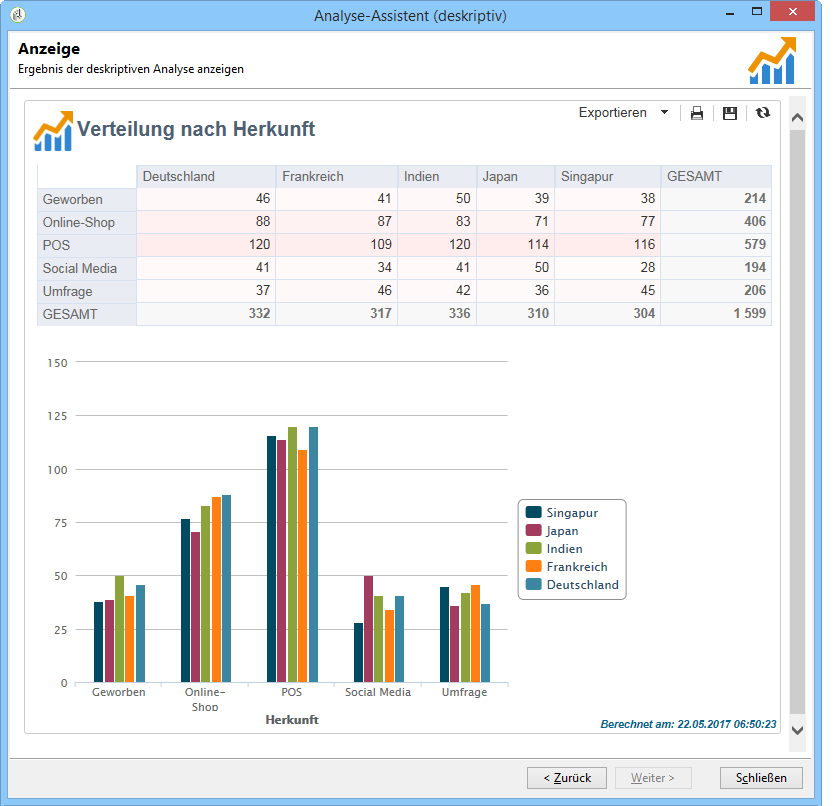
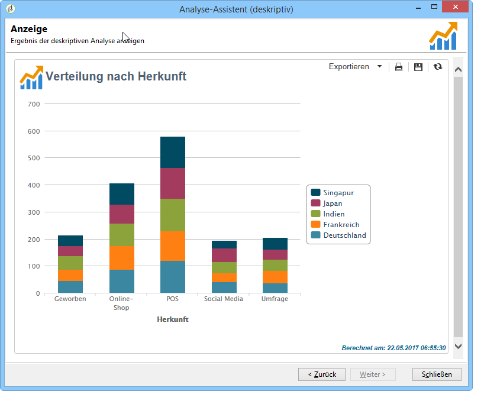
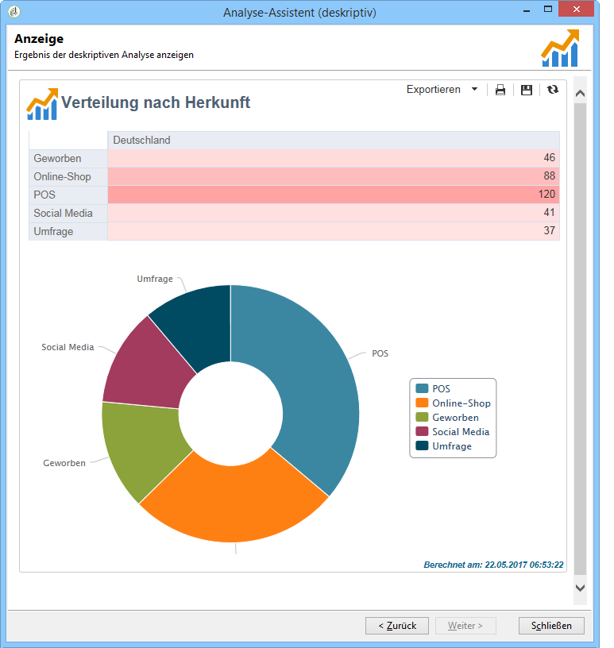
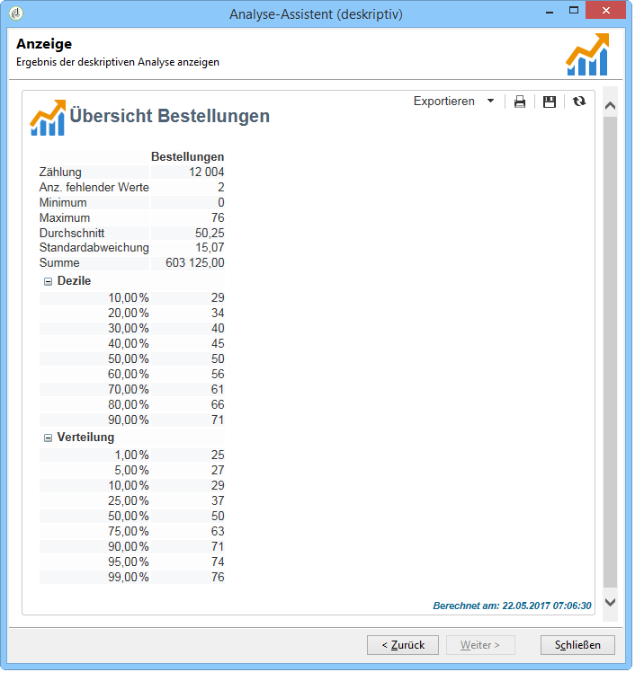

# Erste Schritte mit der deskriptiven Analyse{#about-descriptive-analysis}

Um Statistiken über Daten Ihrer Datenbank zu erzeugen, können Sie Berichte mit deskriptiven Analysen über einen dedizierten Assistenten erstellen und Inhalt und Darstellung entsprechend Ihren Vorstellungen anpassen.

Diese Berichte beziehen sich auf Populationen und sind der Analyse geringer Datenvolumen vorbehalten.

Sie haben die Wahl zwischen Berichten für quantitative oder qualitative Analysen. Eine qualitative Analyse bietet folgende Darstellungsformen:

* Tabelle und Histogramm:

  

* Säulendiagramm ohne Tabelle:

  

* Verteilung nach Segmenten

  

Eine quantitative Analyse bietet globale Statistiken über numerische Daten der zugrundeliegenden Auswahl, wie im folgenden Beispiel:

Im Assistenten zur deskriptiven Analyse werden in mehreren Schritten der zu erzeugende Berichtstyp sowie die Daten und ihre Formatierung ausgewählt. Der Bericht wird im letzten Schritt angezeigt. Bei Bedarf kann der Bericht freigegeben und mit anderen Benutzern geteilt, gedruckt oder in verschiedenen Formaten exportiert werden (Excel, PDF oder OpenDocument).

Berichte der deskriptiven Analyse sind weniger leistungsfähig als Adobe-Campaign-Berichte, ermöglichen aber einen schnellen Überblick über den Inhalt der Datenbank oder ausgewählte Daten.

>[!CAUTION]
>
>Die deskriptive Analyse ist nicht für die Exploration großer Datenvolumen geeignet.
