# Mit Berichten arbeiten{#actions-on-reports}

Über die oberhalb der Berichtansicht gelegene Symbolleiste können verschiedene Aktionen ausgeführt werden. Diese werden im Folgenden dargestellt.

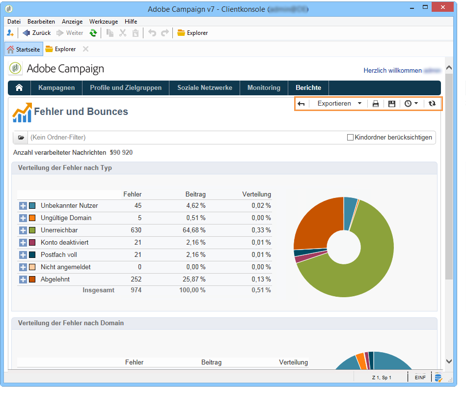

Die Symbolleiste bietet die Möglichkeit, den Bericht zu exportieren, zu drucken, in einem Webbrowser anzuzeigen oder einen Verlauf des Berichts zu erstellen.

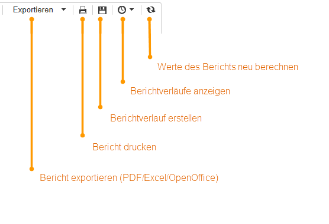

## Berichtexport {#exporting-a-report}

Wählen Sie in der Dropdown-Liste das Format aus, in dem der Bericht exportiert werden soll: .xls, .pdf oder .ods.

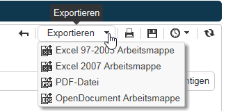

Wenn ein Bericht mehrere Seiten enthält, muss der Vorgang für jede Seite wiederholt werden.

Sie können Ihren Bericht für den Export im PDF-, Excel- oder OpenOffice-Format konfigurieren. Öffnen Sie den Adobe-Campaign-Explorer und wählen Sie den betreffenden Bericht aus.

Export options are accessed via the **[!UICONTROL Page]** activities of the report, in the **[!UICONTROL Advanced]** tab.

Ändern Sie die Einstellungen von **[!UICONTROL Paper]** und **[!UICONTROL Margins]** passen Sie Ihre Anforderungen an. Sie können auch den Export einer Seite nur im PDF-Format genehmigen. Deaktivieren Sie dazu die **[!UICONTROL Activate OpenOffice/Microsoft Excel export]** Option.

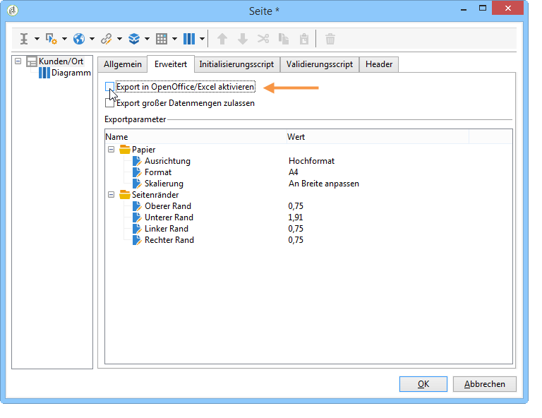

### Nach Microsoft Excel exportieren {#exporting-into-microsoft-excel}

For **[!UICONTROL List with group]** type reports destined to be exported into Excel, the following recommendations and limitations apply:

* Die Berichte dürfen keine leeren Zeilen enthalten.

   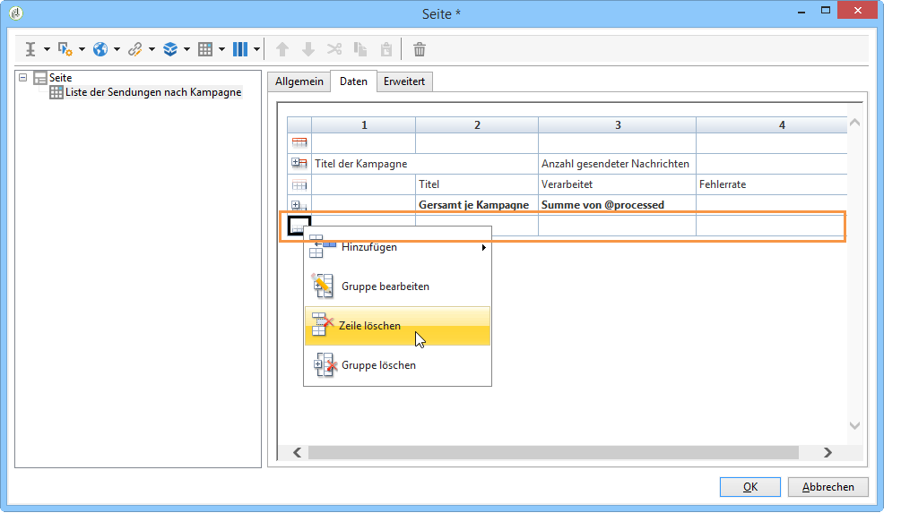

* Die Legende der Liste muss ausgeblendet sein.

   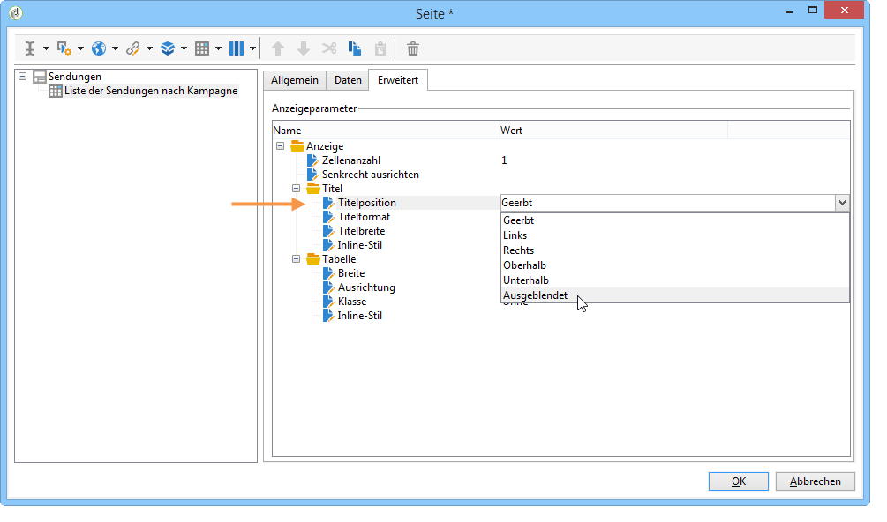

* Die Berichte müssen keine spezielle Formatierung verwenden, die auf Zellenebene definiert ist. Es empfiehlt sich, das Format der Zellen in der Tabelle **[!UICONTROL Form rendering]** zu definieren. Der Zugriff **[!UICONTROL Form rendering]** ist über **[!UICONTROL Administration > Configuration > Form rendering]**.
* Es wird empfohlen, keinen HTML-Inhalt einzufügen.
* Wenn ein Bericht mehrere Elemente vom Typ Tabelle, Grafik etc. enthält, werden diese untereinander exportiert.
* Sie können den Wagenrücklauf in Zellen erzwingen: Diese Konfiguration wird in Excel beibehalten. Weitere Informationen hierzu finden Sie in diesem [Definieren des Zellenformats](../../reporting/using/creating-a-table.md#defining-cell-format).

### Export verzögern {#postpone-the-export}

Sie haben die Möglichkeit, den Export eines Berichts zu verzögern, z. B. um auf asynchrone Aufrufe zu warten. Geben Sie hierzu den folgenden Parameter im Initialisierungsscript der Seite an:

```
document.nl_waitBeforeRender = true;
```

Bedienen Sie sich zur Aktivierung des Exports und zur Konvertierung ins PDF-Format der Funktion **document.nl_renderToPdf()** ohne Parameter.

### Speicher zuteilen {#memory-allocation}

Beim Export von gewissen umfangreichen Berichten kann es zu Problemen bei der Speicherzuteilung kommen.

In einigen Instanzen ist der in der Konfigurationsdatei **serverConf.xml** angegebene Standardwert **maxMB** (**SKMS** bei gehosteten Instanzen) im JavaScript mit 64 MB angegeben. Wenn beim Export von Berichten Fehler bezüglich Speichermangel auftreten, empfiehlt es sich, diesen Wert auf 512 MB zu erhöhen:

```
<javaScript maxMB="512" stackSizeKB="8"/>
```

Um die Änderungen der Konfiguration zu übernehmen, ist ein Neustart des **nlserver**-Dienstes erforderlich.

Weiterführende Informationen zur Datei **serverConf.xml** finden Sie in [diesem Abschnitt](../../production/using/configuration-principle.md).

Weiterführende Informationen zum **nlserver**-Service finden Sie in [diesem Abschnitt](../../production/using/administration.md).

## Berichte drucken {#printing-a-report}

Sie haben die Möglichkeit, Ihren Bericht zu drucken. Klicken Sie hierzu auf das Drucker-Symbol. Das Druck-Dialogfenster öffnet sich.

Um ein besseres Ergebnis zu erzielen, bearbeiten Sie die Druckoptionen in Internet Explorer und wählen Sie **[!UICONTROL Print background colors and images]**.

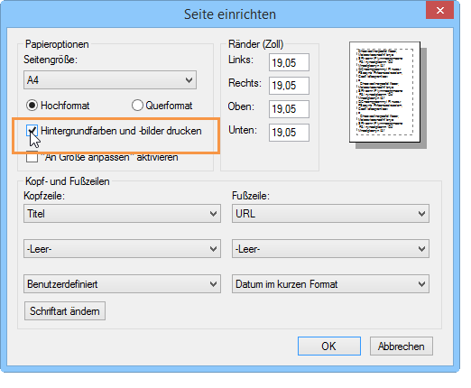

## Berichtverläufe erstellen {#creating-report-archives}

Die Erstellung eines Verlaufs ermöglicht es Ihnen, die Entwicklung der Berichtsdaten über die Zeit zu beobachten. Zudem können Statistiken eines bestimmten Zeitpunkts eingesehen werden.

Um einen Verlauf zu erstellen, öffnen Sie den betreffenden Bericht und klicken Sie auf das Symbol zur Verlaufserstellung.

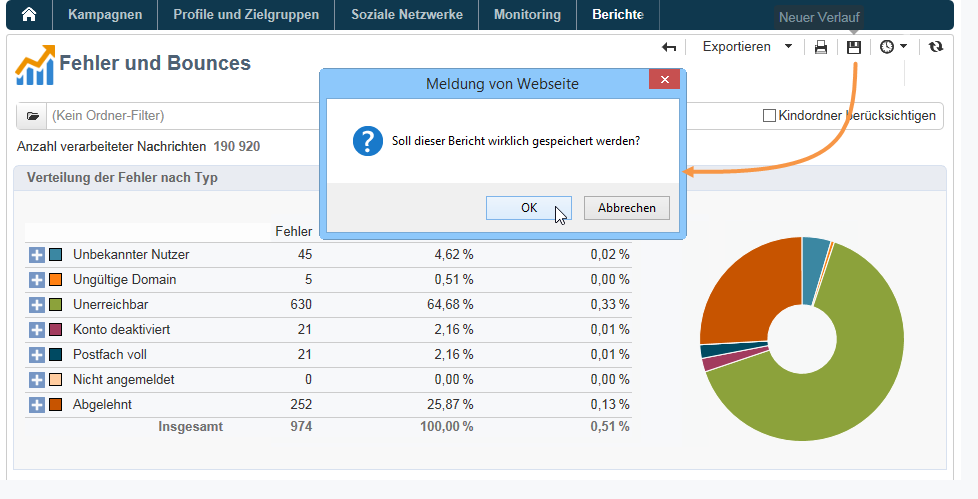

Durch Klick auf das entsprechende Symbol können Sie die existierenden Verläufe aus- oder einblenden.

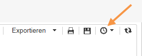

Die gespeicherten Verläufe können über das Ein-/Ausblende-Symbol angezeigt werden. Klicken Sie auf einen Verlauf, um ihn einzusehen.

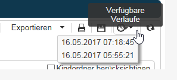

Es ist möglich, ein Berichtsarchiv zu löschen. Gehen Sie dazu zum Adobe Campaign-Knoten, in dem Ihre Berichte gespeichert sind. Klicken Sie auf die **[!UICONTROL Archives]** Registerkarte, wählen Sie die zu löschende aus und klicken Sie auf **[!UICONTROL Delete]**.

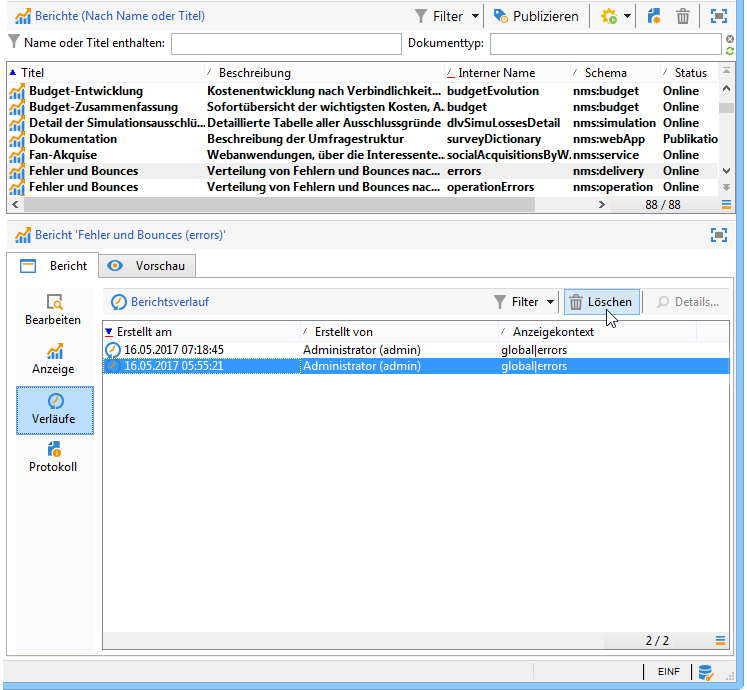

