# Aktionen mit Berichten{#actions-on-reports}


Wenn Sie einen Bericht anzeigen, können Sie in der Symbolleiste eine bestimmte Anzahl von Aktionen ausführen. Diese sind im Folgenden aufgeführt.

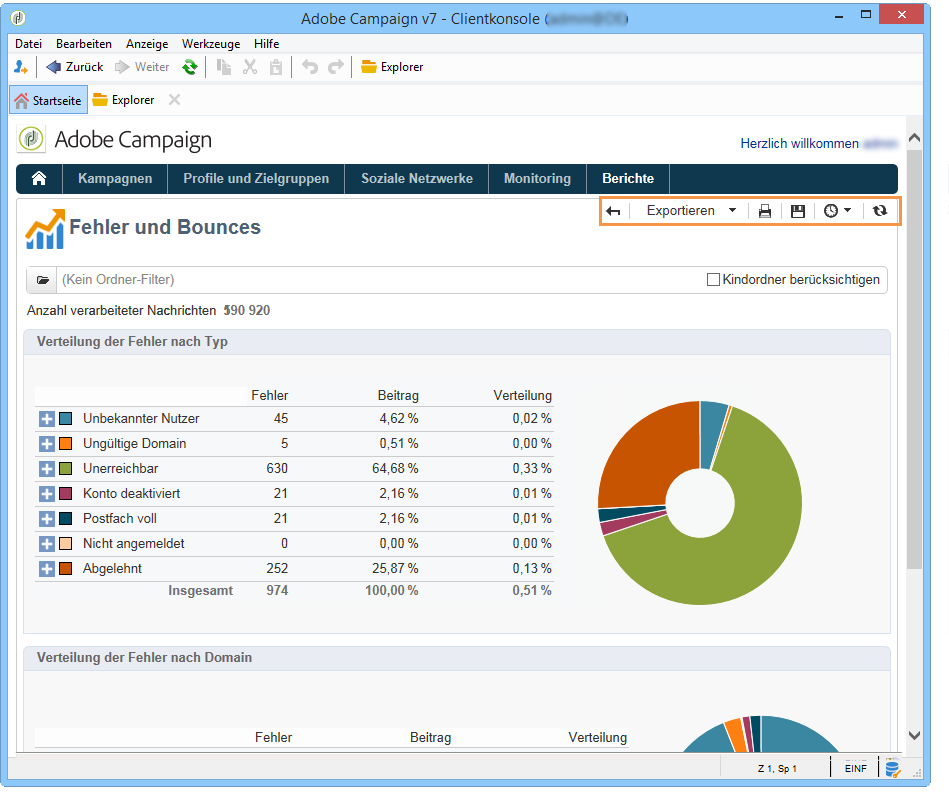

Die Symbolleiste bietet die Möglichkeit, den Bericht zu exportieren, zu drucken, in einem Webbrowser anzuzeigen oder einen Verlauf des Berichts zu erstellen.

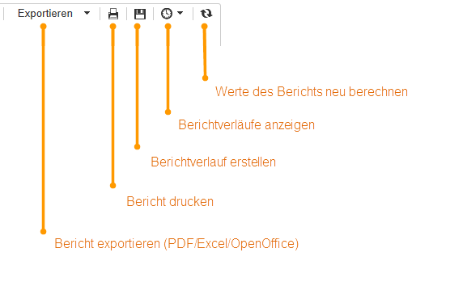

## Exportieren eines Berichts {#exporting-a-report}

Wählen Sie aus der Dropdown-Liste das Format aus, in das Sie Ihren Bericht exportieren möchten. (.xls, .pdf oder .ods).

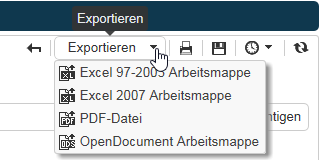

Wenn ein Bericht mehrere Seiten enthält, muss der Vorgang für jede Seite wiederholt werden.

Sie können Ihren Bericht konfigurieren, um ihn im PDF-, Excel- oder OpenOffice-Format zu exportieren. Öffnen Sie den Adobe Campaign Explorer und wählen Sie den betreffenden Bericht aus.

Die Exportoptionen sind über die **[!UICONTROL Seite]**-Aktivität(en) des Berichts im Tab **[!UICONTROL Erweitert]** zugänglich.

Ändern Sie die Einstellungen von **[!UICONTROL Papier]** und **[!UICONTROL Ränder]** Ihren Anforderungen entsprechend. Sie können auch den Export einer Seite nur im PDF-Format autorisieren. Deaktivieren Sie hierzu die Option **[!UICONTROL Export in OpenOffice/Excel aktivieren]**.

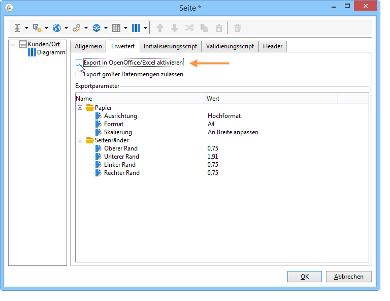

### Exportieren nach Microsoft Excel {#exporting-into-microsoft-excel}

Für Berichte vom Typ **[!UICONTROL Liste mit Gruppierung]**, die im Excel-Format exportiert werden sollen, gelten folgende Empfehlungen und Einschränkungen:

* Die Berichte dürfen keine leeren Zeilen enthalten.

  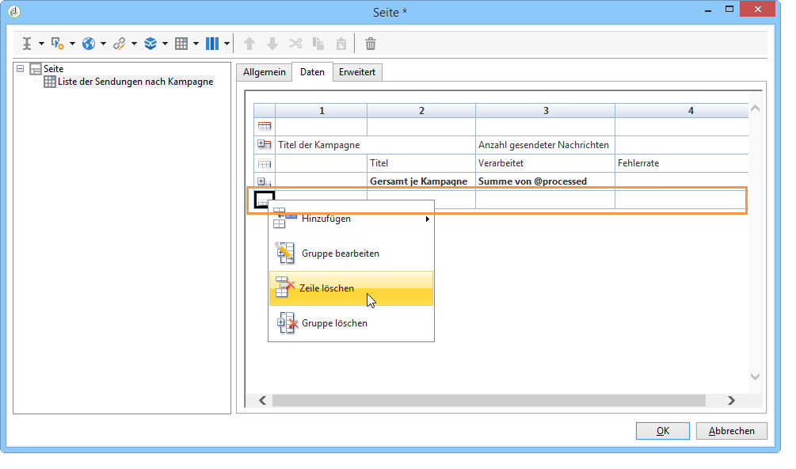

* Die Legende der Liste muss ausgeblendet sein.

  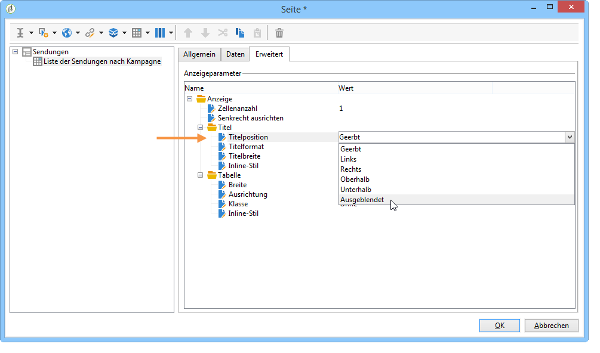

* Die Berichte dürfen keine spezifische Zellenformatierung aufweisen. Es empfiehlt sich, das **[!UICONTROL Formular-Rendering]** zu verwenden, um das Format der Zellen der Tabelle zu definieren. Der Zugriff auf das **[!UICONTROL Formular-Rendering]** erfolgt im Knoten **[!UICONTROL Administration > Konfiguration > Formular-Rendering]**.
* Es wird empfohlen, keinen HTML-Inhalt einzufügen.
* Wenn ein Bericht mehrere Elemente vom Typ Tabelle, Grafik etc. enthält, werden diese untereinander exportiert.
* Sie können den Zeilenumbruch in Zellen erzwingen: Diese Konfiguration wird in Excel beibehalten. Weiterführende Informationen hierzu finden Sie in [diesem Abschnitt](../../reporting/using/creating-a-table.md#defining-cell-format).

### Export verzögern {#postpone-the-export}

Sie können den Export eines Berichts aufschieben, um beispielsweise auf asynchrone Aufrufe zu warten. Geben Sie dazu den folgenden Parameter im Initialisierungsskript der Seite ein:

```
document.nl_waitBeforeRender = true;
```

Bedienen Sie sich zur Aktivierung des Exports und zur Konvertierung ins PDF-Format der Funktion **document.nl_renderToPdf()** ohne Parameter.

### Speicher zuteilen {#memory-allocation}

Beim Export von gewissen umfangreichen Berichten kann es zu Problemen bei der Speicherzuteilung kommen.

In bestimmten Fällen ist der Standardwert **maxMB** (**SKMS** für gehostete Instanzen) der JavaScript, der in der Konfigurationsdatei **serverConf.xml** angegeben ist, auf 64 MB festgelegt. Wenn beim Exportieren eines Berichts Speicherfehler auftreten, kann es empfohlen werden, diese Zahl auf 512 MB zu erhöhen:

```
<javaScript maxMB="512" stackSizeKB="8"/>
```

Um die Änderungen der Konfiguration zu übernehmen, ist ein Neustart des **nlserver**-Dienstes erforderlich.

Weiterführende Informationen zur Datei **serverConf.xml** finden Sie in [diesem Abschnitt](../../production/using/configuration-principle.md).

Weiterführende Informationen zum **nlserver**-Service finden Sie in [diesem Abschnitt](../../production/using/administration.md).

## Drucken eines Berichts {#printing-a-report}

Sie haben die Möglichkeit, Ihren Bericht zu drucken. Klicken Sie hierzu auf das Drucker-Symbol. Das Druck-Dialogfenster öffnet sich.

Um das Druckergebnis zu optimieren, öffnen Sie die Druckoptionen von Explorer und aktivieren Sie die Option **[!UICONTROL Farben und Hintergrundbilder drucken]**.

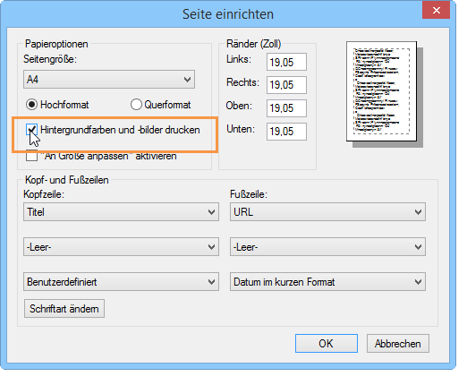

## Erstellen von Berichtsarchiven {#creating-report-archives}

Die Erstellung eines Verlaufs ermöglicht es Ihnen, die Entwicklung der Berichtsdaten über die Zeit zu beobachten. Zudem können Statistiken eines bestimmten Zeitpunkts eingesehen werden.

Um einen Verlauf zu erstellen, öffnen Sie den betreffenden Bericht und klicken Sie auf das Symbol zur Verlaufserstellung.

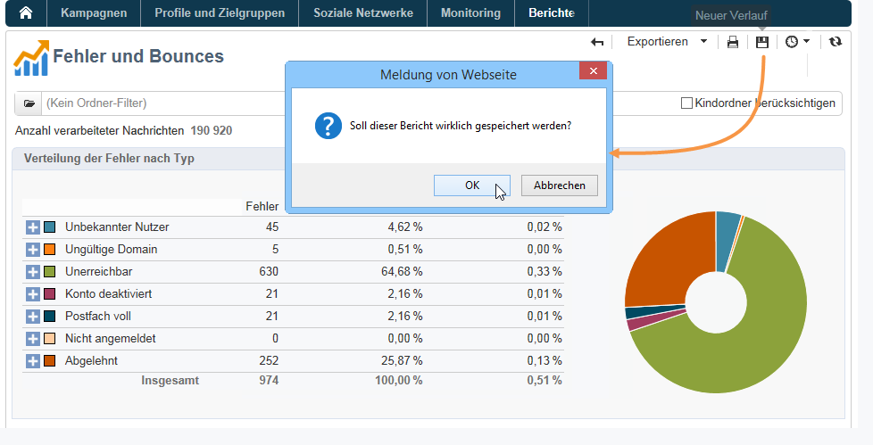

Durch Klick auf das entsprechende Symbol können Sie die existierenden Verläufe aus- oder einblenden.

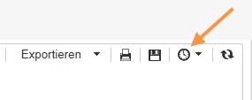

Die Archivierungsdaten werden unter dem Symbol Einblenden/Ausblenden angezeigt. Klicken Sie auf das Archiv, um es anzuzeigen.

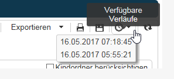

Es ist möglich, ein Berichtsarchiv zu löschen. Wechseln Sie dazu zum Adobe Campaign-Knoten, in dem Ihre Berichte gespeichert sind. Klicken Sie auf den Tab **[!UICONTROL Verläufe]**, markieren Sie den betreffenden Verlauf und klicken Sie auf **[!UICONTROL Löschen]**.

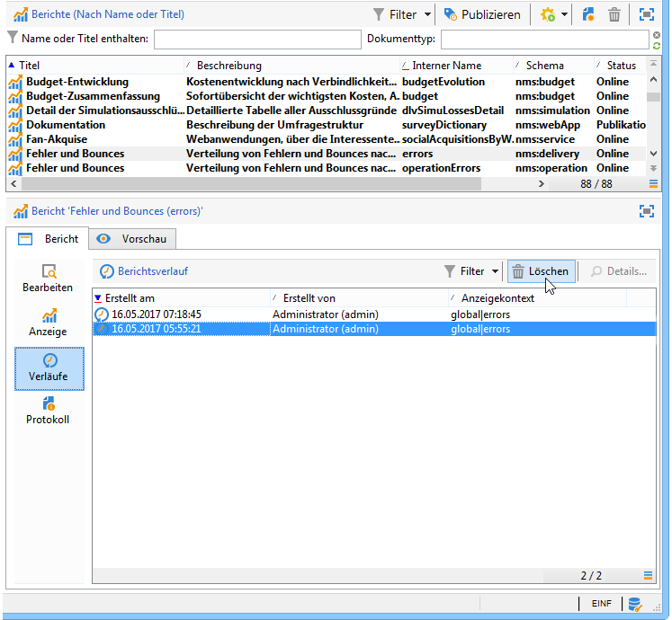
