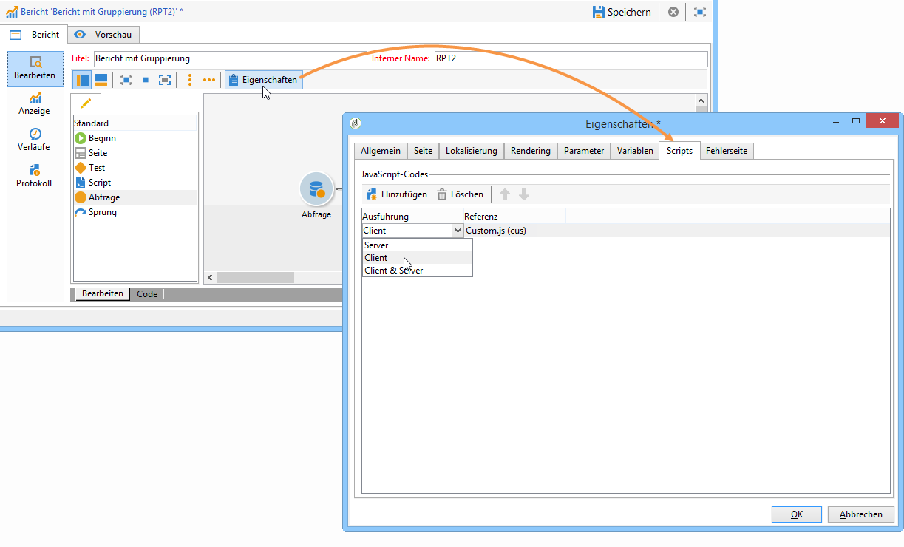
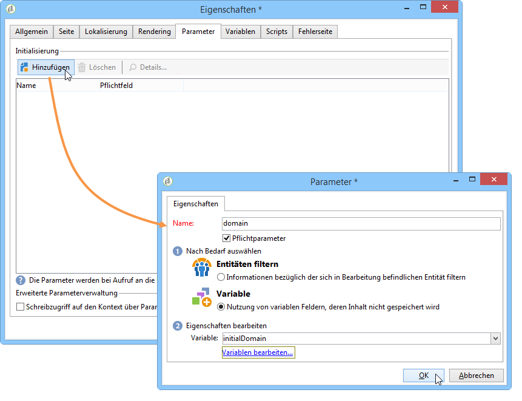
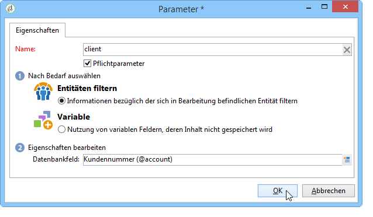
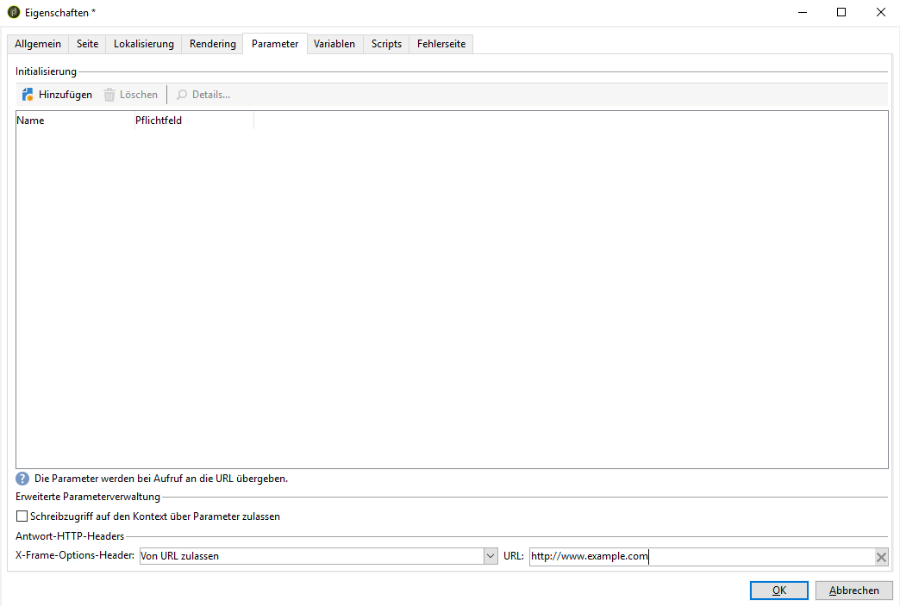
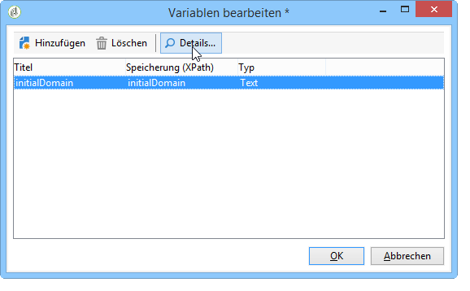

# Erweiterte Funktionen{#advanced-functionalities}

Als technischer Benutzer können Sie zusätzlich zu den [allgemeinen Eigenschaften](../../reporting/using/properties-of-the-report.md) erweiterte Funktionen für die Konfiguration Ihrer Berichte nutzen, z. B.:

* Erstellen Sie komplexe Abfragen zur Verarbeitung von Daten in einer **Script**-Aktivität. [Mehr dazu](#script-activity)

* Fügen Sie ein externes Script hinzu, das auf der Server- oder Client-Seite ausgeführt wird. [Mehr dazu](#external-script)

* Rufen Sie einen Bericht mit einer **Sprung**-Aktivität auf. [Mehr dazu](#calling-up-another-report)

* Fügen Sie einem Bericht einen URL-Parameter hinzu, um ihn leichter zugänglich zu machen. [Mehr dazu](#calling-up-another-report)

* Fügen Sie Variablen hinzu, die im Kontext des Berichts verwendet werden. [Mehr dazu](#adding-variables)

## Arbeiten mit Scripts {#adding-a-script}

### Externe Scripts referenzieren {#external-script}

Sie können JavaScript-Codes referenzieren, die beim Aufruf der Berichtseite Client- und/oder Server-seitig ausgeführt werden.

Gehen Sie dazu wie folgt vor:

1. Bearbeiten Sie die [Berichteigenschaften](../../reporting/using/properties-of-the-report.md) und klicken Sie auf den Tab **[!UICONTROL Scripts]**.
1. Klicken Sie auf **[!UICONTROL Hinzufügen]** und wählen Sie das zu referenzierende Script aus.
1. Bestimmen Sie anschließend den Ausführungsmodus.

   Wenn Sie mehrere Scripts hinzufügen, können Sie deren Ausführungsreihenfolge mithilfe der Pfeile in der Symbolleiste verändern.

   

Die referenzierten Scripts müssen in JavaScript verfasst und mit gängigen Browsern kompatibel sein, damit sie Client-seitig korrekt ausgeführt werden. Weiterführende Informationen hierzu finden Sie in [diesem Abschnitt](../../web/using/web-forms-answers.md).

### Script-Aktivität hinzufügen {#script-activity}

Verwenden Sie beim [Entwerfen Ihres Berichts](../../reporting/using/creating-a-new-report.md#modelizing-the-chart) die **[!UICONTROL Script]**-Aktivität, um Daten zu verarbeiten und ganz leicht komplexe Abfragen zu erstellen, die keine SQL-Sprache aktivieren. Sie können Ihre Abfrage direkt im Script-Fenster eingeben.

Auf dem Tab **[!UICONTROL Texte]** können Sie Text-Strings definieren. Diese können dann mit der folgenden Syntax verwendet werden: **$(Identifier)**. Weitere Informationen zur Verwendung von Texten finden Sie unter [Header und Footer hinzufügen](../../reporting/using/element-layout.md#adding-a-header-and-a-footer).

>[!CAUTION]
>
>Es wird DRINGEND davon abgeraten, JavaScript-Code zur Erstellung von Aggregaten zu verwenden.

Wenn Sie einen Berichtsverlauf erstellen möchten, fügen Sie Ihrer JavaScript-Abfrage die folgende Zeile hinzu, um die Verlaufsdaten beizubehalten:

```
if( ctx.@_historyId.toString().length == 0 )
```

Andernfalls werden nur aktuelle Daten angezeigt.

## Hinzufügen eines URL-Parameters {#defining-additional-settings}

Im Tab **[!UICONTROL Parameter]** der [Berichteigenschaften](../../reporting/using/properties-of-the-report.md) können zusätzliche Parameter für den Bericht angegeben werden; diese werden beim Aufruf der URL übergeben.

>[!CAUTION]
>
>Diese Parameter sollten aus Sicherheitsgründen mit Vorsicht benutzt werden.

Gehen Sie wie folgt vor, um einen neuen Parameter zu erstellen:

1. Klicken Sie auf die Schaltfläche **[!UICONTROL Hinzufügen]** und erfassen Sie den Namen des Parameters.

   

1. Geben Sie an, ob es sich um einen obligatorischen Parameter handeln soll.

1. Wählen Sie den zu erstellenden Parameter aus: **[!UICONTROL Filter]** oder **[!UICONTROL Variable]**.

   Die Option **[!UICONTROL Entitäten filtern]** ermöglicht die Nutzung eines Datenbank-Feldes als Parameter.

   

   Die Daten werden direkt auf Ebene der Entität abgerufen: **ctx/recipient/@account**.

   Über die Option **[!UICONTROL Variable]** kann eine Variable erstellt oder ausgewählt werden, die als URL-Parameter übergeben und auf Ebene der Filter genutzt werden kann.

Mit **[!UICONTROL Antwort-HTTP-Headers]** können Sie Clickjacking verhindern, wenn Sie die Seite Ihres Berichts mit iframe in eine HTML-Seite einschließen. Zur Vermeidung von Clickjacking können Sie das Verhalten **[!UICONTROL X-Frame-Options-Header]** auswählen:

* **[!UICONTROL Keiner]**: Der Bericht enthält keinen **[!UICONTROL X-Frame-Options-Header]**.
* **[!UICONTROL Identisch mit Ursprung]**: Standardmäßig für neue Berichte und erneut veröffentlichte Berichte festgelegt. Der Host-Name entspricht der URL des Berichts.
* **[!UICONTROL Ablehnen]**: Der Bericht kann nicht mit iframe in eine HTML-Seite eingefügt werden.



## Variablen hinzufügen {#adding-variables}

Der Tab **[!UICONTROL Variablen]** enthält die Liste der im Bericht konfigurierten Variablen. Diese werden im Kontext des Berichts aufgeführt und können in den Berechnungen verwendet werden.

Klicken Sie auf die Schaltfläche **[!UICONTROL Hinzufügen]**, um eine neue Variable zu erstellen.

Um die Parameter einer Variablen einzusehen, markieren Sie sie und klicken Sie auf die Schaltfläche **[!UICONTROL Detail...]**.



## Anwendungsbeispiel: Verwenden von Variablen und Parametern in einem Bericht

Im folgenden Videobeispiel erfahren Sie, wie Sie einen &quot;_type&quot;-Parameter hinzufügen, um je nach Wert des Attributs verschiedene Ansichten eines Berichts zu erstellen.

 [Mehr zu dieser Funktion erfahren Sie im Video.](https://helpx.adobe.com/de/campaign/classic/how-to/add-url-parameter-in-acv6.html?playlist=/ccx/v1/collection/product/campaign/classic/segment/business-practitioners/explevel/intermediate/applaunch/how-to-4/collection.ccx.js&amp;ref=helpx.adobe.com).


## Andere Berichte aufrufen {#calling-up-another-report}

Eine **Sprung**-Aktivität ist wie eine Transition ohne Pfeil: Ein Sprung ermöglicht den Übergang von einer Aktivität zur anderen oder den Zugriff auf einen anderen Bericht.
