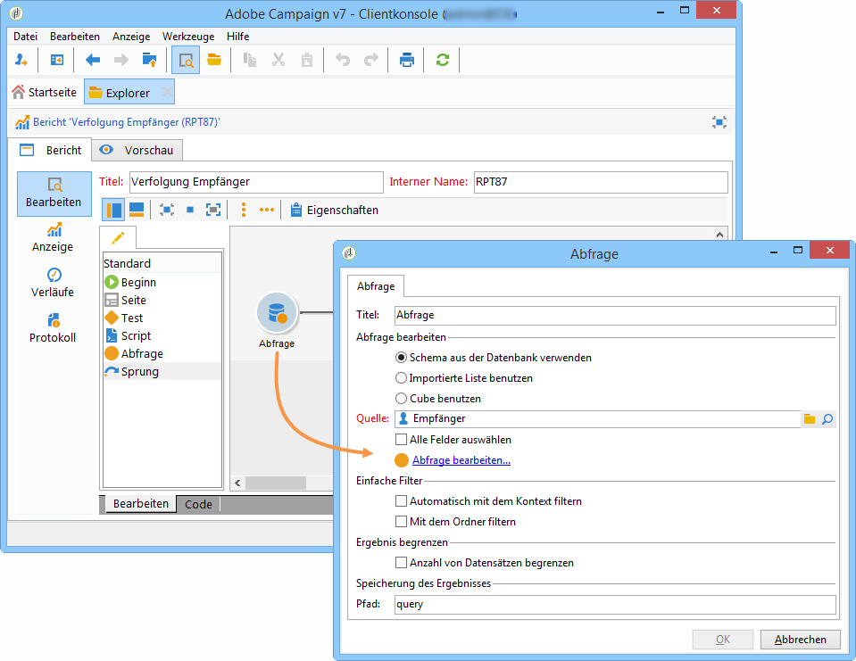
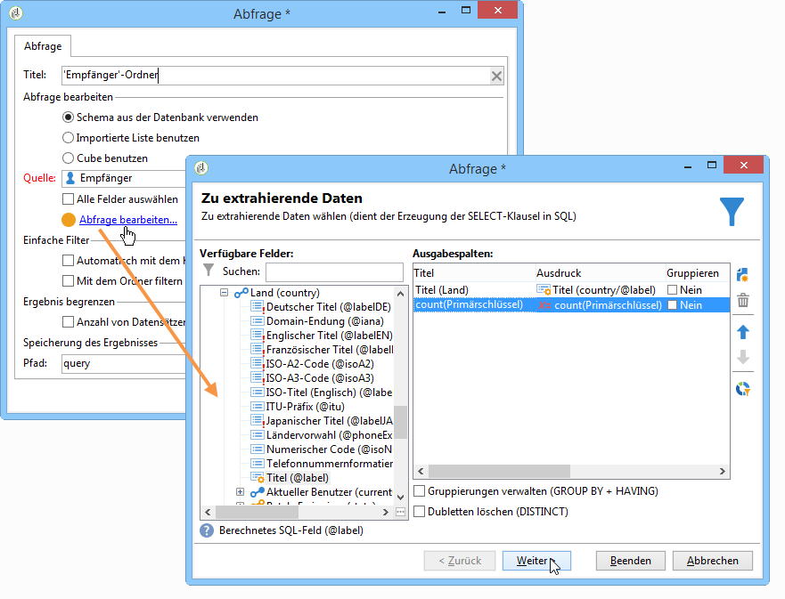
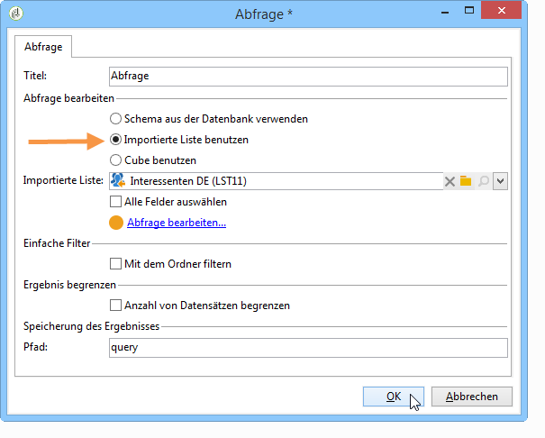
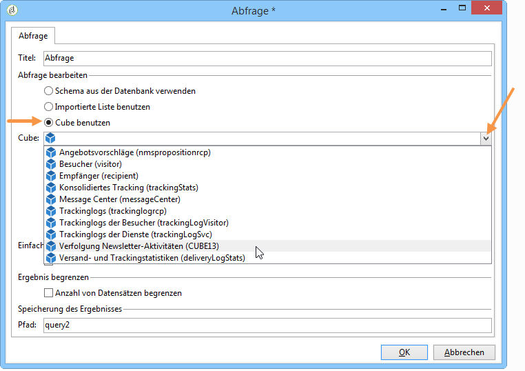
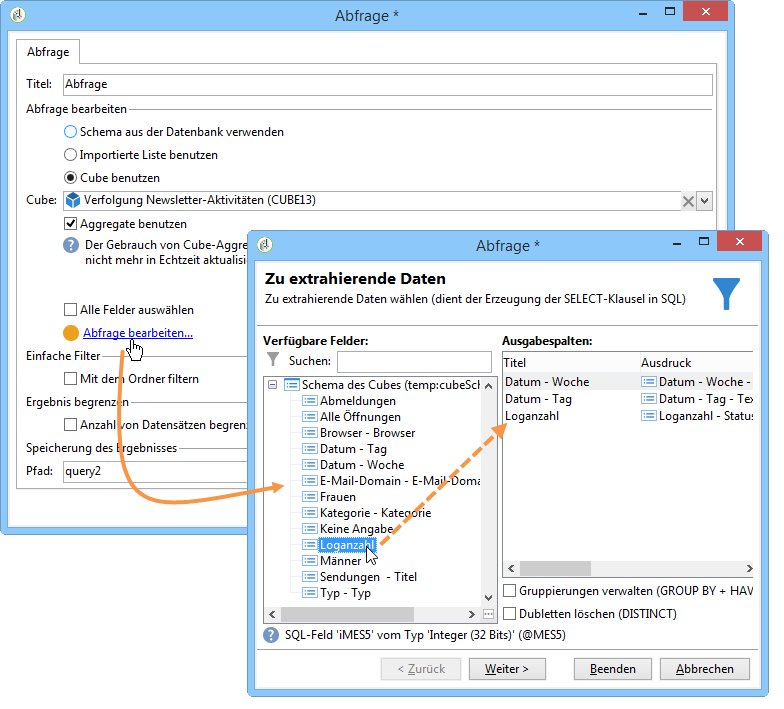
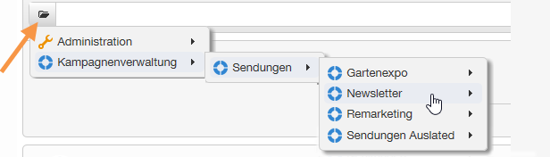

# Zu analysierende Daten abrufen{#collecting-data-to-analyze}

Die zur Erstellung eines Berichts verwendeten Daten können direkt auf der Seite des Berichts ausgewählt (siehe hierzu den Abschnitt [Kontext verwenden](../../reporting/using/using-the-context.md)) oder über eine oder mehrere Abfragen abgerufen werden.

In der Abfrage-Aktivität stehen drei verschiedene Methoden zur Verfügung:

1. Erstellung einer Abfrage zu den Daten der Datenbank;
1. Analyse der Daten aus einer Liste;
1. Verwendung der Daten eines existierenden Cubes.

Die Wahl der einen oder der anderen Methode hängt vom auszuführenden Berechnungstyp, dem zu bewegenden Datenvolumen, ihrer Beständigkeit und mehr ab. Diese Konfigurationen müssen genau durchdacht werden, um die Datenbank nicht zu überlasten und die Erzeugung und Nutzung der erstellten Berichte zu optimieren. Lesen Sie diesbezüglich [diese Seite](../../reporting/using/best-practices.md#optimizing-report-creation).

In jedem Fall werden die Daten über eine Aktivität vom Typ **[!UICONTROL Abfrage]** abgerufen.

Dieser Datenauswahl-Modus empfiehlt sich dann, wenn die Daten des Berichts über die Datenbank abgerufen oder erstellt werden. In bestimmten Fällen ist es auch möglich, die Daten direkt über die im Bericht verwendeten Elemente auszuwählen: Beim Einfügen einer Grafik beispielsweise können Sie die Quelldaten direkt auswählen. Weitere Informationen finden Sie unter [Kontext verwenden](../../reporting/using/using-the-context.md).

## Datenbankschemata benutzen {#using-the-data-from-a-schema}

Um direkt die mit einem Schema der Datenbank verbundenen Daten zu verwenden, wählen Sie die entsprechende Option im Abfrage-Editor aus und konfigurieren Sie die anzuwendende Abfrage.

Im folgenden Beispiel wird die Empfängeranzahl pro Land aus den Profilen der Datenbank abgerufen. Die Daten können dann in Tabellenform in einem Bericht angezeigt werden.

## Importierte Listen benutzen {#using-an-imported-list}

Sie haben die Möglichkeit, eine Liste mit importierten Daten als Basis für Ihren Bericht zu verwenden.

Aktivieren Sie hierzu die Option **[!UICONTROL Importierte Liste verwenden]** in der Abfrage-Aktivität und wählen Sie die betreffende Liste aus.

Klicken Sie auf den Link **[!UICONTROL Abfrage bearbeiten...]**, um zu bestimmen, welche Elemente aus der Liste für die Berichtserstellung abzurufen sind.

## Cubes benutzen {#using-a-cube}

Sie können einen Cube zur Definition der Abfrage auswählen.

Cubes ermöglichen es, die Kapazitäten der Datenexploration und -analyse zu erweitern und gleichzeitig die Konfiguration der Berichte und Tabellen für die Endbenutzer zu vereinfachen: Wählen Sie einfach einen existierenden, vollständig konfigurierten Cube aus, um dessen Berechnungen, Messungen und Statistiken zu nutzen. Weiterführende Informationen zum Erstellen von Cubes finden Sie in [diesem Abschnitt](../../reporting/using/about-cubes.md).

Klicken Sie auf den Link **[!UICONTROL Abfrage bearbeiten...]** und wählen Sie die Indikatoren aus, die im Bericht angezeigt oder genutzt werden sollen.

## Filteroptionen in Abfragen {#filtering-options-in-the-queries}

Um zu vermeiden, dass die Abfragen sich auf die gesamte Datenbank beziehen, müssen die Daten gefiltert werden.

### Einfache Filter {#simplified-filter}

Sie können die Option **[!UICONTROL Automatisch mit dem Kontext filtern]** aktivieren, um den Bericht in einem bestimmten Knoten des Navigationsbaums (Liste, Empfänger, Versand) zugänglich zu machen.

Die Option **[!UICONTROL Mit dem Ordner filtern]** ermöglicht es, durch Angabe eines bestimmten Ordners nur dessen Elemente zu berücksichtigen. Auf diese Weise können Sie den Bericht dahingehend konfigurieren, dass nur die Daten eines bestimmten Ordners des Navigationsbaums angezeigt werden, wie im folgenden Beispiel:

### Umfang der abgerufenen Daten begrenzen {#limiting-the-amount-of-data-collected}

Konfigurieren Sie die Anzahl der über eine Abfrage zu extrahierenden Daten mithilfe der Optionen zur Ergebnisbegrenzung:

* **[!UICONTROL Auf den ersten Datensatz begrenzen]**: extrahiert ein einziges Ergebnis;
* **[!UICONTROL Anzahl]**: extrahiert eine bestimmte Anzahl an Datensätzen.

