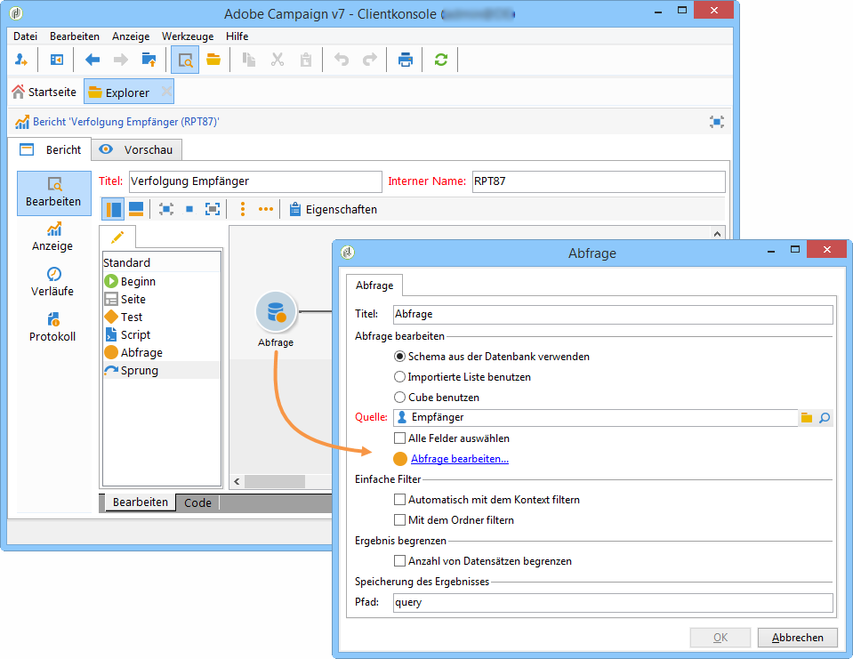
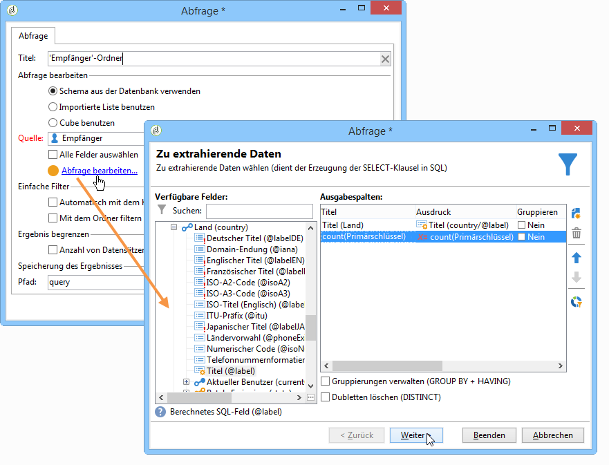
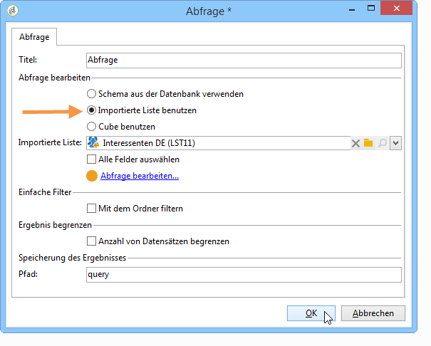
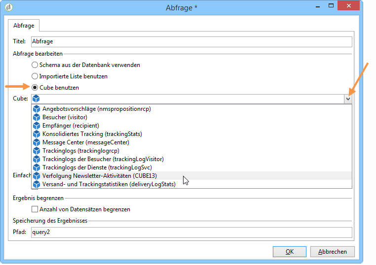
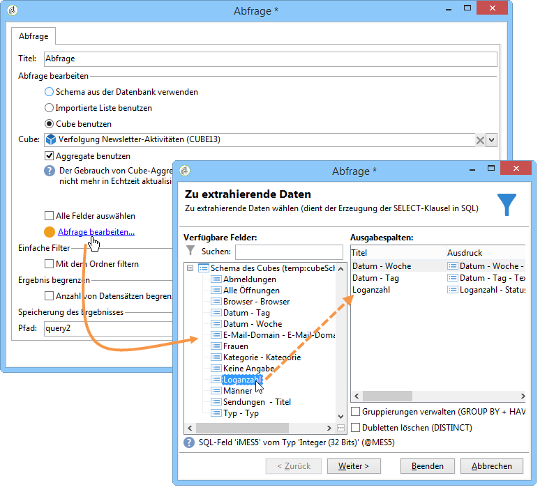

# Erfassen von Daten zur Analyse{#collecting-data-to-analyze}

Die zur Erstellung eines Berichts verwendeten Daten können direkt auf der Seite des Berichts ausgewählt (siehe hierzu den Abschnitt [Kontext verwenden](../../reporting/using/using-the-context.md)) oder über eine oder mehrere Abfragen abgerufen werden.

In der Abfrage-Aktivität stehen drei verschiedene Methoden zur Verfügung:

1. Erstellung einer Abfrage zu den Daten der Datenbank;
1. Analyse der Daten aus einer Liste;
1. Verwendung der Daten eines existierenden Cubes.

Die Wahl der einen oder der anderen Methode hängt vom auszuführenden Berechnungstyp, dem zu bewegenden Datenvolumen, ihrer Beständigkeit und mehr ab. Diese Parameter müssen genau durchdacht werden, um die Adobe Campaign-Datenbank nicht zu überlasten und die Generierung und Änderung der erstellten Berichte zu optimieren. Weitere Informationen hierzu finden Sie auf [dieser Seite](../../reporting/using/best-practices.md#optimizing-report-creation).

In jedem Fall werden die Daten über eine Aktivität vom Typ **[!UICONTROL Abfrage]** abgerufen.

Dieser Datenauswahlmodus ist relevant, wenn die Daten im Bericht mithilfe der Daten in der Datenbank erfasst oder erstellt werden müssen. In einigen Fällen können Sie die Daten auch direkt aus den im Bericht verwendeten Elementen auswählen. Beispielsweise können Sie beim Einfügen eines Diagramms die Quelldaten direkt auswählen. Weitere Informationen finden Sie unter [Kontext verwenden](../../reporting/using/using-the-context.md).

## Verwenden der Daten aus einem Schema {#using-the-data-from-a-schema}

Um direkt die mit einem Schema der Datenbank verbundenen Daten zu verwenden, wählen Sie die entsprechende Option im Abfrage-Editor aus und konfigurieren Sie die anzuwendende Abfrage.

Im folgenden Beispiel wird die Anzahl der Empfängerinnen und Empfänger für jedes Land unter den Profilen in der Datenbank erfasst. Sie können dann in einem Bericht in Form einer Tabelle angezeigt werden.

## Verwenden einer importierten Liste {#using-an-imported-list}

Sie haben die Möglichkeit, eine Liste mit importierten Daten als Basis für Ihren Bericht zu verwenden.

Aktivieren Sie hierzu die Option **[!UICONTROL Importierte Liste verwenden]** in der Abfrage-Aktivität und wählen Sie die betreffende Liste aus.

Klicken Sie auf den Link **[!UICONTROL Abfrage bearbeiten...]**, um zu bestimmen, welche Elemente aus der Liste für die Berichtserstellung abzurufen sind.

## Verwenden von Cubes {#using-a-cube}

Sie können einen Cube zur Definition der Abfrage auswählen.

Cubes ermöglichen es, die Kapazitäten der Datenexploration und-analyse zu erweitern und gleichzeitig die Konfiguration der Berichte und Tabellen für die Endbenutzer zu vereinfachen: Wählen Sie einfach einen existierenden, vollständig konfigurierten Cube aus, um dessen Berechnungen, Messungen und Statistiken zu nutzen. Weiterführende Informationen zum Erstellen von Cubes finden Sie in [diesem Abschnitt](../../reporting/using/ac-cubes.md).

Klicken Sie auf den Link **[!UICONTROL Abfrage bearbeiten...]** und wählen Sie die Indikatoren aus, die im Bericht angezeigt oder genutzt werden sollen.

## Filteroptionen in Abfragen {#filtering-options-in-the-queries}

Um zu vermeiden, dass die Abfragen sich auf die gesamte Datenbank beziehen, müssen die Daten gefiltert werden.

### Einfache Filter {#simplified-filter}

Sie können die Option **[!UICONTROL Automatisch mit dem Kontext filtern]** aktivieren, um den Bericht in einem bestimmten Knoten des Navigationsbaums (Liste, Empfänger, Versand) zugänglich zu machen.

Mit **[!UICONTROL Option „Mit Ordner filtern]** können Sie einen Ordner angeben und nur dessen Inhalt berücksichtigen. Auf diese Weise können Sie die Berichtsdaten so filtern, dass nur die Daten aus einem der Ordner in der Baumstruktur angezeigt werden, wie unten dargestellt:

### Begrenzen des Umfangs der abgerufenen Daten {#limiting-the-amount-of-data-collected}

Konfigurieren Sie die Anzahl der über eine Abfrage zu extrahierenden Daten mithilfe der Optionen zur Ergebnisbegrenzung:

* **[!UICONTROL Auf den ersten Datensatz begrenzen]**: extrahiert ein einziges Ergebnis;
* **[!UICONTROL Anzahl]**: extrahiert eine bestimmte Anzahl an Datensätzen.
